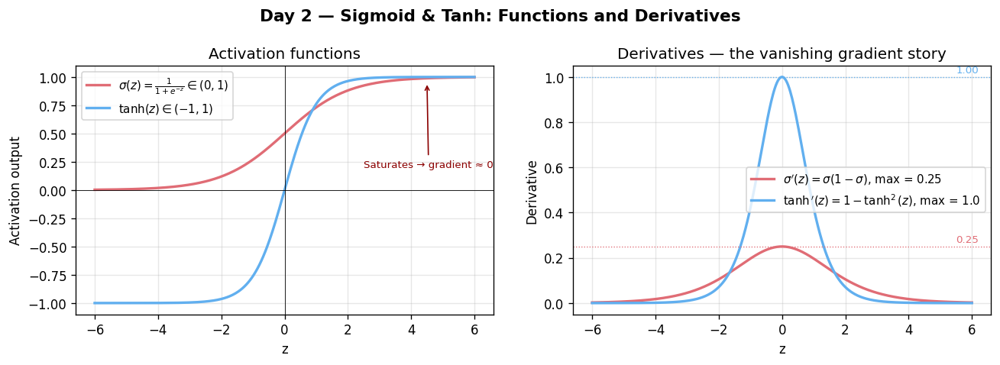

# Day 2 — Sigmoid & Tanh (Why Nonlinearity)
**Date:** 2026-06-03 | **Phase 1 of 11** | **Concept 2 / 112**

---

## 🧠 CONCEPT OF THE DAY

### Intuition
Yesterday's neuron computed $z = \mathbf{w}^\top\mathbf{x} + b$ — a straight line (or hyperplane). Stack a hundred of those and you *still* only get a straight line; matrix products of matrix products are just bigger matrices. Nonlinearity is the "kink" that lets a network bend space, fold it, and carve out decision regions that no single hyperplane could. Sigmoid and tanh are the original kinks: smooth S-curves that squash an unbounded real number into a bounded range, letting the network express "soft yes/no" or "soft +/-" decisions.

### The Math

**Sigmoid (logistic function):**

$$\sigma(z) = \frac{1}{1 + e^{-z}} \in (0, 1)$$

**Tanh (hyperbolic tangent) — a rescaled, shifted sigmoid:**

$$\tanh(z) = \frac{e^{z} - e^{-z}}{e^{z} + e^{-z}} = 2\sigma(2z) - 1 \in (-1, 1)$$

**Derivatives (the part that matters for backprop):**

$$\sigma'(z) = \sigma(z)\big(1 - \sigma(z)\big), \qquad \tanh'(z) = 1 - \tanh^2(z)$$

| Symbol | Meaning |
|--------|---------|
| $z$ | pre-activation (logit) |
| $\sigma(z)$ | sigmoid output, interpretable as a probability |
| $\tanh(z)$ | zero-centered squashing output |
| $\sigma'(z)$ | local gradient, max value $0.25$ at $z=0$ |



Notice both derivatives are *expressed in terms of the function's own output* — a huge implementation convenience: cache the forward activation, reuse it in the backward pass for free.

### Why it matters / where it leads
Sigmoid's zero-centered cousin tanh trains faster in hidden layers because its outputs straddle zero, keeping downstream gradients better balanced (a preview of Concept 18's init story). But both share a fatal flaw: for $|z| \gg 0$, the derivative collapses toward $0$ — the infamous **saturating gradient**. Multiply many such small numbers across layers during backprop (Concepts 8–9) and you get **vanishing gradients** (Concept 20), which is exactly why ReLU (Concept 3) eventually dethroned them in hidden layers. Sigmoid survives today mainly at *output* layers for binary probabilities and inside gates of LSTMs/GRUs (Concepts 48–49), where "soft switch" semantics are exactly what you want.

---

**Interview question (answer at the bottom):**
> "Why does sigmoid's maximum derivative value of 0.25 make deep sigmoid networks especially prone to vanishing gradients, even before you consider saturation?"

---

## 🐍 PYTHONIC EDGE

**Trick:** Never compute `sigmoid` via the textbook formula directly on raw logits — use the numerically stable log-sum-exp-based primitives PyTorch already ships, especially when you need log-probabilities.

```python
import torch

z = torch.tensor([-80.0, 0.0, 80.0])  # torch.tensor() is a free function, not a constructor

# BAD — naive formula overflows/underflows in float32 for large |z|
def sigmoid_bad(z):
    # -z: unary negation operator (__neg__) — same as C++
    return 1 / (1 + torch.exp(-z))   # exp(80) → inf, exp(-(-80)) → inf → nan

# GOOD — built-in is numerically stable across the whole real line
# torch.sigmoid: module-level free function (C++: a free function in namespace torch)
s = torch.sigmoid(z)                 # tensor([0., 0.5, 1.])

# Even better when you need log(sigmoid(z)) (e.g. BCE loss math):
# torch.nn.functional: submodule accessed via dot-chained attribute lookup (C++: nested namespace)
# This is the stateless functional API — no learnable parameters, no object needed
# (C++: conceptually a namespace of free functions vs the nn.Module OOP layer classes)
log_s = torch.nn.functional.logsigmoid(z)   # stable; avoids log(0) → -inf surprises
```

**Bonus gotcha:** `torch.tanh(z)` is just `2*torch.sigmoid(2*z) - 1` mathematically, but PyTorch's native `tanh` is both faster and more numerically stable — never reimplement it from sigmoid.

---

## 📡 SIGNAL LAB

### Squashing as Soft Clipping / Compander

A sigmoid-like squashing curve is exactly what audio engineers call a **soft clipper** or **compander**: it compresses large-amplitude values toward a ceiling/floor while leaving small values nearly untouched (linear near the origin).

**Problem:** Take a synthetic signal $x[n] = 3\sin(2\pi \cdot 0.05 n)$ for $n = 0,\dots,255$ (amplitude 3, well beyond $\pm 1$). Pass it through $\tanh$. Compare the FFT magnitude spectra of the original and the squashed signal — what new structure appears, and why?

**Worked solution:**

```python
import numpy as np

n = np.arange(256)
x = 3 * np.sin(2 * np.pi * 0.05 * n)
y = np.tanh(x)

X = np.abs(np.fft.rfft(x))
Y = np.abs(np.fft.rfft(y))

# X has essentially ONE spike at f = 0.05 (pure sinusoid)
# Y has a spike at f = 0.05 PLUS smaller spikes at 0.15, 0.25, ... (odd harmonics)
```

**So what:** Squashing a pure tone through a saturating nonlinearity injects **odd harmonics** — the same mechanism that gives an overdriven guitar amp its characteristic buzz. This is a clean, concrete instance of a general truth: *any nonlinearity applied to a signal redistributes its energy across new frequencies*. That's precisely why deep nets with nonlinear activations can synthesize textures and frequency content absent from their inputs — and conversely, why generative models (GANs, diffusion) leave detectable spectral fingerprints from the nonlinearities and upsampling operations baked into their architectures. File this away; it resurfaces hard in Concept 88 (spectral signatures of generated images), squarely in your research lane.

---

## ⚔️ THE GAUNTLET

### Bounded Partial Sums

Given an integer array `nums` of length `n` and an integer `limit`, find the length of the **longest contiguous subarray** such that the absolute difference between any two elements in that subarray is **at most** `limit`.

**Constraints:**
- $1 \leq n \leq 10^5$
- $-10^9 \leq \text{nums}[i] \leq 10^9$
- $0 \leq \text{limit} \leq 10^9$
- Time: $O(n)$, Space: $O(n)$

**Input format:**
```
8 4
8 2 4 7 7 7 4 7
```

**Hints:**
1. "Max minus min within a window ≤ limit" is a sliding-window condition — but you need the running max *and* min of the current window efficiently as it slides.
2. What data structure gives you O(1) amortized access to both the current max and current min while supporting push-back and pop-front? Think monotonic.
3. Maintain two monotonic deques (one decreasing for max-candidates, one increasing for min-candidates); shrink the window from the left whenever `max - min > limit`.

**Pattern:** Sliding Window + Monotonic Deque
**Target:** $O(n)$ time, $O(n)$ space

*Full solution locked below.*

---

## 🏗️ BLUEPRINT

No blueprint today.

---

## 💬 MARCHING ORDERS

Squashing functions taught the field that "bounded and smooth" beats "unbounded and sharp" — until ReLU showed up tomorrow and broke that rule entirely. Hold both ideas in your head; the tension between them is the whole story of activation function design.

**Tomorrow:** Concept 3 — ReLU, LeakyReLU, GELU, SiLU

---
---

## 🔒 GAUNTLET SOLUTION

```cpp
#include <bits/stdc++.h>
using namespace std;

int main() {
    ios_base::sync_with_stdio(false);
    cin.tie(nullptr);

    int n;
    long long limit;
    cin >> n >> limit;
    vector<long long> a(n);
    for (auto& x : a) cin >> x;

    deque<int> maxDq, minDq;   // store indices; maxDq decreasing, minDq increasing
    int left = 0;
    int best = 0;

    for (int right = 0; right < n; right++) {
        while (!maxDq.empty() && a[maxDq.back()] <= a[right]) maxDq.pop_back();
        maxDq.push_back(right);
        while (!minDq.empty() && a[minDq.back()] >= a[right]) minDq.pop_back();
        minDq.push_back(right);

        while (a[maxDq.front()] - a[minDq.front()] > limit) {
            left++;
            if (maxDq.front() < left) maxDq.pop_front();
            if (minDq.front() < left) minDq.pop_front();
        }
        best = max(best, right - left + 1);
    }
    cout << best << "\n";
    return 0;
}
```

**Why it works:** The two monotonic deques keep the current window's max and min accessible in O(1): `maxDq` is kept strictly decreasing (front = max), `minDq` strictly increasing (front = min). Each index enters and leaves each deque at most once, so total work is O(n) amortized despite the nested-looking loops.

**Edge cases:** `limit = 0` forces a subarray of all-equal elements; the algorithm handles it naturally since any difference > 0 triggers a shrink.

---

## 🔑 CONCEPT ANSWER

**Question:** "Why does sigmoid's maximum derivative value of 0.25 make deep sigmoid networks especially prone to vanishing gradients, even before you consider saturation?"

**Answer:** During backprop, the gradient flowing into layer $\ell$ gets multiplied by $\sigma'(z^{(\ell)})$ at every layer it passes through (chain rule). Even in the *best case* — every neuron sitting exactly at $z=0$ where $\sigma'(z) = 0.25$ — a gradient passing through $L$ layers gets scaled by at most $0.25^L$. For $L = 10$, that's a factor of roughly $9.5 \times 10^{-7}$; for $L = 20$, about $10^{-12}$. The gradient is crushed toward zero from compounding multiplication alone, *before* you even factor in that most neurons aren't sitting at the optimal $z=0$ and saturate further. This is precisely why ReLU's derivative — a clean $0$ or $1$, never a fraction — became the default for deep hidden stacks: it removes the multiplicative shrinkage entirely (at the cost of a different pathology, "dying ReLUs," which Concept 3 covers).
