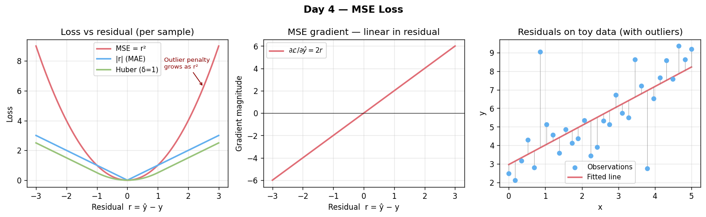

# Day 4 — MSE Loss
**Date:** 2026-06-05 | **Phase 1 of 11** | **Concept 4 / 112**

---

## 🧠 CONCEPT OF THE DAY

### Intuition
A loss function is how you tell a network "you were *this* wrong." Mean Squared Error says: measure the gap between prediction and truth, square it (so overshoot and undershoot both count as "bad," and big misses count *much* worse than small ones), then average over your batch. Squaring is the whole personality of MSE — it's a magnifying glass that makes outliers scream louder than they would under a linear penalty.

### The Math

**Per-sample squared error and batch mean:**

$$\mathcal{L}_{\text{MSE}} = \frac{1}{N}\sum_{i=1}^{N} (y_i - \hat{y}_i)^2$$

**Gradient w.r.t. the prediction (what flows backward into the network):**

$$\frac{\partial \mathcal{L}_{\text{MSE}}}{\partial \hat{y}_i} = -\frac{2}{N}(y_i - \hat{y}_i) = \frac{2}{N}(\hat{y}_i - y_i)$$

| Symbol | Meaning |
|--------|---------|
| $y_i$ | ground-truth target for sample $i$ |
| $\hat{y}_i$ | model prediction for sample $i$ |
| $N$ | batch size |
| $(y_i - \hat{y}_i)$ | residual — the signed error |



Note the gradient is *linear* in the residual: a prediction twice as wrong produces a gradient twice as large. That single fact explains both MSE's biggest strength (smooth, well-behaved optimization near the optimum) and its biggest weakness (a handful of huge-residual outliers can dominate the entire gradient signal).

### Why it matters / where it leads
MSE is the maximum-likelihood loss under the assumption that your targets are corrupted by **Gaussian noise** — minimizing squared error is *exactly* equivalent to maximizing the likelihood of the data under a Gaussian observation model with fixed variance. That's not a coincidence; it's the reason MSE is the default for regression: it encodes a specific (often reasonable) statistical assumption about your errors. When that assumption breaks — heavy-tailed noise, outlier-prone labels — MSE overreacts, and you reach for Huber loss, MAE, or robust alternatives. This sets up tomorrow's concept directly: cross-entropy is the analogous maximum-likelihood loss for *categorical* (Bernoulli/Multinoulli) targets, and understanding *why* MSE is the "right" loss for Gaussian regression is the fastest route to understanding why it is the *wrong* loss for classification.

---

**Interview question (answer at the bottom):**
> "Why is MSE a poor loss choice for a binary classification output layer that ends in a sigmoid, even though both produce a single scalar in [0,1]? What concrete optimization pathology does it cause?"

---

## 🐍 PYTHONIC EDGE

**Trick:** Be deliberate about reduction modes — `mean` vs `sum` vs `none` change your effective learning rate and your ability to do per-sample analysis, and silently mixing them across a codebase is a classic source of "my loss looks fine but training is unstable" bugs.

```python
import torch
import torch.nn as nn

pred = torch.tensor([2.5, 0.0, 1.8, 4.2])
target = torch.tensor([3.0, -0.5, 2.0, 4.1])

# BAD — relying on the default without thinking, then changing batch size later
loss_fn = nn.MSELoss()              # default reduction='mean'
loss = loss_fn(pred, target)        # fine in isolation, but...
# ...if you switch to reduction='sum' during a refactor, your effective LR
# silently scales with batch size — a notorious "it trained differently on 2 GPUs" bug

# GOOD — be explicit, and keep per-sample losses around when you need them
loss_mean = nn.functional.mse_loss(pred, target, reduction='mean')   # for backprop
loss_per_sample = nn.functional.mse_loss(pred, target, reduction='none')  # for analysis
# loss_per_sample → tensor([0.25, 0.25, 0.04, 0.01])
# Use 'none' to find which samples in a batch are driving your loss — invaluable for
# debugging label noise or spotting hard examples.
```

**Bonus gotcha:** `reduction='sum'` makes your loss magnitude (and therefore your gradient magnitude) scale linearly with batch size — if you change batch size without adjusting the learning rate, you've silently changed your optimization dynamics.

---

## 📡 SIGNAL LAB

### MSE in the Frequency Domain — Parseval's Theorem

By **Parseval's (Plancherel's) theorem**, the energy of a discrete signal is preserved between time and frequency domains: $\sum_n |x[n]|^2 = \frac{1}{N}\sum_k |X[k]|^2$. This means **MSE between two signals in the time domain equals (a scaled version of) MSE between their DFTs** — squared-error loss is, secretly, a frequency-domain comparison too.

**Problem:** Generate a clean sinusoid $x[n] = \sin(2\pi \cdot 0.1 n)$ and a noisy version $\hat{x}[n] = x[n] + \epsilon[n]$ with $\epsilon \sim \mathcal{N}(0, 0.1)$, for $n=0,\dots,255$. Verify numerically that $\text{MSE}(x, \hat{x})$ in the time domain matches the (normalized) MSE of their DFT magnitudes' squared difference, per Parseval.

**Worked solution:**

```python
import numpy as np

np.random.seed(0)
n = np.arange(256)
x = np.sin(2 * np.pi * 0.1 * n)
noise = np.random.normal(0, 0.1, size=256)
xhat = x + noise

mse_time = np.mean((x - xhat)**2)

X = np.fft.fft(x)
Xhat = np.fft.fft(xhat)
mse_freq = np.mean(np.abs(X - Xhat)**2) / len(x)   # Parseval scaling

# mse_time ≈ mse_freq  (both ≈ 0.01, matching the noise variance)
```

**So what:** This is *not* a numerical coincidence — it's a theorem. It means a model trained with time-domain MSE is implicitly being scored on frequency-domain fidelity too, and vice versa. But — and this is the catch that matters for your research — MSE distributes its penalty *uniformly* across all frequencies, while human perception (and many forensic detectors) weight frequencies very unevenly. This is exactly why naive pixel-wise MSE famously produces *blurry* reconstructions in autoencoders/VAEs (Concepts 78–80): MSE is "satisfied" by a blurred average that minimizes squared error across all frequencies, even though it discards the high-frequency detail a human (or detector) cares about most.

---

## ⚔️ THE GAUNTLET

### Minimum Squared Deviation Split

Given an integer array `nums` of length `n`, split it into exactly `k` contiguous, non-empty subarrays. Define the cost of a subarray as the squared deviation of its elements from their mean: $\text{cost}(S) = \sum_{x \in S}(x - \bar{S})^2$. Minimize the sum of costs across all `k` subarrays.

**Constraints:**
- $1 \leq k \leq n \leq 2000$
- $-10^4 \leq \text{nums}[i] \leq 10^4$
- Time: $O(n^2 k)$, Space: $O(nk)$

**Input format:**
```
6 2
1 2 3 10 11 12
```

**Hints:**
1. "Partition into k contiguous groups, minimize a sum of group costs" screams **interval DP**: define `dp[i][j]` = min cost of splitting the first `i` elements into `j` groups.
2. You'll repeatedly need `cost(l, r)` — the squared-deviation cost of subarray `nums[l..r]`. Precompute prefix sums of values *and* of squares so any `cost(l, r)` is O(1): $\text{cost} = \sum x^2 - \frac{(\sum x)^2}{r-l+1}$.
3. Transition: `dp[i][j] = min over m < i of ( dp[m][j-1] + cost(m, i-1) )`. Base case `dp[i][1] = cost(0, i-1)`.

**Pattern:** Interval/Partition DP with precomputed range-cost via prefix sums of $\sum x$ and $\sum x^2$
**Target:** $O(n^2 k)$ time, $O(nk)$ space

*Full solution locked below.*

---

## 🏗️ BLUEPRINT

No blueprint today.

---

## 💬 MARCHING ORDERS

Every loss function is a hidden statement of belief about your data's noise — choosing one is a modeling decision, not a formality. Get into the habit of asking "what distributional assumption am I baking in here?" before you reach for the default.

**Tomorrow:** Concept 5 — Softmax + cross-entropy

---
---

## 🔒 GAUNTLET SOLUTION

```cpp
#include <bits/stdc++.h>
using namespace std;

int main() {
    ios_base::sync_with_stdio(false);
    cin.tie(nullptr);

    int n, k;
    cin >> n >> k;
    vector<double> a(n);
    for (auto& x : a) cin >> x;

    // prefix sums of values and squares for O(1) range cost
    vector<double> ps(n + 1, 0.0), ps2(n + 1, 0.0);
    for (int i = 0; i < n; i++) {
        ps[i+1] = ps[i] + a[i];
        ps2[i+1] = ps2[i] + a[i] * a[i];
    }
    auto cost = [&](int l, int r) -> double { // inclusive [l, r]
        int cnt = r - l + 1;
        double sum = ps[r+1] - ps[l];
        double sumsq = ps2[r+1] - ps2[l];
        return sumsq - (sum * sum) / cnt;
    };

    const double INF = 1e18;
    // dp[i][j] = min cost splitting first i elements into j groups
    vector<vector<double>> dp(n + 1, vector<double>(k + 1, INF));
    dp[0][0] = 0.0;
    for (int i = 1; i <= n; i++) {
        for (int j = 1; j <= min(i, k); j++) {
            for (int m = j - 1; m < i; m++) {
                if (dp[m][j-1] >= INF) continue;
                double c = dp[m][j-1] + cost(m, i - 1);
                dp[i][j] = min(dp[i][j], c);
            }
        }
    }
    printf("%.6f\n", dp[n][k]);
    return 0;
}
```

**Why it works:** The cost of any contiguous range can be derived in O(1) from prefix sums of values and squared values via the identity $\sum (x-\bar{x})^2 = \sum x^2 - \frac{(\sum x)^2}{n}$ — the same "computational shortcut" used to compute variance in a single pass. The DP then enumerates, for each prefix length and group count, the best place to cut off the last group; O(n) states per (i, j) pair gives the stated O(n²k).

**Edge cases:** `k == n` forces every element into its own singleton group, each with cost 0 — the DP naturally finds this is optimal when the data is wide-spread.

---

## 🔑 CONCEPT ANSWER

**Question:** "Why is MSE a poor loss choice for a binary classification output layer that ends in a sigmoid, even though both produce a single scalar in [0,1]? What concrete optimization pathology does it cause?"

**Answer:** Combining sigmoid output with MSE loss creates a **gradient-saturation trap**: the gradient of the loss w.r.t. the pre-activation $z$ is $\frac{\partial \mathcal{L}}{\partial z} = \frac{\partial \mathcal{L}}{\partial \hat{y}} \cdot \sigma'(z) = 2(\hat{y}-y)\cdot \sigma(z)(1-\sigma(z))$. Now consider a confidently *wrong* prediction — say $y=1$ but $\hat y \approx 0$ (so $z \ll 0$). Here $\sigma'(z) \approx 0$, which means the gradient is **near zero exactly when the error is largest** — the model is most wrong and learns slowest. Cross-entropy (tomorrow's concept) avoids this entirely: its gradient w.r.t. $z$ simplifies to the beautifully clean $(\hat y - y)$ — proportional directly to the error, with the $\sigma'(z)$ term canceling out algebraically. That cancellation is not a lucky accident; cross-entropy is *derived* to be the matched maximum-likelihood loss for a sigmoid/softmax output, which is precisely why the pairing produces well-behaved gradients while MSE+sigmoid does not.

---

## 📎 SUPPLEMENTARY — Lecture 7: Regression Metrics (CSE 4621)

*These topics were in your course lecture but are not standalone concepts in the roadmap. They extend naturally from MSE and live here for reference.*

### The Regression Metrics Family

All regression metrics compare predictions $\hat{y}_i$ to ground truth $y_i$ over $N$ samples.

**MAE — Mean Absolute Error:**

$$\text{MAE} = \frac{1}{N}\sum_{i=1}^{N} |y_i - \hat{y}_i|$$

Uses absolute (not squared) error, so every residual is weighted equally. **Outlier-robust** — a single massive error has linear (not quadratic) influence. Gradient is ±1/N everywhere except at zero, which makes optimization slightly noisier than MSE near the minimum. Use when you care about median-like behavior and outliers are common (e.g., house price prediction with a few mansions).

**RMSE — Root Mean Squared Error:**

$$\text{RMSE} = \sqrt{\frac{1}{N}\sum_{i=1}^{N}(y_i - \hat{y}_i)^2}$$

Just $\sqrt{\text{MSE}}$. The square root brings the units back to the same scale as the target, making the number interpretable alongside the data. If your target is in dollars, RMSE is in dollars; MSE is in dollars². Minimizing RMSE and minimizing MSE are equivalent (same gradient direction) — RMSE is purely a reporting metric.

**MAPE — Mean Absolute Percentage Error:**

$$\text{MAPE} = \frac{100\%}{N}\sum_{i=1}^{N}\left|\frac{y_i - \hat{y}_i}{y_i}\right|$$

Scale-independent — great for comparing models across targets with very different magnitudes (sales at different stores). **Critical flaw:** undefined when $y_i = 0$, and asymmetric (predicting 50 when truth is 100 gives 50% error; predicting 150 when truth is 100 gives 50% error — but the first is worse in absolute terms).

**R² — Coefficient of Determination:**

$$R^2 = 1 - \frac{\sum_i (y_i - \hat{y}_i)^2}{\sum_i (y_i - \bar{y})^2} = 1 - \frac{\text{SS}_{res}}{\text{SS}_{tot}}$$

Answers "what fraction of the target's variance does my model explain?" A dumb baseline that always predicts the mean $\bar{y}$ gets $R^2 = 0$. A perfect model gets $R^2 = 1$. A model *worse* than the mean baseline gets $R^2 < 0$. It is **not** the square of the Pearson correlation in the general multivariate case (though it is for simple linear regression).

**Adjusted R² — penalizing free parameters:**

$$\bar{R}^2 = 1 - (1 - R^2)\frac{N-1}{N-p-1}$$

where $p$ = number of features. $R^2$ can only increase or stay the same as you add features — even random noise features raise it slightly. Adjusted $R^2$ penalizes each extra parameter; it decreases if a new feature doesn't improve the model enough to justify its complexity. Use this when comparing models with different numbers of features.

### Quick Decision Table

| Situation | Reach for |
|---|---|
| Outliers present; want robustness | MAE |
| Want interpretable units; outliers matter | RMSE |
| Need scale-free comparison across targets | MAPE (check for zero targets) |
| Explaining "how well" relative to a mean baseline | R² |
| Comparing models with different feature counts | Adjusted R² |
| Actually training the model | MSE (smooth gradients) |

### The Connection Back to MSE

MSE is the training loss; MAE/RMSE/R²/MAPE are **evaluation metrics** used to communicate performance. You often train with MSE but report RMSE (same units as target) and R² (interpretable fraction of variance explained). The choice of metric is a modeling decision: it tells stakeholders what "good" means for your specific problem.
