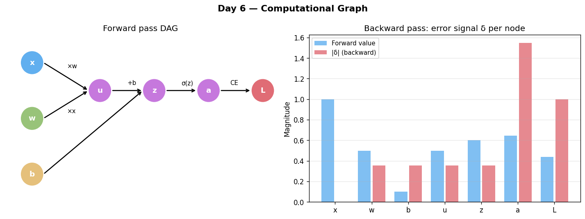

# Day 6 — Computational Graph
**Date:** 2026-06-07 | **Phase 1 of 11** | **Concept 6 / 112**

---

## 🧠 CONCEPT OF THE DAY

### Intuition
Every expression you've written so far — $z = \mathbf{w}^\top\mathbf{x}+b$, $a = \sigma(z)$, $\mathcal{L} = \text{CE}(a, y)$ — is secretly a *recipe*, a sequence of small, primitive operations chained together. A computational graph makes that recipe explicit and visual: nodes are values (inputs, intermediate results, outputs), edges are operations. Once you draw the recipe as a graph, two things become almost mechanical: running it forward (plug in numbers, follow the arrows) and running it backward (ask "how much does the final output change if I nudge *this* node a tiny bit?").

### The Math

A computational graph is a **directed acyclic graph (DAG)**. For our familiar one-neuron pipeline:

$$x \xrightarrow{\times \mathbf{w}} u \xrightarrow{+\, b} z \xrightarrow{\sigma} a \xrightarrow{\text{CE}(\cdot, y)} \mathcal{L}$$



**Forward pass** = evaluate nodes in topological order, left to right:

$$u = \mathbf{w}^\top\mathbf{x}, \quad z = u + b, \quad a = \sigma(z), \quad \mathcal{L} = \text{CE}(a, y)$$

**Backward pass** = apply the chain rule in *reverse* topological order, accumulating local derivatives:

$$\frac{\partial \mathcal{L}}{\partial z} = \frac{\partial \mathcal{L}}{\partial a}\cdot\frac{\partial a}{\partial z}, \quad
\frac{\partial \mathcal{L}}{\partial u} = \frac{\partial \mathcal{L}}{\partial z}\cdot\underbrace{\frac{\partial z}{\partial u}}_{=1}, \quad
\frac{\partial \mathcal{L}}{\partial \mathbf{w}} = \frac{\partial \mathcal{L}}{\partial u}\cdot\frac{\partial u}{\partial \mathbf{w}}$$

| Symbol | Meaning |
|--------|---------|
| node | a tensor: an input, a parameter, or an intermediate/output value |
| edge | a primitive differentiable operation connecting nodes |
| topological order | an ordering where every node appears after all its inputs |
| local gradient | $\partial(\text{node})/\partial(\text{its direct input})$ — cheap to compute in isolation |

### Why it matters / where it leads
This is the conceptual hinge of the entire course: **the computational graph is what makes automatic differentiation possible**. PyTorch doesn't "know calculus" — it builds this graph silently as you run your forward pass (every tensor operation appends a node), then walks it backward, multiplying together the *local* gradients you can already compute by hand for each primitive op (you derived several yesterday and the day before: $\sigma'$, the cross-entropy gradient). `loss.backward()` is, quite literally, "traverse the graph I just built, in reverse, multiplying local derivatives along each path." Concepts 7–9 (chain rule, backprop intuition, backprop in full) are simply this idea applied with increasing rigor and scale — once you can see the graph, backprop stops being mysterious and becomes "just bookkeeping, done by a computer because a human would make arithmetic errors."

---

**Interview question (answer at the bottom):**
> "Why must a computational graph be acyclic, and what would 'backpropagating through a cycle' even mean — is it fixable, or fundamentally ill-defined for standard backprop?"

---

## 🐍 PYTHONIC EDGE

**Trick:** Inspect the graph PyTorch built for you — `.grad_fn` and `.next_functions` let you literally walk the DAG backward by hand, which is the single best way to *see* autodiff stop being magic.

```python
import torch

# requires_grad=True: keyword argument enabling gradient tracking for this leaf tensor
x = torch.tensor([1.0, 2.0], requires_grad=True)
w = torch.tensor([0.5, -0.3], requires_grad=True)
b = torch.tensor(0.1, requires_grad=True)

# * is element-wise multiplication (__mul__); .sum() is a method call (C++: member function)
# operator overloading: Python resolves w * x to w.__mul__(x)
u = (w * x).sum()      # node: elementwise mul + sum  → MulBackward / SumBackward
# + calls __add__; Python operator overloading (C++: same concept with operator+)
z = u + b              # node: add                    → AddBackward
a = torch.sigmoid(z)   # node: sigmoid                → SigmoidBackward

# BAD — treating `a` as just a number, throwing away the graph context
# float(): built-in type conversion function (C++: static_cast<float> or .item())
print(float(a))   # 0.5374... — you've lost all the structure that produced it

# GOOD — walk the graph that autograd silently recorded
# .grad_fn: an attribute (Python property) — points to the backward function object
# (C++: a raw pointer or shared_ptr to a GradFn base class)
print(a.grad_fn)                       # <SigmoidBackward0 ...>
# .next_functions: returns a tuple of (AccumulateGrad, output_index) pairs
# Python tuple: immutable ordered sequence (C++: std::tuple / std::pair)
print(a.grad_fn.next_functions)        # → points to AddBackward (the node that produced z)
# Each .next_functions entry is an edge to a parent node — this IS the DAG, inspectable.
```

**Bonus gotcha:** Calling `.backward()` twice on the same graph raises an error by default — PyTorch *frees* the graph after the first backward pass to save memory. Pass `retain_graph=True` only when you genuinely need to backprop through the same forward computation more than once (e.g., certain GAN training loops); otherwise it's a memory leak waiting to happen.

---

## 📡 SIGNAL LAB

### The FFT *Is* a Computational Graph (Butterfly Diagram)

The Fast Fourier Transform's classic **butterfly diagram** is, structurally, identical to a computational graph: nodes are complex partial sums, edges are additions/multiplications by twiddle factors $e^{-2\pi i k/N}$, and the whole thing is a DAG that decomposes one big $O(N^2)$ operation (the naive DFT) into $O(N \log N)$ small, reusable ones.

**Problem:** For $N=4$, write out the radix-2 FFT butterfly graph for input $x = [x_0, x_1, x_2, x_3]$ explicitly as a sequence of graph nodes (the way you'd write the neuron pipeline above), and verify your hand-decomposition against `np.fft.fft`.

**Worked solution:**

```
Stage 0 (bit-reversal reorder): [x0, x2, x1, x3]
Stage 1 (butterflies of size 2):
  a0 = x0 + x2,     a1 = x0 - x2
  a2 = x1 + x3,     a3 = x1 - x3
Stage 2 (butterflies of size 4, twiddle W = e^{-2πi/4} = -i):
  X0 = a0 + a2
  X1 = a1 + W·a3
  X2 = a0 - a2
  X3 = a1 - W·a3
```

```python
import numpy as np
x = np.array([1+0j, 2+0j, 3+0j, 4+0j])

a0, a1 = x[0]+x[2], x[0]-x[2]
a2, a3 = x[1]+x[3], x[1]-x[3]
W = np.exp(-2j*np.pi/4)
X = np.array([a0+a2, a1+W*a3, a0-a2, a1-W*a3])

assert np.allclose(X, np.fft.fft(x))   # passes — your hand-built graph IS the FFT
```

**So what:** You just hand-built a tiny "autodiff-style" graph for a *signal-processing* algorithm — and the analogy is exact, not poetic: both the FFT and backprop get their efficiency from the *same* trick — decomposing one expensive global computation into a DAG of small, reusable, locally-cheap subcomputations whose results can be combined. Once you see one as a DAG, you start instinctively looking for DAG structure (and the resulting algorithmic speedups) everywhere — convolutions as Toeplitz-matrix graphs, dynamic programming as DAGs of subproblems, attention as a graph of weighted aggregations. This pattern-recognition habit is one of the highest-leverage things a researcher can build.

---

## ⚔️ THE GAUNTLET

### Topological Order with Minimum Lexicographic Sequence

Given a DAG with `n` nodes (labeled `0..n-1`) and `m` directed edges representing dependencies (an edge `u → v` means `u` must come before `v`), output the **lexicographically smallest valid topological ordering**. If no valid ordering exists (i.e., the graph has a cycle), output `-1`.

**Constraints:**
- $1 \leq n \leq 10^5$, $0 \leq m \leq 2\times 10^5$
- Time: $O((n+m)\log n)$, Space: $O(n+m)$

**Input format:**
```
6 6
5 2
5 0
4 0
4 1
2 3
3 1
```

**Hints:**
1. Plain Kahn's algorithm (BFS with in-degree counting) gives *a* topological order — but to get the lexicographically *smallest* one, the order in which you process "available" (in-degree-zero) nodes matters.
2. What data structure always hands you the smallest available element in $O(\log n)$, replacing a plain queue?
3. Use a min-heap instead of a FIFO queue in Kahn's algorithm: always expand the smallest-labeled node with in-degree zero; if the heap empties before all nodes are output, a cycle exists → output `-1`.

**Pattern:** Kahn's Algorithm (BFS topological sort) + Min-Heap for lexicographic tie-breaking
**Target:** $O((n+m)\log n)$ time, $O(n+m)$ space

*Full solution locked below.*

---

## 🏗️ BLUEPRINT

No blueprint today.

---

## 💬 MARCHING ORDERS

From today on, stop reading `loss.backward()` as a magic incantation — read it as "traverse the DAG I built, multiply local gradients along the way." That single mental shift is what separates engineers who can debug a broken training loop from those who can only restart it and hope.

**Tomorrow:** Concept 7 — Chain rule refresher

---
---

## 🔒 GAUNTLET SOLUTION

```cpp
#include <bits/stdc++.h>
using namespace std;

int main() {
    ios_base::sync_with_stdio(false);
    cin.tie(nullptr);

    int n, m;
    cin >> n >> m;
    vector<vector<int>> adj(n);
    vector<int> indeg(n, 0);
    for (int i = 0; i < m; i++) {
        int u, v;
        cin >> u >> v;
        adj[u].push_back(v);
        indeg[v]++;
    }

    priority_queue<int, vector<int>, greater<int>> pq; // min-heap
    for (int i = 0; i < n; i++) if (indeg[i] == 0) pq.push(i);

    vector<int> order;
    order.reserve(n);
    while (!pq.empty()) {
        int u = pq.top(); pq.pop();
        order.push_back(u);
        for (int v : adj[u]) {
            if (--indeg[v] == 0) pq.push(v);
        }
    }

    if ((int)order.size() != n) {
        cout << -1 << "\n";
    } else {
        for (int i = 0; i < n; i++) cout << order[i] << " \n"[i == n-1];
    }
    return 0;
}
```

**Why it works:** Kahn's algorithm repeatedly removes a node with in-degree zero (a node with no remaining unprocessed dependencies) and decrements its neighbors' in-degrees. Swapping the FIFO queue for a min-heap ensures that whenever multiple nodes are simultaneously "ready," we always pick the smallest label — which is exactly the greedy choice that produces the lexicographically smallest valid ordering (an exchange argument shows picking any larger ready label first can never lead to a lexicographically smaller overall sequence). If the produced order has fewer than `n` nodes, some nodes never reached in-degree zero — proof of a cycle.

**Edge cases:** A graph with `m = 0` has every node simultaneously ready; the min-heap naturally outputs `0, 1, 2, ..., n-1`.

---

## 🔑 CONCEPT ANSWER

**Question:** "Why must a computational graph be acyclic, and what would 'backpropagating through a cycle' even mean — is it fixable, or fundamentally ill-defined for standard backprop?"

**Answer:** Backprop relies on a **topological ordering** — every node's gradient is computed only after the gradients of every node that *consumes* its output have already been computed (reverse order of the forward pass). A cycle ($A \to B \to A$) makes this ordering impossible to define: to compute $\partial \mathcal{L}/\partial A$ you'd need $\partial \mathcal{L}/\partial B$, but to compute that you'd need $\partial \mathcal{L}/\partial A$ — an infinite regress with no well-defined base case. This isn't a missing feature; it's a structural requirement of reverse-mode autodiff as formulated. The "fix" the field actually uses is **unrolling**: any apparently-cyclic computation that recurs over a *bounded, known* number of steps (an RNN applying the same cell repeatedly, Concept 45) is unrolled into an explicit acyclic chain — one copy of the cell per timestep — turning a "cycle in spirit" into a genuine DAG that backprop-through-time (Concept 46) can traverse normally. True unbounded cycles remain fundamentally outside standard backprop's scope.
