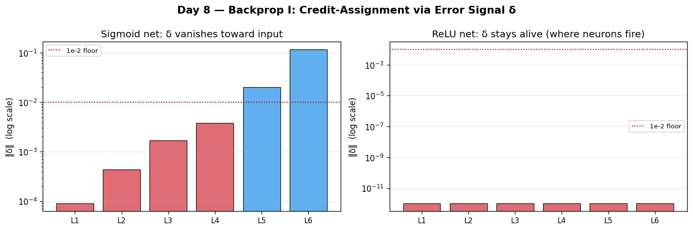

# Day 8 — Backprop I: Credit-Assignment Intuition
**Date:** 2026-06-09 | **Phase 1 of 11** | **Concept 8 / 112**

---

## 🧠 CONCEPT OF THE DAY

### Intuition
Imagine a relay team that just lost a race. The coach doesn't know *why* — was it the first leg's slow start, the third leg's bad handoff, or the anchor's final sprint? To improve, the coach needs to assign **credit (or blame)** to each runner in proportion to how much *that runner's* performance actually moved the final time. Backpropagation is the algorithm that does exactly this for a neural network: given that the loss is high, how much is *each individual weight* to blame, and in which direction should it nudge to help?

The naive way to answer this — wiggle one weight, rerun the whole network, see how the loss changes, repeat for every weight — is the finite-difference approach, and it's hopelessly slow (you'll quantify *how* slow in today's interview question). Backprop's insight is that you don't need to rerun anything per-parameter. You can compute *one* "error signal" per layer — how sensitive the loss is to that layer's raw output — and every weight feeding into that layer can read its own blame off that single shared signal, multiplied by something purely local (its own input activation). Compute these error signals once, in one organized backward sweep from the output to the input, and you've assigned credit to every parameter in the network simultaneously.

### The Math

For a feedforward network with layers $l = 1, \dots, L$, define the forward pass as:

$$z^{(l)} = W^{(l)} a^{(l-1)} + b^{(l)}, \qquad a^{(l)} = f(z^{(l)})$$

Backprop's central object is the **error signal** $\delta^{(l)} = \dfrac{\partial \mathcal{L}}{\partial z^{(l)}}$ — "how much would a tiny nudge to this layer's *raw, pre-activation* output change the final loss?" It is computed recursively, backward, starting from the output layer:

$$\delta^{(L)} = \nabla_{a^{(L)}}\mathcal{L} \;\odot\; f'(z^{(L)})$$

$$\delta^{(l)} = \big(W^{(l+1)}\big)^{\!\top} \delta^{(l+1)} \;\odot\; f'(z^{(l)}) \quad \text{for } l = L-1, \dots, 1$$

Once you have $\delta^{(l)}$, the gradient for *every* parameter at that layer drops out for free — no further chain-rule unrolling required:

$$\frac{\partial \mathcal{L}}{\partial W^{(l)}} = \delta^{(l)} \big(a^{(l-1)}\big)^{\!\top}, \qquad \frac{\partial \mathcal{L}}{\partial b^{(l)}} = \delta^{(l)}$$

| Symbol | Meaning |
|--------|---------|
| $a^{(l)}, z^{(l)}$ | post- and pre-activation outputs of layer $l$ |
| $W^{(l)}, b^{(l)}$ | weight matrix and bias of layer $l$ — the things being "blamed" |
| $f, f'$ | activation function (Concepts 2–3) and its derivative |
| $\delta^{(l)} = \partial \mathcal{L}/\partial z^{(l)}$ | the **error signal** — the one quantity that carries all "credit-assignment" information for layer $l$ |
| $\odot$ | element-wise (Hadamard) product |



Notice the structure: $\delta^{(l)}$ is built entirely from $\delta^{(l+1)}$ (the *upstream* signal, already computed) and purely *local* quantities ($W^{(l+1)}$, $f'(z^{(l)})$). This is yesterday's chain rule, applied recursively layer by layer — and the $(W^{(l+1)})^\top \delta^{(l+1)}$ term is exactly the **multi-path sum** from Concept 7: every unit in layer $l$ feeds forward into *every* unit of layer $l+1$, so its blame is the sum of the blame it inherits through each of those paths.

### Why it matters / where it leads
Today is the *intuition* — tomorrow (Concept 9) you'll grind through the full derivation by hand for a concrete one-hidden-layer network, symbol by symbol, until the recursion above feels inevitable rather than magical. Internalizing the **error-signal-as-shared-resource** idea now is what makes that derivation click instead of feeling like rote symbol-pushing: every gradient in the network is just "local derivative × the one shared upstream signal for that layer," computed once and reused everywhere it's needed. That reuse is *the entire reason* training billion-parameter models is computationally feasible at all.

---

**Interview question (answer at the bottom):**
> "Why is backpropagation's total cost roughly 2–3× the cost of a single forward pass — regardless of whether the network has a thousand parameters or a trillion? Concretely, what would go wrong, and how badly, if instead you estimated each parameter's gradient independently via finite differences — perturb one weight, rerun the forward pass, measure the change in loss?"

---

## 🐍 PYTHONIC EDGE

**Trick:** `.retain_grad()` lets you keep the gradient (the $\delta$ from today's lesson!) of an *intermediate*, non-leaf activation alive after `.backward()` — turning backprop from a black box into something you can watch assign credit, layer by layer, in real time.

```python
import torch
import torch.nn as nn

torch.manual_seed(0)
x = torch.randn(2, 4)

# BAD — .backward() computes every layer's δ internally, uses it, then frees
# it. You only ever get to see gradients on LEAF tensors (the parameters);
# the intermediate "story" of how blame propagated backward is gone.
model = nn.Sequential(nn.Linear(4, 8), nn.ReLU(), nn.Linear(8, 1))
loss = model(x).sum()
loss.backward()
print(model[0].weight.grad.norm())   # final answer — but HOW did we get here?

# GOOD — call .retain_grad() on intermediate activations BEFORE the backward
# pass. After .backward(), each tensor's .grad IS its δ = ∂L/∂(activation):
# you're reading backprop's credit-assignment signal directly off the wire.
torch.manual_seed(0)
model2 = nn.Sequential(nn.Linear(4, 8), nn.ReLU(), nn.Linear(8, 1))
h1 = model2[0](x); h1.retain_grad()      # pre-ReLU
h2 = model2[1](h1); h2.retain_grad()     # post-ReLU
loss2 = model2[2](h2).sum()
loss2.backward()

print("δ at h1 (pre-ReLU): ", h1.grad.norm().item())
print("δ at h2 (post-ReLU):", h2.grad.norm().item())
# Wherever ReLU zeroed an activation, it also zeroes that unit's δ on the way
# back — "dead" neurons get assigned exactly zero blame. You're watching
# credit assignment route around the parts of the network that didn't fire.
```

---

## 📡 SIGNAL LAB

### Convolution's Gradient *Is* Cross-Correlation — Credit Assignment for a Shared Filter

A convolutional filter `h` is the purest illustration of yesterday's "multi-path sum rule" in the wild: the *same* `K` weights are reused at every sliding-window position across the input. By the chain rule, each tap `h[k]`'s total blame must be the **sum** of its contribution at every position it touched — and that sum has a beautiful closed form.

If `y = x ⋆ h` (cross-correlation, what frameworks call "convolution") and `δ = ∂L/∂y` is the upstream gradient, then:

$$\frac{\partial \mathcal{L}}{\partial h[k]} = \sum_n \delta[n]\cdot x[n+k] \quad(\text{cross-correlation of } x \text{ and } \delta), \qquad \frac{\partial \mathcal{L}}{\partial x[n]} = \sum_k \delta[n-k]\cdot h[k] \quad(\text{convolution of } \delta \text{ with flipped } h)$$

**Worked solution — verify both formulas against finite-difference gradients:**

```python
import numpy as np

np.random.seed(0)
x = np.random.randn(10)
h = np.random.randn(3)
y = np.correlate(x, h, mode='valid')     # "conv" in CNNs is really cross-correlation
delta = np.random.randn(len(y))           # pretend this is dL/dy, handed down from above

# Closed form: dL/dh[k] = sum_n delta[n] * x[n+k]  (cross-correlation of x, delta)
grad_h_closed = np.array([np.sum(delta * x[k:k+len(delta)]) for k in range(len(h))])
# Closed form: dL/dx = FULL convolution of delta with the FLIPPED filter h
grad_x_closed = np.convolve(delta, h[::-1])

# Ground truth via central finite differences on L = sum(delta * (x correlate h))
eps = 1e-6
def loss(x_, h_):
    return np.sum(delta * np.correlate(x_, h_, mode='valid'))

grad_h_fd = np.array([(loss(x, h + eps*e) - loss(x, h - eps*e)) / (2*eps)
                      for e in np.eye(len(h))])
grad_x_fd = np.array([(loss(x + eps*e, h) - loss(x - eps*e, h)) / (2*eps)
                      for e in np.eye(len(x))])

assert np.allclose(grad_h_closed, grad_h_fd, atol=1e-5)
assert np.allclose(grad_x_closed, grad_x_fd, atol=1e-5)
```

**So what:** Filter tap `h[k]` is reused at every window position — the multi-path scenario from Concept 7 made physical. Its total blame is the *sum* (never the average!) of "how much I contributed here" (`x[n+k]`) weighted by "how much the loss cared about this output position" (`δ[n]`) — and that sum-of-products-across-shared-uses *is* a cross-correlation. Meanwhile the gradient that must continue flowing backward into `x` (so earlier layers can keep assigning their own blame) comes out as a convolution with the *flipped* kernel — which is precisely why deep learning frameworks implement a conv layer's backward pass as just another correlation/convolution, not some exotic new primitive. Forward and backward through a conv are both, at their core, sliding dot products. Keep this in your back pocket — it's the seed of everything from Concept 32 onward, and a fact that separates "I've used CNNs" from "I understand CNNs" in an interview.

---

## ⚔️ THE GAUNTLET

### Gradient Flow

You're given a DAG with `n` nodes and `m` directed edges. Each edge `u → v` carries a real-valued **local derivative** `d(u, v)` — think of it as $\partial a_v / \partial a_u$, an entry of the local Jacobian, exactly like the $f'(z^{(l)})$ and $W^{(l+1)}$ factors from today's recursion. Node `t` is the designated **loss / sink node** (guaranteed to have no outgoing edges) with seed gradient $\partial \mathcal{L}/\partial a_t = 1$.

For each of `q` query nodes `s`, output $\partial \mathcal{L}/\partial a_s = \sum_{P:\, s \to t} \prod_{(u,v) \in P} d(u, v)$ — the sum, over **every** path from `s` to `t`, of the product of local derivatives along that path. (This is exactly what reverse-mode autodiff computes — and exponentially many paths can exist, so don't enumerate them.)

**Constraints:**
- $1 \le n \le 10^5$, $0 \le m \le 2\times 10^5$, $1 \le q \le n$
- $|d(u,v)| \le 10$, given to 6 decimal places
- Output each answer with absolute or relative error $\le 10^{-6}$
- Time: $O(n+m)$, Space: $O(n+m)$

**Input format:**
```
6 7 5
0 1 0.500000
0 2 -0.300000
1 3 1.200000
2 3 0.800000
3 4 2.000000
3 5 1.000000
4 5 0.500000
3
0 1 3
```
(`n m t`, then `m` lines `u v d`, then `q`, then `q` query node indices)

**Hints:**
1. This is the *exact* weighted generalization of yesterday's path-counting problem — instead of each path contributing a flat weight of 1, it now contributes the **product** of its edge derivatives, and you must **sum** those products across all paths from a node to the sink. Exponentially many paths exist — you cannot enumerate them; you need a DP that processes each edge exactly once.
2. Look closely at the *direction* of the dependency: to know $\partial \mathcal{L}/\partial a_u$, you need $\partial \mathcal{L}/\partial a_v$ for **every node `v` that `u` points to** (`u`'s out-neighbors) — the mirror image of yesterday's dependency direction. What traversal order guarantees every node is finalized only *after* all of its out-neighbors are?
3. Compute the graph's *forward* topological order exactly as you did yesterday (Kahn's algorithm via in-degrees) — then walk that order **backward**. Seed `grad[t] = 1`. For every other node `u`, in reverse topological order, set `grad[u] = Σ over edges (u→v, weight d) of d · grad[v]`. By the time you reach `u`, every such `grad[v]` is already finalized, because `v` necessarily appears earlier in the reversed order. This *is* the $\delta$-recursion from today's lesson, generalized to an arbitrary DAG.

**Pattern:** Reverse Topological Order + Weighted DP Accumulation — i.e., *backpropagation on a general DAG*
**Target:** $O(n+m)$ time, $O(n+m)$ space

*Full solution locked below.*

---

## 🏗️ BLUEPRINT

No blueprint today.

---

## 💬 MARCHING ORDERS

You now have the *idea* of backprop fully in hand: one shared error signal per layer, computed once and read off by every parameter that needs it. That's the entire trick — everything tomorrow does is make it precise enough to code from scratch. Sit with the intuition tonight; tomorrow you'll derive it cold, and it'll feel like remembering something you already knew rather than learning something new.

**Tomorrow:** Concept 9 — Backprop II — full math (one hidden layer)

---
---

## 🔒 GAUNTLET SOLUTION

```cpp
#include <bits/stdc++.h>
using namespace std;

int main() {
    ios_base::sync_with_stdio(false);
    cin.tie(nullptr);

    int n, m, t;
    cin >> n >> m >> t;

    vector<vector<pair<int,double>>> adj(n);
    vector<int> indeg(n, 0);
    for (int i = 0; i < m; i++) {
        int u, v; double d;
        cin >> u >> v >> d;
        adj[u].push_back({v, d});
        indeg[v]++;
    }

    // Forward topological order (Kahn's) — same as yesterday
    queue<int> q;
    for (int i = 0; i < n; i++) if (indeg[i] == 0) q.push(i);
    vector<int> topo;
    topo.reserve(n);
    while (!q.empty()) {
        int u = q.front(); q.pop();
        topo.push_back(u);
        for (auto& [v, d] : adj[u]) if (--indeg[v] == 0) q.push(v);
    }

    // Backward pass: walk the topological order in REVERSE.
    // grad[u] = sum over outgoing edges (u -> v, weight d) of d * grad[v].
    // Reverse-topo order guarantees every grad[v] is finalized before grad[u]
    // is computed — this IS the delta-recursion from today's lesson.
    vector<double> grad(n, 0.0);
    grad[t] = 1.0;
    for (int i = (int)topo.size() - 1; i >= 0; i--) {
        int u = topo[i];
        if (u == t) continue;            // sink is seeded, has no out-edges to fold in
        double g = 0.0;
        for (auto& [v, d] : adj[u]) g += d * grad[v];
        grad[u] = g;
    }

    int qnum;
    cin >> qnum;
    cout << fixed << setprecision(6);
    while (qnum--) {
        int s; cin >> s;
        cout << grad[s] << "\n";
    }
    return 0;
}
```

**Why it works:** $\partial \mathcal{L}/\partial a_u$ equals the sum, over every outgoing edge $u \to v$, of "how sensitive $a_v$ is to $a_u$" ($d(u,v)$) times "how sensitive $\mathcal{L}$ is to $a_v$" ($\text{grad}[v]$) — that's the multivariable chain rule's sum-over-paths from Concept 7, applied one edge-hop at a time instead of all at once. Processing nodes in reverse topological order guarantees that whenever we compute `grad[u]`, every node `u` points to has *already* been finalized (it must appear earlier in the reversed order, since the forward order placed it later). One pass over every edge, one multiply-add each — $O(n+m)$, and structurally identical to a real backward pass through a network.

**Edge cases:** If `s == t`, the seed value `1.0` is already correct (the empty path contributes a product of 1). If `s` cannot reach `t`, every path-product sum is empty and `grad[s]` correctly remains `0.0`.

---

## 🔑 CONCEPT ANSWER

**Question:** "Why is backpropagation's total cost roughly 2–3× the cost of a single forward pass — regardless of whether the network has a thousand parameters or a trillion? Concretely, what would go wrong, and how badly, if instead you estimated each parameter's gradient independently via finite differences?"

**Answer:** Backprop computes gradients for *every* parameter in one organized backward sweep by exploiting reuse: the error signal $\delta^{(l)} = \partial \mathcal{L}/\partial z^{(l)}$ at layer $l$ is computed **exactly once**, and every weight feeding into that layer reads its own gradient off that single shared value, multiplied by something purely local and cheap (an input activation, in the case of $\partial \mathcal{L}/\partial W^{(l)} = \delta^{(l)}(a^{(l-1)})^\top$). Structurally, the backward pass performs the *same family of matrix multiplications* as the forward pass — just transposed and run in reverse order — which is why the total cost (forward + backward) lands at roughly 2–3× a single forward pass, a ratio that is **independent of how many parameters the network has**.

Finite differences throw all of that reuse away. To estimate $\partial \mathcal{L}/\partial w_i$ for a single parameter $w_i$, you perturb it by $\epsilon$, rerun the *entire* forward pass, and divide the change in loss by $\epsilon$ — and you must repeat this independently for **every one of the $P$ parameters**. That's $O(P)$ full forward passes (closer to $2P$ with central differences) just to obtain *one* gradient estimate that backprop produces in a single backward pass. For a billion-parameter model, that's roughly a *billion times* more compute per training step — not a constant-factor slowdown but a difference in asymptotic class, the difference between "trains overnight" and "never finishes." And the result you'd get wouldn't even be exact: finite differences trade off truncation error (ε too large) against catastrophic floating-point cancellation (ε too small), yielding a noisy approximation rather than the analytically exact value backprop computes. This is precisely why finite differences survive in practice only as **gradient checking** — spot-verifying a handful of parameters' analytic gradients during debugging — never as the mechanism that actually trains the model.
