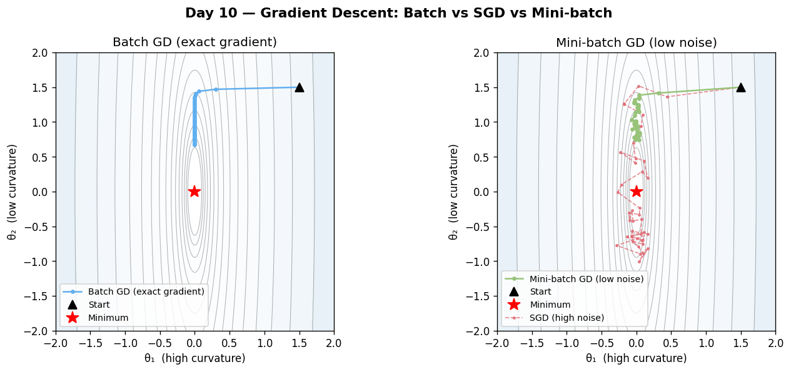

# Day 10 — Gradient Descent: Batch, SGD, and Mini-Batch
**Date:** 2026-06-10 | **Phase 1 of 11** | **Concept 10 / 112**

---

## 🧠 CONCEPT OF THE DAY

### Intuition

You're standing on a foggy hillside at night. You can't see the valley, but you can feel the slope under your feet. So you take a step downhill, feel the new slope, take another step, repeat. That's gradient descent: the gradient is "which way is downhill from here," and the learning rate is "how big a step do I dare take."

The twist that matters today: **how do you measure the slope?** You could survey the *entire* hillside before each step (expensive, but accurate). You could feel the slope under just *one foot* (cheap, but jittery — sometimes it tells you to go slightly the wrong way). Or you could feel the slope under a small patch of ground (a compromise that, surprisingly, often works *better* than surveying the whole hill).

Concept 9 gave you the exact gradient $\partial \mathcal{L}/\partial \theta$ for any single example. Today's question is: which examples do you average over before you take a step?

### The Math

**The update rule** (same for all three variants — only $g_t$ differs):

$$\theta_{t+1} = \theta_t - \eta \, g_t$$

| Symbol | Meaning |
|--------|---------|
| $\theta_t$ | All trainable parameters at step $t$ |
| $\eta$ | Learning rate (Concept 11 — tomorrow) |
| $g_t$ | The gradient *estimate* used at step $t$ |

**Batch gradient descent** — the true gradient, averaged over all $N$ training examples:

$$g_t = \frac{1}{N}\sum_{i=1}^{N} \nabla_\theta \mathcal{L}_i(\theta_t)$$

This is the exact direction of steepest descent on the *full* loss surface. One step requires a full pass over the dataset.

**Stochastic gradient descent (SGD)** — a single randomly drawn example:

$$g_t = \nabla_\theta \mathcal{L}_{i_t}(\theta_t), \qquad i_t \sim \text{Uniform}\{1,\dots,N\}$$

Crucially, $g_t$ is an **unbiased estimator** of the true gradient:

$$\mathbb{E}[g_t] = \nabla_\theta \mathcal{L}(\theta_t)$$

but it's noisy — high variance around that expectation.

**Mini-batch gradient descent** — average over a random batch $B_t$ of size $b$:

$$g_t = \frac{1}{b}\sum_{i \in B_t} \nabla_\theta \mathcal{L}_i(\theta_t)$$

Still unbiased, but averaging shrinks the variance:

$$\mathrm{Var}[g_t] = \frac{\sigma^2}{b}$$

where $\sigma^2$ is the variance of a single example's gradient. This is the **square-root law**: doubling the batch size only buys you $\sqrt{2}\times$ less noise, not $2\times$ — diminishing returns that show up directly in your GPU bill.



| | Batch GD | SGD ($b{=}1$) | Mini-batch |
|---|---|---|---|
| Gradient estimate | Exact | Unbiased, $\mathrm{Var}=\sigma^2$ | Unbiased, $\mathrm{Var}=\sigma^2/b$ |
| Cost per step | $O(N)$ | $O(1)$ | $O(b)$ |
| Steps per epoch | 1 | $N$ | $N/b$ |
| Hardware utilization | High (one big matmul) | Terrible (no parallelism) | High (vectorized matmul) |
| Escapes sharp local minima / saddles? | No (gets stuck) | Yes (noise helps) | Yes, tunably |

### Why it matters / where it leads

Mini-batch isn't a compromise made reluctantly — it's usually **strictly better** than batch GD for *generalization*, not just speed. The gradient noise acts as implicit regularization, biasing trajectories toward wide, flat minima that generalize better (this becomes precise in Concept 22, bias–variance, and again in Concept 26, dropout — another noise-as-regularizer trick). Tomorrow (Concept 11) asks the natural follow-up: *how big can $\eta$ be before this update rule blows up?* The answer depends on the curvature of $\mathcal{L}$ — and today's Signal Lab shows you that exact relationship through a 60-year-old adaptive filter.

---

**Interview question (answer at the bottom):**
> "You're training with batch size 32 and it works well. A teammate suggests batch size 4096 'to use the GPU better' and keeps the learning rate the same. Training gets *worse*. Why — and what's the standard fix?"

---

## 🐍 PYTHONIC EDGE

**Trick:** `optimizer.zero_grad()` placement is the single most common silent bug in hand-rolled training loops — and it's a *mini-batch gradient descent* bug specifically: forgetting it turns your mini-batch gradients into a running sum across the whole epoch.

```python
import torch

model = torch.nn.Linear(10, 1)
optimizer = torch.optim.SGD(model.parameters(), lr=0.01)
loss_fn = torch.nn.MSELoss()

X = torch.randn(256, 10)
y = torch.randn(256, 1)
batch_size = 32

# BAD — gradients accumulate across batches (no zero_grad)
for i in range(0, len(X), batch_size):
    xb, yb = X[i:i+batch_size], y[i:i+batch_size]
    pred = model(xb)
    loss = loss_fn(pred, yb)
    loss.backward()              # grads ADD to whatever was already there
    optimizer.step()
    # missing: optimizer.zero_grad()
    # by batch 8, grad = sum of 8 batches' gradients -> effective lr is 8x

# GOOD — each step uses only this batch's gradient
for i in range(0, len(X), batch_size):
    xb, yb = X[i:i+batch_size], y[i:i+batch_size]
    optimizer.zero_grad(set_to_none=True)   # clear before backward
    pred = model(xb)
    loss = loss_fn(pred, yb)
    loss.backward()
    optimizer.step()
```

The "bad" version doesn't crash and often *appears* to train (the accumulated gradient still points roughly downhill early on) — which is exactly why it's dangerous. `set_to_none=True` is also a free micro-optimization: it lets PyTorch skip a memset instead of zeroing a tensor. The one place you *want* accumulation is intentional: simulating a larger batch size on limited memory by calling `loss.backward()` several times before one `optimizer.step()` + `zero_grad()` (Concept 97, gradient accumulation).

---

## 📡 SIGNAL LAB

### LMS Adaptive Filtering — Mini-Batch SGD with $b=1$, Invented in 1960

Long before "SGD" was deep-learning vocabulary, adaptive filtering had it: the **Least Mean Squares (LMS)** algorithm (Widrow & Hoff, 1960) is *exactly* online SGD ($b=1$) applied to the quadratic loss

$$\mathcal{L}(\mathbf{w}) = \mathbb{E}\big[(d[n] - \mathbf{w}^\top \mathbf{x}_n)^2\big]$$

where $\mathbf{x}_n = [x[n], x[n-1], \dots, x[n-M+1]]^\top$ is a sliding window of input samples and $d[n]$ is a desired signal (e.g. the output of an unknown FIR system you're trying to identify). The instantaneous gradient is $\nabla_\mathbf{w}(d[n]-\mathbf{w}^\top\mathbf{x}_n)^2 = -2e[n]\mathbf{x}_n$, giving the update:

$$\mathbf{w}_{n+1} = \mathbf{w}_n + \mu\, e[n]\, \mathbf{x}_n, \qquad e[n] = d[n] - \mathbf{w}_n^\top \mathbf{x}_n$$

This is *literally* $\theta_{t+1} = \theta_t - \eta g_t$ with $g_t = -e[n]\mathbf{x}_n$ and step size $\mu \leftrightarrow \eta$.

The classic stability result: LMS converges in the mean iff

$$0 < \mu < \frac{2}{\lambda_{\max}(\mathbf{R})}$$

where $\mathbf{R} = \mathbb{E}[\mathbf{x}_n\mathbf{x}_n^\top]$ is the input autocorrelation matrix. **This is exactly the gradient descent step-size bound $\eta < 2/L$**, where $L$ (the Lipschitz constant of $\nabla\mathcal{L}$) equals the largest eigenvalue of the loss's Hessian — and for this quadratic loss, the Hessian is $2\mathbf{R}$.

```python
import numpy as np

np.random.seed(0)
M = 8                                  # unknown filter length
h_true = np.random.randn(M) * 0.5      # the system we're trying to identify

N = 4000
x = np.random.randn(N)                 # white noise input -> R = Px * I, Px = 1
noise = 0.01 * np.random.randn(N)

def lms(mu, x, h_true, noise, M):
    w = np.zeros(M)
    sq_err = []
    for n in range(M - 1, len(x)):
        x_n = x[n - M + 1:n + 1][::-1]          # most recent sample first
        d = h_true @ x_n + noise[n]
        e = d - w @ x_n
        w = w + mu * e * x_n                     # <-- this line IS gradient descent
        sq_err.append(e ** 2)
    return w, np.array(sq_err)

# White noise input -> R = I -> lambda_max(R) = 1 -> stability bound mu < 2
for mu, label in [(0.001, "too small (slow)"), (0.5, "good"), (2.5, "too large (>2/lambda_max)")]:
    w, sq_err = lms(mu, x, h_true, noise, M)
    final_mse = sq_err[-200:].mean()
    print(f"mu={mu:>5.3f} [{label:25s}] final MSE={final_mse:.4e}  ||w - h_true||={np.linalg.norm(w - h_true):.4f}")
```

Expected pattern: $\mu=0.001$ converges, but is still far from $h_{\text{true}}$ after 4000 samples (too few effective updates — like training with a tiny LR for too few epochs). $\mu=0.5$ converges close to $h_{\text{true}}$ with low steady-state error. $\mu=2.5 > 2/\lambda_{\max}(\mathbf{R})$ diverges — the weights blow up exponentially (`final MSE` explodes toward `inf`/`nan`), the filter equivalent of a loss curve that shoots to NaN after a few steps.

**So what:** Every time you've heard "if your loss explodes, lower the learning rate," you were rediscovering the LMS stability bound. The reason deep learning can't just compute $\lambda_{\max}(\mathbf{R})$ and pick the optimal $\mu$ exactly is that $\mathbf{R}$ (the Hessian's curvature) changes at every step and across every layer — which is precisely the motivation for adaptive per-parameter step sizes (Concept 15, AdaGrad/RMSprop) and learning-rate schedules (Concept 17). For frequency-domain work specifically: LMS and its frequency-domain cousins (FxLMS, frequency-domain block LMS) are the backbone of adaptive noise cancellation and echo cancellation — the same gradient-descent math you just used for neural nets, running at audio sample rates since before backprop had a name.

---

## ⚔️ THE GAUNTLET

### Convex Cost Minimization

You're given $n$ "anchor" points $a_1, \dots, a_n$ on the real line, each with a positive weight $w_i$, and a non-negative constant $C$. Define:

$$f(x) = \sum_{i=1}^{n} w_i (x - a_i)^2 + C|x|$$

Find $\min_{x \in \mathbb{R}} f(x)$, accurate to within $10^{-6}$.

**Input:**
```
n C
a_1 w_1
a_2 w_2
...
a_n w_n
```

**Output:** the minimum value of $f(x)$, printed with 6 decimal digits after the decimal point.

**Constraints:**
- $1 \le n \le 10^5$
- $|a_i| \le 10^6$, $1 \le w_i \le 10^6$, $0 \le C \le 10^6$
- Time limit implies roughly $O(n \log(1/\varepsilon))$

**Example:**
```
1 4
5 1
```
$f(x) = (x-5)^2 + 4|x|$. For $x \ge 0$: $f'(x) = 2(x-5)+4 = 2x-6=0 \Rightarrow x=3$. $f(3) = 4 + 12 = 16$.
Output: `16.000000`

**Hints:**
1. Each term $w_i(x-a_i)^2$ is convex, and $C|x|$ is convex (it's just non-differentiable at $x=0$). A **sum of convex functions is convex** — and convexity, not differentiability, is all ternary search needs. Crucially, $f$ here is *strictly* convex away from any flat region (the quadratic terms dominate), so it has a unique minimum.
2. Pick a search interval $[\text{lo}, \text{hi}]$ guaranteed to contain the minimizer — since each quadratic term pulls toward $a_i$ and $|x|$ pulls toward $0$, the minimizer lies within $[\min(0,\min_i a_i), \max(0,\max_i a_i)]$. Pad it slightly for safety.
3. Standard ternary search: $m_1 = \text{lo} + (\text{hi}-\text{lo})/3$, $m_2 = \text{hi} - (\text{hi}-\text{lo})/3$. If $f(m_1) < f(m_2)$, the minimum can't be in $(m_2, \text{hi}]$, so set $\text{hi}=m_2$; otherwise set $\text{lo}=m_1$. Each evaluation of $f$ is $O(n)$, and ~100 iterations shrinks the interval by a factor of $(2/3)^{100}$ — far below $10^{-6}$. Total: $O(n \log(1/\varepsilon))$. Evaluate $f$ once more at the final midpoint for your answer.

**Pattern:** Ternary search on a convex (possibly non-smooth) 1D function — the "closed-form-free" sibling of gradient descent. Where GD needs a gradient and a learning rate and only *probabilistically* converges, ternary search needs only a convexity guarantee and converges geometrically, every time, with zero hyperparameters.

**Target:** $O(n \log(1/\varepsilon))$ time, $O(n)$ space.

*Full solution locked below.*

---

## 🏗️ BLUEPRINT

**System design nugget — the data pipeline that feeds mini-batch SGD:**

The variance reduction in $g_t = \frac{1}{b}\sum_{i\in B_t}\nabla\mathcal{L}_i$ assumes $B_t$ is an i.i.d. sample from the data distribution. In practice, your `Dataset`/`DataLoader` decides how true that assumption is — and it's a real tradeoff:

- **Full shuffle every epoch** (`shuffle=True` over an in-memory index list): best statistical guarantee, but requires random access to the whole dataset — fine for ImageNet-sized data on local SSD, infeasible for a 10 TB sharded dataset on object storage (random reads kill throughput).
- **Shuffle buffer** (`IterableDataset` + a buffer of size $K \ll N$, e.g. TFRecord/WebDataset style): stream shards sequentially, maintain a buffer of $K$ examples, sample randomly from the buffer while refilling from the stream. Throughput stays high (sequential reads), but consecutive batches are correlated within shard boundaries unless $K$ is large and shards are pre-shuffled at write time.
- **No shuffle** (sequential): maximum throughput, but if your data is sorted (by class, by time, by speaker) your mini-batch gradients become *biased* estimators of the full gradient for long stretches — training can look fine and still converge to a worse optimum, or oscillate as the data distribution shifts batch-to-batch.

The rule of thumb: shuffle once at the shard level when you write the dataset, then use a shuffle buffer at read time — you get near-i.i.d. mini-batches without paying for random disk access.

---

## 💬 MARCHING ORDERS

Run the LMS experiment — watch $\mu=2.5$ blow up in real numbers, not just in theory. That instability *is* the same instability behind every "loss went to NaN, halved the LR, fixed it" war story you'll hear in your career.

**Tomorrow:** Concept 11 — The Learning Rate

---
---

## 🔒 GAUNTLET SOLUTION

```cpp
#include <bits/stdc++.h>
using namespace std;

int n;
double C;
vector<double> a, w;

double f(double x) {
    double total = C * fabs(x);
    for (int i = 0; i < n; i++) {
        double d = x - a[i];
        total += w[i] * d * d;
    }
    return total;
}

int main() {
    ios_base::sync_with_stdio(false);
    cin.tie(nullptr);

    cin >> n >> C;
    a.resize(n);
    w.resize(n);

    double lo = 0.0, hi = 0.0;
    for (int i = 0; i < n; i++) {
        cin >> a[i] >> w[i];
        lo = min(lo, a[i]);
        hi = max(hi, a[i]);
    }
    // Pad the bracket slightly; the true minimizer lies within [min(0,min a_i), max(0,max a_i)]
    lo -= 1.0;
    hi += 1.0;

    // Ternary search on the convex function f
    for (int iter = 0; iter < 200; iter++) {
        double m1 = lo + (hi - lo) / 3.0;
        double m2 = hi - (hi - lo) / 3.0;
        if (f(m1) < f(m2)) {
            hi = m2;
        } else {
            lo = m1;
        }
    }

    double x_star = (lo + hi) / 2.0;
    cout << fixed << setprecision(6) << f(x_star) << "\n";
    return 0;
}
```

**Why it works:** Convexity guarantees that for any $m_1 < m_2$ in the search interval, $f(m_1) < f(m_2)$ implies the minimizer lies in $[\text{lo}, m_2]$ (it cannot be in $(m_2, \text{hi}]$, since $f$ would have to decrease again after increasing — contradicting convexity), and symmetrically for the other case. Each iteration shrinks the interval to $2/3$ of its size, so 200 iterations shrink an interval of size $\sim 2\times10^6$ by a factor of $(2/3)^{200} \approx 10^{-35}$ — vastly below the $10^{-6}$ tolerance, with huge margin for floating-point error. Each evaluation of $f$ costs $O(n)$, giving $O(n \cdot \text{iters}) = O(n\log(1/\varepsilon))$ overall — $2\times10^7$ operations for $n=10^5$, comfortably within limits. The non-differentiability of $C|x|$ at $x=0$ is a complete non-issue: ternary search only ever compares *values* of $f$, never slopes.

---

## 🔑 CONCEPT ANSWER

**Question:** "You're training with batch size 32 and it works well. A teammate suggests batch size 4096 'to use the GPU better' and keeps the learning rate the same. Training gets *worse*. Why — and what's the standard fix?"

**Answer:**

Going from $b=32$ to $b=4096$ is a $128\times$ increase in batch size. By the variance formula $\mathrm{Var}[g_t] = \sigma^2/b$, the gradient estimate becomes $\sqrt{128}\approx 11.3\times$ less noisy *per step* — but each step is also $128\times$ more expensive, so over one **epoch** you take $128\times$ fewer steps. With the same learning rate, the *total displacement* of $\theta$ per epoch shrinks dramatically, and you also lose the noise that was helping the optimizer escape sharp minima and saddle points (this is the same noise-as-regularizer effect mentioned in "Why it matters" above). Net effect: slower convergence and often worse final generalization — the model settles into a sharper, less robust minimum.

**The standard fix is the linear scaling rule** (Goyal et al., 2017, "Accurate, Large Minibatch SGD"): when multiplying batch size by $k$, multiply the learning rate by $k$ as well, *and* use a learning-rate warmup over the first few epochs so the larger step size doesn't destabilize training while $\theta$ is still far from any well-behaved region of the loss surface (warmup is previewed here, formalized in Concept 17). This keeps the *expected per-epoch displacement* roughly constant: $128\times$ fewer, but $128\times$-scaled-up steps. It's not a perfect fix — past a certain batch size the noise-as-regularization benefit is lost no matter what you do to $\eta$ — but it recovers most of the gap and is the first thing any interviewer expects you to say.
