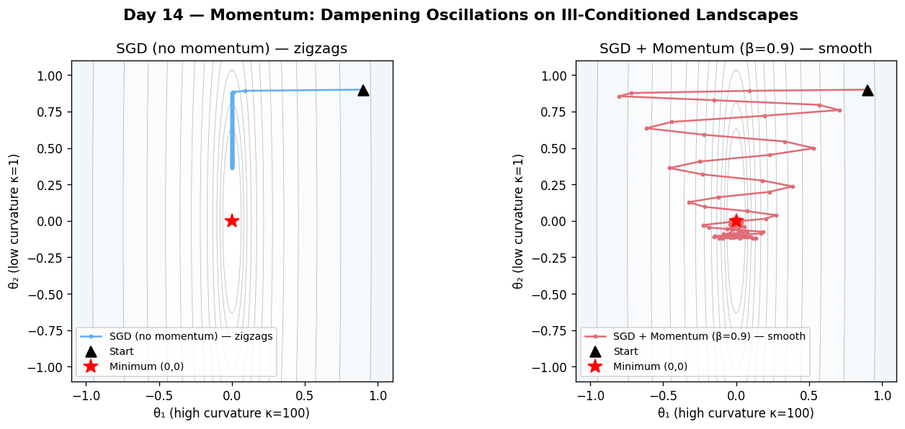

# Day 14 — Momentum

> Phase 2 · Concept 13 of 112 | 2026-06-15

---

## 🧠 CONCEPT OF THE DAY

### Intuition: A Ball Rolling Downhill

Vanilla SGD updates parameters using only the current gradient — it has no memory. If gradients zigzag (common in elongated loss landscapes), each step fights the last. Momentum fixes this by giving the optimizer a sense of **inertia**: it accumulates a velocity vector that smooths out oscillations and amplifies consistent directions.

Imagine rolling a heavy ball down a hilly terrain. On a flat plateau it slows slightly, on a steep slope it accelerates, and across a ravine it maintains momentum through the bottom rather than getting stuck. That's exactly what momentum does for gradient descent.

### The Math

Classical momentum introduces a **velocity vector** v:

$$v_t = \beta \, v_{t-1} + \nabla_\theta \mathcal{L}_t$$

$$\theta_{t+1} = \theta_t - \eta \, v_t$$

Expanded over time:

$$v_t = \sum_{k=0}^{t} \beta^{t-k} \nabla_\theta \mathcal{L}_k$$

The velocity is a **geometrically decaying average** of past gradients. Recent gradients count more; old gradients decay by factor β per step.

**Symbol glossary:**
- β — momentum coefficient (typical: 0.9, sometimes 0.99)
- η — learning rate
- v_t — velocity at step t
- ∇θ ℒ_t — gradient at step t

**Effective learning rate intuition:** On a slope with consistent gradient g, the velocity converges to:

$$v^\star = \frac{g}{1 - \beta}$$

So with β = 0.9, the effective step magnitude is:

$$\eta \cdot v^\star = \frac{\eta}{1 - \beta} = 10\eta$$

Momentum **amplifies** the learning rate by 1/(1−β) in directions of consistent gradient.



### Why It Matters / Where It Leads

Momentum solves two problems simultaneously:
1. **Smooths out noisy mini-batch gradients** — oscillations in high-curvature directions cancel out.
2. **Accelerates along low-curvature directions** — builds up speed where gradients consistently agree.

The classic failure mode: momentum can **overshoot** a minimum if β is too high. This motivates **Nesterov Accelerated Gradient (tomorrow)**, which looks ahead before computing the gradient — a key correction that fixes momentum's myopia.

Real-world: β = 0.9 is the default in PyTorch SGD. For Adam (coming in Concept 16), a momentum-like term is baked in as the first moment. Understanding momentum from first principles is what lets you debug "why is my loss spiking after step N" — it's usually an interaction between momentum and a large gradient.

**Interview question (answer at bottom):**
> *With momentum coefficient β = 0.9, how many steps does it take for a past gradient to decay to less than 1% of its original influence? What does this imply about the optimizer's "memory"?*

---

## 🐍 PYTHONIC EDGE

### Inspecting Optimizer State — Momentum Buffers

Momentum state lives inside the optimizer, not in your model. Knowing how to read it is essential for debugging training instability.

**Bad way (can't see what's happening):**
```python
optimizer = torch.optim.SGD(model.parameters(), lr=0.01, momentum=0.9)
# Train for N steps and hope for the best
```

**Clean way (inspect momentum buffers):**
```python
optimizer = torch.optim.SGD(model.parameters(), lr=0.01, momentum=0.9)

# After a few training steps:
for group in optimizer.param_groups:
    for p in group['params']:
        if p.grad is not None:
            state = optimizer.state[p]
            if 'momentum_buffer' in state:
                buf = state['momentum_buffer']
                print(f"param shape {p.shape}: "
                      f"velocity norm = {buf.norm():.4f}, "
                      f"grad norm = {p.grad.norm():.4f}, "
                      f"ratio = {buf.norm()/p.grad.norm():.2f}x")
```

This lets you verify the effective amplification is tracking 1/(1−β) ≈ 10×. If velocity norm is ≫ 10× gradient norm, momentum has built up dangerously — often a sign you need gradient clipping (Concept 21).

---

## 📡 SIGNAL LAB

### Momentum as an Exponential Moving Average Filter

From a DSP perspective, the momentum update is a **first-order IIR low-pass filter** applied to the gradient signal.

**Problem:** The discrete-time transfer function of the momentum update is:

$$V(z) = \beta z^{-1} V(z) + G(z)$$

Solve for the frequency response $H(e^{j\omega})$ and find the −3 dB cutoff frequency as a function of β.

**Worked solution:**

Rearranging:

$$V(z)(1 - \beta z^{-1}) = G(z)$$

$$H(z) = \frac{V(z)}{G(z)} = \frac{1}{1 - \beta z^{-1}}$$

On the unit circle $z = e^{j\omega}$:

$$|H(e^{j\omega})|^2 = \frac{1}{1 - 2\beta\cos\omega + \beta^2}$$

At DC (ω = 0): magnitude = 1/(1−β). At the −3 dB point, we want the magnitude to fall to $\frac{1}{\sqrt{2}} \cdot \frac{1}{1-\beta}$:

For β = 0.9, the −3 dB cutoff is approximately:

$$\omega_c \approx 2(1 - \beta) = 0.2 \text{ rad/sample}$$

**So what?** Momentum with β = 0.9 low-pass filters the gradient stream with a cutoff at about 0.2 rad/sample (normalized). Gradient noise above this frequency is attenuated. This is exactly why momentum helps with noisy mini-batch gradients — it's a trainable low-pass filter on the optimization trajectory. In your frequency-domain research: a model trained with high-β momentum may converge to a smoother loss landscape because high-frequency gradient components (sample-specific noise) are systematically suppressed.

---

## 🏋️ THE GAUNTLET

### Problem: Exponential Moving Average (Streaming)

**Statement:**
Given a stream of N integers arriving one by one, compute the **exponential moving average** (EMA) at each step with smoothing factor β:

$$\text{EMA}_t = \beta \cdot \text{EMA}_{t-1} + (1 - \beta) \cdot x_t, \quad \text{EMA}_0 = x_0$$

Output a vector of EMA values after each new element is consumed.

**Constraints:**
- 1 ≤ N ≤ 10⁶
- Values are integers in [−10⁹, 10⁹]
- β is given as a rational p/q (0 < p < q ≤ 100) to avoid floating-point input parsing issues
- Output as doubles with 6 decimal places
- O(N) time, O(N) space

**Hints:**
1. 🟡 You only need the previous EMA value to compute the next one — no array of history needed beyond a single scalar.
2. 🟠 Initialize EMA₀ = x₀ (not 0). For steps t ≥ 1, apply the recurrence. Indexing off-by-one is the most common bug.
3. 🔴 To avoid catastrophic cancellation in floating point: compute `beta = (double)p / q` once, then `ema = beta * ema + (1.0 - beta) * x` per step.

**Pattern:** Streaming / prefix recurrence
**Target complexity:** O(N) time, O(N) output space

---

## 🏗️ BLUEPRINT

### System Design Nugget: Optimizer State in Distributed Training

When you shard a model across GPUs (data parallelism), each GPU holds a replica of the optimizer state — including momentum buffers. This means momentum doubles or quadruples your optimizer memory footprint.

**Key tradeoff:** ZeRO Stage 1 (Concept 99) shards optimizer state across ranks, cutting momentum memory by the number of GPUs. The cost: an all-gather before each parameter update. For momentum-heavy optimizers (Adam has two moment buffers), this trade is almost always worth it at scale. If you're running a training job and OOM-ing not during the forward pass but during the optimizer step, momentum buffer sharding is the fix.

---

## 🗺️ MARCHING ORDERS

Momentum is where optimization stops being "follow the gradient" and starts being "follow the gradient intelligently." Internalize the exponential decay view — you'll see it again in Adam's moment estimates.

Tomorrow: Concept 14 — **Nesterov Accelerated Gradient**

---

---

## 🔓 GAUNTLET SOLUTION

```cpp
#include <bits/stdc++.h>
using namespace std;

int main() {
    ios::sync_with_stdio(false);
    cin.tie(nullptr);

    int n, p, q;
    cin >> n >> p >> q;
    double beta = (double)p / q;
    double one_minus_beta = 1.0 - beta;

    vector<double> result(n);
    double ema = 0.0;

    for (int i = 0; i < n; ++i) {
        double x;
        cin >> x;
        if (i == 0) {
            ema = x;
        } else {
            ema = beta * ema + one_minus_beta * x;
        }
        result[i] = ema;
    }

    cout << fixed << setprecision(6);
    for (double v : result) cout << v << "\n";

    return 0;
}
```

**Note:** The initialization `EMA₀ = x₀` (not 0) avoids the **cold-start bias** present in Adam's moment estimator — which is why Adam has a bias correction term (1 − βᵗ) in its denominator. If you use `EMA₀ = 0`, the early estimates are systematically underestimated until βᵗ ≈ 0.

---

## 💡 CONCEPT ANSWER

**Q:** *With β = 0.9, how many steps for a past gradient to decay to < 1% of its original influence?*

**A:** The influence after k steps is βᵏ. We need 0.9ᵏ < 0.01:

k > log(0.01) / log(0.9) = −2 / −0.04576 ≈ 43.7

So roughly **44 steps**. This means the optimizer effectively has a ~44-step memory window with β = 0.9. Implication: if your loss landscape changes abruptly (e.g., at a curriculum boundary or after a sudden data distribution shift), the stale momentum built up over those 44 steps will actively fight the new gradient direction for many iterations — a real problem in fine-tuning and RL training.
