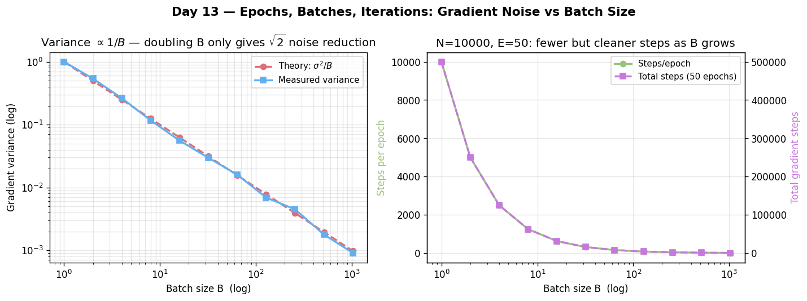

# Day 13 — Epochs, Batches & Iterations

> Phase 1 · Concept 12 of 112 | 2026-06-16

---

## 🧠 CONCEPT OF THE DAY

### Intuition: The Gym Analogy

Imagine you have a textbook with 10,000 practice problems. You don't memorize all of them in one sitting. Instead, you work through them in batches — say 32 at a time — because your working memory is finite. After finishing every problem in the book, that's one "pass" through the curriculum: one **epoch**. Each time you sit down to work through a batch, that's one **iteration**.

This maps exactly to neural network training:

- **Dataset** → 10,000 samples
- **Batch (mini-batch)** → a subset of B samples processed together before a gradient step
- **Iteration** → one forward pass + one backward pass + one weight update
- **Epoch** → one complete pass over the entire dataset (N/B iterations)

### The Math

Given a dataset of N samples and a batch size B:

Number of iterations per epoch:

$$\text{iterations per epoch} = \left\lceil \frac{N}{B} \right\rceil$$

Total gradient steps over E epochs:

$$\text{total steps} = E \cdot \left\lceil \frac{N}{B} \right\rceil$$

The loss at a single gradient step (mini-batch SGD) estimates the true gradient:

$$\nabla_\theta \mathcal{L} \approx \frac{1}{B} \sum_{i \in \mathcal{B}} \nabla_\theta \ell(f_\theta(x_i), y_i)$$

This is a **stochastic** estimate — it's noisy, but that noise is often beneficial (implicit regularization via gradient noise).

**Symbol glossary:**
- N — total training samples
- B — batch size
- E — epochs
- θ — model parameters
- ℓ — per-sample loss
- 𝒷 — the mini-batch index set, |𝒷| = B



### Why It Matters / Where It Leads

The batch size B is a fundamental hyperparameter that controls the **gradient noise-vs-compute tradeoff**:

| Setting | Gradient noise | Generalization | GPU utilization |
|---|---|---|---|
| B = 1 (pure SGD) | Very high | Often good (regularizes) | Poor |
| B = 32–256 (mini-batch) | Medium | Sweet spot | Good |
| B = N (full batch) | None (exact) | Worse (sharp minima) | May not fit in memory |

Large-batch training is notoriously prone to converging to **sharp minima** (Keskar et al., 2017) with worse test accuracy — even with the same loss. This is why you'll see warmup schedules that start with small effective batches and grow. This connects directly to tomorrow's concept: **Momentum** — which is one of the first tricks to stabilize the noisy gradient signal from small batches.

**Interview question (answer at bottom):**
> *You double the batch size from 64 to 128. Without changing anything else, how does this affect the number of gradient updates per epoch, and what might you need to adjust to compensate?*

---

## 🐍 PYTHONIC EDGE

### Don't re-compute `len(dataloader)` inside the loop

A subtle inefficiency: calling `len(dataloader)` inside a tight loop invokes `__len__` on the dataset or sampler every iteration. Worse, people sometimes build the scheduler using a magic number rather than the actual computed steps.

**Bad way:**
```python
for epoch in range(num_epochs):
    for i, batch in enumerate(dataloader):
        # someone hardcoded this somewhere earlier:
        # scheduler = StepLR(optimizer, step_size=1000)
        pass
```

**Clean way:**
```python
steps_per_epoch = len(train_loader)  # compute once
total_steps = num_epochs * steps_per_epoch

scheduler = torch.optim.lr_scheduler.OneCycleLR(
    optimizer,
    max_lr=1e-3,
    total_steps=total_steps,  # scheduler knows the full budget
)

for epoch in range(num_epochs):
    for batch in train_loader:
        optimizer.zero_grad()
        loss = model(batch)
        loss.backward()
        optimizer.step()
        scheduler.step()  # step every iteration, not every epoch
```

The "so what": many schedulers (OneCycleLR, cosine with warmup) need `total_steps` at construction time. Computing it from `len(train_loader)` upfront keeps the math correct and avoids off-by-one bugs when the last batch is a partial batch (drop_last=False).

---

## 📡 SIGNAL LAB

### Batches as Windowed Averaging — A Spectral View

Here's a bridge from your research lane to today's concept.

When you take a mini-batch gradient, you're computing an **average** of N individual gradient vectors. Averaging in the signal-processing sense is a **low-pass filter**: it suppresses high-frequency (sample-specific) noise and preserves low-frequency (population-level) signal.

**Problem:** Suppose each sample's gradient is an independent noise realization, modeled as:

$$g_i = \bar{g} + \epsilon_i, \quad \epsilon_i \sim \mathcal{N}(0, \sigma^2)$$

where $\bar{g}$ is the true gradient. What is the variance of the mini-batch gradient estimator as a function of batch size B?

**Worked solution:**

The mini-batch estimator is:

$$\hat{g}_B = \frac{1}{B} \sum_{i=1}^{B} g_i = \bar{g} + \frac{1}{B}\sum_{i=1}^{B} \epsilon_i$$

Since the $\epsilon_i$ are i.i.d.:

$$\text{Var}(\hat{g}_B) = \frac{\sigma^2}{B}$$

The **standard deviation** of the gradient estimate scales as $1/\sqrt{B}$ — exactly the same as the standard error of the mean from basic statistics.

**So what?** Doubling batch size halves gradient variance — a 3 dB noise reduction in signal terms. But it also halves the number of gradient steps per epoch, so you make fewer but more confident updates. In frequency terms: a larger batch is a wider averaging window, cutting more high-frequency gradient noise. This is why large-batch training needs a higher learning rate to compensate for the reduced noise-induced exploration — the **linear scaling rule** (Goyal et al., 2017): if you multiply B by k, multiply lr by k.

---

## 🏋️ THE GAUNTLET

### Problem: Batch Iterator with Drop-Last

**Statement:**
You are building a minimal training harness. Implement a function `batch_iter(data, batch_size, drop_last)` in C++ that, given a flat array of N integers and a batch size B:
- Yields (via a callback or returns a vector-of-vectors) consecutive mini-batches.
- If `drop_last = true`, discards the final batch if it has fewer than B elements.
- If `drop_last = false`, includes the final (possibly smaller) batch.

**Constraints:**
- 1 ≤ N ≤ 10⁶
- 1 ≤ B ≤ N
- No STL `<algorithm>` functions that do this for you — implement the slicing manually.
- Must run in O(N) time and O(N) space.

**Hints:**
1. 🟡 How many full batches of size B fit into N elements? That's `N / B` using integer division.
2. 🟠 After emitting all full batches, check: is `N % B > 0`? That remainder determines whether a partial batch exists.
3. 🔴 Index into the flat array with `start = i * B` and `end = min(start + B, N)` for batch `i`. Slice `data[start..end)`.

**Pattern:** Array partitioning / index arithmetic
**Target complexity:** O(N) time, O(N) space (output storage)

---

## 🏗️ BLUEPRINT

No blueprint today.

---

## 🗺️ MARCHING ORDERS

You've now closed out the entire foundation arc — neuron to loss to backprop to gradient descent to learning rate to batching. That's the complete training loop in your head. Own it.

Tomorrow: Concept 13 — **Momentum**

---

---

## 🔓 GAUNTLET SOLUTION

```cpp
#include <bits/stdc++.h>
using namespace std;

vector<vector<int>> batch_iter(const vector<int>& data, int batch_size, bool drop_last) {
    int n = data.size();
    int num_full = n / batch_size;
    bool has_remainder = (n % batch_size) != 0;

    vector<vector<int>> batches;
    batches.reserve(num_full + (has_remainder && !drop_last ? 1 : 0));

    for (int i = 0; i < num_full; ++i) {
        int start = i * batch_size;
        int end   = start + batch_size;
        batches.emplace_back(data.begin() + start, data.begin() + end);
    }

    if (has_remainder && !drop_last) {
        int start = num_full * batch_size;
        batches.emplace_back(data.begin() + start, data.end());
    }

    return batches;
}

int main() {
    vector<int> data = {1,2,3,4,5,6,7,8,9,10};

    auto b1 = batch_iter(data, 3, false);
    // → [1,2,3], [4,5,6], [7,8,9], [10]    (4 batches)
    for (auto& b : b1) {
        for (int x : b) cout << x << " ";
        cout << "\n";
    }
    cout << "---\n";

    auto b2 = batch_iter(data, 3, true);
    // → [1,2,3], [4,5,6], [7,8,9]           (3 batches, [10] dropped)
    for (auto& b : b2) {
        for (int x : b) cout << x << " ";
        cout << "\n";
    }
    return 0;
}
```

**Key insight:** `reserve()` the output vector with the exact count to avoid reallocations. In a real training loop, the drop_last=true path is preferred when benchmarking throughput (fixed-size batches are easier to pipeline on GPU).

---

## 💡 CONCEPT ANSWER

**Q:** *You double the batch size from 64 to 128. Without changing anything else, how does this affect the number of gradient updates per epoch, and what might you need to adjust to compensate?*

**A:** Doubling the batch size halves the number of gradient updates per epoch (from N/64 to N/128). The gradient noise variance also halves (Var ∝ 1/B). With fewer, lower-variance updates, the effective step size is smaller — the model explores less. To compensate, practitioners apply the **linear scaling rule**: double the learning rate alongside the batch size (lr × 2). In practice, this works well up to ~B=4096 and should be paired with a linear warmup to avoid instability early in training when gradients are large and noisy.
