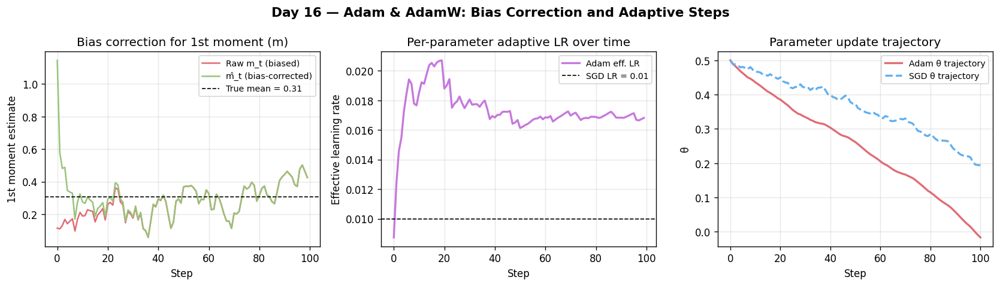

# Day 16 — Adam & AdamW

**Phase 2 · Concept 16 of 112**

---

## 🧠 CONCEPT OF THE DAY

### Adam & AdamW — the Adaptive Moment Optimizer

**Intuition first.**
Imagine you're hiking in a foggy mountain range. You have two memory books: one tracks *which direction you've been running* (your momentum), and another tracks *how rocky each slope is* (how erratic each parameter's gradient has been). Adam reads both books and scales each step accordingly — charging boldly down smooth valleys and tiptoeing along jagged ridges. Every parameter gets its own personalised step size. That's Adam: **Adam**ptive **M**oment estimation.

---

**The math.**

Adam maintains two exponential moving averages for each parameter θ:

First moment (mean of gradients — momentum):

$$m_t = \beta_1 m_{t-1} + (1 - \beta_1) g_t$$

Second moment (uncentred variance — RMSprop-style):

$$v_t = \beta_2 v_{t-1} + (1 - \beta_2) g_t^2$$

Because both accumulators start at zero, they're biased toward zero early in training. We fix that with bias correction:

$$\hat{m}_t = \frac{m_t}{1 - \beta_1^t}, \qquad \hat{v}_t = \frac{v_t}{1 - \beta_2^t}$$

Parameter update:

$$\theta_t = \theta_{t-1} - \frac{\alpha}{\sqrt{\hat{v}_t} + \epsilon} \hat{m}_t$$

**Symbol glossary:**
| Symbol | Meaning | Typical default |
|--------|---------|----------------|
| $g_t$ | gradient at step $t$ | — |
| $\beta_1$ | decay rate for 1st moment | 0.9 |
| $\beta_2$ | decay rate for 2nd moment | 0.999 |
| $\alpha$ | global learning rate | 1e-3 |
| $\epsilon$ | numerical stability floor | 1e-8 |

---

**Why the $\sqrt{\hat{v}_t}$ denominator?** Parameters with consistently large or noisy gradients accumulate large $v_t$, shrinking their effective step — exactly what RMSprop did (Concept 15). The first moment then adds directional persistence (Concept 13: momentum). Adam = Momentum + RMSprop, bias-corrected.



---

**Adam vs AdamW — weight decay done right.**

Vanilla Adam folds L2 regularisation *into the gradient* before scaling:

$$g_t \leftarrow g_t + \lambda \theta_{t-1} \qquad \text{(Adam + L2)}$$

But the $\hat{v}_t$ denominator then shrinks the penalty unpredictably — regularisation effectively disappears for frequently-updated parameters. **AdamW** (Loshchilov & Hutter, 2019) decouples weight decay from the gradient by applying it *directly* to the parameters after the Adam step:

$$\theta_t = \theta_{t-1} - \alpha \left(\frac{\hat{m}_t}{\sqrt{\hat{v}_t} + \epsilon} + \lambda \theta_{t-1}\right)$$

The $\lambda \theta_{t-1}$ term is **not** divided by $\sqrt{\hat{v}_t}$. This makes regularisation uniform across all parameters. Almost every modern LLM/ViT uses AdamW.

---

**Why it matters / where it leads.**

Adam's per-parameter learning rate makes it far more forgiving of hyperparameter choices than plain SGD — it's the default workhorse for deep learning. The AdamW fix is essential whenever weight decay matters (LLM pre-training, fine-tuning). Understanding Adam is the prerequisite for tomorrow's topic: **LR schedules** (cosine warmup, step decay, OneCycleLR) — because Adam still needs $\alpha$ tuned over time.

Real interview question this leads to: *"Why does AdamW generalize better than Adam + L2 for transformers?"*

---

**Interview question (answer at bottom):**

> AdamW is Adam with weight decay decoupled. Explain *concretely* what "decoupled" means — where exactly does the weight decay term appear in the update equations for Adam+L2 vs AdamW, and why does the difference matter for training stability?

---

## 🐍 PYTHONIC EDGE

**Swap Adam for AdamW — and don't forget to exclude biases from weight decay.**

```python
# ❌ Bad: L2 via Adam — decay gets eaten by adaptive scaling
optimizer = torch.optim.Adam(model.parameters(), lr=1e-3, weight_decay=1e-2)

# ✅ Good: AdamW with proper param groups
#   biases & LayerNorm weights should NOT be decayed
# def with default argument: `wd=1e-2` (C++: default parameter value — same concept)
def make_param_groups(model, wd=1e-2):
    # Multiple assignment: `a, b = [], []` — tuple unpacking of two empty lists
    decay, no_decay = [], []
    # model.named_parameters(): generator yielding (name_string, tensor) pairs
    # (C++: would return std::vector<std::pair<std::string, Tensor*>>)
    for name, p in model.named_parameters():
        # `not`: boolean negation (C++: !)
        if not p.requires_grad:
            continue                        # same as C++ continue in a loop
        # p.ndim: attribute (property) for number of dimensions (C++: .dim() method)
        # name.endswith("bias"): str method returning bool (C++: str.ends_with() in C++20)
        if p.ndim <= 1 or name.endswith("bias"):  # 1-D = norm scales/biases
            no_decay.append(p)
        else:
            decay.append(p)
    # returning a list of dicts: dict literal with string keys {"key": value}
    # (C++: would return std::vector<std::unordered_map<std::string, ...>>)
    return [
        {"params": decay,    "weight_decay": wd},
        {"params": no_decay, "weight_decay": 0.0},
    ]

optimizer = torch.optim.AdamW(make_param_groups(model), lr=3e-4)
```

Why split? Decaying a bias or a LayerNorm scale pulls them toward zero, which distorts the normalisation and adds useless regularisation noise. This pattern is used verbatim in the GPT-2 codebase.

---

## 📡 SIGNAL LAB

**Problem: adaptive step sizes through a spectral lens**

Adam's $v_t$ accumulates $g^2$ — it's tracking the *power spectrum* of each parameter's gradient signal over time. Let's make this concrete.

Suppose parameter $\theta_j$ receives gradients that look like a sinusoid at frequency $f = 10$ Hz (say, from an oscillating training signal), while $\theta_k$ receives i.i.d. Gaussian noise.

With $\beta_2 = 0.999$ and $\Delta t = 1$ step:

The EMA $v_t \approx \mathbb{E}[g^2]$ at steady state equals **the average power** of the gradient signal. For the sinusoid with amplitude $A$: $v_\infty = A^2/2$ (same as its mean-squared value). For the noise with variance $\sigma^2$: $v_\infty = \sigma^2$.

So:

- Sinusoidal gradient → effective LR $\approx \frac{\alpha}{A/\sqrt{2}}$ — a fixed, predictable step.
- Noisy gradient → effective LR $\approx \frac{\alpha}{\sigma}$ — steps scale inversely with gradient noise power.

**Worked insight:**
The $\beta_2$ EMA is a **first-order IIR low-pass filter** on $g_t^2$, with time constant $\tau = 1/(1-\beta_2) = 1000$ steps. It smooths out the power estimate over ~1000 gradient observations. Choosing $\beta_2$ close to 1 = longer memory = more stable $v_t$ estimate = more stable effective LR. That's why $\beta_2 = 0.999$ works well for large batches: gradient variance is already low, so the long-horizon power estimate stays accurate.

**So what:** When you see Adam "exploding" in fp16 training, it's often $v_t$ underflowing to zero (denominator → $\epsilon$, huge step) — a spectral power-estimation failure. Fix: use `eps=1e-6` or switch to bf16.

---

## 🏋️ THE GAUNTLET

**Problem: "Running Weighted Variance"**

You're building an optimizer profiler. Given a stream of $N$ gradient magnitudes $|g_1|, |g_2|, \ldots, |g_N|$ and a decay factor $\beta \in (0,1)$, compute the **bias-corrected exponential moving average of $g_t^2$** for every timestep $t$ from 1 to $N$.

Formally, for each $t$:

$$v_t = \beta \cdot v_{t-1} + (1-\beta) \cdot g_t^2, \quad v_0 = 0$$

$$\hat{v}_t = \frac{v_t}{1 - \beta^t}$$

Return the array $[\hat{v}_1, \hat{v}_2, \ldots, \hat{v}_N]$ as a vector of doubles, rounded to 6 decimal places.

**Constraints:**
- $1 \le N \le 10^6$
- $0 < \beta < 1$ (given as a double)
- $|g_t| \in [0, 10^4]$
- Time limit: 1 second

**Hints:**
1. You do not need any data structure fancier than a running scalar — think about what state you actually need to carry forward.
2. $\beta^t$ computed naively in a loop risks floating-point accumulation error; maintain it as a running product updated each step.
3. The bias correction denominator approaches 1 as $t \to \infty$, so for large $t$ it barely matters — but for the first ~10 steps it can change the answer by an order of magnitude.

**Pattern:** Prefix scan / running accumulation.  
**Target complexity:** $O(N)$ time, $O(1)$ extra space (output array aside).

---

## 🏗️ BLUEPRINT

**System design nugget: Optimizer state memory in distributed training**

AdamW carries **two momentum buffers per parameter** ($m_t$ and $v_t$), making its memory footprint 3× that of the raw parameters (weights + two moments), all in fp32 optimizer state. For a 7B-parameter model: ~7B × 3 × 4 bytes ≈ **84 GB** just for the optimizer — before activations or gradients.

Key tradeoff: **Adam's convergence speed vs memory cost.**  
- SGD with momentum: 2× parameter memory (weights + one moment).  
- Adam/AdamW: 3× parameter memory.  
- Adafactor (used in T5/PaLM): factorises $v_t$ into row/column vectors, cuts moment memory by ~10–100× at cost of slightly noisier updates.  
- ZeRO-1 (tomorrow's extended reading): shards optimizer states across GPUs, keeping per-GPU footprint at 3×/world_size.

Rule of thumb: if you're GPU-memory-limited and can't go below Adam's 3× footprint, try Adafactor before you chop batch size.

---

## 🗺️ MARCHING ORDERS

Implement the bias-corrected EMA by hand tonight — no PyTorch — and cross-check against `torch.optim.Adam`'s `state_dict()` after one step. You'll see exactly where your numbers diverge if something's wrong.

**Tomorrow: Concept 17 — LR Schedules (step decay / cosine / warmup)**

---
---

## 🔓 GAUNTLET SOLUTION

```cpp
#include <bits/stdc++.h>
using namespace std;

int main() {
    ios::sync_with_stdio(false);
    cin.tie(nullptr);

    int n;
    double beta;
    cin >> n >> beta;

    vector<double> g(n);
    for (int i = 0; i < n; i++) cin >> g[i];

    vector<double> vhat(n);
    double v = 0.0;
    double beta_pow = 1.0;   // will hold beta^t after each update

    for (int t = 0; t < n; t++) {
        double gt2 = g[t] * g[t];
        v = beta * v + (1.0 - beta) * gt2;
        beta_pow *= beta;                    // beta^(t+1)
        double denom = 1.0 - beta_pow;      // 1 - beta^(t+1)
        vhat[t] = v / denom;
    }

    cout << fixed << setprecision(6);
    for (int t = 0; t < n; t++) {
        cout << vhat[t] << "\n";
    }
    return 0;
}
```

**Why it works:**
- We maintain `v` as a single running scalar — no array of past gradients needed.
- `beta_pow` tracks $\beta^t$ via multiplication each step, avoiding `pow(beta, t)` which would be $O(1)$ but accumulates more float error over $10^6$ steps.
- Total: one pass, $O(N)$ time, $O(1)$ extra memory beyond output.

---

## 💡 CONCEPT ANSWER

**Adam+L2 vs AdamW — where exactly weight decay appears:**

In **Adam + L2**, weight decay is folded *into the gradient* before the adaptive step:

$$g_t \leftarrow g_t + \lambda \theta_{t-1}$$

This augmented gradient then enters the EMA accumulators $m_t$ and $v_t$. The problem: the $\sqrt{\hat{v}_t}$ denominator in the Adam update shrinks the effective penalty differently for each parameter — parameters with large, noisy gradients accumulate large $v_t$, which *scales down* the weight decay penalty for exactly those parameters. Regularisation becomes nonuniform and weaker where you often want it most.

In **AdamW**, the weight decay is applied *after* the adaptive step, directly in parameter space:

$$\theta_t = \theta_{t-1} - \alpha \left(\frac{\hat{m}_t}{\sqrt{\hat{v}_t} + \epsilon} + \lambda \theta_{t-1}\right)$$

The $\lambda \theta_{t-1}$ term is **not divided by $\sqrt{\hat{v}_t}$**, so every parameter shrinks toward zero at the same rate $\alpha \lambda$, regardless of its gradient history. This uniform shrinkage is what "decoupled" means. It matters for stability because:
1. Regularisation actually reaches its intended strength for all parameters.
2. High-frequency weight oscillations (common in transformers with large $v_t$) aren't accidentally exempted from decay.
3. Hyperparameter transfer: the same $\lambda$ works across architectures without rescaling by gradient variance.
