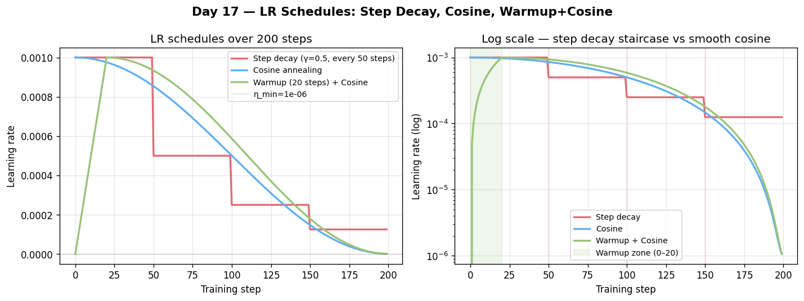

# Day 17 — LR Schedules (Step / Cosine / Warmup)

---

## 🧠 CONCEPT OF THE DAY

**Intuition:** The learning rate is the throttle on your training car. Early on, the landscape is unknown and you need momentum to escape bad minima — but as you approach a good valley, slamming the gas risks overshooting it. A learning rate **schedule** modulates this throttle over time: start hot (or warm up slowly), then cool down systematically.

Three canonical schedules:

**Step Decay** — multiply LR by γ every k epochs:

$$\eta_t = \eta_0 \cdot \gamma^{\lfloor t/k \rfloor}$$

Simple, interpretable, brittle. Manual tuning of k and γ. The loss curve shows staircase drops at each step boundary — visually obvious in training logs.

**Cosine Annealing** — smoothly decay from η₀ to η_min following a cosine curve over T steps:

$$\eta_t = \eta_{\min} + \frac{1}{2}(\eta_0 - \eta_{\min})\left(1 + \cos\left(\frac{\pi t}{T}\right)\right)$$

Where:
- η₀ = initial LR
- η_min = floor (often 0 or 1e-6)
- T = total training steps

This is the industry default for both vision and language models. No cliff artifacts, smooth convergence.

**Linear Warmup + Cosine Decay (the Transformer schedule):**

$$\eta_t = \begin{cases} \eta_0 \cdot \dfrac{t}{T_w} & t < T_w \\[6pt] \eta_{\min} + \dfrac{1}{2}(\eta_0 - \eta_{\min})\left(1 + \cos\!\left(\dfrac{\pi(t - T_w)}{T - T_w}\right)\right) & t \geq T_w \end{cases}$$

Where T_w is the warmup duration (typically 1–5% of total steps).

**Why warmup?** At step 0, weights are random → activations can be large → gradients are noisy. Adam's moment estimates start at zero and are bias-corrected, but in early steps the corrections are still unreliable. A high LR at step 0 can violently destabilize batch norm statistics or blow up attention logits into NaN territory. Warmup ramps the LR gently until the model has a stable "footing."

**Why cosine over step?** Step decay creates hard LR discontinuities that appear as sharp loss spikes — you then need to tune when those drops happen. Cosine is parameterized only by T (total steps), making it nearly hyperparameter-free in practice.

**Where it leads:** LR schedules interact directly with the optimizer (Adam's adaptive scaling still defers to the global η), weight initialization (tomorrow's topic — where you *start* before any schedule kicks in), and gradient clipping (a schedule can't save you from early exploding gradients without clipping).



**Interview question:** *"You're training a Transformer with Adam and your training loss diverges in the first 1000 steps. What are the two most likely causes, and how would you diagnose each?"*

*(Answer hidden at the very bottom)*

---

## 🐍 PYTHONIC EDGE

**The off-by-one scheduler trap in PyTorch**

```python
# ❌ Wrong — step() BEFORE optimizer.step() desynchronizes the schedule
# OOP: .step() is a method on both the scheduler and optimizer objects
scheduler.step()
optimizer.step()

# ✅ Correct — always step() AFTER the optimizer
optimizer.step()
scheduler.step()
```

This matters because PyTorch schedulers track an internal `last_epoch` counter that increments on `.step()`. Calling it before the optimizer means your LR at step N was actually applied at step N−1.

**Cosine with linear warmup (HuggingFace one-liner):**

```python
# `from X import Y`: selective import — brings only Y into the local namespace
# (C++: using X::Y; — more selective than `using namespace X;`)
from transformers import get_cosine_schedule_with_warmup

scheduler = get_cosine_schedule_with_warmup(
    optimizer,
    num_warmup_steps=500,       # ~2% of 25k total steps
    # 25_000: Python allows underscores in integer literals as visual digit separators
    # (C++17: 25'000 with single-quote; both are purely cosmetic, ignored by the parser)
    num_training_steps=25_000,
)
```

**Cosine annealing with warm restarts (vision favorite):**

```python
# OOP: CosineAnnealingWarmRestarts is a subclass of _LRScheduler
# All keyword arguments — T_0, T_mult, eta_min are named explicitly at the call site
scheduler = torch.optim.lr_scheduler.CosineAnnealingWarmRestarts(
    optimizer, T_0=1000, T_mult=2, eta_min=1e-6
)
# T_mult=2 doubles the cycle period after each restart
# Restarts "shake" the model out of sharp minima
```

Restarts are the "SGDR" trick (Loshchilov & Hutter 2017) — the periodic resets act like simulated annealing jumps.

---

## 📡 SIGNAL LAB

**Cosine schedules and the Hann window — same math, same reason**

The cosine annealing multiplier (with η_min = 0):

$$m(t) = \frac{1}{2}\left(1 + \cos\left(\frac{\pi t}{T}\right)\right)$$

is *exactly* one half-period of a raised cosine. Compare to the **Hann window** used in spectral analysis:

$$w[n] = \frac{1}{2}\left(1 - \cos\left(\frac{2\pi n}{N-1}\right)\right)$$

Same shape, sign-flipped (windows rise from 0, schedules fall from 1).

**Why does this matter?** Both solve the *same mathematical problem*: smooth tapering at endpoints to avoid discontinuity artifacts.

- A **rectangular window** in your FFT creates Gibbs-phenomenon sidelobes — fake spectral energy at neighboring frequencies from the hard cutoff at the signal's edges.
- A **rectangular LR schedule** (constant LR, then hard step drop) creates analogous "energy spikes" in the loss curve at the drop boundary — the optimizer is forced to suddenly adapt to a new regime.
- The **Hann window** suppresses sidelobes by ~31 dB by making the transition smooth.
- **Cosine annealing** suppresses loss spikes for the same reason.

**Worked illustration:** Take a 10 Hz sine wave at fs = 1000 Hz, N = 256 samples. Compute the DFT magnitude:

- Rectangular window → sidelobes at ±8 Hz, ±12 Hz visible at −13 dB relative to the peak.
- Hann window → sidelobes suppressed to −31 dB. The main lobe widens slightly (frequency resolution ↓) but the leakage is gone.

**So what:** When you see a sawtooth loss curve with periodic spikes, the schedule has hard discontinuities. The fix is the same as fixing a leaky spectrum: apply smooth tapering — cosine annealing or softened step drops. Your frequency-domain intuition about window functions transfers *directly* to LR schedule design.

---

## 🏋️ THE GAUNTLET

**Problem: "LR Multiplier Queries"**

Given a total training budget `T`, a warmup count `W`, and `Q` query step indices, return the LR multiplier (value in [0.0, 1.0]) at each queried step under a **linear warmup + cosine decay** schedule with η_min = 0 and η₀ = 1.

**Constraints:**
- 1 ≤ W < T ≤ 10⁹
- 1 ≤ Q ≤ 10⁵
- 0 ≤ queries[i] ≤ T
- Absolute error < 1e-6

**Example:**
```
T=1000, W=100
queries: [0, 50, 100, 550, 1000]
output:  [0.000000, 0.500000, 1.000000, 0.500000, 0.000000]
```

**Hints (peel one at a time):**

1. For step t in the warmup region (t < W), the multiplier is simply the linear fraction: t / W.
2. For t ≥ W, map t into the cosine decay region by computing the phase: (t − W) / (T − W), a value in [0, 1].
3. Apply the cosine formula to the phase: 0.5 × (1 + cos(π × phase)). At phase=0 you get 1.0 (peak); at phase=1 you get 0.0 (floor).

**Pattern:** Pure math / closed-form evaluation — no data structures. Target: **O(Q)** total.

*(Full C++ solution at the very bottom)*

---

## 🏗️ BLUEPRINT

**Choosing a schedule in production**

| | Step Decay | Cosine Annealing |
|---|---|---|
| **Pros** | Interpretable drop points; easy ablations | Smooth; nearly hyperparameter-free |
| **Cons** | Brittle; spikes at drop epochs; manual tuning | Can "over-cool" — learning halts before budget ends |
| **Use when** | ResNet-era CV; reproducing older baselines | Transformers, ViT, diffusion models, anything modern |

**One production pitfall:** If your training budget is much *longer* than your cosine period T, the LR hits η_min early and training stalls. Always set T = your actual training step count, not a guess. Use `CosineAnnealingWarmRestarts` if you don't know when to stop — restarts keep the LR cycling and prevent premature convergence.

---

## 🗺️ MARCHING ORDERS

The schedule is set — trust the descent, one step at a time.

Tomorrow: Concept 18 — Weight Init: Zeros Fail; Xavier/Glorot

---
---

## 🔓 GAUNTLET SOLUTION

```cpp
#include <bits/stdc++.h>
using namespace std;

int main() {
    ios_base::sync_with_stdio(false);
    cin.tie(nullptr);

    long long T, W, Q;
    cin >> T >> W >> Q;

    const double PI = acos(-1.0);

    while (Q--) {
        long long t;
        cin >> t;

        double lr;
        if (t < W) {
            // Linear warmup
            lr = (double)t / (double)W;
        } else {
            // Cosine decay
            double phase = (double)(t - W) / (double)(T - W);
            lr = 0.5 * (1.0 + cos(PI * phase));
        }

        cout << fixed << setprecision(6) << lr << "\n";
    }

    return 0;
}
```

**Verification against the example:**
- t=0: 0/100 = 0.0 ✓
- t=50: 50/100 = 0.5 ✓
- t=100: phase=0/900=0 → 0.5×(1+cos(0))=1.0 ✓
- t=550: phase=450/900=0.5 → 0.5×(1+cos(π/2))=0.5×(1+0)=0.5 ✓
- t=1000: phase=900/900=1.0 → 0.5×(1+cos(π))=0.5×(1-1)=0.0 ✓

---

## 💡 CONCEPT ANSWER

**"You're training a Transformer with Adam and your training loss diverges in the first 1000 steps. What are the two most likely causes?"**

**Cause 1 — No warmup / LR too high at step 0.** Adam's moment estimates (β₁, β₂ accumulators) start at zero. Early bias-correction factors amplify per-parameter updates in unpredictable ways during the first few hundred steps. Coupled with a full-size LR, this can send layer norm scale parameters or attention logits into extreme ranges, cascading into NaN. **Diagnosis:** Enable warmup for 1–5% of total steps; log the loss every 10 steps; watch for NaN propagation (loss suddenly jumps to `inf` then `nan`).

**Cause 2 — Exploding gradients from bad initialization.** Random-initialized Transformer attention with large d_model can produce very large pre-softmax logits. Softmax then saturates → near-zero gradients for most tokens → large updates for the few non-saturated ones → gradient explosion. **Diagnosis:** Log `torch.nn.utils.clip_grad_norm_` *before* clipping; if the raw norm is consistently > 10× your clip threshold in the first 100 steps, the init is too large. Apply gradient clipping (max_norm=1.0) and/or scaled initialization (divide weight init std by √depth).
