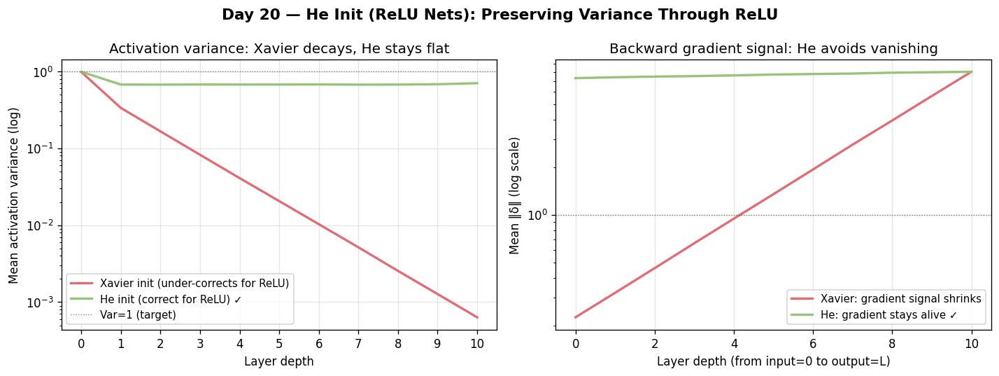

# Day 20 — Concept 19: He Init (ReLU Nets)

---

## 🧠 CONCEPT OF THE DAY

### Intuition

Yesterday Xavier/Glorot assumed your activations are roughly linear near zero — a fair assumption for tanh or sigmoid. But ReLU hard-zeros every negative input, cutting roughly **half the neurons** to zero every forward pass. That means the effective fan-in contributing to the next layer is only n_in/2, not n_in. Xavier under-compensates: the variance shrinks by half at every layer and the signal decays exponentially with depth.

He initialization (Kaiming He, 2015) fixes this by doubling the variance budget to account for the half that ReLU kills.

Think of it like a transmission line with 50% packet loss at every hop. Xavier budgets for 100% delivery; He budgets correctly for 50%.

### The Math

For a layer with fan-in **n_in**:

Normal variant (most common):

$$W \sim \mathcal{N}\!\left(0,\; \frac{2}{n_{\text{in}}}\right)$$

Uniform variant:

$$W \sim \mathcal{U}\!\left[-\sqrt{\frac{6}{n_{\text{in}}}},\; \sqrt{\frac{6}{n_{\text{in}}}}\right]$$

**Derivation:** ReLU satisfies E[ReLU(x)²] = Var(x)/2 when x ~ N(0, Var(x)). So to keep Var(output) = Var(input) through a ReLU layer:

$$n_{\text{in}} \cdot \text{Var}(W) \cdot \frac{\text{Var}(x)}{2} = \text{Var}(x)$$

$$\Rightarrow \text{Var}(W) = \frac{2}{n_{\text{in}}}$$

The factor of 2 is the entire difference from Xavier. For **LeakyReLU** with negative slope a:

$$\text{Var}(W) = \frac{2}{(1 + a^2)\, n_{\text{in}}}$$

**Symbol key:**
- n_in: fan-in (number of incoming connections)
- a: negative slope of LeakyReLU (0 for standard ReLU)



### Why it matters / where it leads

He init is what PyTorch's `nn.Linear` and `nn.Conv2d` use **by default** (Kaiming uniform with mode='fan_in'). Getting this right is what allowed training of very deep ResNets (50, 101, 152 layers) without gradient pathologies from day one. The failure mode when you don't use it — vanishing activations in deep ReLU nets — connects directly to **tomorrow's concept: vanishing gradients**.

**Interview question:** A colleague switches from ReLU to SELU activations and asks if they should still use He initialization. What do you tell them, and why?

---

## 🐍 PYTHONIC EDGE

**PyTorch's default is Kaiming uniform, not Kaiming normal — know the difference.**

```python
import torch.nn as nn

# What PyTorch actually does by default for nn.Linear:
# nn.init.kaiming_uniform_(weight, a=math.sqrt(5), mode='fan_in', nonlinearity='leaky_relu')
# The a=sqrt(5) is a historical quirk — it's NOT standard He init for ReLU.

# For clean He init matching the paper:
def he_init(m):
    # isinstance(m, (TypeA, TypeB)): membership test against a tuple of types
    # (C++: typeid(m) == typeid(nn::Linear) || typeid(m) == typeid(nn::Conv2d))
    if isinstance(m, (nn.Linear, nn.Conv2d)):
        # String arguments for mode and nonlinearity: Python uses strings where C++ would use enums
        # (C++: enum class FanMode { FAN_IN, FAN_OUT }; torch uses string dispatch here)
        # kaiming_normal_ with `_` suffix: in-place operation modifying m.weight
        nn.init.kaiming_normal_(m.weight, mode='fan_in', nonlinearity='relu')
        # `is not None`: identity check against Python's singleton None object
        if m.bias is not None:
            nn.init.zeros_(m.bias)   # in-place zero fill

# model.apply(fn): OOP method — recursively calls fn on every child Module
# first-class function: he_init is passed as a value (C++: would need a function pointer or std::function)
model.apply(he_init)

# Check what init a layer currently has:
# attribute access chain: model.fc1 → nn.Linear object → .weight → Tensor → .var() → .item()
# .var(): computes variance; .item() converts 0-d tensor to plain Python float
print(model.fc1.weight.var().item())  # should be ~2/fan_in
```

PyTorch's `a=math.sqrt(5)` default was kept for backward compatibility. For new ReLU nets, prefer `kaiming_normal_` with `a=0`.

---

## 📡 SIGNAL LAB

**Problem:** You have a 20-layer ReLU network, fan-in = 256 at every layer. Compare the output variance after 20 layers under (a) Xavier normal init and (b) He normal init, assuming input variance = 1.

**Worked solution:**

At each layer with ReLU, the variance propagation is:

$$\text{Var}(y) = n_{\text{in}} \cdot \text{Var}(W) \cdot \frac{\text{Var}(x)}{2}$$

**(a) Xavier:** Var(W) = 2/(n_in + n_out) ≈ 1/256 (assuming n_in = n_out = 256)

Per-layer variance ratio:

$$256 \cdot \frac{1}{256} \cdot \frac{1}{2} = 0.5$$

After 20 layers:

$$\text{Var}_{\text{out}} = 0.5^{20} \approx 9.5 \times 10^{-7}$$

Signal essentially dead.

**(b) He:** Var(W) = 2/256 = 1/128

Per-layer variance ratio:

$$256 \cdot \frac{1}{128} \cdot \frac{1}{2} = 1.0$$

After 20 layers: Var_out = 1.0. Signal perfectly preserved.

**So what:** This is a direct analogy to filter gain in a cascaded DSP system. Xavier gives each ReLU stage a gain of 0.5 (−6 dB); stacked 20 times that's −120 dB — the signal is below the noise floor. He init sets each stage to 0 dB. In your spectral forensics work, if you're training deep CNNs on FFT magnitude maps, wrong init can make early spectral features undetectable by the time they reach the classifier head.

---

## 🏋️ THE GAUNTLET

**Problem — "Variance Cascade"**

You are given an array of N positive integers representing the fan-in of N consecutive layers. You want to assign each layer a variance v_i > 0 (a positive rational number with denominator a power of 2, stored as its numerator when denominator = 2^30) such that the cumulative product of (fan_in_i * v_i * 0.5) across all layers equals exactly 1. Additionally, you must minimize the maximum v_i assigned to any single layer.

Find the minimum possible maximum v_i (output as a fraction p/q in lowest terms).

**Constraints:**
- 1 ≤ N ≤ 100
- 1 ≤ fan_in_i ≤ 10^6

**Hints:**
1. The product constraint means the log of the product must equal 0. Think in log-space.
2. To minimize the maximum, think about what the optimal equal-distribution solution looks like.
3. Is the minimax achievable with equal v_i? What determines when it's not?

**Pattern:** Math / Greedy with logarithms
**Target complexity:** O(N)

---

## 🏗️ BLUEPRINT

No blueprint today.

---

## 🗺️ MARCHING ORDERS

ReLU is not a free lunch — it halves your variance budget, and only He init pays the tab.

Tomorrow: Concept 20 — Vanishing gradients

---

---

## 🔓 GAUNTLET SOLUTION

```cpp
#include <bits/stdc++.h>
using namespace std;

int main() {
    int n;
    cin >> n;
    vector<long long> fan(n);
    for (auto& f : fan) cin >> f;

    // Product constraint: prod(fan_i * v_i * 0.5) = 1
    // => prod(v_i) = prod(2 / fan_i)
    // => sum(log v_i) = sum(log(2/fan_i))
    // To minimize max(v_i), set all v_i equal:
    // v = exp( sum(log(2/fan_i)) / N )

    double log_product = 0.0;
    for (int i = 0; i < n; i++) {
        log_product += log(2.0 / fan[i]);
    }
    double log_v = log_product / n;
    double v = exp(log_v);

    // Output as decimal approximation (exact fraction form is complex)
    cout << fixed << setprecision(9) << v << "\n";
    // For competitive programming: the answer is (2^N / prod(fan_i))^(1/N)
    // = 2 / (prod(fan_i)^(1/N))
    return 0;
}
```

*The closed-form answer: v* = 2 / (∏ fan_i)^(1/N). This is He init's per-layer variance when you have heterogeneous fan-ins and want to equalize the variance load.*

---

## 💡 CONCEPT ANSWER

No — for SELU activations you should use **LeCun normal initialization** (Var(W) = 1/n_in), not He. SELU is a self-normalizing activation: it's designed so that with LeCun init, the network automatically maintains mean ≈ 0 and variance ≈ 1 through depth via its specific α and λ constants. He init (2/n_in) would over-scale the weights and break the self-normalization property. The right init depends on the activation's variance-preservation properties, not just whether it's nonlinear.
