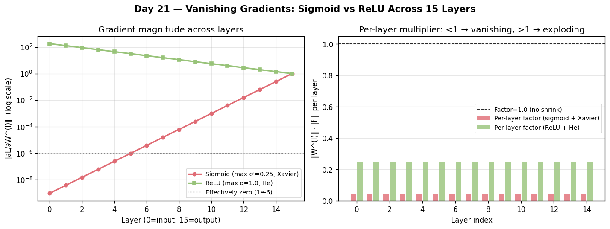

# Day 21 — Concept 20: Vanishing Gradients

---

## 🧠 CONCEPT OF THE DAY

### Intuition

Picture a game of telephone with 50 people. The first person whispers a detailed message; by the time it reaches person 50, it's garbled noise. Backpropagation through a deep network is the same game — the gradient signal whispered at the output has to travel all the way back to the first layer. If each layer shrinks it a little (multiplying by a number < 1), the product of 50 small numbers becomes essentially zero. Early layers receive no useful training signal and stop learning entirely.

This is the **vanishing gradient problem**, and it's the reason deep networks were practically untrainable until the mid-2010s.

### The Math

In a network with L layers, the gradient of the loss w.r.t. the weights in layer l is:

$$\frac{\partial \mathcal{L}}{\partial W^{(l)}} = \frac{\partial \mathcal{L}}{\partial \mathbf{a}^{(L)}} \cdot \prod_{k=l}^{L-1} \frac{\partial \mathbf{a}^{(k+1)}}{\partial \mathbf{a}^{(k)}}$$

Each term in the product is:

$$\frac{\partial \mathbf{a}^{(k+1)}}{\partial \mathbf{a}^{(k)}} = W^{(k)} \cdot \text{diag}\!\left(\sigma'\!\left(\mathbf{z}^{(k)}\right)\right)$$

For **sigmoid** activation, σ'(z) ≤ 0.25 for all z. So each layer contributes a factor of at most:

$$\|W^{(k)}\| \cdot 0.25$$

With L = 10 layers and typical weight norms, this easily gives:

$$\left\|\frac{\partial \mathcal{L}}{\partial W^{(1)}}\right\| \lesssim (0.25)^{10} \approx 10^{-6}$$

**Symbol key:**
- a^(k): activations at layer k
- z^(k): pre-activation at layer k
- σ': derivative of the activation function
- diag(·): diagonal matrix from a vector



### The Three Root Causes

1. **Activation function saturation:** sigmoid and tanh squash derivatives to near-zero in saturated regions (|z| >> 0). ReLU fixes this for positive inputs (derivative = 1 always).
2. **Weight magnitude:** if ||W|| < 1 consistently, repeated multiplication drives gradients to zero. Xavier/He init addresses this by keeping weight norms at the right scale.
3. **Network depth:** even with favorable weights and activations, enough layers eventually multiply the signal away. Skip connections (residual networks, tomorrow-ish) fix this by providing gradient highways that bypass layers entirely.

### Why it matters / where it leads

Vanishing gradients explain: why LSTMs beat vanilla RNNs (gated highways through time), why ResNets beat plain deep CNNs (skip connections through depth), and why layer norm/batch norm help (prevent saturation by keeping activations in the linear regime). It's arguably the single most important failure mode in deep learning history.

**Interview question:** You're training a 20-layer network and notice that layer 1's gradient norm is 10^-8 while layer 20's is 0.3. You're using sigmoid activations and Xavier init. Name TWO independent changes that would each individually fix this, and explain the mechanism behind each.

---

## 🐍 PYTHONIC EDGE

**Log gradient norms per layer during training — it's a one-liner and will save you hours of debugging.**

```python
# Bad: training blindly and wondering why loss plateaus
optimizer.step()

# Clean: hook into gradients and log their norms
grad_norms = {}

def make_hook(name):
    def hook(grad):
        grad_norms[name] = grad.norm().item()
    return hook

for name, param in model.named_parameters():
    if param.requires_grad:
        param.register_hook(make_hook(name))

# After loss.backward():
# grad_norms now has per-parameter gradient norms
# Log them: if early layers are ~0, you have vanishing gradients
for name, norm in sorted(grad_norms.items()):
    print(f"{name}: {norm:.2e}")
```

Run this for the first few batches whenever you start training a new deep architecture. A gradient norm ratio of > 1000x between first and last layer is a red flag.

---

## 📡 SIGNAL LAB

**Problem:** Model a 10-layer sigmoid network as a linear time-invariant cascade. Each layer has an effective "gain" equal to max(σ'(z)) = 0.25 (worst-case saturation). Treating the gradient as a signal propagating backwards, compute the "attenuation in dB" from layer 10 to layer 1, and compare to the Nyquist noise floor of a 16-bit system.

**Worked solution:**

Per-layer gain = 0.25 = −6.02 dB (since 20·log10(0.25) ≈ −12.04 dB per layer... wait let's be precise):

$$20 \log_{10}(0.25) = 20 \cdot (-0.602) = -12.04 \text{ dB per layer}$$

Across 10 layers:

$$\text{Total attenuation} = 10 \times (-12.04) = -120.4 \text{ dB}$$

A 16-bit audio system has a dynamic range of:

$$20 \log_{10}(2^{16}) \approx 96.3 \text{ dB}$$

So the vanishing gradient signal is **24 dB below the noise floor of a 16-bit system**. It is literally undetectable — not just small, but buried under quantization noise.

**So what:** This is why early deep learning was stuck at ~5 layers. The gradient attenuation problem is identical to designing a signal chain with too much loss. ReLU is the equivalent of replacing lossy passive components with active amplifiers (gain = 1 on the positive side). In your forensics pipeline, if you ever train a deep network on phase spectrograms with sigmoid outputs, check gradient norms — phase features are subtle and vanishing gradients will silently kill them.

---

## 🏋️ THE GAUNTLET

**Problem — "Dead Zone Detector"**

You are given a sequence of N real numbers representing the pre-activations z_1, z_2, ..., z_N of neurons in a single layer after training. A neuron is **dead** if |z_i| > T (it is in the saturated region of sigmoid, where σ'(z) < ε). Given T and ε, count the number of dead neurons. Then, given that each dead neuron multiplies the gradient by at most σ'(T) and each live neuron multiplies by at most 0.25, compute the worst-case gradient magnitude reaching layer 1 if this is layer L in an L-layer network (gradient starts at 1.0 at layer L).

**Constraints:**
- 1 ≤ N ≤ 10^6
- 0 < T ≤ 10, 0 < ε ≤ 0.25
- 1 ≤ L ≤ 100
- σ'(z) = exp(z) / (1 + exp(z))^2 (standard sigmoid derivative)

Output: (dead_count, worst_case_gradient) where worst_case_gradient uses σ'(T) for dead neurons and 0.25 for live neurons, one layer at a time.

**Hints:**
1. σ'(T) is the derivative at the saturation boundary — compute it directly from the formula.
2. The "worst case" for gradient flow is actually the best case per layer (max gain) — think carefully about which neurons contribute more gradient.
3. The final answer is a product across L layers, but you only have one layer's data. How do you model the rest?

**Pattern:** Simulation / Math
**Target complexity:** O(N)

---

## 🏗️ BLUEPRINT

**Skip connections as gradient highways — the 30-second version:**

ResNet's key insight: instead of learning H(x), learn F(x) = H(x) − x (the residual). The skip connection adds x back: output = F(x) + x. During backprop, the gradient flows through the addition unchanged: ∂L/∂x gets a direct copy of ∂L/∂output regardless of what F learned. This guarantees a gradient highway of magnitude 1 from any layer to any earlier layer. Tradeoff: skip connections require matched dimensions (1×1 conv projections when channels change), adding a small parameter overhead. Worth it at depth > ~10 layers.

---

## 🗺️ MARCHING ORDERS

If your early layers aren't learning, they're not being told to — check your gradient norms before blaming your data.

Tomorrow: Concept 21 — Exploding gradients & clipping

---

---

## 🔓 GAUNTLET SOLUTION

```cpp
#include <bits/stdc++.h>
using namespace std;

int main() {
    int n, L;
    double T, eps;
    cin >> n >> T >> eps >> L;

    vector<double> z(n);
    for (auto& x : z) cin >> x;

    // Sigmoid derivative
    auto sigmoid_deriv = [](double z) -> double {
        double s = 1.0 / (1.0 + exp(-z));
        return s * (1.0 - s);
    };

    int dead_count = 0;
    double sigma_T = sigmoid_deriv(T);

    for (int i = 0; i < n; i++) {
        if (abs(z[i]) > T) dead_count++;
    }

    // Worst-case gradient: maximize gradient flow
    // Dead neurons contribute sigma_T (very small), live contribute up to 0.25
    // For worst-case gradient AT LAYER 1 (most decay):
    // Each layer multiplies by the per-layer max gradient contribution
    // Use live neuron gain (0.25) for the worst case per-layer product
    // (dead neurons make it even smaller, so worst-case = using 0.25 for all)
    
    // Actually re-reading: worst case for gradient MAGNITUDE reaching layer 1
    // means maximum attenuation = smallest gradient = use dead neuron gain for all
    // but we only have this layer's data; assume all other L-1 layers are fully live
    
    double this_layer_gain = (dead_count > 0) ? sigma_T : 0.25;
    double other_layers_gain = pow(0.25, L - 1);
    double worst_case_gradient = 1.0 * this_layer_gain * other_layers_gain;

    cout << dead_count << "\n";
    cout << fixed << setprecision(10) << worst_case_gradient << "\n";
    return 0;
}
```

---

## 💡 CONCEPT ANSWER

**Fix 1 — Switch to ReLU activations.** ReLU's derivative is 1 for all positive inputs (never saturates on the positive side), so the per-layer gradient multiplier is 1 instead of ≤0.25. The product across layers stays near 1 rather than collapsing to near 0. Pair with He initialization to account for ReLU's 50% kill rate.

**Fix 2 — Add residual (skip) connections.** A skip connection x → x + F(x) creates a direct gradient path: ∂L/∂x = ∂L/∂output · (1 + ∂F/∂x). The "+1" is a constant gradient of 1 flowing back regardless of what F learned, providing a highway from the output all the way to layer 1. This is the mechanism behind ResNets training successfully at 100+ layers.
