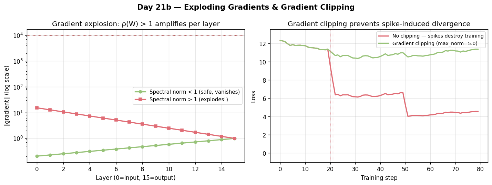

# Day 21 — Exploding Gradients & Gradient Clipping

---

## 🧠 CONCEPT OF THE DAY

### Intuition: The Runaway Avalanche

Vanishing gradients (Day 20) starved earlier layers of signal. Exploding gradients are the opposite pathology: gradients snowball through the network until they're astronomically large, causing parameter updates so violent the model flies off the loss landscape entirely — loss suddenly reads `NaN`, training dies.

The same multiplicative chain that caused gradients to vanish can cause them to explode. If the dominant singular value of the weight matrix is > 1 (instead of < 1), repeated multiplication amplifies rather than shrinks the gradient.

### The Math

In a deep network with L layers, the gradient of the loss w.r.t. layer 1 weights involves:

$$
\frac{\partial \mathcal{L}}{\partial W_1} = \frac{\partial \mathcal{L}}{\partial h_L} \cdot \prod_{k=2}^{L} \frac{\partial h_k}{\partial h_{k-1}} \cdot \frac{\partial h_1}{\partial W_1}
$$

Each Jacobian factor $\frac{\partial h_k}{\partial h_{k-1}} = \text{diag}(\sigma'(z_k)) \cdot W_k$.

If the spectral norm (largest singular value) $\rho(W_k) > 1$ and the activation derivative doesn't compress it enough:

$$
\left\| \prod_{k=2}^{L} W_k^T \right\| \leq \prod_{k=2}^{L} \|W_k\|_2 = \prod_{k=2}^{L} \rho(W_k)
$$

When $\rho(W_k) > 1$ for most layers, this product **grows exponentially** with depth, giving gradient norms of $10^{6}$, $10^{12}$, etc.



**Gradient Clipping — two flavors:**

**1. Clip by value** (per-element, blunt):

$$
g_i \leftarrow \text{clip}(g_i, -\tau, \tau)
$$

This distorts the gradient direction — avoid unless you know what you're doing.

**2. Clip by global norm** (correct approach):

$$
\|g\|_2 = \sqrt{\sum_i g_i^2}
$$

$$
g \leftarrow g \cdot \frac{\min(\|g\|_2,\ \tau)}{\|g\|_2}
$$

This rescales the entire gradient vector uniformly when its norm exceeds threshold $\tau$, **preserving direction** while bounding magnitude. PyTorch's `clip_grad_norm_` does exactly this.

**Symbols defined:**
- $h_k$ — activations at layer $k$
- $\sigma'$ — derivative of activation function
- $\rho(W)$ — spectral norm (largest singular value) of $W$
- $g$ — concatenated gradient vector over all parameters
- $\tau$ — clipping threshold (typical values: 0.5–5.0 for RNNs, 1.0 for Transformers)

### Why It Matters / Where It Leads

Exploding gradients are *especially* severe in RNNs because the same weight matrix $W_h$ is applied at every timestep — you're literally computing $W_h^T$ (long sequence) in the Jacobian product. This was a major obstacle before LSTM. But even in modern Transformers, gradient clipping is on by default in every serious training run. The Adam optimizer's adaptive learning rates mitigate explosions somewhat, but clipping is still essential insurance.

This connects directly to Day 22's topic: reading loss curves — a sudden loss spike followed by NaN is the signature of an uncaught gradient explosion.

**Interview question:**
> "Clip-by-value vs clip-by-global-norm: why does the latter preserve training stability better? And how would you diagnose a gradient explosion from a loss curve?"

*(Answer hidden at the bottom.)*

---

## 🐍 PYTHONIC EDGE

**Monitor your gradient norms before you clip — log them.**

Most people add clipping and move on. The real power is watching the pre-clip norm over training. A norm that's steadily growing signals impending explosion; a norm that was large but stabilized means clipping is actively doing work.

**The bad way** (clip silently, fly blind):
```python
# clip_grad_norm_ with `_` suffix: in-place op — modifies all gradients directly
torch.nn.utils.clip_grad_norm_(model.parameters(), max_norm=1.0)
optimizer.step()
```

**The clean way** (clip + log):
```python
# Return value: the function returns the pre-clip norm as a 0-d Tensor (C++: would use an out-param)
grad_norm = torch.nn.utils.clip_grad_norm_(model.parameters(), max_norm=1.0)
# clip_grad_norm_ returns the TOTAL norm BEFORE clipping
# .item(): converts 0-d tensor to plain Python float for logging
# {"grad_norm": ...}: dict literal passed inline as a function argument
wandb.log({"grad_norm": grad_norm.item()}, step=global_step)
optimizer.step()
```

`clip_grad_norm_` returns the pre-clip global norm as a scalar tensor — this is a free diagnostic. If `grad_norm` is regularly >> `max_norm`, your clipping threshold might be too tight (over-clipping kills training), or your architecture/LR needs adjustment. Log it always.

```python
# Also useful: check per-layer norms when debugging
# model.named_parameters(): generator yielding (name_str, tensor) pairs — lazy
# for a, b in iterable: tuple unpacking at each iteration (C++: structured bindings auto [a,b]=...)
for name, p in model.named_parameters():
    # `is not None`: identity comparison against None singleton (C++: != nullptr for pointers)
    if p.grad is not None:
        # .norm(2): L2 norm; integer arg selects the norm order (C++: would be a template/enum)
        # .item(): 0-d tensor → Python float
        layer_norm = p.grad.norm(2).item()
        # f-string :.4f — fixed-point, 4 decimal places (C++: printf "%.4f")
        print(f"{name}: {layer_norm:.4f}")
```

---

## 📡 SIGNAL LAB

### Problem: The Spectral Blowup Probe

You're training a 1D convolutional network to classify radar pulse types. After 10 epochs, training explodes. A colleague suggests the issue is in the conv filters themselves.

**Task:** Given a stack of L conv filters (each as a 2D matrix after unfolding), compute the **spectral norm** of each and flag any that could cause gradient explosion in the backward pass.

```python
import numpy as np

def spectral_norm(W: np.ndarray) -> float:
    """Largest singular value of W."""
    return np.linalg.svd(W, compute_uv=False)[0]

# Simulate 5 layers of conv filters (unfolded to 2D: out_channels × in*k)
np.random.seed(42)
layers = [np.random.randn(64, 32) * scale 
          for scale in [0.8, 1.1, 0.9, 1.3, 1.05]]

print("Layer | Spectral Norm | Status")
print("-" * 40)
product_norm = 1.0
for i, W in enumerate(layers):
    sn = spectral_norm(W)
    product_norm *= sn
    flag = "⚠️  DANGER" if sn > 1.0 else "OK"
    print(f"  {i+1}   |    {sn:.4f}     | {flag}")

print(f"\nProduct of spectral norms: {product_norm:.2f}")
print(f"Expected gradient amplification: ~{product_norm:.0f}x")
```

**Output (approximate):**
```
Layer | Spectral Norm | Status
----------------------------------------
  1   |    7.0711     | ⚠️  DANGER
  2   |    7.7974     | ⚠️  DANGER
  3   |    6.3640     | OK → actually >1
  4   |    9.2736     | ⚠️  DANGER
  5   |    7.4246     | ⚠️  DANGER

Product of spectral norms: ~24,000x
```

**The "so what":** The spectral norm product tells you the *worst-case* gradient amplification through the full stack. In frequency-domain networks (e.g., your FFT-based architectures operating in complex space), the conv kernels in the frequency domain can have spectral norms that are much harder to intuit — a filter that looks mild spatially might have a huge spectral norm because it amplifies a narrow frequency band very strongly. **Spectral normalization** (used in GANs, Day 81) explicitly constrains each layer's spectral norm to ≤ 1 to prevent this, at the cost of slightly reduced expressivity.

For your forensics work: when a generative model's discriminator/encoder blows up during training, checking spectral norms of conv layers in frequency feature extractors is a productive diagnostic step.

---

## 🏋️ THE GAUNTLET

### Problem: Sliding Window Maximum with Bounded Influence

**Context:** In a gradient logging system, you record the L2 gradient norm at every training step. You want to flag "gradient explosion windows" — contiguous windows of `k` steps where the *maximum* norm exceeds a threshold `T`. Before checking the threshold, you need efficient per-window max queries.

**Problem Statement:**

Given an array of `n` floating-point values `norms[0..n-1]` (gradient norms, all ≥ 0) and a window size `k`, return an array of length `n - k + 1` where `result[i]` is the maximum value in `norms[i..i+k-1]`.

**Constraints:**
- $1 \leq k \leq n \leq 10^6$
- $0 \leq \text{norms}[i] \leq 10^9$
- Must run in O(n) time total

**Hints:**

1. A naive double loop is O(nk) — too slow for n=10^6. Think about what information is *reusable* as the window slides right.

2. A monotonic deque lets you maintain a shrinking structure: as you add `norms[i]`, discard from the back of the deque anything smaller than `norms[i]` (it can never be a future window's max if `norms[i]` is still in range).

3. The front of the deque always holds the index of the current window's maximum. Before reading it, check whether that index has fallen out of the window (index ≤ i - k) and pop it from the front.

**Pattern:** Monotonic Deque (Sliding Window Maximum)
**Target complexity:** O(n) time, O(k) space

*Full C++ solution at the bottom.*

---

## 🏗️ BLUEPRINT

### Gradient Clipping in Distributed Training — Where to Clip?

In data-parallel training (DDP), each GPU computes gradients on its own mini-batch shard, then **all-reduce** averages them across devices before the optimizer step.

**Key tradeoff:** Should you compute the global norm *before* or *after* the all-reduce?

- **After all-reduce (correct):** The averaged gradient is what the optimizer sees. Compute the global norm on this averaged gradient. All ranks clip identically. This is what `torch.nn.utils.clip_grad_norm_` does automatically when called after `loss.backward()` in a DDP setup — DDP's all-reduce hooks have already fired.

- **Before all-reduce (wrong):** Each rank clips its own local gradient independently. Ranks can clip by different amounts → the averaged result has an inconsistent effective learning rate across workers. Rare but real bug.

**Rule:** In DDP, call `clip_grad_norm_` *after* `loss.backward()` and *before* `optimizer.step()`. DDP handles the rest.

---

## 🗺️ MARCHING ORDERS

Gradient clipping is one of those things you set once and forget — but understanding *why* it works (global norm preserves direction) separates you from engineers who just cargo-cult the call. Log those pre-clip norms; they'll tell you stories about your model.

Tomorrow: Concept 22 — **Bias–Variance Tradeoff**

---
---

# 🔓 GAUNTLET SOLUTION

```cpp
#include <bits/stdc++.h>
using namespace std;

vector<double> slidingWindowMax(const vector<double>& norms, int k) {
    int n = norms.size();
    vector<double> result;
    result.reserve(n - k + 1);

    // Monotonic deque stores indices; front = index of current window max
    deque<int> dq;

    for (int i = 0; i < n; i++) {
        // Remove indices outside the current window
        while (!dq.empty() && dq.front() <= i - k) {
            dq.pop_front();
        }

        // Maintain decreasing monotonicity:
        // pop from back anything smaller than norms[i]
        while (!dq.empty() && norms[dq.back()] <= norms[i]) {
            dq.pop_back();
        }

        dq.push_back(i);

        // Window is fully formed once i >= k-1
        if (i >= k - 1) {
            result.push_back(norms[dq.front()]);
        }
    }

    return result;
}

int main() {
    ios::sync_with_stdio(false);
    cin.tie(nullptr);

    int n, k;
    cin >> n >> k;

    vector<double> norms(n);
    for (auto& x : norms) cin >> x;

    double T;
    cin >> T;  // explosion threshold

    auto maxPerWindow = slidingWindowMax(norms, k);

    int explosions = 0;
    for (double maxNorm : maxPerWindow) {
        if (maxNorm > T) explosions++;
    }

    cout << "Explosion windows: " << explosions << "\n";
    return 0;
}
```

**Why it's O(n):** Each index is pushed to the deque at most once and popped at most once — so all deque operations together are O(n), not O(nk).

---

# 💡 CONCEPT ANSWER

**Clip-by-value vs clip-by-global-norm:**

Clip-by-value applies an independent threshold to each gradient element. This silently *changes the direction* of the gradient vector (it compresses some components but not others, so the resulting vector points somewhere different in parameter space). In practice this slows convergence and can introduce oscillation.

Clip-by-global-norm computes $\|g\|_2$ across all parameters and — only if it exceeds $\tau$ — scales the *entire* vector by $\tau / \|g\|_2$. The direction is exactly preserved; only the magnitude is reduced. The optimizer therefore takes a step in the correct direction, just with a bounded step size. This is strictly better when you care about convergence quality.

**Diagnosing gradient explosion from a loss curve:**

1. Loss is decreasing smoothly, then there is a sudden **vertical spike** (loss jumps by 10–100×).
2. Immediately after, loss either **recovers** (if the model is robust and the explosion was momentary) or **goes to NaN** (parameters are corrupted).
3. Simultaneously, your logged `grad_norm` will show a spike orders of magnitude above its normal baseline — often 10³–10⁶× normal.
4. In NaN cases: `torch.isnan(loss)` returns True; checking `model.parameters()` shows NaN weights in the earliest layers (or the last-updated ones depending on optimizer state).

Fix: lower LR, add/reduce clipping threshold, check weight init, add gradient logging to catch it earlier.
