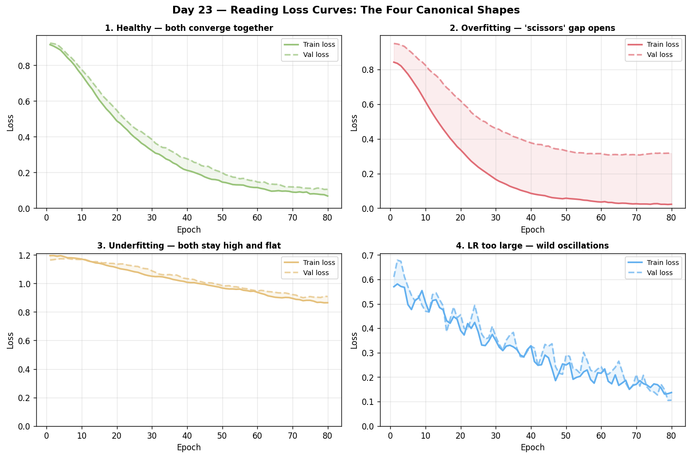

# Day 23 — Reading Loss Curves
**Date:** 2026-06-26 | **Concept #23 of 112** | **Phase 2: Optimizers & Regularization**

---

## 🧠 CONCEPT OF THE DAY

### Intuition: The Vital Signs Monitor

Loss curves are your model's ECG. Just as a doctor reads a heartbeat trace to spot arrhythmias, you read training/validation loss traces to diagnose learning health. The curve's *shape*, *gap*, and *slope* each tell a different story — and learning to decode them fast is one of the most valuable practical skills in deep learning.

---



### The Four Canonical Shapes

**1. Both losses decrease together → Healthy**

Training and validation loss both descend smoothly and level off near each other. The model is generalizing. Ship it (after a learning rate sweep).

**2. Training loss falls, validation loss diverges → Overfitting**

The classic "scissors" opening. The model memorizes the training set; the generalization gap widens.

```
loss
 │   val ─ ─ ─ ─ ↗
 │  train ──────↘
 └──────────────── epoch
```

Remedies: dropout, weight decay, more data, early stopping (Concept 30).

**3. Both losses stay high and flat → Underfitting**

The model lacks capacity or the learning rate is so large updates overshoot every minimum. Add parameters, reduce LR, check for bugs.

**4. Training loss oscillates wildly → LR too large or bad batching**

Gradient steps bounce over valleys. Decrease LR or increase batch size to smooth the gradient estimate.

---

### The Math Behind the Gap

Define:

- $L_{train}(\theta)$ = empirical risk on training set
- $L_{val}(\theta)$ = empirical risk on held-out validation set
- $\epsilon_{gen}$ = generalization error = $L_{val} - L_{train}$

By the bias–variance decomposition (Concept 22):

$$\mathbb{E}[L_{val}] = \text{Bias}^2 + \text{Variance} + \sigma^2_{noise}$$

The *training loss* estimates the **reducible error** the optimizer actually minimizes. The *gap* $\epsilon_{gen}$ reflects variance — how much the model over-fit to one particular dataset draw. Regularization techniques (L2, dropout, data aug) shrink variance and therefore shrink the gap.

---

### Diagnostic Checklist

| Signal | Diagnosis | Lever |
|---|---|---|
| val loss > train loss by >2× | Overfit | Regularize / more data |
| Both losses plateau early | LR too low or dead neurons | Increase LR or fix init |
| Loss NaN after epoch 1 | LR explode or bad init | Clip grads, lower LR |
| Loss decreases then spikes | LR schedule step too aggressive | Softer cosine decay |
| Gap grows after epoch K | Early stopping should trigger at K | Monitor `patience` |
| val loss decreases but slower than train | Normal; slight overfit | OK if gap is acceptable |

---

### Why It Matters / Where It Leads

Reading curves well connects directly to early stopping (Concept 30) and learning rate schedules (Concept 17). Every hyperparameter search is really a loss-curve diagnosis loop. Interviewers at research labs love to show a noisy loss curve and ask what went wrong — being able to answer in 30 seconds without guessing is a differentiator.

---

**Interview Question:**
> You're training a transformer for 100 epochs. After epoch 20, validation loss is 0.45 and training loss is 0.12. By epoch 50, val loss climbs to 0.61 while train loss reaches 0.05. What happened, and what would you do?

*(Answer at the very bottom.)*

---

## 🐍 PYTHONIC EDGE

### Smooth your curves before diagnosing

Raw mini-batch loss is jittery. Plotting with exponential moving average (EMA) reveals the true trend without hiding real structure.

**The bad way — plotting raw step losses:**
```python
plt.plot(losses)  # chaotic; hard to read inflection points
```

**The clean way — EMA smoothing inline:**
```python
import numpy as np
import matplotlib.pyplot as plt

def ema(values, alpha=0.97):
    smoothed = []
    s = values[0]
    for v in values:
        s = alpha * s + (1 - alpha) * v
        smoothed.append(s)
    return smoothed

fig, ax = plt.subplots()
ax.plot(train_losses, alpha=0.15, color='steelblue', label='train (raw)')
ax.plot(ema(train_losses), color='steelblue', linewidth=2, label='train (EMA)')
ax.plot(val_losses, alpha=0.15, color='tomato', label='val (raw)')
ax.plot(ema(val_losses), color='tomato', linewidth=2, label='val (EMA)')
ax.set_yscale('log')  # log-scale reveals early drop structure hidden on linear
ax.legend(); ax.set_xlabel('Step'); ax.set_ylabel('Loss')
plt.tight_layout()
```

**Key insight:** Log-scale y-axis compresses the wide early drops and expands the late fine-grained behavior where overfitting shows up. Always use `set_yscale('log')` as your default for loss curves.

---

## 📡 SIGNAL LAB

### Frequency Fingerprints of Overfitting

Here's a signal-processing angle that most ML courses miss entirely.

**Setup:** Consider a 1-D regression problem where the ground truth is a smooth low-frequency function. A model that overfits will fit the *high-frequency noise* in the training data — it has a wider spectral bandwidth than the true signal.

**Experiment:**
```python
import numpy as np
import matplotlib.pyplot as plt

rng = np.random.default_rng(42)
N = 256
t = np.linspace(0, 1, N)

# True signal: 3 Hz sine (low frequency)
signal = np.sin(2 * np.pi * 3 * t)
noise  = rng.normal(0, 0.3, N)
y_train = signal + noise

# Simulate "underfit" model: just the DC mean
underfit = np.full(N, y_train.mean())

# Simulate "overfit" model: interpolates every point (e.g., degree-100 poly)
poly_coeffs = np.polyfit(t, y_train, 40)
overfit = np.polyval(poly_coeffs, t)

# Frequency analysis
freqs = np.fft.rfftfreq(N, d=1/N)
def mag(x): return np.abs(np.fft.rfft(x)) / N

fig, axes = plt.subplots(1, 2, figsize=(12, 4))
axes[0].plot(t, signal, label='True', lw=2)
axes[0].plot(t, underfit, '--', label='Underfit')
axes[0].plot(t, overfit, ':', label='Overfit')
axes[0].legend(); axes[0].set_title('Time Domain')

axes[1].plot(freqs, mag(signal), label='True', lw=2)
axes[1].plot(freqs, mag(underfit), '--', label='Underfit')
axes[1].plot(freqs, mag(overfit), ':', label='Overfit', alpha=0.7)
axes[1].set_xlim(0, 30); axes[1].legend(); axes[1].set_title('Frequency Domain')
plt.tight_layout(); plt.show()
```

**What you'll see:**
- **True signal**: spike at 3 Hz, nothing else.
- **Underfit model**: spike only at 0 Hz (DC offset). No structure captured.
- **Overfit model**: broadband — energy spread across many high frequencies corresponding to noise interpolation.

**The "so what":**
Overfitting is literally bandwidth excess. Your model allocated spectral capacity to noise frequencies. In your generative forensics research, this is exactly why GAN discriminators can detect fake images by their high-frequency texture artifacts — generated images often carry spectral fingerprints of the training noise, filter kernels, or aliasing from upsampling that real images don't have. Reading loss curves and reading frequency spectra are the same diagnostic act in two different domains.

---

## 🏋️ THE GAUNTLET

### Problem: Moving Average Divergence

**Pattern:** Sliding window / Two-pointer

**Statement:**
Given an integer array `losses` of length `n` (representing per-epoch validation losses × 1000, stored as non-negative integers), and two integers `short_w` and `long_w` with `short_w < long_w`, find the **first index** `i` (0-indexed, `i >= long_w - 1`) at which the short-window moving average **crosses above** the long-window moving average — i.e., the first index where:

```
mean(losses[i - short_w + 1 .. i]) > mean(losses[i - long_w + 1 .. i])
```

This is a "golden cross" divergence — in loss-curve monitoring it signals the moment overfitting begins.

Return the index, or `-1` if no such crossing exists.

**Constraints:**
- `1 ≤ short_w < long_w ≤ n ≤ 10^5`
- `0 ≤ losses[i] ≤ 10^4`
- All values are integers.

**Expected complexity:** O(n) time, O(1) extra space.

---

**Hint 1:** You need two running sums simultaneously — one for the short window and one for the long window. Maintain them with sliding window additions and subtractions instead of recomputing each time.

**Hint 2:** To avoid floating-point division, compare `short_sum * long_w` vs `long_sum * short_w` (cross-multiply). Both fit in 64-bit integers given the constraints.

**Hint 3:** The crossing can only first happen at `i = long_w - 1` (when the long window is first full). Iterate from there to `n - 1`. If at `i - 1` the short MA was ≤ long MA and at `i` it flips, return `i`.

---

## 🏗️ BLUEPRINT

**No blueprint today.**

---

## 🗺️ MARCHING ORDERS

Diagnosing loss curves is a superpower — next time you train anything, run through the checklist before tweaking a single hyperparameter.

**Tomorrow: Concept 24 — L2 Weight Decay**

---
---
---

## 🔓 GAUNTLET SOLUTION

```cpp
#include <bits/stdc++.h>
using namespace std;

int findDivergence(vector<int>& losses, int short_w, int long_w) {
    int n = losses.size();
    if (n < long_w) return -1;

    long long short_sum = 0, long_sum = 0;

    // Build initial windows up to index long_w - 1
    for (int i = 0; i < long_w; i++) {
        long_sum += losses[i];
        if (i >= long_w - short_w) short_sum += losses[i];
    }

    // Check first valid index
    // short_sum / short_w > long_sum / long_w
    // ⟺ short_sum * long_w > long_sum * short_w
    if (short_sum * (long long)long_w > long_sum * (long long)short_w)
        return long_w - 1;

    for (int i = long_w; i < n; i++) {
        // Slide both windows
        long_sum  += losses[i] - losses[i - long_w];
        short_sum += losses[i] - losses[i - short_w];

        if (short_sum * (long long)long_w > long_sum * (long long)short_w)
            return i;
    }

    return -1;
}

int main() {
    // Example: losses spike up (overfitting starts at index 6)
    vector<int> losses = {500, 480, 460, 450, 440, 435, 430, 440, 460, 490};
    int sw = 2, lw = 4;
    cout << findDivergence(losses, sw, lw) << "\n"; // Expected: some index >= 3
    return 0;
}
```

**Why it works:** Sliding window maintains O(1) per step. Cross-multiplication avoids floating-point and overflow is safe because `max(short_sum) = short_w × 10^4 ≤ 10^9` and `long_w ≤ 10^5`, so the product fits in int64.

---

## 💡 CONCEPT ANSWER

> **What happened:** Classic overfitting. By epoch 20 the model had learned the training data well, but by epoch 50 it had memorized noise — training loss kept falling while validation loss rose (the scissors pattern). The best checkpoint was somewhere around epoch 20.
>
> **What to do:**
> 1. **Restore the epoch-20 checkpoint** — that's your actual best model.
> 2. **Add early stopping** with patience ~5 epochs monitored on val loss.
> 3. **Add regularization**: weight decay (L2), dropout if not already present.
> 4. **Check data augmentation** — if the training set is small, augment to reduce variance.
> 5. **Reduce model capacity** if regularization alone doesn't close the gap.
>
> The 5× gap between train (0.05) and val (0.61) at epoch 50 suggests severe overfitting, likely from insufficient regularization on a model that's too expressive for the dataset size.
