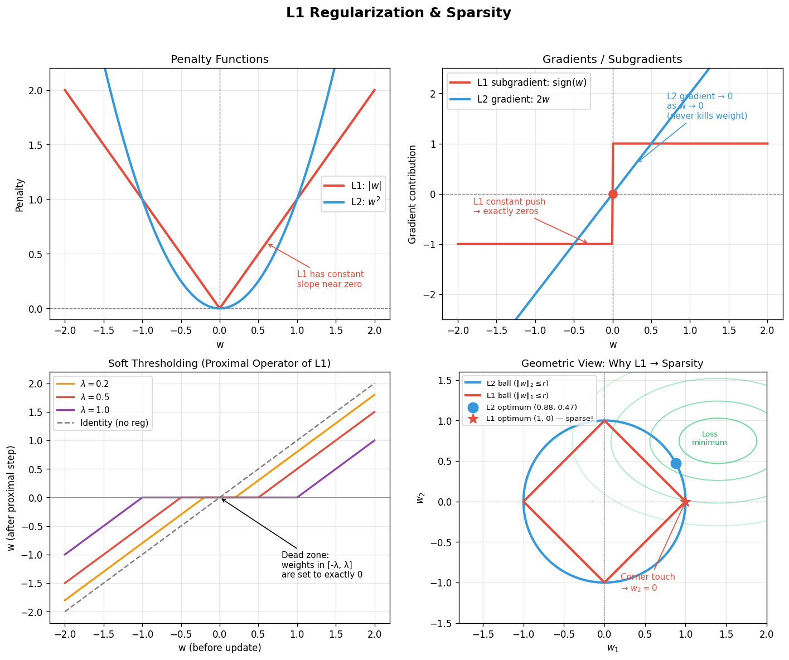

# Day 25 — L1 Regularization & Sparsity

**Phase 3 · Regularization & Generalization**
**Date:** 2026-06-27

---

## 🧠 CONCEPT OF THE DAY

### The Constant Bulldozer

Yesterday's L2 weight decay was a rubber band — the harder you pull, the harder it pulls back. L1 regularization is different: it's a **constant bulldozer**, always pushing every weight toward zero by the same fixed amount, regardless of how large or small the weight already is. That one difference is why L1 creates **exactly sparse** models while L2 just makes small weights smaller.

**The Loss:**

L2 adds λΣwᵢ² to your data loss. L1 adds the absolute values:

$$\mathcal{L}_{\text{total}} = \mathcal{L}_{\text{data}} + \lambda \sum_i |w_i|$$

**The Gradient:**

For L2, the regularization gradient is 2λwᵢ — proportional to the weight magnitude. For L1, it's the **subgradient**:

$$\frac{\partial}{\partial w_i} |w_i| = \text{sign}(w_i) = \begin{cases} +1 & w_i > 0 \\ -1 & w_i < 0 \\ 0 & w_i = 0 \end{cases}$$

So the gradient step for each weight during SGD becomes:

$$w_i \leftarrow w_i - \eta \left( \frac{\partial \mathcal{L}_{\text{data}}}{\partial w_i} + \lambda \cdot \text{sign}(w_i) \right)$$

**Why this kills weights to exactly zero:**

| Situation | L2 gradient contribution | L1 gradient contribution |
|-----------|--------------------------|--------------------------|
| w = 1.0   | 2λ × 1.0 = 2λ (large)    | λ × 1 = λ (constant)     |
| w = 0.01  | 2λ × 0.01 = 0.02λ (tiny) | λ × 1 = λ (same!)        |
| w → 0⁺   | → 0 (rubber band loosens) | = λ (bulldozer never stops)|

L2 weakens as w → 0, so tiny weights linger forever. L1 keeps pushing at full strength until the weight hits zero and **sticks there**.

**The Proximal / Soft Thresholding Interpretation:**

In proximal gradient methods, the exact update for L1 is **soft thresholding**:

$$w_i^{\text{new}} = \text{sign}(w_i) \cdot \max(|w_i| - \lambda, 0)$$

Any weight smaller than λ in magnitude gets zeroed out completely. This is also called the LASSO (Least Absolute Shrinkage and Selection Operator) operator.

**Geometric View:**

The L1 constraint set { w : ‖w‖₁ ≤ r } is a **diamond** in 2D (an L1-ball). The unconstrained loss minimum lies outside this diamond. When you project onto the diamond, the optimal point almost always lands on a **corner** — and corners are sparse (one coordinate is 0). The L2 ball is a smooth sphere with no corners, so projections land anywhere on the surface.



**Why it matters / where it leads:**
- Feature selection: L1 automatically identifies which inputs matter (non-zero weights) and which don't (zero weights). This is exploited in LoRA (Day 73) and sparse attention.
- Compressed sensing: the frequency-domain cousin of L1 — your research area. If a signal is sparse in some basis, L1 minimization recovers it perfectly from far fewer measurements than Nyquist demands.
- Next: **Day 26 — Dropout**, a stochastic regularizer that creates implicit sparsity at the neuron level rather than the weight level.

**Interview Question:**
> A senior engineer asks: "You have a model with 10,000 features. You suspect most are irrelevant. You want to use regularization both to prevent overfitting *and* to automatically identify which features matter. Which regularizer do you use and why? What happens if you use both L1 and L2 together?"

*(Answer at the bottom)*

---

## 🐍 PYTHONIC EDGE

### Adding L1 to PyTorch (PyTorch has no built-in L1 reg — you add it yourself)

```python
import torch
import torch.nn as nn

# --- Bad way: recompute the norm inside the training loop every step ---
# for name, param in model.named_parameters():
#     if 'weight' in name:
#         loss += 0.01 * torch.sum(torch.abs(param))  # repeated, slow, easy to forget
# optimizer.step()

# --- Clean way: compute L1 penalty as a single vectorized operation ---

def l1_penalty(model: nn.Module, lambda_l1: float) -> torch.Tensor:
    # model.parameters() returns a generator — Python iterator, no C++ equivalent
    # sum() with a generator: pythonic, lazy evaluation
    # torch.abs() is element-wise |w| — Python operator overloading via __abs__
    return lambda_l1 * sum(
        param.abs().sum()          # .abs() returns new tensor (not in-place)
        for param in model.parameters()
        if param.requires_grad     # skip frozen params (e.g. after LoRA freezing)
    )
    # NOTE: PyTorch's optimizer weight_decay= is L2 ONLY.
    # For L1 you must manually add this penalty to your loss — no shortcut.

class TinyNet(nn.Module):         # class X(Base): — Python single-inheritance syntax
    def __init__(self, in_dim: int, out_dim: int):
        super().__init__()        # super().__init__() calls nn.Module.__init__(self)
                                  # C++ equivalent: nn.Module::nn.Module() in init list
        self.fc = nn.Linear(in_dim, out_dim)  # self.x = ... sets instance attribute

    def forward(self, x: torch.Tensor) -> torch.Tensor:
        return self.fc(x)         # __call__ invokes forward() via nn.Module.__call__
                                  # NEVER call model.forward(x) directly — skips hooks

model = TinyNet(10, 1)
optimizer = torch.optim.SGD(model.parameters(), lr=1e-3)
# weight_decay= here would add L2 only — leave it out for pure L1
criterion = nn.MSELoss()

x = torch.randn(32, 10)          # randn: Gaussian noise, shape (32, 10)
y = torch.randn(32, 1)

# Training step
optimizer.zero_grad()
pred = model(x)                  # __call__, not forward()
loss = criterion(pred, y) + l1_penalty(model, lambda_l1=1e-4)
loss.backward()
optimizer.step()

# Check sparsity after training (after many steps)
with torch.no_grad():            # 'with' — Python context manager; C++ has no equiv
    weight = model.fc.weight
    sparsity = (weight.abs() < 1e-6).float().mean().item()
    # .item() extracts scalar from 0-dim tensor → Python float
    print(f"Weight sparsity: {sparsity:.1%}")   # f"..." — Python f-string (C++: sprintf)

# Elastic Net = L1 + L2 (common in practice: stability of L2 + sparsity of L1)
lambda_l1, lambda_l2 = 1e-4, 1e-3   # tuple unpacking — no C++ direct equivalent
l1_reg = l1_penalty(model, lambda_l1)
l2_reg = lambda_l2 * sum(p.pow(2).sum() for p in model.parameters() if p.requires_grad)
#                          ^ .pow(2): element-wise square; ** operator also works
total_loss = criterion(pred, y) + l1_reg + l2_reg
```

**Key idiom:** `sum(... for p in model.parameters() if p.requires_grad)` — Python generator expression with an inline filter. One clean line replaces a 4-line C++ accumulator loop.

---

## 📡 SIGNAL LAB

### Compressed Sensing: L1 as Sparse Signal Recovery

This is where L1 regularization connects directly to your research territory.

**Setup:** You have a signal **x** ∈ ℝⁿ that is *K-sparse* in the frequency domain (only K of its n DFT coefficients are non-zero). You acquire only m ≪ n measurements via a random sensing matrix **Φ**:

$$\mathbf{y} = \mathbf{\Phi x} + \text{noise}, \quad m \ll n$$

**The Naive Approach (L0):** Minimize ‖x‖₀ subject to y = Φx. This is NP-hard (exhaustive search over all K-sparse subsets).

**The L1 Magic:** Relax to:

$$\min_{\mathbf{x}} \|\mathbf{x}\|_1 \quad \text{subject to} \quad \|\mathbf{y} - \mathbf{\Phi x}\|_2 \leq \epsilon$$

Under the **Restricted Isometry Property (RIP)** — which random Gaussian Φ satisfies with high probability — L1 minimization recovers the *exact* sparse solution with only:

$$m \geq C \cdot K \cdot \log(n/K) \text{ measurements}$$

vs. Nyquist's m = n.

**Why does L1 work here?**
Geometrically: the feasibility set {x : ‖y − Φx‖₂ ≤ ε} is an ellipsoid in ℝⁿ. The L1-ball's corners (sparse points) poke out toward the ellipsoid, making the intersection land at a corner. Same diamond geometry as before — now in n dimensions.

**So what for your research:** When you look for sparse spectra (a signal with few strong frequency components buried in noise), LASSO / basis pursuit is the theoretically principled estimator. Methods like MUSIC and ESPRIT exploit sparsity implicitly; LASSO does it explicitly and handles noisy measurements with recovery guarantees. This is the foundation of frequency-sparse autoencoders and diffusion models with spectral priors.

---

## 🏋️ THE GAUNTLET

### Weighted Median via L1 Minimization

**Problem Statement:**

You are given n houses on a 1D number line at positions `pos[i]` with weights `weight[i]` (representing how many people live there). You want to build a single mailbox at integer position `x` to minimize the **total weighted walking distance**:

$$\text{cost}(x) = \sum_{i=0}^{n-1} \text{weight}[i] \cdot |x - \text{pos}[i]|$$

Given:
- `vector<pair<int,int>> houses` where `houses[i] = {pos[i], weight[i]}`
- `1 ≤ n ≤ 10^5`
- `1 ≤ pos[i] ≤ 10^9`
- `1 ≤ weight[i] ≤ 10^4`

Return the minimum total weighted distance.

**Example:**
```
houses = [{1,1}, {3,2}, {5,3}, {9,1}]
Output: 12
Explanation: x=5 gives 1*4 + 2*2 + 3*0 + 1*4 = 12
```

**Constraints:**
- O(n log n) time
- O(n) space

---

**Hints (try before reading each):**

> **Hint 1:** The function cost(x) is piecewise linear and convex. Its minimum is at a special statistical quantity. What minimizes the sum of weighted absolute deviations?

> **Hint 2:** The weighted median minimizes Σ wᵢ|x − posᵢ|. Sort by position, compute prefix weight sums, and find where the cumulative weight first reaches half the total weight.

> **Hint 3:** Once you find the optimal x (the weighted median position), evaluate cost(x) directly. Careful: the optimal x doesn't have to be a house position — but it turns out it always is when weights are integers. Why?

**Pattern:** Weighted Median / Prefix Sums · Target: O(n log n)

---

## 🏗️ BLUEPRINT

**L1 in Production: When to Actually Use It**

L1 and L2 are rarely the primary regularization mechanism in deep learning (dropout, batch norm, and data augmentation dominate). L1 shines in specific contexts:

| Use case | Why L1 |
|----------|--------|
| High-dimensional tabular features (100K+) | Automatic feature selection — output sparsity = interpretable |
| LASSO for linear/logistic regression | Provable recovery guarantees, sklearn's `Lasso` solver |
| LoRA / adapter sparsity | Pushing adapter matrices toward sparse updates |
| Spectral regularization | Promote sparse frequency representations in autoencoders |

**Tradeoff:** L1's non-differentiability at zero complicates second-order optimizers. Proximal gradient methods (ISTA, FISTA) handle it cleanly. For neural nets, just add `param.abs().sum()` to the loss — autograd handles the subgradient automatically (it returns 0 at exactly w=0, which is numerically harmless).

**Elastic Net** (α·L1 + (1−α)·L2) is the practical compromise: L2 stability + L1 sparsity. Default in sklearn's `ElasticNet`.

---

## 🗺️ MARCHING ORDERS

Implement L1 regularization on yesterday's L2 experiment: train a linear model on a 1000-feature synthetic dataset (only 50 features are truly relevant), and compare the resulting weight histograms. Watch L1 drive irrelevant weights to exactly zero while L2 leaves them small but non-zero.

**Tomorrow: Concept 26 — Dropout**

---

---

## 🔓 GAUNTLET SOLUTION

```cpp
#include <bits/stdc++.h>
using namespace std;

long long minCostMailbox(vector<pair<int,int>>& houses) {
    // Sort by position so we can sweep left to right
    sort(houses.begin(), houses.end());

    int n = houses.size();
    long long totalWeight = 0;
    for (auto& [pos, w] : houses) totalWeight += w;  // structured binding (C++17)

    // Find weighted median: first position where prefix weight >= totalWeight/2
    long long halfWeight = (totalWeight + 1) / 2;  // ceiling division
    long long prefixW = 0;
    int medianPos = houses[0].first;

    for (auto& [pos, w] : houses) {
        prefixW += w;
        if (prefixW >= halfWeight) {
            medianPos = pos;
            break;
        }
    }

    // Evaluate total cost at medianPos
    long long cost = 0;
    for (auto& [pos, w] : houses) {
        cost += (long long)w * abs(pos - medianPos);
    }
    return cost;
}

int main() {
    vector<pair<int,int>> houses = {{1,1}, {3,2}, {5,3}, {9,1}};
    cout << minCostMailbox(houses) << "\n";  // Output: 12
    return 0;
}
```

**Why the weighted median?**

Cost(x) = Σ wᵢ|x − posᵢ|. The derivative (where it exists) is:

dCost/dx = Σ wᵢ · sign(x − posᵢ) = (weight to the left of x) − (weight to the right of x)

Setting this to zero: weight-left = weight-right. That's exactly the weighted median — the point that balances half the total weight on each side. This is the *same optimality condition* as in LASSO: the L1 subgradient condition 0 ∈ ∂L/∂x is satisfied when weight-left = weight-right. The ML concept and the algorithmic problem share the same mathematical soul.

---

## 💡 CONCEPT ANSWER

**Use L1 (LASSO).** L1's constant gradient (sign function) continues to push small weights toward exactly zero regardless of magnitude, while L2's gradient (2λw) weakens as weights shrink and only asymptotically approaches zero — small weights persist. For feature selection, L1 is the principled choice: non-zero weights after training indicate the truly informative features.

**L1 + L2 together = Elastic Net.** This combination gains both benefits: L2 adds stability when features are correlated (pure L1 picks one arbitrarily from a correlated group), while L1 enforces sparsity. In sklearn: `ElasticNet(l1_ratio=0.5)` blends both. In neural nets: add both penalty terms explicitly to your loss. The `weight_decay` in PyTorch optimizers is L2 *only* — add L1 manually.
