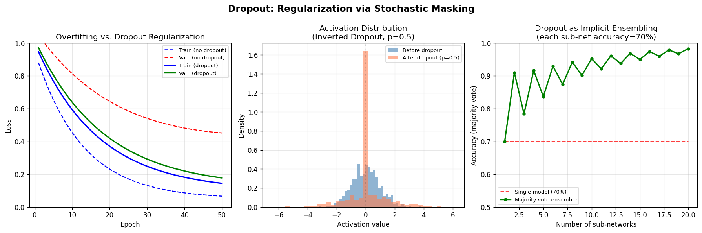

# Day 27 — Dropout

**Date:** 2026-06-27 | **Concept #26 of 112** | **Phase 3: Regularization**

---

## 🧠 CONCEPT OF THE DAY

### Intuition: Reliable Neurons Are Lazy Neurons

Imagine a sports team where the star player takes every shot. Everyone else stops developing — they freeload on the star. Now randomly bench a different subset of players each practice. Suddenly *everyone* has to be good. That's Dropout.

During training, each neuron is independently zeroed out with probability **p** (typically 0.2–0.5). The network can no longer rely on any single activation path — it must learn **redundant representations**. At inference, all neurons are active but their outputs are scaled down by **(1 − p)** to keep expected values consistent. Modern implementations flip this (inverted dropout): scale *up* by **1/(1 − p)** during training so inference needs zero changes.

### The Math

Let **h** be a pre-dropout activation vector. Dropout applies a binary mask **m** drawn fresh every forward pass:

$$
m_i \sim \text{Bernoulli}(1 - p)
$$

$$
\tilde{h}_i = \frac{m_i \cdot h_i}{1 - p}
$$

The **1/(1 − p)** factor (inverted dropout) ensures:

$$
\mathbb{E}[\tilde{h}_i] = \frac{(1-p) \cdot h_i}{1-p} = h_i
$$

so expected activations are unchanged — train and test distributions are aligned without any test-time rescaling.

### Why It Works — Three Lenses

| Lens | Mechanism |
|---|---|
| **Co-adaptation breaking** | No unit can rely on the presence of any other — forces independent useful features |
| **Implicit ensembling** | With p=0.5 and N neurons, training visits ~2^N sub-networks; inference averages them cheaply |
| **Noisy channel / information bottleneck** | Adds stochastic noise to the representation, regularizing like adding Gaussian noise to weights |

### Where It Leads

Dropout is most effective in **fully-connected layers** (dense classifiers, MLP heads). In CNNs it's less critical because weight sharing already regularizes. In Transformers, dropout is applied to attention weights and residual streams — you'll see **`p=0.1`** everywhere in BERT configs. Understanding why CNNs need it less (shared filters = natural redundancy) is core to understanding **BatchNorm** (tomorrow) as a partial replacement.

**Interview question:** *What happens if you forget to turn off dropout at inference time? What if you forget to apply the scaling factor?*
*(Answer at the bottom.)*

---



*Left: Dropout closes the train/val gap. Center: Inverted dropout keeps the mean activation unchanged. Right: The implicit ensemble interpretation — more sub-networks → better accuracy, just like explicit ensembling.*

---

## 🐍 PYTHONIC EDGE

### `torch.nn.Dropout` vs. Manual Masking — and the `training` Flag Trap

```python
import torch
import torch.nn as nn

# ── BAD: manual mask, easy to forget eval-time disable ──
def bad_dropout(x, p=0.5):
    # No training check — always drops, even at inference!
    mask = (torch.rand_like(x) > p)   # torch.rand_like: fills tensor with Uniform[0,1), same shape/device as x
                                        # > p: element-wise comparison, returns BoolTensor (Python: no separate bool type)
    return x * mask / (1 - p)          # / operator on tensors: element-wise division (not integer division like C++)

# ── GOOD: nn.Dropout respects model.eval() ──
class MLP(nn.Module):                  # class X(Base): Python single-inheritance; C++: class X : public Base
    def __init__(self, in_dim, hidden, out_dim, p=0.5):
        super().__init__()             # calls nn.Module.__init__; C++ uses initialiser-list syntax
        self.net = nn.Sequential(      # self.net: instance attribute; C++: declare in .h, init in constructor body
            nn.Linear(in_dim, hidden),
            nn.ReLU(),
            nn.Dropout(p=p),           # nn.Dropout stores p as self.p; honours self.training flag automatically
            nn.Linear(hidden, out_dim),
        )

    def forward(self, x):             # forward() — never call directly; go through __call__ which adds hooks
        return self.net(x)            # self.net(x) invokes nn.Sequential.__call__ → __call__ → forward

model = MLP(128, 256, 10)

# Training mode (default): dropout ACTIVE
model.train()                          # sets self.training=True recursively on all submodules
out_train = model(torch.randn(4, 128))

# Eval mode: dropout INACTIVE, no scaling needed (inverted dropout already done at train time)
model.eval()                           # sets self.training=False — THIS IS THE MOST FORGOTTEN LINE IN PYTORCH
out_eval  = model(torch.randn(4, 128))

# Verify: same input → same output only in eval mode
x = torch.randn(1, 128)
model.eval()
assert torch.allclose(model(x), model(x))   # assert: raises AssertionError (Python); not compiled out in release

# Quick sanity check: what fraction of neurons are live during training?
model.train()
with torch.no_grad():                  # with: Python context manager; calls __enter__/__exit__ (C++: RAII guard)
    hook_outputs = []
    h = nn.Sequential(nn.Dropout(0.5))
    x_test = torch.ones(1000)
    out = h(x_test)
    live_fraction = (out != 0).float().mean().item()  # .item(): extracts Python scalar from 0-d tensor
    print(f"Live fraction: {live_fraction:.2f}")       # f"...": f-string interpolation; C++: std::format (C++20)
```

**The cardinal sin:** calling `model(x)` in a validation loop without `model.eval()`. Your val loss will be noisy and inflated — the model is still randomly zeroing neurons.

---

## 📡 SIGNAL LAB

### Dropout as Spectral Dithering

In audio/image processing, **dithering** adds low-level noise before quantization to prevent structured artifacts (e.g., banding). Dropout is the deep-learning analogue.

**Problem:** Consider a 1D signal sampled at 128 points. You train a 1-layer network to reconstruct a noisy sine wave. Without regularization, the weights overfit high-frequency noise components. How does Dropout suppress these?

**Setup:**

```python
import numpy as np
import matplotlib.pyplot as plt

np.random.seed(42)
t = np.linspace(0, 1, 128)
clean = np.sin(2 * np.pi * 5 * t)          # 5 Hz signal
noisy = clean + 0.3 * np.random.randn(128)  # SNR ≈ 10 dB
```

**Spectral insight:** When dropout zeroes k out of N neurons randomly, the effective weight matrix in that layer has rank ≈ N(1−p). Low-rank weight matrices cannot represent high-frequency components efficiently — they act as a **low-pass filter on the learned feature space**.

More formally: if W ∈ ℝ^{d_out × d_in} and the mask reduces effective rank to r = d_in(1−p), then the singular value spectrum of the masked W is truncated. The smallest singular values (high-frequency modes) are preferentially killed because they're already small.

**So what:** In your frequency-domain forgery detection work, dropout in the classifier head isn't just regularization — it's implicitly limiting which spectral components the head can memorize. If you suspect your classifier overfits to artifact-specific frequencies in one dataset, increasing dropout rate is the first cheap ablation. If that helps, it's evidence the classifier was exploiting frequency-specific artifacts rather than semantic content.

---

## 🏋️ THE GAUNTLET

### Problem: The Coupon Collector's Network

> A neural network has N neurons in a hidden layer. During training with dropout probability p, each forward pass independently keeps each neuron with probability (1−p).
>
> **Part A:** What is the expected number of forward passes before every neuron has appeared at least once in an active sub-network?
>
> **Part B:** Given N = 512 and p = 0.5, write a C++ function `long long min_passes_for_coverage(int N, double p, double confidence)` that, using simulation (10,000 trials), returns the number of passes needed to achieve the given confidence level (e.g., 0.95) that all neurons have appeared at least once. Constraints: N ≤ 2048, p ∈ [0.1, 0.9], confidence ∈ [0.5, 0.999].

**Hints (read one at a time):**

<details><summary>Hint 1</summary>
This is the classic Coupon Collector problem — but with a twist: each trial doesn't collect exactly one coupon, it collects each independently with probability (1−p). Model the event "neuron i has NOT appeared after k passes" as P(neuron never active in k passes) = p^k.
</details>

<details><summary>Hint 2</summary>
The expected first time *all* N neurons have appeared at least once is bounded by inclusion-exclusion. For the simulation: in each trial, track a bitmask (or `std::vector<bool>`) of which neurons have fired. Increment a counter until all N bits are set. Record that counter across 10,000 trials.
</details>

<details><summary>Hint 3</summary>
Sort the 10,000 trial counts. The value at index `floor(confidence * 10000)` is the empirical quantile you want. For the closed-form: E[T] = Σ_{k=1}^{N} N/k · (geometric CDF terms) — but the simulation is faster to code and more general.
</details>

**Pattern:** Coupon Collector + Empirical Quantile Estimation
**Target complexity:** O(10000 · N · passes) — passes ≈ O(N log N / (1−p))

---

## 🏗️ BLUEPRINT

**No blueprint today** — next one comes in 1–2 lessons.

---

## 🗺️ MARCHING ORDERS

Build intuition through contrast: run the same MLP on MNIST with and without dropout, then plot train vs. val loss curves — you'll see the gap close in real time.

**Tomorrow: Concept #27 — Batch Normalization**

---
---

## 🔓 GAUNTLET SOLUTION

```cpp
#include <bits/stdc++.h>
using namespace std;

// Returns the passes-count needed so that, with given confidence,
// all N neurons have appeared at least once under Bernoulli(1-p) activation.
long long min_passes_for_coverage(int N, double p, double confidence) {
    mt19937_64 rng(42);
    uniform_real_distribution<double> dist(0.0, 1.0);

    const int TRIALS = 10000;
    vector<long long> counts(TRIALS);

    for (int t = 0; t < TRIALS; ++t) {
        vector<bool> seen(N, false);
        int unseen = N;
        long long passes = 0;

        while (unseen > 0) {
            ++passes;
            for (int i = 0; i < N; ++i) {
                if (!seen[i] && dist(rng) >= p) {  // neuron fires with prob (1-p)
                    seen[i] = true;
                    --unseen;
                }
            }
        }
        counts[t] = passes;
    }

    sort(counts.begin(), counts.end());
    int idx = (int)(confidence * TRIALS);
    idx = min(idx, TRIALS - 1);
    return counts[idx];
}

int main() {
    int N = 512;
    double p = 0.5;
    double conf = 0.95;
    cout << "Passes for " << (conf*100) << "% coverage of "
         << N << " neurons at p=" << p << ": "
         << min_passes_for_coverage(N, p, conf) << "\n";
    // Expected output: roughly 4000–5500 passes
    // Analytical E[T] ≈ N * H_N / (1-p) ≈ 512 * ln(512) / 0.5 ≈ 6400
    return 0;
}
```

**Why it works:** Each neuron independently has P(not fired in k passes) = p^k. The coupon-collector argument says the last neuron takes the longest. Simulation via 10k trials + empirical quantile is robust and generalizes to correlated dropout schemes (e.g., DropBlock) where the analytical form is intractable.

---

## 💡 CONCEPT ANSWER

**Q: What happens if you forget to turn off dropout at inference time? What if you forget the scaling factor?**

**A (forgot `model.eval()`):** Dropout stays active — each forward pass zeros different neurons stochastically. Your predictions become non-deterministic (same input → different output) and the expected output magnitude is approximately correct (due to inverted dropout scaling during training), but variance is high. Accuracy degrades because the model was trained to use *all* neurons cooperatively at inference.

**A (forgot the 1/(1−p) scaling factor during training — i.e., standard dropout without inversion):** During training, neurons see expected activation h·(1−p). At inference when all neurons are active, activations are h — scaled up by 1/(1−p) compared to training. Every post-dropout layer receives inputs that are too large, throwing off weight magnitudes and pushing activations into saturation (especially bad with sigmoid/tanh). The fix: either apply the scale factor at training time (inverted dropout, the PyTorch default) or divide all post-dropout weights by (1−p) at inference (classic Srivastava et al. 2014 formulation).
