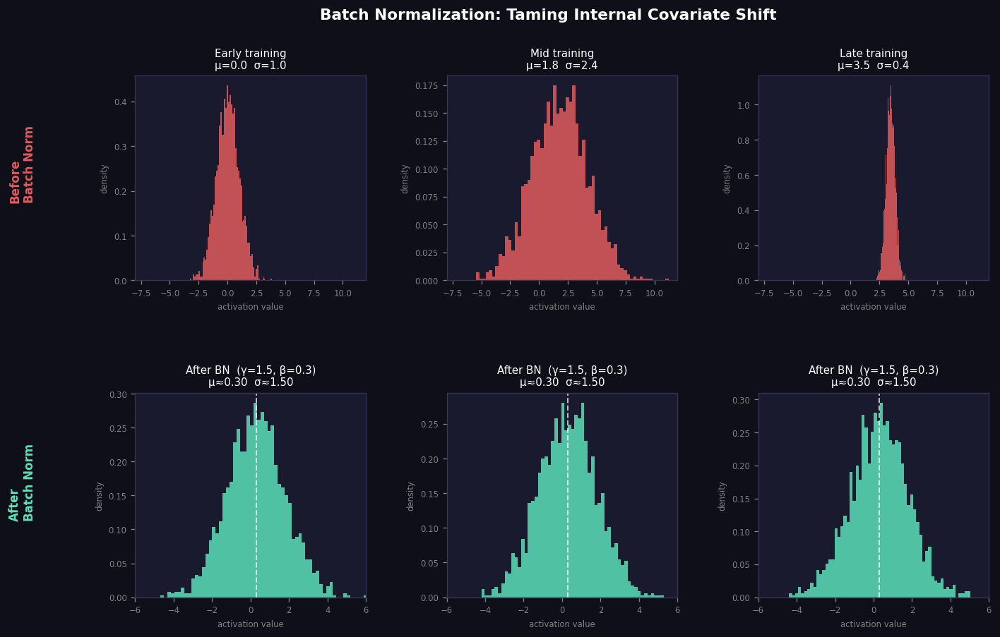

# Day 28 — Batch Normalization

**Phase 3 · Concept 27 of 112** | 2026-06-28

---

## 🧠 CONCEPT OF THE DAY

### The Problem: Your Network's Shifting Ground

Imagine teaching someone calculus while every day you secretly change the meaning of the symbols they learned yesterday. That's roughly what happens to later layers in a deep network: as earlier weights update during training, the statistical distribution of each layer's input keeps shifting. Ioffe & Szegedy (2015) called this **Internal Covariate Shift**.

Every layer must chase a moving target. The result: you need small learning rates, careful initialization, and saturating activations will kill your gradients. Training is fragile and slow.

**Batch Normalization (BN)** fixes this by normalizing each layer's pre-activation output across the current mini-batch — then immediately *un-normalizing* with learned parameters so the network can choose a different distribution if it wants to.

### The Math

Given a mini-batch of activations **x** = {x₁, …, xₘ} for a single feature dimension:

**Step 1 — Compute batch statistics:**

$$\mu_\mathcal{B} = \frac{1}{m} \sum_{i=1}^{m} x_i$$

$$\sigma^2_\mathcal{B} = \frac{1}{m} \sum_{i=1}^{m} (x_i - \mu_\mathcal{B})^2$$

**Step 2 — Normalize:**

$$\hat{x}_i = \frac{x_i - \mu_\mathcal{B}}{\sqrt{\sigma^2_\mathcal{B} + \varepsilon}}$$

where ε ≈ 1e-5 prevents division by zero.

**Step 3 — Affine rescale (the "undo" knob):**

$$y_i = \gamma \hat{x}_i + \beta$$

Here **γ** (scale) and **β** (shift) are **learned parameters**, one pair per feature. They give the network the expressivity to represent any mean and variance — including the original unnormalized distribution if that turns out to be optimal.

**At inference:** the stochastic batch statistics become unstable (batch size might be 1). Instead, BN uses an **exponential moving average** of μ and σ² accumulated during training:

$$\mu_{\text{running}} \leftarrow \alpha \, \mu_{\text{running}} + (1-\alpha)\, \mu_\mathcal{B}$$

This is why `model.train()` vs `model.eval()` matters so much — they toggle which statistics BN uses.



*Each column is a different training snapshot. Top row: raw pre-activations drift in mean and variance. Bottom row: after BN they're consistently centered near β=0.3, regardless of when in training.*

### Why It Matters / Where It Leads

BN was one of the key enablers of very deep nets (ResNet, Inception). It lets you use:
- **Much larger learning rates** (activations can't blow up)
- **Less careful initialization** (BN absorbs the scale mismatch)
- **A bit of free regularization** (batch statistics are noisy — each sample sees a slightly different normalization)

The next concept (Layer Normalization) fixes BN's core weakness: it breaks at small batch sizes (batch size 1 has σ²=0) and doesn't work across the sequence dimension in Transformers. You'll see exactly why LN became the default for LLMs.

**Real interview question:**

> *Why do we learn γ and β? If the whole point of BN is to normalize, why immediately "de-normalize"?*

*(Answer at the bottom.)*

---

## 🐍 PYTHONIC EDGE

### BN at Train vs Eval Time — a Bug That's Easy to Miss

```python
import torch
import torch.nn as nn

# ── Define a tiny net with BN ─────────────────────────────────────────────
class TinyNet(nn.Module):          # class X(Base): — Python single-inheritance
    def __init__(self):            # constructor; self == C++'s 'this' but explicit
        super().__init__()         # parent constructor (C++ uses init-list syntax)
        self.fc  = nn.Linear(16, 16)
        self.bn  = nn.BatchNorm1d(16)   # 16 learnable (gamma, beta) pairs
        self.act = nn.ReLU()

    def forward(self, x):          # __call__ on an nn.Module wraps forward() with hooks
        return self.act(self.bn(self.fc(x)))  # @ is matmul; () invokes __call__

model = TinyNet()

# ── BAD: forgetting to switch modes ──────────────────────────────────────
model.train()                      # BN uses batch μ/σ²
out_train = model(torch.randn(32, 16))

# ... then at inference, still in train mode:
out_BAD = model(torch.randn(1, 16))   # batch of 1 → σ²=0, BN outputs NaN or trash

# ── GOOD: always flip to eval before inference ─────────────────────────
model.eval()                       # BN now uses running_mean / running_var
with torch.no_grad():              # 'with' context manager — disables grad tracking
    out_GOOD = model(torch.randn(1, 16))   # stable, deterministic

# ── Inspect BN's running stats ─────────────────────────────────────────
print(model.bn.running_mean)   # exponential moving avg of μ_B
print(model.bn.running_var)    # exponential moving avg of σ²_B
print(model.bn.weight)         # γ — learnable scale
print(model.bn.bias)           # β — learnable shift

# ── Momentum (confusingly named opposite to optimizer momentum) ────────
#    momentum=0.1 means: running_mean = 0.9*running_mean + 0.1*batch_mean
bn_custom = nn.BatchNorm1d(16, momentum=0.1, eps=1e-5, affine=True)
#                                             ^^^ ε in denominator
#                                                          ^^^^^^ enables γ,β params
```

**The trap:** `model.eval()` doesn't just stop dropout — it switches BN from stochastic batch statistics to the accumulated running statistics. Forgetting this is a common source of bizarre inference degradation that's hard to debug.

**Bonus idiom — freezing BN during fine-tuning:**
```python
for module in model.modules():    # .modules() yields all submodules recursively
    if isinstance(module, nn.BatchNorm2d):  # isinstance() — Python's type check
        module.eval()             # freeze BN stats even while rest of model trains
        module.weight.requires_grad_(False)  # ._() suffix = in-place method (C++ has no equiv)
        module.bias.requires_grad_(False)
```

---

## 📡 SIGNAL LAB

### Batch Norm as Spectral Whitening

Consider a convolutional feature map of shape **(B, C, H, W)**. BatchNorm2d normalizes across the **(B, H, W)** axes for each channel C independently.

Now think about what this does in the **spatial frequency domain** (per channel):

Take the 2D DFT of a feature map:

$$\hat{F}[u, v] = \sum_{h,w} F[h,w]\, e^{-j2\pi(uh/H + vw/W)}$$

Normalization in the spatial domain subtracts the DC component (μ controls the **magnitude of the zero-frequency bin**) and divides by standard deviation (σ controls the **overall spectral energy**). So BN:

1. **Zeros out the DC component** — removes the global brightness offset from each feature map
2. **Whitens the total energy** — makes every channel's feature map have unit total power

This is a *channelwise* operation, not a full spatial whitening (which would require decorrelating across (u,v) bins — that's what ZCA whitening does, at far greater cost).

**The so-what:** In frequency-domain forensics (your lane), CNNs trained with BN will show *suppressed low-frequency information* in early layers and *boosted high-frequency edge content* in later layers — because removing DC and normalizing energy is exactly what BN encourages. When you analyze what a deepfake detector "sees," BN is one reason the network's internal representations look like bandpass-filtered feature maps rather than raw images.

**Quick experiment** (run mentally or in Colab):
```python
import torch, torch.nn as nn, numpy as np

x = torch.rand(8, 1, 32, 32)  # 8 images, 1 channel, 32x32

bn = nn.BatchNorm2d(1)
bn.eval()
bn.weight.data.fill_(1.0)   # γ=1
bn.bias.data.fill_(0.0)     # β=0

with torch.no_grad():
    x_bn = bn(x)

# Spectral energy before and after
E_before = (torch.fft.fft2(x).abs() ** 2).mean()       # fft2: 2-D FFT
E_after  = (torch.fft.fft2(x_bn).abs() ** 2).mean()    # should be ~1/scale

print(f"Energy before BN: {E_before:.4f}")
print(f"Energy after BN:  {E_after:.4f}")
# DC bin specifically:
print("DC before:", torch.fft.fft2(x)[..., 0, 0].abs().mean().item())
print("DC after: ", torch.fft.fft2(x_bn)[..., 0, 0].abs().mean().item())
```

You'll see the DC bin collapse dramatically after BN.

---

## 🏋️ THE GAUNTLET

### Problem: Sliding Window Statistics

You are given an integer array `nums` and an integer `k`. For each contiguous subarray of length `k`, compute its **median** and return all medians as a `double[]`.

```
Input:  nums = [1, 3, -1, -3, 5, 3, 6, 7],  k = 3
Output: [1.0, -1.0, -1.0, 3.0, 5.0, 6.0]
```

**Constraints:**
- 1 ≤ k ≤ n ≤ 10⁵
- −2³¹ ≤ nums[i] ≤ 2³¹ − 1

**Why this connects to today's concept:**  
Batch Norm computes running statistics (mean, variance) over a sliding window of training. Computing stable statistics over a sliding window efficiently is the algorithmic core of that idea.

**Hints:**

1. A sorted sliding window lets you read off the median in O(1) — what data structures let you maintain a sorted view efficiently as elements slide in and out?

2. Think two heaps: one max-heap for the lower half, one min-heap for the upper half. The median lives at their tops. Insertion is O(log k). What's the hard part?

3. The hard part is *deletion* of the outgoing element. Lazy deletion (mark the element as dead, only remove it when it surfaces at a heap top) keeps insertion O(log k) without needing an ordered set.

**Pattern:** Two-Heap with Lazy Deletion  
**Target complexity:** O(n log k) time, O(k) space

*(Full C++ solution at the bottom.)*

---

## 🏗️ BLUEPRINT

**BN placement: before or after activation?**

The original paper places BN *before* the activation (Linear → BN → ReLU). Practice often uses BN *after* (Linear → ReLU → BN) or, in ResNets, a "pre-activation" variant (BN → ReLU → Conv). The pre-activation ResNet empirically shows cleaner gradient flow and is preferred in very deep networks.

**Key tradeoff:** Post-activation BN normalizes the output of ReLU, which has already zeroed negative values — this skews the distribution and makes the "normalize to zero mean" assumption less meaningful. Pre-activation BN sees the full (unbounded) pre-nonlinearity values, giving normalization a cleaner signal. Default choice: stick with post-activation for standard CNNs; switch to pre-activation for ResNets deeper than 50 layers.

---

## 🗺️ MARCHING ORDERS

Batch Norm is one of those ideas that looks trivial on paper but was genuinely a training breakthrough — it's why you can train a 152-layer ResNet without prayer. Make sure you can derive the backward pass (it's a chain-rule through two statistics that themselves depend on the batch) — that question comes up.

**Tomorrow: Concept 28 — Layer Normalization**

---

---

## 🔓 GAUNTLET SOLUTION

```cpp
#include <bits/stdc++.h>
using namespace std;

class Solution {
public:
    vector<double> medianSlidingWindow(vector<int>& nums, int k) {
        // max-heap for lower half, min-heap for upper half
        // Use multiset for easy O(log k) deletion
        multiset<int> lo, hi;
        // lo: lower half (max at *lo.rbegin())
        // hi: upper half (min at *hi.begin())

        auto balance = [&]() {
            // ensure lo.size() == hi.size() or lo.size() == hi.size()+1
            while (lo.size() > hi.size() + 1) {
                hi.insert(*lo.rbegin());
                lo.erase(lo.find(*lo.rbegin()));
            }
            while (hi.size() > lo.size()) {
                lo.insert(*hi.begin());
                hi.erase(hi.begin());
            }
        };

        auto getMedian = [&]() -> double {
            if (k % 2 == 1) return (double)*lo.rbegin();
            return ((double)*lo.rbegin() + (double)*hi.begin()) / 2.0;
        };

        vector<double> result;

        for (int i = 0; i < (int)nums.size(); i++) {
            // --- Insert new element ---
            int x = nums[i];
            if (lo.empty() || x <= *lo.rbegin())
                lo.insert(x);
            else
                hi.insert(x);
            balance();

            // --- Window is full: record median, then remove outgoing element ---
            if (i >= k - 1) {
                result.push_back(getMedian());

                int out = nums[i - k + 1];
                // Remove from whichever half contains it
                auto it_lo = lo.find(out);
                if (it_lo != lo.end()) {
                    lo.erase(it_lo);
                } else {
                    hi.erase(hi.find(out));
                }
                balance();
            }
        }
        return result;
    }
};

// Time:  O(n log k)  — each insert/erase on multiset is O(log k)
// Space: O(k)        — two multisets hold at most k elements total
```

**Why multiset over two heaps + lazy deletion?**  
`std::multiset` is a balanced BST — it supports O(log k) insert, O(log k) erase *by iterator*, and O(1) access to min/max via `.begin()` / `.rbegin()`. Lazy deletion with two `priority_queue`s works but requires tracking "dead" elements and conditionally popping — the multiset version is cleaner and equally fast.

---

## 💡 CONCEPT ANSWER

> *Why do we learn γ and β? If the whole point of BN is to normalize, why immediately "de-normalize"?*

**Because pure normalization restricts the representational power of the layer.**

If we only normalized to zero mean and unit variance, we'd be forcing every layer's output distribution into the same canonical shape — but the optimal distribution for a given layer might be centered at 2.5 with std 0.3. The learnable γ and β allow the network to *recover any desired distribution*. In the extreme case, if γ = σ_B and β = μ_B, the network learns to exactly undo the normalization.

The real benefit of BN isn't the final distribution — it's that the **gradient flow** through the normalized path is much better conditioned (the Jacobian is well-scaled), even if the output distribution is eventually shifted back. You get stable gradients for free, and the network decides what distribution actually works best.
