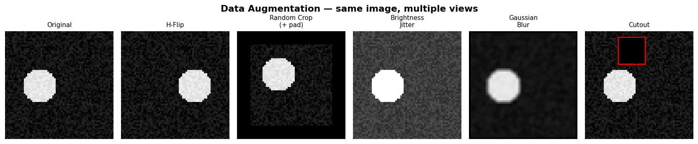

# Day 30 — Data Augmentation

> **Phase 3 · Concept 29 of 112** | Date: 2026-06-29

---

## 🧠 CONCEPT OF THE DAY

### Mental model

Training a model on the same images every epoch is like studying only one textbook edition, word-for-word.
Augmentation photocopies your dataset but puts each copy through a different photocopier setting — flipped, darker, slightly blurry — so the model is forced to learn *structure*, not pixel patterns.

More precisely: augmentation expands the effective dataset size and injects **inductive biases** (e.g. horizontal flip says "the label doesn't change when a cat faces left vs right").

### The math

Let $x \in \mathbb{R}^{H \times W \times C}$ be an image and $\mathcal{T}$ be a family of label-preserving transformations.
At each training step we sample $t \sim \mathcal{T}$ and feed $t(x)$ to the network instead of $x$.

The loss over the augmented distribution:

$$\mathcal{L}_{\text{aug}} = \mathbb{E}_{(x,y) \sim \mathcal{D},\ t \sim \mathcal{T}} \left[ \ell\left(f_\theta(t(x)),\, y\right) \right]$$

where:
- $\mathcal{D}$ = training dataset
- $\mathcal{T}$ = augmentation distribution (random crop, flip, colour jitter, …)
- $f_\theta$ = model with parameters $\theta$
- $\ell$ = task loss (cross-entropy, MSE, …)

This is equivalent to **data-space regularisation**: you constrain the model to be invariant under $\mathcal{T}$ without adding explicit penalty terms.

### Common transforms and what they teach the model

| Transform | Invariance injected | Watch out for |
|-----------|--------------------|--------------------|
| Horizontal flip | Left/right symmetry | Not safe for text, surgical images |
| Random crop | Translation, scale | Crop too aggressive → object removed |
| Brightness/contrast jitter | Lighting variation | Don't jitter medical images with calibrated pixel values |
| Gaussian blur | Focus variation | May remove high-freq texture needed for forensics |
| Cutout / Random erase | Occlusion robustness | Pair with label smoothing |
| Mixup | Convex combinations of pairs | Breaks calibration assumptions |
| RandAugment | Learnable policy | Adds search cost |



### Why it matters / where it leads

- Data augmentation is the **cheapest regulariser** available — free improved generalisation before touching architecture or optimiser.
- It bridges to **self-supervised learning** (Day 91 SimCLR): the entire pretraining objective is "these two augmented views of the same image should have similar embeddings."
- **Frequency-domain lens**: aggressive JPEG artefact augmentation or spectral noise injection is critical in deepfake forensics — your detector should be invariant to compression codec, not to facial identity. Augmentation lets you encode that prior directly.

**Interview question:** Why does random crop + horizontal flip generalise better than adding more L2 weight decay, even if both reduce overfitting? *(Answer at bottom.)*

---

## 🐍 PYTHONIC EDGE

**torchvision transforms compose cleanly — but know the new v2 API**

```python
import torch
from torchvision import transforms  # v1 API — still common
# from torchvision.transforms import v2  # new v2 API — recommended for boxes/masks

# ── Bad way: apply transforms manually inside __getitem__ ──────────────────
class BadDataset(torch.utils.data.Dataset):  # class X(Base): — Python single-inheritance
    def __init__(self, data):               # constructor; 'self' is explicit (C++ 'this')
        self.data = data                    # instance attribute (C++: declare in .h, init here)

    def __getitem__(self, idx):             # dunder: defines [] operator
        img = self.data[idx]
        img = transforms.functional.hflip(img)   # hard-coded — can't be tuned
        img = transforms.functional.resize(img, [224, 224])
        return img


# ── Good way: inject a callable transform at construction time ─────────────
class GoodDataset(torch.utils.data.Dataset):
    def __init__(self, data, transform=None):  # None is Python's nullptr — falsy
        self.data = data
        self.transform = transform              # store the callable as an attribute

    def __getitem__(self, idx):
        img = self.data[idx]
        if self.transform:                      # 'if obj' — falsy check; C++ uses != nullptr
            img = self.transform(img)           # __call__ on the Compose object
        return img

    def __len__(self):                          # dunder: len(dataset) — no C++ equivalent
        return len(self.data)                   # len() is a built-in; C++ uses .size()


train_tf = transforms.Compose([               # Compose is just a callable that chains callables
    transforms.RandomResizedCrop(224),        # random crop then resize — single op
    transforms.RandomHorizontalFlip(p=0.5),   # p= keyword arg — Python keyword-only pattern
    transforms.ColorJitter(brightness=0.4, contrast=0.4, saturation=0.4),
    transforms.ToTensor(),                    # PIL/numpy HWC uint8 → CHW float32 in [0,1]
    transforms.Normalize(                     # subtract mean, divide std — per channel
        mean=[0.485, 0.456, 0.406],           # list literal; C++ would be std::vector or array
        std =[0.229, 0.224, 0.225]
    ),
])

# Pass the transform object (first-class callable) — no C++ function-pointer ceremony
ds = GoodDataset(raw_data, transform=train_tf)

# ── Quick sanity check ─────────────────────────────────────────────────────
sample, label = ds[0]               # tuple unpacking: a, b = fn() — C++ needs std::tie
assert sample.shape == (3, 224, 224), f"got {sample.shape}"  # assert with f-string message
```

**Key takeaway:** keeping transforms *outside* the dataset class makes it trivial to swap `train_tf` for `val_tf` (which typically only resizes and crops center).

---

## 📡 SIGNAL LAB

**Augmentation in the frequency domain — what flipping does to your spectrum**

When you horizontally flip an image $x$, its 2-D DFT magnitude spectrum $|F(u,v)|$ is **unchanged** — the energy at each spatial frequency is the same, only the phase changes.

$$|F(\text{hflip}(x))| = |F(x)|$$

This is the convolution-shift theorem: a spatial reflection maps to complex conjugation in the frequency domain, so $|\cdot|$ is invariant.

**So what?**

- Flipping is "free" in the spectral sense — it does not add fake frequency content. Safe to use whenever the label is flip-invariant.
- Colour jitter and JPEG recompression **do** alter the spectrum (they shift energy across frequency bands). For **deepfake detection**, your augmentation pipeline should include realistic JPEG noise injection at various quality factors (e.g., `quality ~ Uniform(70, 95)`) so the detector learns to key on face synthesis artefacts, not compression artefacts.
- Gaussian blur **suppresses high frequencies** ($H(u,v) = e^{-2\pi^2\sigma^2(u^2+v^2)}$). Blurring augmentation trains the model to be less reliant on texture edges — useful for shape-biased vision, but **dangerous in forensics** where GAN fingerprints live in the high-frequency tail. Use blur augmentation cautiously in your forensics pipeline.

**Quick experiment (run it):**

```python
import numpy as np, matplotlib.pyplot as plt
np.random.seed(0)
img = np.random.rand(64, 64)
F_orig = np.abs(np.fft.fftshift(np.fft.fft2(img)))
F_flip = np.abs(np.fft.fftshift(np.fft.fft2(img[:, ::-1])))  # [::-1] — Python reverse slice
print("Max diff:", np.max(np.abs(F_orig - F_flip)))           # should be ~1e-12
```

---

## 🏋️ THE GAUNTLET

### Problem: Random Unique Pairs

You have `n` images in a dataset (0-indexed). For self-supervised contrastive learning you need to sample **K distinct pairs** `(i, j)` with `i < j`, uniformly at random **without replacement**.

**Constraints:**
- $2 \le n \le 10^5$
- $1 \le K \le \min\!\left(10^6, \binom{n}{2}\right)$
- Each pair must be unique.
- Time limit: solve in **expected O(K)** time.

**Hint 1 (mild):** The total number of pairs is $\binom{n}{2}$. Can you represent a pair as a single integer in $[0, \binom{n}{2})$ and sample that integer?

**Hint 2 (medium):** Given a flat index $m \in [0, \binom{n}{2})$, recover `(i, j)` with `i < j`. Row $i$ of the upper triangle starts at index $\binom{i}{2}$... think about how to invert that with binary search or a closed-form approximation.

**Hint 3 (spicy):** For the without-replacement requirement, use a hash set. If $K \ll \binom{n}{2}$, collision probability per draw is tiny — plain rejection sampling runs in expected O(1) per sample. When does rejection sampling break down?

**Pattern:** Random sampling + index encoding · **Target complexity:** Expected O(K)

---

## 🏗️ BLUEPRINT

**Test-time augmentation (TTA) — cheap inference-time boost**

Run the same image through $M$ augmented versions at test time, average (or vote on) the predictions:

$$\hat{y} = \frac{1}{M}\sum_{m=1}^{M} f_\theta(t_m(x))$$

**Key tradeoff:** TTA increases accuracy (especially on borderline examples) at cost of $M\times$ inference compute. For production, set $M=5$ with flip + small crops; measure accuracy delta vs latency budget. TTA is the first thing to try when you can't retrain but need a quick accuracy bump before a demo.

---

## 🗺️ MARCHING ORDERS

Spend five minutes running your own image through three augmentation pipelines and inspecting the FFT magnitude before/after — your forensics intuition will thank you.

Tomorrow: Concept 30 — **Early stopping**

---
---

## 🔓 GAUNTLET SOLUTION

```cpp
#include <bits/stdc++.h>
using namespace std;

// Convert flat upper-triangle index m -> pair (i, j) with i < j
// Row i of the upper triangle starts at i*(i-1)/2.
// Binary search for the largest i s.t. i*(i-1)/2 <= m.
pair<long long, long long> decode(long long m, long long n) {
    // binary search for row i
    long long lo = 1, hi = n - 1, i = 0;
    while (lo <= hi) {
        long long mid = (lo + hi) / 2;
        if (mid * (mid - 1) / 2 <= m) {
            i = mid;
            lo = mid + 1;
        } else {
            hi = mid - 1;
        }
    }
    long long j = m - i * (i - 1) / 2;  // offset within row i
    return {j, i};                        // (i,j) with i<j; j is smaller index here
}

int main() {
    ios::sync_with_stdio(false);
    cin.tie(nullptr);

    long long n, K;
    cin >> n >> K;

    long long total = n * (n - 1) / 2;  // C(n,2)

    unordered_set<long long> seen;
    seen.reserve(K * 2);                 // pre-allocate to avoid rehashing

    mt19937_64 rng(42);
    uniform_int_distribution<long long> dist(0, total - 1);

    vector<pair<long long,long long>> result;
    result.reserve(K);

    while ((long long)result.size() < K) {
        long long m = dist(rng);
        if (seen.insert(m).second) {     // .second is true if newly inserted
            result.push_back(decode(m, n));
        }
    }

    for (auto& [i, j] : result) {        // structured binding (C++17)
        cout << i << " " << j << "\n";
    }
    return 0;
}
```

**When rejection sampling breaks down:** When $K$ is close to $\binom{n}{2}$, the hash set fills up and collision probability grows. The fix: Fisher-Yates shuffle on the full flat index array — but that costs O(total) memory. Practical threshold: switch to shuffle when $K > 0.5 \cdot \binom{n}{2}$.

---

## 💡 CONCEPT ANSWER

**Why does random crop + flip generalise better than more L2 weight decay?**

L2 regularisation shrinks all weights uniformly — it has no knowledge of *which* variations are semantically irrelevant. Augmentation directly encodes domain knowledge: "horizontal flip and small translation shouldn't change the label." This is a much stronger, more targeted constraint. The model is explicitly trained on the augmented distribution, so at test time it has already seen those variations. L2 just biases toward small weights, which reduces complexity but doesn't teach invariance. The two are complementary — you should use both.
