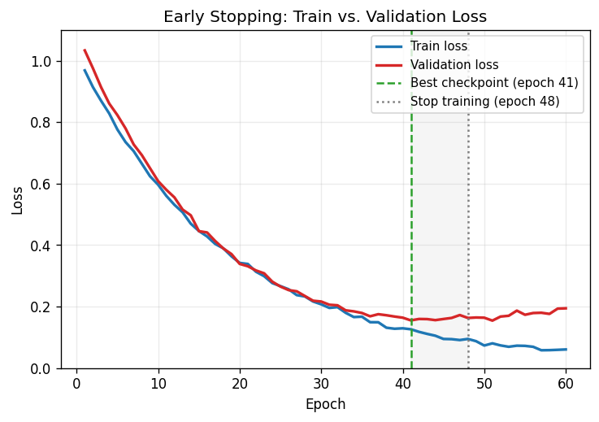

# Day 31 — Early Stopping

> **Phase 3 · Concept 30 of 112** | Date: 2026-06-30

---

## 🧠 CONCEPT OF THE DAY

### Mental model

Imagine cramming for an exam by memorizing last year's practice test word-for-word. You'll ace *that* exact test, but you've stopped learning the subject — you've started memorizing noise. At some point during training, your network does the exact same thing: it stops learning general structure and starts memorizing training-set quirks.

Early stopping is the simplest possible fix: **watch a held-out validation signal, and the moment it stops improving, stop training and roll back to the best checkpoint.** No extra loss term, no architecture change — just discipline about *when to quit*.

### The math

Let $\theta_t$ be the parameters after $t$ training steps, and $\mathcal{L}_{val}(\theta_t)$ the validation loss. Define the **best-so-far** validation loss:

$$\mathcal{L}_{val}^{*}(t) = \min_{s \le t} \mathcal{L}_{val}(\theta_s)$$

With **patience** $p$, training halts at the first $t$ such that:

$$\mathcal{L}_{val}(\theta_t) > \mathcal{L}_{val}^{*}(t - p) \quad \text{for all checkpoints in } [t-p, t]$$

i.e. $p$ consecutive evaluations with no new best. The returned model is **not** $\theta_t$ (the final weights) — it's $\theta_{t^*}$, the checkpoint that achieved $\mathcal{L}_{val}^{*}$.



The shaded region in the plot is the "wasted" patience window — training continues past the optimum just long enough to confirm the trend is real, not noise.

### Why early stopping is a regularizer, not just a convenience

This is the subtle interview point: early stopping **implicitly bounds model capacity**. For a linear model trained with gradient descent on a quadratic loss, it can be shown that stopping after $t$ steps is approximately equivalent to L2 regularization with:

$$\lambda \approx \frac{1}{\eta t}$$

where $\eta$ is the learning rate. Fewer steps ⇔ stronger effective regularization ⇔ smaller effective hypothesis space. You're not adding a penalty term — you're truncating the optimization trajectory before it reaches the unconstrained (and overfit) minimum.

### Why it matters / where it leads

- It's free — no compute overhead beyond periodic validation passes you'd run anyway.
- It composes with everything: L2 (Day 24), dropout (Day 26), batchnorm (Day 27) all still apply; early stopping just adds a stopping rule on top.
- It's the conceptual seed for **learning rate schedules with warmup/decay** (Day 17) and **checkpoint averaging / SWA** — both are about *when and how* to read off the final model, not just *how* to train it.
- In production pipelines, "monitor val metric, checkpoint best, stop on plateau" is implemented by callbacks (`EarlyStopping` in Keras, custom loops in PyTorch) — knowing the patience/delta tradeoff is a real config decision, not academic.

**Interview question:** Why is it critical to restore the *best* checkpoint rather than just stopping training at the patience-triggered step? What goes wrong if you don't? *(Answer at bottom.)*

---

## 🐍 PYTHONIC EDGE

**Implementing an `EarlyStopper` as a small stateful class — clean PyTorch idiom**

```python
import torch
import copy


class EarlyStopper:                                  # class X: — no explicit base needed (implicit object)
    def __init__(self, patience=7, min_delta=0.0):    # constructor; self == C++'s 'this', but explicit
        self.patience = patience                      # self.x = ... sets an instance attribute
        self.min_delta = min_delta                    # (C++: declare in header, init in body/initializer list)
        self.best_loss = float("inf")                 # Python float has no separate 'infinity' type ceremony
        self.wait = 0
        self.best_state = None                        # None is Python's nullptr/null equivalent

    def step(self, val_loss, model) -> bool:           # -> bool is an optional type hint, not enforced
        if val_loss < self.best_loss - self.min_delta:  # plain comparison; no special epsilon type
            self.best_loss = val_loss
            self.wait = 0
            # deepcopy snapshots tensors by value — a .state_dict() reference would keep mutating
            self.best_state = copy.deepcopy(model.state_dict())
        else:
            self.wait += 1                              # += works for both int and float, no overload needed
        return self.wait >= self.patience               # returns True/False — "should I stop?"

    def restore_best(self, model):
        model.load_state_dict(self.best_state)          # load_state_dict mutates model in place


# ── Bad way: stop on the FINAL epoch's weights ──────────────────────────────
# model trains for 60 epochs; you just take whatever weights exist at epoch 60.
# If val loss bottomed out at epoch 24, you're shipping an overfit model.

# ── Good way: track + restore the best checkpoint ───────────────────────────
stopper = EarlyStopper(patience=7, min_delta=1e-4)
for epoch in range(60):                                  # range() is an object (lazy iterator), not a list
    train_one_epoch(model, train_loader)                 # assume defined elsewhere
    val_loss = evaluate(model, val_loader)
    should_stop = stopper.step(val_loss, model)
    if should_stop:                                       # idiomatic truthy check, no '== True'
        print(f"Stopping at epoch {epoch}, best={stopper.best_loss:.4f}")  # f-string interpolation
        break                                              # exits the for-loop early — same as C++

stopper.restore_best(model)                               # always restore before deploying/evaluating
```

**Key takeaway:** `state_dict()` returns references to live tensors — without `copy.deepcopy`, "saving" the best state actually keeps a live, mutating view of the model. This is a classic silent bug: your "best" checkpoint quietly becomes the *last* checkpoint.

---

## 📡 SIGNAL LAB

**Early stopping as a low-pass filter on the optimization trajectory**

Think of the sequence of validation losses $\mathcal{L}_{val}(\theta_0), \mathcal{L}_{val}(\theta_1), \dots$ as a noisy time series. The "true" underlying trend (capacity catching up to data, then overfitting) is a slow-varying signal; epoch-to-epoch noise (minibatch sampling, dropout randomness, BN statistics) is high-frequency jitter superimposed on it.

**The patience window is literally a smoothing filter.** Requiring $p$ consecutive non-improving evaluations before declaring "done" is equivalent to applying a moving-average (low-pass) filter to the loss curve before thresholding — it rejects high-frequency noise that would otherwise trigger false-positive stops.

$$\tilde{\mathcal{L}}(t) = \frac{1}{p}\sum_{k=0}^{p-1}\mathcal{L}_{val}(\theta_{t-k})$$

**So what?**

- Too small a patience ($p=1$) is like an undersampled, noisy detector — you stop on the first random uptick, a false alarm (Type-I error in the time domain).
- Too large a patience wastes compute and risks missing the inflection point until the trend is unmistakable (a "DC offset" has built up) — analogous to over-smoothing and losing transient detail.
- **Forensics tie-in:** this same tension — sensitivity vs. false-alarm rate under noise — shows up when you threshold a spectral statistic (e.g., a GAN-fingerprint energy ratio) for deepfake detection. The "patience" there is how many consecutive frames/patches must cross threshold before you flag a video, exactly the same noise-rejection logic.

**Quick experiment (run it):**

```python
import numpy as np
np.random.seed(1)
trend = np.concatenate([np.linspace(1.0, 0.2, 30), np.linspace(0.2, 0.35, 30)])
noisy = trend + np.random.normal(0, 0.03, size=trend.shape)
# moving average with window p smooths out the noise before you check "did it improve?"
p = 5
smoothed = np.convolve(noisy, np.ones(p) / p, mode="valid")
print("Argmin raw (noisy):", np.argmin(noisy))
print("Argmin smoothed:   ", np.argmin(smoothed) + p // 2)  # closer to true trend minimum at 30
```

---

## 🏋️ THE GAUNTLET

### Problem: Sliding Window Best-So-Far with Patience Trigger

You're given an array `loss` of `n` floating-point validation losses recorded one per epoch (0-indexed). Implement a function that returns the **0-indexed epoch of the best checkpoint** and the **epoch at which training would have stopped**, given a patience `p` and minimum improvement delta `eps`:

- A new loss `loss[i]` counts as an improvement over the current best `b` only if `loss[i] < b - eps`.
- Training stops at the first index `i` such that the **last `p` consecutive evaluations** produced zero improvements over the best-so-far tracked at the start of that window.
- If training never triggers the stop condition, it runs to `n-1`.

**Constraints:**
- $1 \le n \le 2 \times 10^5$
- $0 \le p < n$
- $0 \le eps < 1$
- Losses are doubles, can be in any range $\ge 0$.
- Time limit: solve in **O(n)** total — no re-scanning the window from scratch each step.

**Hint 1 (mild):** You only need two running variables — `best_loss` and `best_epoch` — plus a counter for "epochs since last improvement." You don't need to store or re-scan a literal sliding window.

**Hint 2 (medium):** The counter resets to 0 exactly when you find a new best; otherwise it increments by 1 each epoch. The stop condition fires the instant the counter reaches `p`.

**Hint 3 (spicy):** Be careful with the edge case `p == 0` (stop immediately if epoch 0 isn't itself the best — i.e., no patience at all) and the case where the best loss is achieved on the very last epoch (no stop ever triggers; you must report `n-1` as the stop epoch).

**Pattern:** Single-pass running extremum tracking (Kadane-style) · **Target complexity:** O(n) time, O(1) extra space

---

## 🏗️ BLUEPRINT

**Checkpoint storage tradeoff: best-only vs. top-k vs. full history**

Storing only the single best checkpoint (what `EarlyStopper` above does) costs O(1) disk/memory but loses the ability to do checkpoint averaging (SWA-style) or post-hoc ensembling. Storing top-k by validation metric gives you both early stopping *and* ensembling at k× storage cost. For large models (multi-GB checkpoints), the real-world decision is almost always "best-only + periodic time-based checkpoint for crash recovery," because top-k storage costs dominate cluster disk budgets fast.

---

## 🗺️ MARCHING ORDERS

Next time you train anything past 10 epochs, actually plot train vs. val loss before trusting the final-epoch weights — the gap between "lowest val loss" and "last epoch" is bigger than you think.

Tomorrow: Concept 31 — **Label smoothing**

---
---

## 🔓 GAUNTLET SOLUTION

```cpp
#include <bits/stdc++.h>
using namespace std;

// Returns {best_epoch, stop_epoch}
pair<int,int> earlyStopping(const vector<double>& loss, int p, double eps) {
    int n = (int)loss.size();
    double best_loss = loss[0];
    int best_epoch = 0;
    int wait = 0;          // epochs since last improvement
    int stop_epoch = n - 1; // default: never triggers, run to the end

    for (int i = 1; i < n; ++i) {
        if (loss[i] < best_loss - eps) {
            best_loss = loss[i];
            best_epoch = i;
            wait = 0;
        } else {
            wait++;
            if (wait >= p && p > 0) {   // p == 0 handled separately below
                stop_epoch = i;
                return {best_epoch, stop_epoch};
            }
        }
    }
    // Edge case: p == 0 means zero tolerance — stop the instant epoch 0
    // isn't already the best, i.e. at the first non-improving epoch.
    if (p == 0) {
        for (int i = 1; i < n; ++i) {
            if (!(loss[i] < loss[0] - eps)) {
                return {0, i};
            }
        }
        return {0, n - 1};
    }
    return {best_epoch, stop_epoch};
}

int main() {
    ios::sync_with_stdio(false);
    cin.tie(nullptr);

    int n, p;
    double eps;
    cin >> n >> p >> eps;
    vector<double> loss(n);
    for (auto& x : loss) cin >> x;

    auto [best_epoch, stop_epoch] = earlyStopping(loss, p, eps);  // structured binding (C++17)
    cout << best_epoch << " " << stop_epoch << "\n";
    return 0;
}
```

**Walkthrough:** single forward pass maintaining `best_loss`/`best_epoch`/`wait`. The moment `wait` hits `p`, we've confirmed `p` consecutive non-improving epochs, so we report and stop — no re-scanning. `p == 0` is special-cased because "patience of zero" means there's no grace window at all, so the very first non-improving epoch (relative to epoch 0, not a running best) is the trigger by problem definition.

---

## 💡 CONCEPT ANSWER

**Why restore the best checkpoint instead of stopping at the patience-triggered step?**

The patience-triggered step is, by construction, `p` epochs *after* the actual best validation performance — those `p` epochs were spent confirming the plateau/regression was real, not noise. If you ship the weights from the stop step itself, you're shipping a model that has already overfit for `p` additional epochs past its optimum. The entire value of early stopping comes from selecting $\theta_{t^*}$ at the validation minimum; the patience window is purely a *detection* mechanism, not a *training* target. Forgetting to restore the best checkpoint is one of the most common silent bugs in training pipelines — the loss curves look like you did the right thing, but the deployed model is the overfit one.
