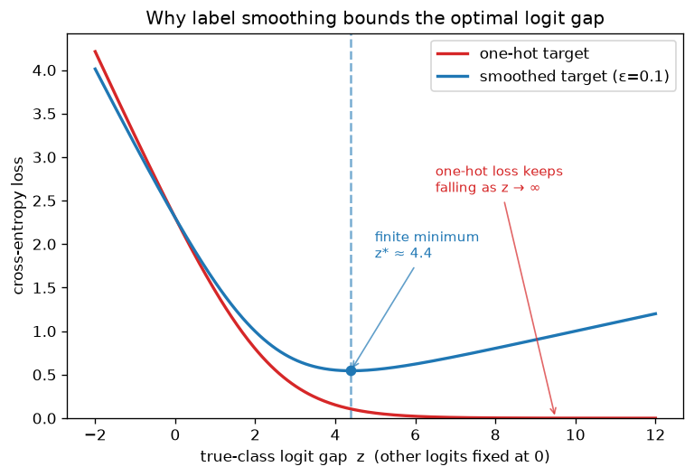

# Day 32 — Label Smoothing

> **Phase 3 · Concept 31 of 112 (final concept of Phase 3)** | Date: 2026-07-03

---

## 🧠 CONCEPT OF THE DAY

### Mental model

A one-hot label is a demand for absolute certainty: "this image is a cat with probability 1.0, everything else is exactly 0." But your training set is noisy — some labels are wrong, some images are ambiguous — and cross-entropy will chase that impossible certainty forever, driving the true-class logit toward infinity and never actually converging. It's a student who refuses to write "I'm 95% sure" on an exam and instead insists on "100% sure," even when a little doubt would be the intellectually honest (and better-calibrated) answer.

**Label smoothing softens the target itself.** Instead of demanding $p_{true} = 1$, you ask for $p_{true} = 1-\epsilon$ and spread the remaining $\epsilon$ uniformly over the wrong classes. The model no longer has an incentive to push its confidence to infinity — it has a finite, achievable target.

### The math

For $K$ classes, the standard one-hot target for true class $y$ is $q_k = \mathbb{1}[k=y]$. Label smoothing (Szegedy et al., 2016) replaces it with:

$$q_k' = (1-\epsilon)\,\mathbb{1}[k=y] + \frac{\epsilon}{K}$$

where $\epsilon \in (0, 1)$ is the smoothing factor (typically 0.1). The cross-entropy loss against this softened target decomposes into two pieces:

$$\mathcal{L} = (1-\epsilon)\, H(y, p) + \epsilon\, H(u, p)$$

where $H(y,p) = -\log p_y$ is the ordinary cross-entropy against the hard label, $H(u,p)$ is cross-entropy against the uniform distribution $u$, and $p$ is the model's softmax output. You're literally blending "fit the label" with "stay close to uniform" — an entropy regularizer hiding inside a loss function.

### Why this actually bounds the optimum (not just "less confident")

Consider a symmetric toy case: true-class logit $z$, every other logit fixed at $0$. With a one-hot target, $\mathcal{L} = -\log p_{true}(z)$ decreases monotonically as $z \to \infty$ — there is **no finite minimizer**; gradient descent just keeps inflating $z$ (and the weight norms that produce it) forever, chasing the last epsilon of loss. With label smoothing, the loss has a genuine **interior minimum** at a finite $z^*$, because pushing $p_{true} \to 1$ now costs you on the $\epsilon$-weighted uniform term. The plot below makes this concrete:



The red curve (one-hot) keeps falling — no stopping point. The blue curve (smoothed) bottoms out and *rises again* if $z$ grows too large, because an overconfident model is now explicitly penalized.

### Why it matters / where it leads

- **Calibration:** smoothed models' softmax outputs track true accuracy much better — critical anywhere you threshold a confidence score (detection systems, medical triage, OOD/deepfake flags).
- **Regularization for free:** bounded logits ⇒ bounded weight growth ⇒ a side-effect that overlaps with what L2 (Day 24) and early stopping (Day 30) do more explicitly.
- **The catch, and a real interview trap:** label smoothing *degrades* knowledge distillation (Concept 75, later in the roadmap). Müller et al. (2019) showed it erases the "dark knowledge" in the non-target logits — smoothing pushes all wrong-class logits toward being *equally* wrong, destroying the fine-grained similarity structure (e.g. "cat" logit for a dog image being closer to "wolf" than to "car") that a distillation student learns from. A senior interviewer loves this question because it tests whether you understand *why* a regularizer works, not just *that* it works.
- This closes out **Phase 3 (regularization)** — Phase 4 starts tomorrow with convolutions, where you'll see label smoothing reappear casually in almost every serious CNN training recipe (Inception, ResNet, EfficientNet all use it).

**Interview question:** You're told a teacher network was trained with label smoothing, and its distilled student underperforms compared to distilling from a teacher trained without smoothing. Why would that happen, and what does it tell you about what distillation actually transfers? *(Answer at bottom.)*

---

## 🐍 PYTHONIC EDGE

**Building the smoothed target vectorized — don't loop over classes**

```python
import torch
import torch.nn.functional as F

logits = torch.randn(4, 10)          # batch of 4, K=10 classes
targets = torch.tensor([2, 5, 0, 9])  # hard labels, shape (4,)
eps = 0.1
K = logits.size(-1)                   # -1 indexes the last dim (Python: negative index from the end)

# ── Bad way: build the smoothed target with an explicit Python loop ─────────
def smooth_targets_slow(targets, K, eps):
    out = []                                        # plain list, not preallocated — reallocates each append
    for t in targets:                                # for x in iterable — no manual index bookkeeping needed
        row = [eps / K] * K                          # list * int repeats the list — no equivalent in C++ std::vector
        row[t.item()] = 1 - eps + eps / K             # .item() pulls a Python scalar out of a 0-d tensor
        out.append(row)
    return torch.tensor(out)

# ── Clean way: vectorized construction, one kernel launch, no Python loop ───
def smooth_targets_fast(targets, K, eps):
    # torch.full: allocate + fill in one call — the in-place-looking size arg is (batch, K), a tuple
    q = torch.full((targets.size(0), K), eps / K)
    # scatter_ writes 1-eps+eps/K at index `targets[i]` along dim=1, per row — the trailing _ means in-place
    q.scatter_(1, targets.unsqueeze(1), 1 - eps + eps / K)  # unsqueeze(1) adds a dim: (B,) -> (B, 1)
    return q

smoothed = smooth_targets_fast(targets, K, eps)
loss = -(smoothed * F.log_softmax(logits, dim=-1)).sum(dim=-1).mean()  # manual cross-entropy against soft targets

# In practice, skip all of this — it's built in:
loss_builtin = F.cross_entropy(logits, targets, label_smoothing=eps)  # kwarg-only arg, no manual target tensor
assert torch.allclose(loss, loss_builtin, atol=1e-6)                  # assert for a sanity check, stripped in -O mode
```

**Key takeaway:** `scatter_` is the vectorized way to write "set this one entry per row" without a Python-level loop over the batch — the same pattern shows up for one-hot encoding, masking, and gather-based indexing everywhere in PyTorch code. And as of recent PyTorch versions, `label_smoothing` is just a kwarg on `F.cross_entropy` — never hand-roll this in production code.

---

## 📡 SIGNAL LAB

**The same "add a small ε to avoid blowing up" trick shows up in deconvolution**

Label smoothing's mechanism — bound an optimization that would otherwise chase infinity — has a direct analogue in inverse filtering. Suppose a signal $x$ is blurred by a known kernel with frequency response $H(f)$ and corrupted by noise: $Y(f) = H(f)X(f) + N(f)$.

**Naive inverse filtering** recovers $\hat X(f) = Y(f)/H(f)$. Wherever $H(f) \approx 0$ (the blur kernel suppresses that frequency almost completely — very common for a Gaussian blur at high frequencies), you divide by ~0 and **amplify noise without bound** — the exact same "no finite optimum" failure mode as one-hot cross-entropy chasing $z \to \infty$.

**The Wiener-filter fix adds a regularizing ε to the denominator:**

$$\hat X(f) = \frac{H^*(f)}{|H(f)|^2 + \epsilon}\, Y(f)$$

Exactly like label smoothing's $\epsilon/K$ term, this $\epsilon$ caps the maximum gain the filter can apply, trading a small amount of bias (imperfect deblurring) for a huge reduction in noise amplification — the classic bias/variance trade against blowup.

**Quick experiment (run it):**

```python
import numpy as np
np.random.seed(42)

n = 256
t = np.arange(n)
x = np.sin(2 * np.pi * t / 40) + 0.5 * np.sin(2 * np.pi * t / 7)  # low + high freq content

# Gaussian blur kernel (suppresses high frequencies -> H(f) near 0 up there)
kernel = np.exp(-0.5 * ((np.arange(n) - n // 2) / 3.0) ** 2)
kernel /= kernel.sum()
H = np.fft.fft(np.fft.ifftshift(kernel))

Y = H * np.fft.fft(x) + np.fft.fft(np.random.normal(0, 0.01, n))  # blur + tiny noise

# Naive inverse: blows up wherever |H| ~ 0
X_naive = Y / H
recon_naive = np.real(np.fft.ifft(X_naive))

# Wiener-regularized inverse: eps bounds the max gain, just like label smoothing bounds z
eps = 1e-2
X_wiener = (np.conj(H) / (np.abs(H) ** 2 + eps)) * Y
recon_wiener = np.real(np.fft.ifft(X_wiener))

print("naive reconstruction max abs value: ", np.abs(recon_naive).max())   # explodes
print("wiener reconstruction max abs value:", np.abs(recon_wiener).max())  # stays bounded, close to original scale
```

**So what:** both fixes are the same idea wearing different clothes — whenever an objective has a term that wants to divide-by-zero or push a parameter to infinity, adding a small, principled constant term (ε/K here, ε there) converts an ill-posed, unbounded optimum into a well-posed, finite one. Recognizing this pattern across ML and DSP is worth more than memorizing either formula in isolation.

---

## 🏋️ THE GAUNTLET

### Problem: Maximize the Minimum After Redistribution

You have `n` classes with non-negative integer mass `a[0..n-1]` (think: raw label counts, or token frequencies). You're allowed to perform **at most `k` unit transfers**: each transfer moves exactly 1 unit of mass from any one class to any other class (the total sum `S = sum(a)` is invariant — transfers just move mass around, they don't create or destroy it).

Find the **maximum possible value of `min(a)`** achievable using at most `k` total transfers.

**Constraints:**
- $1 \le n \le 2 \times 10^5$
- $0 \le a_i \le 10^9$
- $0 \le k \le 10^{15}$
- Time limit: **O(n log(max(a)))**

**Hint 1 (mild):** If you fix a candidate answer `M` and ask "can every class reach at least `M`?" — is that question monotonic in `M`? What does that suggest about how to search over candidate answers?

**Hint 2 (medium):** For a fixed candidate `M`, the number of transfers *required* is exactly the total deficit: $\sum_i \max(0, M - a_i)$. You don't need to separately check where the surplus comes from — think about why conservation of `S` makes that automatic.

**Hint 3 (spicy):** There's a second necessary condition beyond "deficit ≤ k" — a candidate `M` can never exceed $\lfloor S/n \rfloor$, no matter how large `k` is. Make sure your binary search's upper bound (and feasibility check) accounts for this, or you'll search a range that can never be satisfied.

**Pattern:** Binary search on the answer + O(n) monotonic feasibility check · **Target complexity:** O(n log(max(a))) time, O(1) extra space beyond the input array.

---

## 🏗️ BLUEPRINT

No blueprint today.

---

## 🗺️ MARCHING ORDERS

That closes out Phase 3 — you now have the full regularization toolkit (weight decay, dropout, norm layers, augmentation, early stopping, label smoothing) as a reflex, not a checklist. Tomorrow the roadmap turns a corner into CNN territory, where most of this toolkit gets reused rather than reinvented.

Tomorrow: Concept 32 — **The convolution operation**

---
---

## 🔓 GAUNTLET SOLUTION

```cpp
#include <bits/stdc++.h>
using namespace std;

int main() {
    ios::sync_with_stdio(false);
    cin.tie(nullptr);

    int n;
    long long k;
    cin >> n >> k;
    vector<long long> a(n);
    long long S = 0;
    for (auto& x : a) { cin >> x; S += x; }

    // M can never exceed floor(S/n): even with unlimited transfers you can't
    // raise every one of n classes above the true average.
    long long lo = 0, hi = S / n;
    long long ans = 0;

    auto feasible = [&](long long M) -> bool {
        long long deficit = 0;
        for (long long x : a) {
            if (x < M) {
                deficit += (M - x);
                if (deficit > k) return false;  // early exit, keeps it O(n) per check
            }
        }
        return deficit <= k;
    };

    while (lo <= hi) {
        long long mid = lo + (hi - lo) / 2;   // avoids overflow vs (lo+hi)/2
        if (feasible(mid)) {
            ans = mid;
            lo = mid + 1;
        } else {
            hi = mid - 1;
        }
    }

    cout << ans << "\n";
    return 0;
}
```

**Walkthrough:** Feasibility of a candidate minimum `M` is monotonic — if `M` is achievable, every smaller `M' < M` is too (just transfer less), so binary search applies directly. For a fixed `M`, the number of transfers *needed* is exactly $\sum \max(0, M - a_i)$: since total mass `S` is conserved, any mass above `M` in some class is automatically "available" to cover the deficit elsewhere — conservation guarantees the surplus exists whenever `n*M <= S`, so you never need to separately track where the extra mass physically comes from. The upper bound `S/n` prevents wasted iterations on infeasible candidates that no amount of budget could satisfy.

---

## 💡 CONCEPT ANSWER

**Why does a label-smoothed teacher make for a worse distillation source?**

Distillation transfers the *relative* structure of a teacher's output distribution — the fact that a "cat" image gets slightly more probability mass on "dog" and "wolf" than on "airplane" or "truck" encodes real semantic similarity the student can learn from ("dark knowledge"). Label smoothing was explicitly designed to *suppress* differences among non-target classes: it pulls every wrong-class logit toward the same $\epsilon/K$ share, flattening exactly the fine-grained structure distillation depends on. A smoothed teacher's softmax over wrong classes looks close to uniform noise rather than a meaningful similarity ranking — so the student learns less from it than from an unsmoothed (even if less "calibrated") teacher. The lesson: two regularizers can each individually improve a metric you care about (calibration vs. transferable representation) while actively working against each other — always check what a technique is trading away, not just what it improves.
