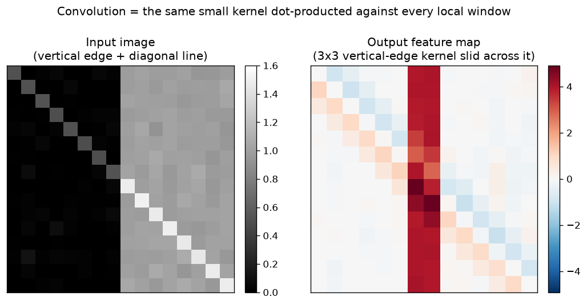

# Day 33 — The Convolution Operation

> **Phase 4 · Concept 32 of 112 (1st concept of Phase 4)** | Date: 2026-07-04

---

## 🧠 CONCEPT OF THE DAY

### Mental model

Every fully-connected layer you've built so far treats every input pixel as an independent, unrelated feature — it has to *relearn* "vertical edge" separately for every possible location in the image, and it throws away the fact that a pixel and its neighbors are correlated. A convolution fixes this with one idea: **use a small, learnable template (a kernel), and slide the exact same template over every location.** Wherever the local patch under the kernel looks like what the kernel is tuned to detect, the output lights up. It's a stencil, or a matched filter, dragged across the whole image — the same detector, reused everywhere, because "edge-ness" doesn't depend on *where* in the image you're looking.

Two ideas fall out of this for free, and both are why CNNs work at all:
- **Parameter sharing** — one 3×3 kernel has 9 weights whether the image is 32×32 or 4096×4096. Compare that to a fully-connected layer, whose weight count scales with the *number of pixels*.
- **Translation equivariance** — shift the input, and the output feature map shifts by the same amount. The network doesn't need separate training examples of a cat in every corner of the frame.

### The math

For a 2D input $I$ and kernel $K$ of size $k \times k$, the operation actually implemented by `nn.Conv2d` at output location $(i,j)$ is:

$$(I * K)(i,j) = \sum_{m=0}^{k-1}\sum_{n=0}^{k-1} I(i+m,\, j+n)\, K(m,n)$$

This is technically **cross-correlation**, not textbook convolution. True mathematical convolution flips the kernel first:

$$(I \circledast K)(i,j) = \sum_{m}\sum_{n} I(i-m,\, j-n)\, K(m,n)$$

Deep learning frameworks skip the flip and call it "convolution" anyway. It doesn't matter for learning — since $K$ is learned from random initialization, the optimizer will happily learn the flipped version of whatever kernel it would have learned otherwise. It only matters if you're deliberately trying to implement a *known, hand-designed* filter (e.g. porting a classical DSP kernel) and get every sign backwards. Filing that one away now — it is a genuine, common gotcha.

Each output value above is one dot product between a $k\times k$ patch of the input and the kernel — that inner double sum is exactly what the graph below is showing you happen at every sliding position:



Notice the output isn't an "image" anymore in the usual sense — it's a **feature map**: a spatial map of "how strongly does this pattern match here." The vertical edge in the input produces a strong, spatially-localized band in the output; the diagonal line barely registers, because this particular kernel wasn't built to detect diagonals.

### Why it matters / where it leads

- **Everything in Phase 4 is a variation on this one operation.** Stride and padding (tomorrow, Concept 33) control how the sliding window moves and what happens at the border. Multiple channels (Concept 34) mean each layer learns *many* kernels in parallel, each producing its own feature map. Pooling (Concept 35) and receptive field (Concept 36) are both about what happens when you stack these sliding windows on top of each other.
- **The convolution theorem is the deep bridge to your DSP background** (today's Signal Lab leans on it hard): convolution in the spatial/time domain is *multiplication* in the frequency domain. A learned CNN kernel is, mathematically, a learned frequency-domain filter — which is exactly why CNN features have characteristic spectral signatures, and why frequency-domain artifacts (a favorite tool in generative-image forensics) show up as telltale patterns after repeated conv + upsampling layers.
- **A real interview question, near-guaranteed if convolution comes up**: "PyTorch's `Conv2d` is technically cross-correlation, not convolution. Does that matter?" The senior-level answer isn't "no it's fine" — it's *why* it doesn't matter for learned filters but *would* matter if you were hand-designing or importing a known kernel, plus knowing that some libraries (classical image-processing ones, e.g. `scipy.ndimage.convolve` vs `correlate`) genuinely do flip the kernel, so mixing frameworks silently introduces a sign/orientation bug.

**Interview question:** You're told a colleague ported a hand-designed edge-detection kernel from a classical computer-vision pipeline (built with true mathematical convolution) directly into a PyTorch `nn.Conv2d` layer with `requires_grad=False`, expecting identical output to the original pipeline. It's producing a mirrored result. What went wrong, and how do you fix it in one line? *(Answer at bottom.)*

---

## 🐍 PYTHONIC EDGE

**Building a 2D convolution — the naive nested loop vs. the vectorized (im2col-style) way**

```python
import torch
import torch.nn.functional as F

img = torch.randn(1, 1, 8, 8)                 # (batch, channels, H, W) — PyTorch's NCHW convention
kernel = torch.randn(3, 3)

# ── Bad way: explicit Python double loop over every output location ────────
def conv2d_slow(img, kernel):
    B, C, H, W = img.shape                     # tuple unpacking — no equivalent std::tie() ceremony needed
    k = kernel.size(0)
    out_h, out_w = H - k + 1, W - k + 1
    out = torch.zeros(out_h, out_w)             # preallocated, but still filled via Python-level loop below
    for i in range(out_h):                      # range() returns a lazy iterator object, not a materialized list
        for j in range(out_w):
            patch = img[0, 0, i:i + k, j:j + k]   # slice notation [a:b] — half-open, like C++ iterators [a, b)
            out[i, j] = (patch * kernel).sum()    # elementwise * then .sum(), one Python-level op per pixel
    return out

# ── Clean way: let the framework's compiled kernel do the sliding ──────────
def conv2d_fast(img, kernel):
    k = kernel.size(0)
    # F.conv2d wants weight shaped (out_channels, in_channels, kH, kW) — view() reshapes without copying data
    w = kernel.view(1, 1, k, k)                 # no C++ analog: view() shares the same underlying buffer
    return F.conv2d(img, w).squeeze()           # squeeze() drops size-1 dims — (1,1,H,W) -> (H,W)

out_slow = conv2d_slow(img, kernel)
out_fast = conv2d_fast(img, kernel)
assert torch.allclose(out_slow, out_fast, atol=1e-5)  # assert x, msg — stripped entirely under python -O
```

**Key takeaway:** `conv2d_slow` is O(output pixels) Python-level iterations — each one a tiny, interpreter-overhead-dominated tensor op. `F.conv2d` internally reframes the sliding-window pattern as one big matrix multiply (the "im2col" trick: unfold every patch into a row, then it's just `patches @ kernel.flatten()`), dispatching to a single fused, vectorized (and on GPU, massively parallel) kernel call. **The rule of thumb that generalizes far beyond convolution:** any time you catch yourself writing nested Python `for` loops over tensor indices, ask whether the operation is secretly a matmul, a broadcast, or a built-in op in disguise — it almost always is.

---

## 📡 SIGNAL LAB

**The convolution theorem: today's operation, seen from the frequency domain**

This is the one where your DSP background pays off directly. The convolution theorem states:

$$I * K \;\Longleftrightarrow\; \mathcal{F}\{I\} \cdot \mathcal{F}\{K\}$$

Sliding a kernel across a signal in the time/space domain is *identical* to multiplying their spectra in the frequency domain, then inverse-transforming back. This isn't an approximation — it's an exact equivalence (modulo circular vs. linear boundary handling, which is where the "so what" below actually bites).

**Quick experiment (run it):**

```python
import numpy as np
np.random.seed(42)

n = 64
x = np.sin(2 * np.pi * np.arange(n) / 16) + 0.3 * np.random.randn(n)  # noisy tone
h = np.array([0.25, 0.5, 0.25])                                        # a tiny smoothing kernel

# Direct (linear) convolution — the textbook sliding-window definition
direct = np.convolve(x, h, mode="full")

# FFT-based convolution: pad both to avoid circular wraparound, multiply spectra, invert
L = len(x) + len(h) - 1                    # required length for LINEAR convolution via FFT
X = np.fft.fft(x, n=L)                     # zero-padded FFT — n= kwarg controls padded length
H = np.fft.fft(h, n=L)
fft_conv = np.real(np.fft.ifft(X * H))     # multiply spectra, then invert — the theorem in one line

print("max abs difference:", np.abs(direct - fft_conv).max())  # ~1e-14, i.e. numerically identical
```

**So what — and why CNNs still use direct convolution:** the two methods are mathematically identical, but their *cost* isn't. Direct sliding-window convolution of an $n$-length signal with a $k$-length kernel costs $O(nk)$; FFT-based convolution costs $O(n\log n)$ regardless of $k$. For CNNs, $k$ is tiny (3×3, 5×5) and $n$ (the image) is what's large, so $O(nk)$ with a small constant $k$ beats $O(n \log n)$ — which is exactly why every mainstream CNN implementation uses direct (im2col/Winograd-style) convolution, *not* FFT convolution, despite the theorem saying they're the same operation. FFT-based convolution only starts winning when the kernel itself gets large relative to the signal — which is precisely the regime some large-kernel CNN and diffusion-model architectures deliberately exploit. Same operation, two implementations, and the crossover point is a genuine systems-engineering decision, not a theoretical one.

---

## 🏋️ THE GAUNTLET

### Problem: Box Filter in O(1) per Query — Range Sum on a 2D Grid

You're given an $n \times m$ grid of integers (think: a grayscale image). You must preprocess it so that you can answer $Q$ queries, each asking for the sum of pixel values inside an axis-aligned rectangle $(r_1, c_1)$ to $(r_2, c_2)$ inclusive — and answer **each query in O(1)** after preprocessing.

**Constraints:**
- $1 \le n, m \le 1000$
- $-10^4 \le \text{grid}[i][j] \le 10^4$
- $1 \le Q \le 10^5$
- Preprocessing budget: $O(nm)$. Per-query budget: $O(1)$.

**Hint 1 (mild):** In 1D, what single array lets you answer "sum of `a[l..r]`" in O(1) after one O(n) pass?

**Hint 2 (medium):** Extend that idea to 2D. If `S[i][j]` = sum of the rectangle from `(0,0)` to `(i,j)` inclusive, can you write `S[i][j]` in terms of `S[i-1][j]`, `S[i][j-1]`, `S[i-1][j-1]`, and `grid[i][j]`? Draw the overlapping rectangles if it's not obvious why one term gets subtracted.

**Hint 3 (spicy):** Answering an arbitrary rectangle query from `S` requires the same inclusion-exclusion pattern as building it — four lookups into `S`, added and subtracted in the right combination. Pad `S` to size `(n+1) x (m+1)` with a leading zero row/column so you never have to special-case queries touching row 0 or column 0.

**Pattern:** 2D prefix sum (a.k.a. summed-area table / integral image) · **Target complexity:** O(nm) preprocessing, O(1) per query.

*Why this belongs in a convolution lesson:* this exact trick, applied to images, is called an **integral image**, and it's how classical CV pipelines (Viola–Jones face detection, fast approximate Gaussian/box blur) compute the sum under *any* rectangular kernel — no matter how large — in O(1) per output pixel instead of O(k²). It's the pre-deep-learning answer to "how do you make convolution with a big kernel cheap."

---

## 🏗️ BLUEPRINT

**im2col vs. direct/Winograd convolution — the tradeoff hiding inside every framework's `Conv2d`**

Frameworks implement convolution one of two ways. **im2col** unfolds every sliding-window patch into a row of a big matrix, then does one large GEMM (`patches @ kernel.flatten()`) — this reuses hyper-optimized BLAS/cuBLAS matmul kernels for free, but the unfolded patch matrix duplicates every pixel up to $k^2$ times, which can blow up memory for large kernels or high-resolution inputs. **Winograd convolution** instead uses an algebraic identity to compute small-kernel convolutions (3×3 is the classic case) with fewer multiplications than the naive $O(k^2)$ count, at the cost of extra additions and reduced numerical precision. cuDNN picks between these (and a few other algorithms) heuristically per layer shape — which is why the *same* `nn.Conv2d` call can have wildly different memory footprints and latency depending on input resolution, batch size, and kernel size, even on identical hardware.

---

## 🗺️ MARCHING ORDERS

You now have the operation that defines the next thirteen days — everything from stride to ResNet is this same sliding dot product, composed and stacked. Get comfortable with the sliding-window mental model today; it's about to get dressed up in a lot of new vocabulary.

Tomorrow: Concept 33 — **Kernels, stride, padding**

---
---

## 🔓 GAUNTLET SOLUTION

```cpp
#include <bits/stdc++.h>
using namespace std;

int main() {
    ios::sync_with_stdio(false);
    cin.tie(nullptr);

    int n, m;
    cin >> n >> m;
    vector<vector<long long>> grid(n, vector<long long>(m));
    for (int i = 0; i < n; i++)
        for (int j = 0; j < m; j++)
            cin >> grid[i][j];

    // Padded prefix-sum table: S[i][j] = sum of rectangle (0,0)-(i-1,j-1) in grid.
    // Padding by one row/col of zeros means no special-casing for i==0 or j==0.
    vector<vector<long long>> S(n + 1, vector<long long>(m + 1, 0));
    for (int i = 1; i <= n; i++) {
        for (int j = 1; j <= m; j++) {
            S[i][j] = grid[i - 1][j - 1]
                    + S[i - 1][j]
                    + S[i][j - 1]
                    - S[i - 1][j - 1];   // inclusion-exclusion: this corner was added twice above
        }
    }

    auto rangeSum = [&](int r1, int c1, int r2, int c2) -> long long {
        // Convert inclusive [r1,c1]-[r2,c2] (0-indexed) into 4 lookups on the padded table.
        r1++; c1++; r2++; c2++;   // shift into S's 1-indexed padded coordinates
        return S[r2][c2] - S[r1 - 1][c2] - S[r2][c1 - 1] + S[r1 - 1][c1 - 1];
    };

    int Q;
    cin >> Q;
    while (Q--) {
        int r1, c1, r2, c2;
        cin >> r1 >> c1 >> r2 >> c2;
        cout << rangeSum(r1, c1, r2, c2) << "\n";
    }
    return 0;
}
```

**Walkthrough:** `S[i][j]` stores the sum of everything from the top-left corner to `(i-1, j-1)` in the original grid. Building it is one O(nm) pass using the standard inclusion-exclusion recurrence: add the row-prefix above, add the column-prefix to the left, subtract the corner that both of those double-counted, add today's cell. Answering a query reuses the identical inclusion-exclusion shape one level up — the sum of any rectangle is "everything up to the far corner" minus "everything above it" minus "everything left of it" plus "the overlap you subtracted twice." The `+1` padding throughout is what lets both the build and the query loops skip boundary checks entirely.

---

## 💡 CONCEPT ANSWER

**Why does a hand-designed kernel produce a mirrored result when ported into `nn.Conv2d`?**

`nn.Conv2d` (and `F.conv2d`) implement **cross-correlation** — it slides the kernel over the input *without flipping it*. True mathematical convolution, which classical CV pipelines and DSP formulas are usually derived in terms of, flips the kernel 180° (both axes) before sliding it. For a *learned* kernel this never matters, because gradient descent will simply converge to whichever orientation (flipped or not) minimizes the loss — the network doesn't care which convention it's implicitly using. But for a hand-designed kernel carried over from a true-convolution pipeline, skipping the flip means you're applying the kernel's mirror image instead of the kernel itself. The one-line fix: flip the kernel before loading it as fixed weights — `kernel_flipped = torch.flip(kernel, dims=[-2, -1])` — so that `nn.Conv2d`'s cross-correlation on the flipped kernel reproduces the original true-convolution result.
