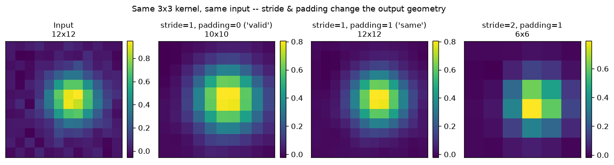

# Day 34 — Kernels, Stride, and Padding

> **Phase 4 · Concept 33 of 112 (2nd concept of Phase 4)** | Date: 2026-07-06

---

## 🧠 CONCEPT OF THE DAY

### Mental model

Yesterday you fixed the *what* (a small learnable template, slid across the input, computing a dot product at every stop). Today is the *how far* and *what happens at the edges*. Three knobs, three questions:

- **Kernel size ($k$)** — how big is the window the template looks through at each stop?
- **Stride ($s$)** — how many pixels does the window jump between stops? Stride 1 checks every position; stride 2 skips every other one, halving the output resolution as a side effect.
- **Padding ($p$)** — what do you glue around the border before you start sliding, so the kernel doesn't run off the edge (or so it does, deliberately, to control the output size)?

Think of it like reading a sentence through a moving magnifying glass. Kernel size is how many words are visible at once. Stride is how many words you jump per look — 1 word (read everything, overlapping) versus 3 words (skim, no overlap). Padding is whether you tape blank paper to the start and end of the sentence so the glass can center itself even on the very first word, instead of being forced to start already 2 words in.

### The math

For an input of size $n$, kernel size $k$, stride $s$, and padding $p$ (added to *each* side), the output size along that dimension is:

$$n_{out} = \left\lfloor \frac{n + 2p - k}{s} \right\rfloor + 1$$

Three named regimes fall out of this one formula, and you should be able to derive each on the spot:

- **"Valid" padding** ($p=0$): the kernel never touches padding — it only slides over real input, so the output *shrinks* by $k-1$ each layer. Stack enough valid-padded layers and you eventually run out of pixels.
- **"Same" padding** ($p = \frac{k-1}{2}$, odd $k$, $s=1$): output size equals input size. This is the default in almost every modern CNN block — you want depth without your feature maps evaporating.
- **Strided** ($s>1$): a deliberate resolution cut. With $s=2$, $k$ odd, and $p=\frac{k-1}{2}$, the output is roughly half the input size — the same effect as a pooling layer, except every value is a *learned* weighted combination instead of a fixed max or average.

The graph below runs the identical 3×3 kernel over the identical input under all three regimes — same operation, three very different output geometries, exactly as the formula predicts (10×10, 12×12, 6×6 from a 12×12 input):



### Why it matters / where it leads

- **This formula is load-bearing for the rest of Phase 4.** Receptive field (Concept 36) is just this formula applied recursively across layers to answer "how much of the original input can one output pixel 'see'?" Transposed convolution (Concept 43) is this formula run in reverse to *upsample* instead of downsample — and getting stride/kernel mismatched there is the single most common cause of the checkerboard artifacts you'll be trained to spot as a forensics researcher.
- **Strided convolution vs. pooling is a real architectural choice, not a historical footnote.** Early CNNs (LeNet, AlexNet) downsampled with max-pooling: cheap, parameter-free, translation-robust to small shifts. Modern architectures — especially GAN and diffusion-model discriminators/encoders — increasingly replace pooling with strided convolutions, because a strided conv *learns* what information to keep when it downsamples instead of hard-coding "keep the max." The cost: more parameters, and a new failure mode when kernel size isn't a clean multiple of stride (uneven overlap → periodic artifacts, visible as spurious peaks in the image's Fourier spectrum).
- **A real interview question**, and one where "I forgot the formula" is an immediate red flag for a CV role: they'll ask you to compute output shapes through 3–4 stacked conv layers with different stride/padding by hand, then ask *why* it matters that you can.

**Interview question:** You're auditing a GAN generator and notice every image it produces has a faint but consistent grid-like pattern when you look at the magnitude spectrum (2D FFT) of the output — a set of regularly spaced peaks that has nothing to do with image content. Nobody touched the loss function. Which architectural detail in the generator's upsampling path would you inspect first, and why would that specific detail produce a *periodic* artifact rather than random noise? *(Answer at bottom.)*

---

## 🐍 PYTHONIC EDGE

**Padding an image before convolving — the naive hand-rolled buffer vs. `F.pad`'s explicit boundary modes**

```python
import numpy as np
import torch
import torch.nn as nn
import torch.nn.functional as F

x = torch.randn(1, 1, 7, 7)                     # NCHW; torch.randn allocates directly, no malloc/new step

# ── Bad way: hand-roll a zero-padded buffer and hope the arithmetic is right ──
def pad_manual(x, k=3):
    p = (k - 1) // 2                            # only valid for ODD k and stride=1 — silently wrong otherwise
    out = torch.zeros(1, 1, x.shape[2] + 2 * p, x.shape[3] + 2 * p)  # a second buffer, allocated by hand
    out[:, :, p:-p, p:-p] = x                   # negative index -p means "p from the end" — no C++ equivalent
    return out                                   # always zero-padding — no way to ask for anything else

# ── Clean way: let F.pad express the boundary condition you actually want ────
def pad_clean(x, k=3, mode="reflect"):
    p = (k - 1) // 2
    # tuple (left, right, top, bottom) — order is last-dim-first, easy to get backwards, always double-check
    return F.pad(x, (p, p, p, p), mode=mode)     # mode="reflect"/"replicate"/"circular"/"constant" as a string flag

conv = nn.Conv2d(1, 1, kernel_size=3, padding=0, bias=False)  # conv is a callable OBJECT, not a bare function
out_zero = conv(pad_manual(x))                   # conv(...) invokes __call__, which wraps forward() with
out_reflect = conv(pad_clean(x, mode="reflect")) # PyTorch's hooks (autograd, etc.) — never call conv.forward() directly

print(out_zero.shape, out_reflect.shape)          # torch.Size([1, 1, 7, 7]) for both — same shape, different edge values
```

**Key takeaway:** `pad_manual` only ever knows how to do one thing — pad with zeros — and its correctness depends on you re-deriving `(k-1)//2` correctly every time you change kernel size or stride. `F.pad`'s `mode` argument makes the boundary *assumption* an explicit, swappable parameter: `"constant"` (zero) introduces a hard discontinuity at the border, while `"reflect"` and `"replicate"` keep the signal locally continuous there. That distinction isn't cosmetic — it's exactly today's Signal Lab.

---

## 📡 SIGNAL LAB

**Zero-padding invents an edge that was never in the data — and a convolution kernel can't tell the difference**

Here's the precise mechanism, not just the vibe: an edge-sensitive kernel (like a derivative filter) responds to *any* sharp jump in value, real or fabricated. Zero-padding forces a sharp jump from your actual boundary pixel down to exactly 0 — the kernel fires on that jump exactly as if it were a real edge in the scene. Reflect-padding instead mirrors the signal back on itself, so a smooth signal stays locally smooth across the boundary, and an edge kernel correctly reports "no edge here."

**Quick experiment (run it):**

```python
import numpy as np

np.random.seed(42)
n = 64
t = np.arange(n)
x = 0.5 + 0.3 * np.sin(2 * np.pi * t / 80) + 0.05 * np.random.randn(n)  # smooth, slowly varying, nonzero at edges

k = np.array([-1, 0, 1], dtype=float)   # a simple derivative / edge-detecting kernel

def conv_same(sig, kernel, mode):
    padded = np.pad(sig, 1, mode=mode) if mode != "constant" else np.pad(sig, 1, mode="constant", constant_values=0.0)
    return np.array([np.sum(padded[i:i + 3] * kernel) for i in range(len(sig))])

out_zero = conv_same(x, k, "constant")      # zero-padding: forces a jump to 0 at the border
out_reflect = conv_same(x, k, "reflect")    # reflect-padding: keeps the signal locally continuous

print(f"left-border edge response — zero-pad: {abs(out_zero[0]):.3f}   reflect-pad: {abs(out_reflect[0]):.3f}")
print(f"interior response (i=32), identical either way: {out_zero[32]:.3f} vs {out_reflect[32]:.3f}")

# A spurious, spatially-LOCALIZED artifact is spread across MANY frequencies (localization in space <=> spread in
# frequency) — so it should also show up as extra high-frequency energy in the edge-detected output's spectrum:
hi = slice(len(x) // 4, len(x) // 2 + 1)
Xz, Xr = np.abs(np.fft.rfft(out_zero)), np.abs(np.fft.rfft(out_reflect))
print(f"high-frequency energy of the output — zero-pad: {Xz[hi].sum():.2f}   reflect-pad: {Xr[hi].sum():.2f}")
```

**So what:** the interior response is identical under both padding modes — boundary handling only ever changes the border pixels, by construction. But at the border, zero-padding produces a large spurious "edge" out of thin air, while reflect-padding correctly reports near-zero (there's no real edge in a smooth signal near its boundary). That one localized spatial artifact isn't confined to one frequency — it smears extra energy across the high end of the spectrum, which the last line's numbers confirm. Stack dozens of zero-padded conv layers, as every standard CNN does, and this border contamination compounds inward with depth. This is precisely why `padding_mode="reflect"` exists on `nn.Conv2d`, why generative and super-resolution pipelines (your research lane) are often fussy about border handling specifically, and why a synthetic border artifact is one of the first things a forensics pipeline should rule out before calling a spectral anomaly genuine "generated content" fingerprinting.

---

## 🏋️ THE GAUNTLET

### Problem: Sliding Window Maximum

Given an integer array `nums` of length $n$ and a window size $k$, return an array of length $n-k+1$ where the $i$-th element is the maximum value in `nums[i .. i+k-1]` — i.e., simulate a stride-1, kernel-size-$k$ "max-pool" sliding across the array, and report the max at every stop.

**Constraints:**
- $1 \le k \le n \le 10^5$
- $-10^4 \le \text{nums}[i] \le 10^4$
- Target: **O(n)** total time (a brute-force O(nk) rescan of every window will not pass at this size).

**Hint 1 (mild):** Recomputing the max of the whole window from scratch every time you slide by one is what makes brute force O(nk). What information from the *previous* window could you reuse instead of throwing it away?

**Hint 2 (medium):** You don't need to track every value in the window — only the values that could *still become* the max later. If some element in the window is smaller than a later element that's still in play, can it ever be the answer again? What does that let you discard immediately?

**Hint 3 (spicy):** Maintain a deque of *indices*, kept in decreasing order of their values. Before adding a new index, pop from the back while the back's value is smaller than the new value (they're now irrelevant forever). Before reading the max, pop from the front while its index has slid out of the current window.

**Pattern:** Monotonic deque · **Target complexity:** O(n) time, O(k) space — each index is pushed and popped at most once.

*Why this belongs in a stride/kernel lesson:* this is, almost verbatim, what a stride-1 max-pooling layer computes over a 1D signal — you're about to formalize pooling itself in Concept 35, and the deque trick is the reason you can compute a full sliding max-pool pass in one linear scan instead of one scan per window.

---

## 🏗️ BLUEPRINT

No blueprint today.

---

## 🗺️ MARCHING ORDERS

Get the output-size formula into muscle memory today — you'll be applying it, recursively, for the rest of this phase. Once "valid vs. same vs. strided" stops requiring conscious derivation, receptive field and pooling will feel like the same idea wearing a different hat.

Tomorrow: Concept 34 — **Feature maps & channels**

---
---

## 🔓 GAUNTLET SOLUTION

```cpp
#include <bits/stdc++.h>
using namespace std;

vector<int> maxSlidingWindow(vector<int>& nums, int k) {
    deque<int> dq;              // stores INDICES, values strictly decreasing front-to-back
    vector<int> result;
    result.reserve(nums.size() - k + 1);

    for (int i = 0; i < (int)nums.size(); i++) {
        // Drop indices that have slid out of the current window [i-k+1, i]
        while (!dq.empty() && dq.front() <= i - k)
            dq.pop_front();

        // Any index whose value is <= nums[i] can never be the max again —
        // nums[i] is both later AND at least as large, so it outlives them all.
        while (!dq.empty() && nums[dq.back()] <= nums[i])
            dq.pop_back();

        dq.push_back(i);

        // First full window forms once i >= k-1; front of deque is always the current max index.
        if (i >= k - 1)
            result.push_back(nums[dq.front()]);
    }
    return result;
}

int main() {
    ios::sync_with_stdio(false);
    cin.tie(nullptr);

    int n, k;
    cin >> n >> k;
    vector<int> nums(n);
    for (int i = 0; i < n; i++) cin >> nums[i];

    vector<int> ans = maxSlidingWindow(nums, k);
    for (int v : ans) cout << v << " ";
    cout << "\n";
    return 0;
}
```

**Walkthrough:** The deque holds candidate indices in strictly decreasing order of value. Two invariants keep it correct: (1) anything that fell out of the window's left edge is popped from the front before you ever read the max, and (2) anything smaller than the value you're about to insert is popped from the back, because it's now provably dead — a bigger, more recent value will out-survive it for the rest of the array. Every index enters the deque exactly once and leaves at most once, which is what makes the whole pass O(n) despite the nested-looking `while` loops — that's the standard amortized-analysis argument for monotonic-deque problems, worth being able to state out loud in an interview.

---

## 💡 CONCEPT ANSWER

**Why does a mismatched stride/kernel in the upsampling path produce a *periodic* spectral artifact?**

When an upsampling operation's kernel size isn't an integer multiple of its stride, different output pixels get contributions from a different *number* of overlapping kernel placements — some output positions are covered by 2 windows, others by 1, in a pattern that repeats every `stride` pixels. That uneven-coverage pattern is itself a periodic signal stamped onto the whole output, spatially — and a spatially periodic pattern is exactly what shows up as sharp, regularly-spaced peaks in the 2D Fourier magnitude spectrum, rather than smeared/broadband noise (which is what you'd expect from random or content-driven variation). The fix at the architecture level: choose kernel size to be divisible by stride (e.g. kernel=4, stride=2) so every output pixel gets equal coverage, or sidestep the mismatch entirely by using resize-then-convolution instead of a transposed/fractionally-strided convolution for upsampling. This exact failure mode — checkerboard artifacts from stride/kernel mismatch — is one of the more well-documented, reliable forensic tells for GAN-generated imagery, and you'll see it formalized when Concept 43 (transposed convolution) covers the upsampling side of this same output-size formula.
