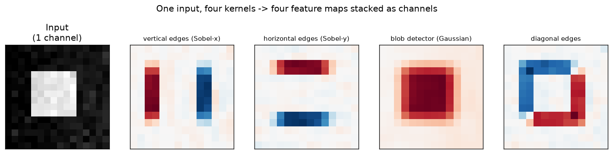

# Day 35 — Feature Maps & Channels

> **Phase 4 · Concept 34 of 112 (3rd concept of Phase 4)** | Date: 2026-07-09

---

## 🧠 CONCEPT OF THE DAY

### Mental model

You now know a single kernel slides across an input and produces one 2D grid of responses. But real conv layers never use *one* kernel — they use dozens or hundreds, each looking for something different, all sliding over the *same* input at the same time. Each kernel's output is one **feature map** (also called an "activation map"). Stack all of them along a new axis and you get a **channel** dimension.

Think of it like a panel of specialists examining the same document simultaneously: one only flags vertical strokes, another only horizontal ones, another only round blobs, another only diagonal edges. Each specialist writes their findings onto their own transparent sheet, same size as the page. Stack the transparent sheets and you get a multi-layered annotated document — that stack *is* the multi-channel output of a conv layer. Layer 2's kernels don't look at the raw pixels anymore; they look at the whole stack of layer 1's sheets at once, so they can express things no single sheet could ("vertical edge sheet AND blob sheet both active here" → *corner*).

The graph below runs four different 3×3 kernels over one grayscale input and shows the four resulting feature maps — same spatial layout, four completely different responses, exactly the "one input, many channels" idea:



### The math

For an input with $C_{in}$ channels and a conv layer with $C_{out}$ output channels, kernel size $k \times k$: each output channel $c$ has its **own** kernel of shape $(C_{in}, k, k)$ — one $k\times k$ filter *per input channel*, summed together, plus one bias:

$$y_c[i,j] = b_c + \sum_{c'=1}^{C_{in}} \big(W_{c,c'} * x_{c'}\big)[i,j]$$

where $*$ is the 2D convolution/cross-correlation from Concepts 32–33, and $x_{c'}$ is input channel $c'$. Do this for every $c = 1 \dots C_{out}$ and stack the results — that stack is the layer's output tensor, shape $(C_{out}, H_{out}, W_{out})$.

**Parameter count** for the whole layer:

$$\#\text{params} = C_{out} \times C_{in} \times k \times k + C_{out}$$

Notice this is *independent of spatial size* $H, W$ — a conv layer applied to a 32×32 image has exactly as many parameters as the same layer applied to a 256×256 image. That's the entire reason CNNs scale to large images where a fully-connected layer would explode in parameter count.

### Why it matters / where it leads

- **The channel–spatial tradeoff is the shape of every CNN you'll ever read a diagram of.** Early layers: few channels (3 for RGB), large spatial size, kernels tuned to low-level statistics (edges, color contrasts, oriented gradients — literally a learned Gabor-like filter bank). Deep layers: hundreds/thousands of channels, tiny spatial size, each channel responding to increasingly abstract, semantic patterns. Concept 35 (pooling) is *how* you shrink the spatial side to afford growing the channel side without exploding compute.
- **Channels are also where all the *cheap* architectural creativity happens.** Concept 37 (1×1 convolutions) is a kernel that only ever mixes channels — zero spatial extent, pure channel-to-channel linear recombination — and it's the single cheapest way to control $C_{out}$ independent of everything else, which is exactly what "bottleneck" blocks (ResNet, Inception) exploit to keep FLOPs down while going deep.
- **A real interview question:** "A `Conv2d` layer has `in_channels=64, out_channels=128, kernel_size=3`. How many learnable parameters does it have, and how does that number change if you first squeeze it through a `1x1` conv down to 16 channels before the `3x3`?" (They're testing whether you actually understand that params scale with $C_{in} \times C_{out}$, not spatial size — and whether you know *why* bottleneck blocks exist.)

**Interview question:** Two conv layers, same input, same output spatial size, same $C_{out}$. Layer A: one `Conv2d(64, 128, kernel_size=3)`. Layer B: `Conv2d(64, 16, kernel_size=1)` followed by `Conv2d(16, 128, kernel_size=3)`. Which has fewer parameters, and by roughly what factor — and what's the one thing Layer B gives up in exchange for that savings? *(Answer at bottom.)*

---

## 🐍 PYTHONIC EDGE

**Visualizing one channel out of a feature-map tensor — manual pixel copying vs. `permute`**

```python
import torch

fmap = torch.randn(1, 8, 16, 16)          # NCHW: batch=1, 8 channels, 16x16 spatial

# ── Bad way: hand-copy each pixel from CHW into an HWC numpy array for imshow ──
def to_image_bad(t, channel_group=(0, 1, 2)):
    c0, c1, c2 = channel_group
    h, w = t.shape[2], t.shape[3]
    out = [[[0.0, 0.0, 0.0] for _ in range(w)] for _ in range(h)]  # nested Python lists — slow, verbose
    for i in range(h):
        for j in range(w):
            out[i][j][0] = t[0, c0, i, j].item()   # .item() pulls a single Python scalar out of a 0-d tensor
            out[i][j][1] = t[0, c1, i, j].item()
            out[i][j][2] = t[0, c2, i, j].item()
    return out                               # plain list of lists, not even an array matplotlib prefers

# ── Clean way: index the channels you want, then permute dims — no data copied element-by-element ──
def to_image_clean(t, channel_group=(0, 1, 2)):
    c0, c1, c2 = channel_group               # tuple unpacking — no C++ equivalent without std::tie
    rgb = t[0, list(channel_group)]          # fancy indexing: picks 3 of 8 channels -> shape (3, H, W)
    return rgb.permute(1, 2, 0).detach().numpy()   # CHW -> HWC; .permute() reorders axes (view, no copy)
    # .detach() strips the autograd graph first — imshow/numpy() would error on a tensor that requires_grad

img = to_image_clean(fmap)                   # img.shape == (16, 16, 3), ready for plt.imshow(img)
```

**Key takeaway:** `to_image_bad` reimplements, one Python-level float at a time, something the tensor library already does in compiled code: a dimension reorder. `.permute(1, 2, 0)` is a *view* — it changes how strides are interpreted, not the underlying memory — so it's essentially free, while the nested-loop version is $O(HW)$ Python-interpreter overhead for a reshape that should cost nothing. The lesson generalizes: any time you're writing a manual loop to move data between axes, ask whether `permute`/`transpose`/`view` already expresses it.

---

## 📡 SIGNAL LAB

**A conv layer's kernels are a learned filter bank — and the graph above already proved it**

Every one of the four "specialist" kernels in today's graph is, in signal-processing terms, a small FIR filter with a specific frequency/orientation response: the Sobel-x and Sobel-y kernels are discrete derivative approximators (high-pass, orientation-selective), the Gaussian-like kernel is a low-pass smoother, and the diagonal kernel sits somewhere in between, oriented at 45°. A multi-channel conv layer is nothing more than running the *same input* through a small **bank** of such filters in parallel and keeping every output — exactly what a filter bank / subband decomposition does in classical DSP (think Gabor filter banks, or the analysis stage of a wavelet transform), except here the filter coefficients are learned by gradient descent instead of hand-designed.

**Quick experiment (run it):**

```python
import numpy as np

np.random.seed(42)

sobel_x = np.array([[-1, 0, 1], [-2, 0, 2], [-1, 0, 1]], dtype=float)
gaussian = np.array([[1, 2, 1], [2, 4, 2], [1, 2, 1]], dtype=float) / 16.0

def freq_response(kernel, size=32):
    # Zero-pad the small kernel out to `size x size`, then take its 2D FFT.
    padded = np.zeros((size, size))
    kh, kw = kernel.shape
    padded[:kh, :kw] = kernel                      # kernel occupies the top-left corner
    H = np.fft.fftshift(np.fft.fft2(padded))       # fftshift moves DC (zero frequency) to the center
    return np.abs(H)

Hx = freq_response(sobel_x)
Hg = freq_response(gaussian)

center = 16
print(f"Sobel-x  |H| at DC (center):        {Hx[center, center]:.3f}")
print(f"Sobel-x  |H| at high freq (corner):  {Hx[2, 2]:.3f}")
print(f"Gaussian |H| at DC (center):         {Hg[center, center]:.3f}")
print(f"Gaussian |H| at high freq (corner):  {Hg[2, 2]:.3f}")
```

**So what:** Sobel-x has near-zero response at DC (a flat, constant image produces no edge response — correct, there's no edge in a flat region) and strong response at higher frequencies (it *is* an edge/high-pass detector, by construction). The Gaussian kernel does the opposite: strong at DC, decaying at high frequency — a smoother. This is the precise, quantitative version of "each channel specializes": in the frequency domain, a bank of conv kernels literally tiles different regions of frequency-orientation space, the same way a Gabor filter bank or a wavelet analysis bank does. For your research lane specifically: this is *why* the channel dimension of an intermediate CNN feature map is a natural place to look for spectral artifacts left by generative models — a channel tuned to a frequency band a real-image encoder rarely activates, but which lights up reliably on GAN/diffusion output, is a textbook forensic feature.

---

## 🏋️ THE GAUNTLET

### Problem: Range Sum Query 2D — Immutable

Given a 2D matrix `matrix` of size $m \times n$, implement a data structure that answers many queries of the form: "what is the sum of all elements inside the rectangle with upper-left corner `(row1, col1)` and lower-right corner `(row2, col2)`?" You must support many queries efficiently after one preprocessing pass.

**Constraints:**
- $1 \le m, n \le 200$
- Up to $10^4$ calls to the sum-region query.
- Target: **O(mn) preprocessing, O(1) per query.**

**Hint 1 (mild):** If you recompute the rectangle sum from scratch on every query by iterating over every cell inside it, worst case is $O(mn)$ *per query* — with $10^4$ queries that's far too slow. What could you precompute once, before any queries arrive, so each query becomes a handful of array lookups?

**Hint 2 (medium):** Think 1D first: if you had a running cumulative sum array `S` where `S[i]` = sum of everything up to index `i`, a range sum `[l, r]` becomes `S[r] - S[l-1]` — one subtraction, no rescanning. What's the 2D generalization of "cumulative sum up to this point"?

**Hint 3 (spicy):** Build an integral image `P` where `P[i][j]` = sum of the entire rectangle from `(0,0)` to `(i-1, j-1)`. Any rectangle sum is then four lookups combined with inclusion–exclusion: `P[r2+1][c2+1] - P[r1][c2+1] - P[r2+1][c1] + P[r1][c1]` (the last term added back because it was subtracted twice).

**Pattern:** 2D prefix sum / integral image · **Target complexity:** O(mn) preprocessing, O(1) per query.

*Why this belongs in a channels/feature-maps lesson:* the integral image trick is exactly how classical CV (Viola–Jones face detection, and any box-filter-based feature) computes fast rectangular sums over an image — and it generalizes directly to computing per-region statistics over a *feature map* (e.g. fast approximate average-pooling over arbitrary windows) without rescanning pixels for every query.

---

## 🏗️ BLUEPRINT

**NCHW vs. NHWC — the channel-layout tradeoff hiding underneath every conv call**

PyTorch's default tensor layout is `NCHW` (batch, channel, height, width) — channels are the *second* axis. TensorFlow/Keras historically defaults to `NHWC` — channels *last*. This isn't cosmetic: on CPU and many accelerators, `NHWC` keeps all channels for one pixel contiguous in memory, which is exactly the access pattern SIMD/vectorized instructions and cuDNN's Tensor Core kernels favor for certain convolution algorithms — `torch.channels_last` memory format can give a free 10–30% speedup on the same `NCHW`-shaped tensor purely by changing the *stride order* in memory, no math changes. **Key tradeoff:** `channels_last` is a strict win on modern GPUs with mixed-precision + Tensor Cores, but not every op supports it cleanly yet (some custom/fused ops silently fall back to `NCHW`, quietly forfeiting the speedup) — always benchmark before assuming the flag helped.

---

## 🗺️ MARCHING ORDERS

Look at any CNN architecture diagram today and consciously name both numbers at every stage — channel count going up, spatial size going down — instead of skimming past the little "64→128→256" annotations. That habit is what makes receptive field and pooling click immediately tomorrow.

Tomorrow: Concept 35 — **Pooling & downsampling**

---
---

## 🔓 GAUNTLET SOLUTION

```cpp
#include <bits/stdc++.h>
using namespace std;

class NumMatrix {
    vector<vector<int>> prefix;  // prefix[i][j] = sum of rectangle (0,0) to (i-1, j-1)

public:
    NumMatrix(vector<vector<int>>& matrix) {
        int m = matrix.size(), n = m ? matrix[0].size() : 0;
        prefix.assign(m + 1, vector<int>(n + 1, 0));

        for (int i = 0; i < m; i++) {
            for (int j = 0; j < n; j++) {
                // inclusion-exclusion: add current cell, add left prefix, add top prefix,
                // subtract top-left (counted in both left and top prefixes)
                prefix[i + 1][j + 1] = matrix[i][j]
                                     + prefix[i][j + 1]
                                     + prefix[i + 1][j]
                                     - prefix[i][j];
            }
        }
    }

    int sumRegion(int row1, int col1, int row2, int col2) {
        // shift to 1-indexed prefix coordinates, then inclusion-exclusion again
        return prefix[row2 + 1][col2 + 1]
             - prefix[row1][col2 + 1]
             - prefix[row2 + 1][col1]
             + prefix[row1][col1];
    }
};

int main() {
    ios::sync_with_stdio(false);
    cin.tie(nullptr);

    int m, n;
    cin >> m >> n;
    vector<vector<int>> matrix(m, vector<int>(n));
    for (int i = 0; i < m; i++)
        for (int j = 0; j < n; j++)
            cin >> matrix[i][j];

    NumMatrix nm(matrix);

    int q;
    cin >> q;
    while (q--) {
        int r1, c1, r2, c2;
        cin >> r1 >> c1 >> r2 >> c2;
        cout << nm.sumRegion(r1, c1, r2, c2) << "\n";
    }
    return 0;
}
```

**Walkthrough:** `prefix[i][j]` stores the sum of everything strictly above-and-left of `(i,j)` in 1-indexed prefix coordinates, built in one $O(mn)$ pass using the same inclusion–exclusion identity twice: once to *build* the table (each cell = itself + left + top − top-left, correcting for the double-counted overlap), and once to *query* it (any rectangle = big corner − left strip − top strip + doubly-subtracted corner, added back). Both steps are $O(1)$ per cell/query, which is what makes the whole structure $O(mn)$ build + $O(1)$ per query — the standard "integral image" trick, and worth being able to derive the inclusion–exclusion diagram from scratch on a whiteboard.

---

## 💡 CONCEPT ANSWER

**Layer A (`Conv2d(64, 128, k=3)`) vs. Layer B (`Conv2d(64,16,k=1)` then `Conv2d(16,128,k=3)`) — which has fewer parameters?**

Layer A: $128 \times 64 \times 3 \times 3 = 73{,}728$ parameters (ignoring biases). Layer B: the $1\times1$ squeeze costs $16 \times 64 \times 1 \times 1 = 1{,}024$, and the $3\times3$ expand costs $128 \times 16 \times 3 \times 3 = 18{,}432$ — total $19{,}456$. That's roughly a **3.8× reduction** in parameters (and a proportional reduction in FLOPs for the $3\times3$ stage, since it now only sees 16 input channels instead of 64), because parameter count scales with $C_{in} \times C_{out}$ and squeezing $C_{in}$ down to 16 before the expensive $3\times3$ shrinks that product dramatically. **What Layer B gives up:** representational capacity in that bottleneck — squeezing 64 channels down to 16 forces the network to compress whatever information those 64 channels carried into a 16-dimensional linear projection *before* the spatial $3\times3$ kernel ever sees it, which can discard information that a full-width $3\times3$ over all 64 channels wouldn't have to. This is exactly the tradeoff ResNet and Inception bottleneck blocks are making on purpose — betting that most of the 64-channel information is redundant enough that a 16-channel bottleneck loses little, in exchange for a much smaller, faster, more regularized layer.
