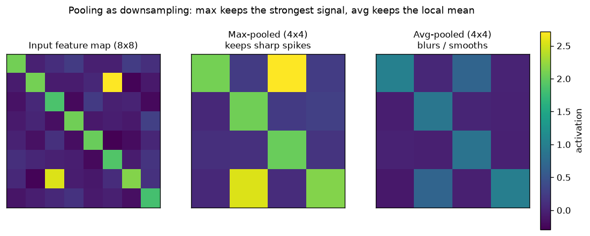

# Day 36 — Pooling & Downsampling

> **Phase 4 · Concept 35 of 112 (4th concept of Phase 4)** | Date: 2026-07-10

---

## 🧠 CONCEPT OF THE DAY

### Mental model

A conv layer's feature maps tell you *where* a pattern fired, at pixel-level precision. Usually you don't need that much precision — you want to know "is there a vertical edge somewhere in this neighborhood," not "is there a vertical edge at exactly pixel (17, 42)." **Pooling** throws away exact position and keeps only a local summary, sliding a small window across each feature map and collapsing it to one number.

Two summaries dominate:
- **Max pooling** — keep the strongest activation in the window. "Did this feature fire *at all* nearby?"
- **Average pooling** — keep the mean activation. "What's the general activity level nearby?"

The graph below runs both over the same 8×8 synthetic feature map (a diagonal edge ridge plus two sparse spikes): max-pooling preserves the spikes crisply, average-pooling smears them into the background — exactly the tradeoff you'd expect from "keep the loudest voice" vs. "average the room."



### The math

For a pooling window of size $k \times k$ with stride $s$ over input feature map $X$:

$$Y_{i,j} = \max_{0 \le a,b < k} X_{s \cdot i + a,\; s \cdot j + b} \quad \text{(max pooling)}$$

$$Y_{i,j} = \frac{1}{k^2}\sum_{0 \le a,b < k} X_{s \cdot i + a,\; s \cdot j + b} \quad \text{(average pooling)}$$

where $Y$ is the pooled output, $i, j$ index output positions, and $a, b$ index offsets inside each window. Pooling has **zero learnable parameters** — it's a fixed reduction, not a layer with weights. Output spatial size follows the same formula as conv:

$$H_{out} = \left\lfloor \frac{H_{in} - k}{s} \right\rfloor + 1$$

Global pooling is the limit case: $k$ = the entire spatial extent, collapsing an $H \times W$ feature map to a single scalar per channel — this is exactly how modern CNNs (ResNet onward) replace the old "flatten + giant FC layer" classifier head with `AdaptiveAvgPool2d(1) → Linear`.

Pooling buys two things cheaply: (1) **translation invariance** — shift the input by a pixel or two and the pooled output barely changes, because the max/mean over a window absorbs small shifts; (2) **downsampling** — spatial resolution shrinks, so deeper layers process fewer positions, cutting compute and letting each subsequent kernel "see" a physically larger region of the original image for the same kernel size.

### Why it matters / where it leads

That last point — "each subsequent kernel sees more of the original image" — is tomorrow's concept exactly: **receptive field**. Pooling (and strided conv) is one of the two main levers architects pull to grow receptive field fast without stacking dozens of layers.

**Real interview question:** "Modern architectures like ResNet mostly replaced max-pooling with strided convolutions for downsampling. Why might that be a better design, and what do you lose?"

---

## 🐍 PYTHONIC EDGE

Pooling is one place where reaching for the manual/explicit version is tempting — and almost always wrong, both for speed and for a subtler correctness trap: hardcoded spatial dims break the moment your input size changes.

```python
import torch
import torch.nn.functional as F

x = torch.randn(1, 16, 33, 33)  # N, C, H, W — an odd, awkward spatial size

# --- BAD: manual nested-loop pooling ---
def max_pool_naive(x, k=2, s=2):
    N, C, H, W = x.shape          # tuple unpacking — Python destructures in one line;
                                    # C++ needs 4 separate assignments or std::tie
    H_out, W_out = (H - k) // s + 1, (W - k) // s + 1
    out = torch.zeros(N, C, H_out, W_out)  # None vs nullptr: torch has no null tensor,
                                             # you always get a real (possibly empty) tensor
    for n in range(N):             # range() returns a lazy iterator object, not a list —
        for c in range(C):          # C++'s equivalent loop just walks an int, no object involved
            for i in range(H_out):
                for j in range(W_out):
                    window = x[n, c, i*s:i*s+k, j*s:j*s+k]  # slice notation [a:b] — no
                                                              # direct C++ equivalent, this is
                                                              # a *view*, not a copy
                    out[n, c, i, j] = window.max()  # Python interpreter overhead per element:
                                                      # this is O(H*W) *Python-level* iterations
    return out

# --- GOOD: vectorized, C++/CUDA kernel does the looping ---
pooled = F.max_pool2d(x, kernel_size=2, stride=2)  # @ is matmul elsewhere, not used here,
                                                      # but note: no Python-level loop at all

# --- The real trick: adaptive pooling kills the "hardcoded spatial dims" bug ---
# Classic bug: a CNN trained assuming 224x224 input crashes (shape mismatch in the
# first Linear layer) the moment someone feeds a 300x300 image.
head = torch.nn.AdaptiveAvgPool2d(output_size=1)  # keyword-only-style clarity, though
                                                     # output_size is positional-or-keyword here
squeezed = head(pooled).flatten(1)  # .flatten(1) is an in-place-*named* but NOT in-place
                                      # method (no trailing underscore) — returns a new view;
                                      # compare to .mul_() which WOULD mutate in place
```

`AdaptiveAvgPool2d` doesn't take a kernel size at all — you give it the *output* size you want, and it computes stride/kernel internally to hit it exactly, for any input resolution. This is why every modern `torchvision` classifier can accept variable-sized images right up until the final pooling step: `AdaptiveAvgPool2d(1)` always squeezes to $1\times1$ regardless of what came in.

---

## 📡 SIGNAL LAB

Pooling *is* downsampling, and downsampling without anti-aliasing is a classic DSP sin — this is precisely the finding behind Zhang (2019), *"Making Convolutional Networks Shift-Invariant Again."*

**Setup:** Take a 1D signal sampled at 100 Hz containing two sinusoids: $f_1 = 8\text{ Hz}$ and $f_2 = 38\text{ Hz}$. Downsample by a factor of 4 (analogous to a stride-2 pool applied twice), two ways:

1. **Naive strided decimation** (literally `x[::4]`, what a stride-4 max/avg pool effectively does spatially): new sample rate is 25 Hz, so the new Nyquist frequency is 12.5 Hz. The 38 Hz component is *way* above that — it doesn't disappear, it **aliases**, folding back to an apparent frequency of $|38 - 25| = 13$ Hz... which is still above the new Nyquist, so it folds again: reflect around 12.5 Hz → $25 - 13 = 12$ Hz. A phantom 12 Hz signal appears in your downsampled data that was never there.
2. **Low-pass filter first, then decimate** (a lowpass/blur kernel before the stride, exactly BlurPool's fix): the 38 Hz content is attenuated below Nyquist *before* subsampling, so it can't fold back — the decimated signal cleanly represents only the 8 Hz component.

**So what:** Average pooling is *already* a crude low-pass filter (a box filter) before it subsamples, which is why avg-pool is mildly more shift-stable than max-pool in practice. **Max pooling has no low-pass component at all** — it's a highly nonlinear, non-bandlimited operation, so small input shifts can flip which pixel "wins" the max inside a window, causing the network's output to jitter for imperceptible input shifts. That's the exact mechanism behind adversarial-robustness and shift-equivariance failures in vanilla CNNs, and it's why anti-aliased pooling (blur, then stride) has become standard in shift-robust and generative-forensics-adjacent architectures — a detector trained to spot resampling artifacts needs its *own* backbone to not be silently introducing new ones.

---

## 🏋️ THE GAUNTLET

**Sliding Window Maximum**

Given an integer array `nums` of size `n` and a sliding window of size `k` moving from the very left to the very right of the array, return the max value in each window as it slides. This is *literally* 1D max-pooling with stride 1.

**Constraints:** $1 \le k \le n \le 10^5$, $-10^4 \le \text{nums}[i] \le 10^4$.

**Hints (escalating):**
1. The brute-force scan-every-window-for-its-max is $O(n \cdot k)$ — fine for tiny inputs, too slow at $n = 10^5$. What information from the *previous* window could you reuse instead of recomputing the max from scratch every time?
2. You don't need to know every element's relative order inside the window — you only ever care about elements that *could still become* the max as the window keeps sliding right. Any element that's smaller than something newer and still inside the window can never win again. Can you discard those permanently?
3. Maintain a **deque of indices** (not values) into `nums`, kept in strictly decreasing order of their values. On each step: pop from the back while the new element is $\ge$ the value at the back index (those are now useless); push the new index; pop from the front if it's fallen outside the current window; the front of the deque is always the current window's max.

**Pattern:** monotonic deque. **Target complexity:** $O(n)$ time, $O(k)$ space — each index is pushed and popped at most once.

---

## 🏗️ BLUEPRINT

No blueprint today.

---

## 🗺️ MARCHING ORDERS

Pooling is the cheapest lever in the whole toolbox — zero parameters, and it reshapes both compute and what the network can "see." Understand it cold and half of architecture design starts making sense.

**Tomorrow: Concept 36 — Receptive field**

---

## 🔓 GAUNTLET SOLUTION

```cpp
#include <vector>
#include <deque>
using namespace std;

class Solution {
public:
    vector<int> maxSlidingWindow(vector<int>& nums, int k) {
        deque<int> dq; // stores indices, values strictly decreasing front-to-back
        vector<int> result;
        result.reserve(nums.size() - k + 1);

        for (int i = 0; i < (int)nums.size(); ++i) {
            // Evict indices that fell out of the window on the left.
            if (!dq.empty() && dq.front() <= i - k) {
                dq.pop_front();
            }
            // Evict from the back: anything smaller than nums[i] can never
            // be the max again while nums[i] is still in the window.
            while (!dq.empty() && nums[dq.back()] <= nums[i]) {
                dq.pop_back();
            }
            dq.push_back(i);

            // Once the first full window is formed, record its max.
            if (i >= k - 1) {
                result.push_back(nums[dq.front()]);
            }
        }
        return result;
    }
};
```

Each index enters and leaves the deque at most once, so total work across the whole scan is $O(n)$ despite the nested-looking `while` inside the `for`.

## 💡 CONCEPT ANSWER

Strided convolutions replace pooling's fixed, parameter-free reduction with a **learned** one — the network gets to decide *how* to downsample (what to keep vs. discard) instead of being locked into "always take the max" or "always average." This removes the sharp, non-differentiable-in-a-useful-sense kink that max-pooling's `argmax` introduces (gradients only flow to the single winning pixel, everything else in the window gets zero gradient — dead-zone sparsity), and lets the same layer do downsampling *and* feature transformation in one learnable op instead of two fixed ones stacked together. What you lose: a few more parameters and FLOPs per layer, and you give up pooling's built-in, hyperparameter-free translation robustness — a strided conv has no guarantee of shift-stability unless you engineer it in (e.g., anti-aliased/blur-pool stride, as in the Signal Lab above).
