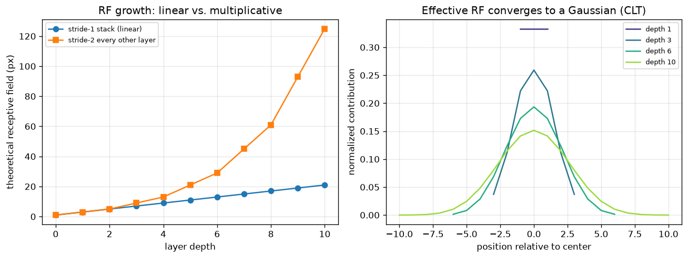

# Day 37 — Receptive Field

> **Phase 4 · Concept 36 of 112 (5th concept of Phase 4)** | Date: 2026-07-11

---

## 🧠 CONCEPT OF THE DAY

### Mental model

Every neuron in a CNN's output only "sees" a limited patch of the original input — not the whole image. The **receptive field** of a unit is that patch: the set of input pixels that can actually influence its value. A neuron in layer 1 sees only what's under its kernel. A neuron in layer 2 sees a patch built from *several* layer-1 outputs, each of which already saw its own patch — so the layer-2 neuron's effective view is the union of all those overlapping layer-1 patches, which is strictly bigger than any single kernel. Stack enough layers and a single output unit can end up "looking at" the entire input image, even though no individual kernel is larger than 3×3.

This is why depth matters for more than "more nonlinearities": it's the primary mechanism by which a CNN grows from seeing local edges to seeing global structure (faces, objects, scene layout) without ever using a giant kernel.

### The math

Track two running quantities as you walk through the layers: **RF** (receptive field size so far) and **jump** (the stride, in original-pixel units, between two adjacent positions in the current feature map). Starting at $RF_0 = 1$, $jump_0 = 1$, each layer $l$ with kernel size $k_l$ and stride $s_l$ updates:

$$RF_l = RF_{l-1} + (k_l - 1) \cdot jump_{l-1}$$

$$jump_l = jump_{l-1} \cdot s_l$$

where $RF_l$ is the receptive field (in original input pixels) of a unit after layer $l$, and $jump_l$ is how many input pixels apart two neighboring output positions are after layer $l$. Pooling layers update the same way — they're just another $(k, s)$ pair in the chain.

The left panel below plots $RF_l$ across depth for two stacks: five 3×3 convs at stride 1 everywhere (linear growth, since $jump$ never changes) versus a stack that adds a stride-2 layer every other step (multiplicative growth, since $jump$ doubles repeatedly). This is *exactly* why architects reach for stride or pooling to grow receptive field fast — stacking stride-1 layers alone gets expensive.



### Why it matters / where it leads

Receptive field is the lens through which the next several concepts make sense: tomorrow's **1×1 convolutions** deliberately do *not* grow receptive field (kernel size 1 means $(k-1)=0$, so $RF$ is unchanged) — they're a channel-mixing tool, not a spatial one, and knowing the RF formula is what makes that distinction click instantly. A few days later, **dilated/atrous convolutions** (Concept 44) will show up as a third lever for growing $jump$ without touching stride or adding real pooling layers.

**Real interview question:** "You have a stack of five 3×3, stride-1 convolutions. What's the theoretical receptive field, and why might a single 11×11 convolution with the same receptive field be a strictly worse design choice?"

---

## 🐍 PYTHONIC EDGE

The formula above is exact for simple stacks — but it silently breaks the moment your architecture has dilation, grouped convs, asymmetric padding, or a branch you forgot to account for. The robust move is to *measure* the receptive field empirically instead of deriving it by hand.

```python
import torch
import torch.nn as nn

# --- BAD: hand-track RF with the formula, layer by layer ---
# Easy to get right for a clean nn.Sequential... and easy to silently get
# wrong the moment dilation, grouping, or a skip connection enters the picture.
def receptive_field_manual(layers):
    rf, jump = 1, 1
    for k, s in layers:              # tuple unpacking in a for-loop — Python
        rf = rf + (k - 1) * jump      # destructures (k, s) automatically each iteration
        jump = jump * s
    return rf

layers = [(3, 1), (3, 1), (3, 2), (3, 1), (3, 2)]  # (kernel, stride) per conv
print(receptive_field_manual(layers))  # trust the algebra... or don't

# --- GOOD: measure it empirically with autograd ---
model = nn.Sequential(
    nn.Conv2d(1, 1, 3, stride=1, padding=1), nn.Conv2d(1, 1, 3, stride=1, padding=1),
    nn.Conv2d(1, 1, 3, stride=2, padding=1), nn.Conv2d(1, 1, 3, stride=1, padding=1),
    nn.Conv2d(1, 1, 3, stride=2, padding=1),
)
x = torch.zeros(1, 1, 64, 64, requires_grad=True)  # requires_grad=True: this leaf tensor
                                                      # now tracks a computation graph —
                                                      # no direct C++ equivalent flag
out = model(x)                        # calling model(x) invokes __call__, which wraps
                                        # forward() with hooks — never call .forward() directly
loss = out[0, 0, out.shape[2] // 2, out.shape[3] // 2]  # pick ONE center output pixel
loss.backward()                       # backprop a unit gradient from just that pixel

footprint = (x.grad[0, 0] != 0)                          # != here is elementwise, not identity
rows = footprint.any(dim=1).nonzero(as_tuple=True)[0]     # any() -> nonzero row indices
cols = footprint.any(dim=0).nonzero(as_tuple=True)[0]     # as_tuple=True: no C++ equivalent,
                                                             # returns a tuple of index tensors
rf_h = (rows.max() - rows.min() + 1).item()  # .item() pulls a Python scalar out of a
rf_w = (cols.max() - cols.min() + 1).item()  # 0-dim tensor — no implicit cast like C++
print(f"empirical RF: {rf_h} x {rf_w}")      # f-string — inline expression interpolation
```

Whichever input pixels end up with nonzero gradient *are*, by definition, the receptive field of that output pixel — no formula required, and it works for literally any architecture you can call `.backward()` on. This is the same technique the `receptivefield` research-code package and most architecture-debugging notebooks use in practice.

---

## 📡 SIGNAL LAB

**Setup:** Model each 3×3 conv layer, crudely, as convolution with a 3-tap box filter (an impulse response of `[1, 1, 1]`). Stack $L$ such layers and the effective impulse response seen by a deep output unit is that box filter convolved with itself $L$ times. Run this for $L \in \{1, 3, 6, 10\}$ and normalize each result to sum to 1 (the right panel of today's graph).

**Worked solution:** Each self-convolution is a sum of i.i.d.-ish contributions, so the **Central Limit Theorem** applies directly: convolving *any* finite-variance kernel with itself repeatedly converges to a Gaussian shape, regardless of the original kernel's shape. A box filter has variance $\sigma_1^2 = \frac{k^2-1}{12}$ per application; after $L$ applications the variance adds ($\sigma_L^2 = L\sigma_1^2$), so the effective width — the standard deviation of the resulting Gaussian — grows as $\sigma_L \propto \sqrt{L}$, not linearly with $L$.

**So what:** Compare that to the *theoretical* receptive field from the left panel, which grows **linearly** (or faster) with depth. The theoretical RF is the full support of the impulse response — everywhere it's technically nonzero. The **effective** receptive field is where the *mass* of that Gaussian actually concentrates, and it grows only as $\sqrt{\text{depth}}$. Luo et al. (2016), *"Understanding the Effective Receptive Field,"* showed this holds for real trained CNNs too: deep units are influenced far more by pixels near the center of their nominal receptive field than by pixels near the edge, which is theoretically "in range" but numerically almost silent.

For a frequency-domain researcher this is a familiar shape wearing a different hat: repeated box-filtering is a cascade of low-pass filters, and a Gaussian spatial profile corresponds to a Gaussian (still low-pass) frequency response — the effective RF's Gaussian falloff is literally the CNN's spatial-domain fingerprint of accumulated low-pass smoothing through depth. That's directly relevant to forensic work: high-frequency structure (resampling grids, GAN upsampling checkerboard artifacts) gets progressively attenuated by exactly this mechanism as you go deeper, which is part of why forensic detectors often tap **shallow** feature maps rather than relying on deep semantic layers to catch high-frequency generation artifacts.

---

## 🏋️ THE GAUNTLET

**Jump Game II**

Given a 0-indexed array of non-negative integers `nums`, you start at index 0. `nums[i]` is the maximum jump length from index `i`. Return the minimum number of jumps to reach the last index. It is guaranteed you can always reach it.

**Constraints:** $1 \le n \le 10^4$, $0 \le \text{nums}[i] \le 1000$.

**Hints (escalating):**
1. Think of the array as a wavefront expanding outward in "layers," where layer $j$ is the set of indices reachable in exactly $j$ jumps — very similar to how each network layer extends how far a unit's receptive field reaches. What's the maximum index reachable *given the current layer's boundary*?
2. You don't need DP over every index to get $O(n)$. Maintain the current layer's right boundary and, while scanning inside it, track the single farthest index reachable from *any* position in that layer.
3. Iterate `i` from `0` to `n-2`, updating `farthest = max(farthest, i + nums[i])`. When `i` reaches the current layer's boundary `curEnd`, you've finished exploring that layer: increment `jumps` and set `curEnd = farthest` — this is BFS level-order traversal without an explicit queue.

**Pattern:** greedy / implicit BFS-by-layers. **Target complexity:** $O(n)$ time, $O(1)$ space.

---

## 🏗️ BLUEPRINT

No blueprint today.

---

## 🗺️ MARCHING ORDERS

Receptive field is the geometry underneath every CNN design choice you'll see for the next dozen concepts — every time an architecture paper justifies a kernel size or a stride, this is the arithmetic behind it.

**Tomorrow: Concept 37 — 1×1 conv & bottlenecks**

---

## 🔓 GAUNTLET SOLUTION

```cpp
#include <vector>
using namespace std;

class Solution {
public:
    int jump(vector<int>& nums) {
        int n = nums.size();
        int jumps = 0, curEnd = 0, farthest = 0;

        for (int i = 0; i < n - 1; ++i) {
            farthest = max(farthest, i + nums[i]);
            if (i == curEnd) {
                ++jumps;
                curEnd = farthest;
                if (curEnd >= n - 1) break;
            }
        }
        return jumps;
    }
};
```

Every index is visited once by the outer loop, and `curEnd`/`farthest` are updated in $O(1)$ per step, so the whole scan is $O(n)$ — no revisiting, no explicit queue, just two pointers tracking the current "layer" of reachability.

## 💡 CONCEPT ANSWER

Theoretical receptive field for five stacked 3×3, stride-1 convs: $RF = 1 + 5 \times (3-1) = 11$, so $11 \times 11$ — identical to a single 11×11 conv. But the single big kernel is a strictly worse trade on every other axis: parameter/FLOP count scales with $k^2$, so one 11×11 layer costs $121C^2$ (for $C$ channels in and out) versus $5 \times 9C^2 = 45C^2$ for the five 3×3 layers — nearly 3× cheaper. The stacked version also inserts a nonlinearity (ReLU) between every conv instead of just one at the end, giving the network far more representational capacity for the same receptive field — this is exactly the argument VGG made for preferring small, stacked kernels over the large kernels AlexNet used. The one thing you *do* give up, per today's Signal Lab: five stacked layers have a more Gaussian, center-concentrated effective receptive field than a single 11×11 conv (whose effective RF is closer to uniform across its full support) — so the stacked version, despite matching the theoretical footprint, may actually attend less to the far edges of that 11×11 patch.
