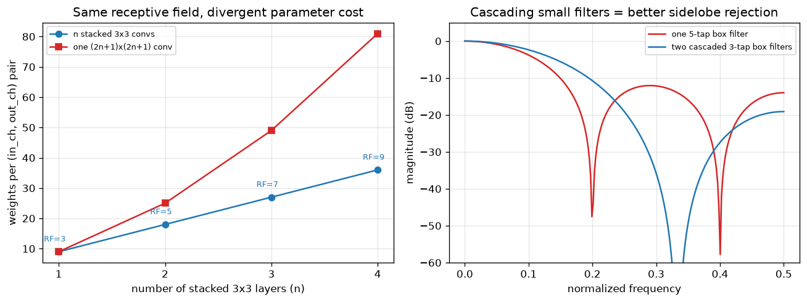

# Day 40 — VGG

> **Phase 4 · Concept 39 of 112 (8th concept of Phase 4)** | Date: 2026-07-14

---

## 🧠 CONCEPT OF THE DAY

**Intuition first.** AlexNet won ImageNet by throwing tricks at the wall — huge 11×11 and 5×5 kernels, local response normalization, a specific two-GPU split. VGG (Simonyan & Zisserman, 2014) asks a more disciplined question: *strip out every trick, use one building block everywhere, and see how far pure depth takes you.* The block is boring on purpose: **3×3 conv, stride 1, pad 1, ReLU** — repeated, with channel count doubling after each 2×2 max-pool (64→128→256→512→512). No cleverness per layer, just more layers of the same layer.

The reason 3×3 is the whole trick: stack two of them and you get the exact same *receptive field* as one 5×5 conv, and stack three and you match one 7×7 — but for a fraction of the parameters, and with extra nonlinearities baked in between.

**Then the math.** For $n$ stacked $k \times k$ convolutions (stride 1), the effective receptive field is:

$$RF_n = n(k-1) + 1$$

where $n$ is the number of stacked layers and $k$ is the kernel size. For $k=3$: $n=2 \to RF=5$, $n=3 \to RF=7$.

Compare the parameter cost, per (input channel, output channel) pair, of $n$ stacked $3\times3$ layers against one big $RF_n \times RF_n$ layer that covers the same receptive field:

$$P_{\text{stacked}} = n \cdot k^2 = 9n \qquad P_{\text{single}} = RF_n^2 = (2n+1)^2$$

At $n=3$ (matching a 7×7 conv): $27$ params vs. $49$ params — nearly half the cost, for the *same* receptive field. The left panel below plots this divergence.



Two things happen when you replace one big kernel with a stack of small ones, and only one of them shows up in a plain parameter count: (1) fewer weights, and (2) — the one that actually matters most — you get $n-1$ extra ReLU nonlinearities threaded through the receptive field instead of one linear transform. A stack of linear filters is *still just one bigger linear filter* (convolution is associative); it's the nonlinearity sandwiched between them that makes the stack strictly more expressive than any single linear kernel of the same span.

**Why it matters / where it leads.** VGG established "depth as the primary lever" as CNN doctrine — everything after it (Inception, ResNet, DenseNet) is still fundamentally stacking small, cheap, nonlinear blocks rather than reaching for bigger kernels. It also directly exposes the *cost* of pure depth: VGG-19 is brutally hard to optimize past a certain depth because gradients have to survive an unbroken chain of 19 nonlinear layers — which is exactly the pain that motivates residual connections two concepts from now (Concept 41, ResNet). And practically: VGG's conv features (specifically `relu3_3`/`relu4_3` of a pretrained VGG-16) are *still* the default backbone for perceptual loss in style transfer, super-resolution, and GAN/diffusion training — one of the longest-lived artifacts in deep learning.

**Interview-style question:** *Two stacked 3×3 conv layers and one 5×5 conv layer produce the same receptive field. Ignoring the parameter-count argument entirely, why is the stacked version still the better choice?* (Answer at the very bottom.)

---

## 🐍 PYTHONIC EDGE

VGG's real elegance is architectural: the whole network is one repeated pattern, so it should be *defined* from a config, not hand-typed 16 times. Bad way vs. clean way:

```python
# BAD: hand-unrolled -- 16 conv layers typed out, error-prone, unreadable diff
import torch.nn as nn

class VGG16Bad(nn.Module):                    # single inheritance: class X(Base) == "class X : public Base" in C++
    def __init__(self, num_classes=1000):     # self is explicit here; C++'s "this" is implicit
        super().__init__()                    # parent ctor call; C++ instead uses an initializer-list: VGG16Bad() : nn.Module()
        self.conv1 = nn.Conv2d(3, 64, 3, padding=1)     # instance attrs assigned in __init__, not declared in a header
        self.relu1 = nn.ReLU()
        self.conv2 = nn.Conv2d(64, 64, 3, padding=1)
        self.relu2 = nn.ReLU()
        self.pool1 = nn.MaxPool2d(2, 2)
        self.conv3 = nn.Conv2d(64, 128, 3, padding=1)
        self.relu3 = nn.ReLU()
        # ... 11 more layers of this, one typo away from a silent channel mismatch
        self.classifier = nn.Linear(512 * 7 * 7, num_classes)

    def forward(self, x):                     # forward() defines the computation, but you never call it directly
        x = self.relu1(self.conv1(x))
        x = self.relu2(self.conv2(x))
        x = self.pool1(x)
        # ... mirrors every line above, 1:1 -- two places to keep in sync
        return x


# CLEAN: config-driven -- the architecture IS the data
cfg = [64, 64, "M", 128, 128, "M", 256, 256, 256, "M", 512, 512, 512, "M", 512, 512, 512, "M"]
# ints = out_channels for a 3x3 conv, "M" = 2x2 max-pool -- this list literally *is* VGG-16

def make_layers(cfg):
    layers = []                                # plain Python list, not a fixed-size C-array
    in_channels = 3
    for v in cfg:                              # `for v in cfg` -- range-based iteration, no index bookkeeping
        if v == "M":                           # "M" is just a str; Python lets you mix types freely in a list
            layers.append(nn.MaxPool2d(kernel_size=2, stride=2))
        else:
            layers += [nn.Conv2d(in_channels, v, kernel_size=3, padding=1),  # list concatenation via +=
                       nn.ReLU(inplace=True)]   # inplace=True: kwarg; trailing-underscore-free here, but the
                                                 # *effect* (mutate in place, skip a copy) matches tensor .relu_()
            in_channels = v                     # rebind the running channel count -- no manual index tracking
    return nn.Sequential(*layers)               # *layers unpacks the list into positional args (C++ has no analog:
                                                 # this is like turning a std::vector<Layer> into a parameter pack)

class VGG16(nn.Module):
    def __init__(self, num_classes=1000):
        super().__init__()
        self.features = make_layers(cfg)        # a class is passed around and constructed like any value
        self.classifier = nn.Linear(512 * 7 * 7, num_classes)

    def forward(self, x):
        x = self.features(x)                    # calling model(x) invokes __call__, which wraps forward()
        x = x.flatten(1)                         # with pre/post hooks -- never call .forward(x) directly
        return self.classifier(x)
```

Same architecture, 16 layers, but the clean version's "diff surface" for changing VGG-16 → VGG-19 is one line in `cfg`, not four new attribute+forward pairs.

---

## 📡 SIGNAL LAB

The "stack small filters instead of one big filter" trick isn't a CNN invention — it's classical DSP, and the right panel of today's plot proves it. Take a 3-tap box (moving-average) filter $h = [\tfrac13, \tfrac13, \tfrac13]$. Cascade it with itself — apply it twice in sequence — and by the convolution theorem this is equivalent to a *single* filter whose impulse response is $h * h$:

$$h_{\text{cascade}} = h * h = \left[\tfrac19, \tfrac29, \tfrac39, \tfrac29, \tfrac19\right]$$

a 5-tap **triangular** window. Compare that to a single 5-tap box filter $[\tfrac15,\tfrac15,\tfrac15,\tfrac15,\tfrac15]$ — same footprint (5 taps), same number of "layers" of context. Their frequency responses are very different: the box filter is a $\mathrm{sinc}$ with slow-decaying sidelobes (bad spectral leakage — energy from stopband frequencies leaks into your passband estimate), while the triangular filter is that $\mathrm{sinc}^2$ — its sidelobes fall off twice as fast in dB. That's exactly what the right panel shows: at the first sidelobe, the cascaded triangle sits roughly 13 dB lower than the plain box.

**The so-what:** this is the *linear* echo of what VGG does nonlinearly. Convolving a signal with itself twice (or convolving any filter with itself $n$ times) is, by the Central Limit Theorem, converging toward a Gaussian-shaped response — smoother, better-behaved sidelobes, no free lunch on delay/support but a much cleaner frequency-domain footprint per tap spent. VGG's stacked 3×3 convs get the CNN-flavored version of this for free: cheaper *and* — because of the ReLUs in between — strictly more expressive than the single equivalent linear filter, which no cascade of *linear* DSP filters can ever claim over their single-filter equivalent (a linear cascade is always exactly reproducible by one filter; a nonlinear one is not).

---

## 🏋️ THE GAUNTLET

**Sliding Window Maximum**

Given an integer array `nums` and a window size `k`, return an array of the maximum value in every contiguous window of size `k` as it slides from the left end of `nums` to the right end.

**Constraints:**
- $1 \le \text{nums.length} \le 10^5$
- $-10^4 \le \text{nums}[i] \le 10^4$
- $1 \le k \le \text{nums.length}$
- Target: $O(n)$ time, $O(k)$ space.

**Hints (escalating):**
1. Brute force is $O(nk)$ — recompute the max from scratch on every shift. What information from the *previous* window is still valid for the next one, and what should you actually be throwing away?
2. You don't need to keep every element in the current window — only the ones that could *possibly* still become the max of some future window. Once a later element is larger than an earlier one still in the window, the earlier one is dead weight forever.
3. Maintain a deque of *indices*, kept monotonically decreasing in value front-to-back. Before pushing a new index, pop from the back while its value is ≤ the new element's value. Pop from the front whenever the front index falls outside the current window. The front is always the current window's max.

**Pattern:** monotonic deque / sliding window. **Target complexity:** $O(n)$ time (each index pushed and popped at most once), $O(k)$ space.

---

## 🏗️ BLUEPRINT

No blueprint today.

---

## 🗺️ MARCHING ORDERS

Every architecture from here on is really just a different answer to "how do I stack cheap nonlinear blocks well" — VGG is the cleanest possible baseline for that question, so hold onto it as the control group.

Tomorrow: Concept 40 — Inception/GoogLeNet

---
---

## 🔓 GAUNTLET SOLUTION

```cpp
#include <vector>
#include <deque>
using namespace std;

class Solution {
public:
    vector<int> maxSlidingWindow(vector<int>& nums, int k) {
        deque<int> dq;              // stores indices, values monotonically decreasing
        vector<int> result;
        result.reserve(nums.size() - k + 1);

        for (int i = 0; i < (int)nums.size(); ++i) {
            // Evict from the back any index whose value can never win again
            while (!dq.empty() && nums[dq.back()] <= nums[i]) {
                dq.pop_back();
            }
            dq.push_back(i);

            // Evict from the front if it has fallen out of the current window
            if (dq.front() <= i - k) {
                dq.pop_front();
            }

            // Once the first full window is formed, record the max
            if (i >= k - 1) {
                result.push_back(nums[dq.front()]);
            }
        }
        return result;
    }
};
```

Each index enters and leaves the deque at most once, so total work across all `i` is $O(n)$ despite the inner `while` loop.

---

## 💡 CONCEPT ANSWER

Convolution is associative, so *two linear filters stacked* are mathematically equivalent to one bigger linear filter — stacking alone buys you nothing in expressive power for a linear system. What breaks that equivalence is the ReLU sandwiched between the two 3×3 convs: it's a genuine nonlinearity applied *inside* the receptive-field span, not just at the very end. That means the composed function over the 5×5 region is not restricted to the family of linear (single-kernel) maps — it can carve out more complex, piecewise decision boundaries than any single 5×5 linear filter could, for the same receptive field. The parameter savings are a nice bonus; the real win is strictly more representational capacity per pixel of receptive field.
