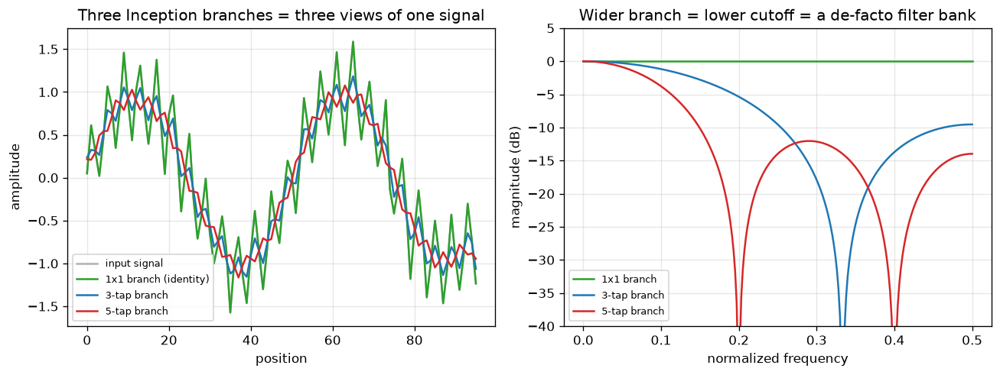

# Day 41 — Concept 40: Inception / GoogLeNet

---

## 🧠 CONCEPT OF THE DAY

**Intuition.** VGG made a bet: pick one kernel size (3×3), stack it deep, done. Inception refuses to bet. At every layer it asks "is this feature better captured by a 1×1 pointwise look, a 3×3 local patch, a 5×5 wider patch, or a pooled summary?" — and instead of choosing, it computes **all four in parallel** and lets the next layer decide how to weight them. Think of it as a filter bank: rather than committing to one resolution, you hand downstream layers a menu of resolutions and let *gradient descent* pick the mix, per channel, per image.

**The math.** An Inception module takes input $x$ with $C$ channels and runs four parallel branches, each producing a feature map with the *same* spatial size $H \times W$:

$$b_1 = \text{Conv}_{1\times1}(x), \quad b_2 = \text{Conv}_{3\times3}(\text{Conv}_{1\times1}(x)), \quad b_3 = \text{Conv}_{5\times5}(\text{Conv}_{1\times1}(x)), \quad b_4 = \text{Conv}_{1\times1}(\text{MaxPool}_{3\times3}(x))$$

The output concatenates channels:

$$y = \text{Concat}_{\text{channel dim}}(b_1, b_2, b_3, b_4)$$

The $\text{Conv}_{1\times1}$ *before* the 3×3 and 5×5 branches is the whole trick — it's a **bottleneck**: a $1\times1$ conv projecting $C$ channels down to $C' \ll C$ before the expensive spatial conv runs. Naive cost of a $5\times5$ conv over $C$ channels is $O(HW \cdot C \cdot C_{\text{out}} \cdot 25)$; inserting the bottleneck makes it $O(HW \cdot C \cdot C' ) + O(HW \cdot C' \cdot C_{\text{out}} \cdot 25)$, which is dramatically cheaper when $C' \ll C$. Crucially, the bottleneck reduces *channel depth*, not spatial size — it doesn't touch the receptive field, only the width of the tensor the expensive conv has to chew through.

**Why it matters / where it leads.** This is the first architecture where "how wide" becomes as important a design axis as "how deep." It directly foreshadows the 1×1-bottleneck pattern that **ResNet** (tomorrow) reuses inside every residual block, and it's the conceptual ancestor of every later "let the network choose its own scale/expert" idea — multi-scale feature pyramids, and eventually Mixture-of-Experts routing (concept 76). The bottleneck-before-expensive-op trick alone is one of the most reused ideas in efficient deep learning.

**Interview-style question:** The four branches are concatenated along the channel dimension into one output tensor. What constraint does that concatenation place on the branches, and how does the architecture satisfy it?

---

## 🐍 PYTHONIC EDGE

Holding parallel branches in a plain Python list quietly breaks a `nn.Module` — PyTorch only discovers submodules that are assigned as attributes through its own registration machinery, and a raw `list` doesn't trigger it.

```python
import torch
import torch.nn as nn

# --- BAD: branches silently invisible to PyTorch ---------------------------
class BadInception(nn.Module):
    def __init__(self, in_ch, out_ch):
        super().__init__()          # parent ctor call; C++ uses an initializer list instead
        self.branches = [           # a plain Python list, NOT an nn.Module container
            nn.Conv2d(in_ch, out_ch, 1),
            nn.Conv2d(in_ch, out_ch, 3, padding=1),
            nn.Conv2d(in_ch, out_ch, 5, padding=2),
        ]

    def forward(self, x):
        # list comprehension: no C++ equivalent, builds a list in one expression
        outs = [branch(x) for branch in self.branches]
        return torch.cat(outs, dim=1)  # dim=1 = channel axis in NCHW; C++ has no keyword args

model = BadInception(8, 4)
print(len(list(model.parameters())))  # 0 !! .to(device)/.eval()/optimizer never see these convs

# --- GOOD: nn.ModuleList registers each branch as a real submodule ---------
class Inception(nn.Module):
    def __init__(self, in_ch, out_ch):
        super().__init__()
        self.branches = nn.ModuleList([        # registers each element; enables .parameters(), .to(), .eval()
            nn.Conv2d(in_ch, out_ch, 1),
            nn.Sequential(
                nn.Conv2d(in_ch, out_ch, 1),    # 1x1 bottleneck before the 3x3
                nn.Conv2d(out_ch, out_ch, 3, padding=1),
            ),
            nn.Sequential(
                nn.Conv2d(in_ch, out_ch, 1),    # 1x1 bottleneck before the 5x5
                nn.Conv2d(out_ch, out_ch, 5, padding=2),
            ),
        ])

    def forward(self, x):
        # calling branch(x) invokes __call__, which wraps forward() with hooks
        # — never call branch.forward(x) directly, it skips those hooks
        return torch.cat([branch(x) for branch in self.branches], dim=1)

model = Inception(8, 4)
print(len(list(model.parameters())))  # 5 tensors — all branches now tracked
```

The `self.x = ...` pattern in `__init__` is Python's version of a member variable — unlike C++, there's no header declaration; the attribute springs into existence the moment you assign it, which is exactly why an unregistered `list` is such an easy, silent mistake to make.

---

## 📡 SIGNAL LAB

Strip away the "convolution" framing and each Inception branch is just a **box filter of a different tap width** — 1, 3, 5 samples — applied to the same signal. That's a textbook multirate-DSP move: instead of picking one cutoff frequency, run a small **filter bank** in parallel and keep every band.

Ran a synthetic two-tone signal (`0.02` slow oscillation + `0.25` fast ripple + noise) through three box filters:



**Left panel:** the 1×1 branch passes the raw signal untouched (it's just a pointwise channel mix, not a spatial filter). The 3-tap branch smooths lightly, still tracking the fast ripple. The 5-tap branch smooths harder, mostly discarding the ripple and tracking only the slow trend.

**Right panel — the "so what":** each branch's frequency response is a lowpass filter, and wider taps push the cutoff *lower*. Concatenating the branch outputs channel-wise is mathematically equivalent to stacking outputs from a small filter bank at three different cutoffs — the network gets a slow-trend channel, a mid-band channel, and a near-full-band channel, for free, without ever having to learn a cutoff frequency from scratch. This is the same intuition behind Gaussian/Laplacian pyramids and, later, wavelet-based generative-forensics features: multi-resolution decomposition beats forcing one operator to be good at every scale simultaneously.

---

## 🏋️ THE GAUNTLET

**Merge k Sorted Lists**

You are given `k` singly-linked lists, each sorted in ascending order. Merge all `k` lists into one sorted linked list and return its head.

**Constraints:**
- `0 <= k <= 10^4`
- Total number of nodes across all lists: `0 <= N <= 5 * 10^4`
- `-10^4 <= Node.val <= 10^4`

This is the algorithmic mirror of today's concept: Inception doesn't process one branch and move to the next — it advances all branches *simultaneously* and merges their outputs. Same shape of problem here.

**Hint 1:** Merging two sorted lists is easy (linear scan with two pointers). What's the naive way to extend that to `k` lists, and what's its complexity in terms of `k` and `N`?

**Hint 2:** The naive pairwise-merge-in-a-row approach does `k-1` merges, but the early lists get re-scanned over and over. What data structure lets you always grab the smallest *current* head across all `k` lists in `O(log k)` instead of `O(k)`?

**Hint 3:** Alternatively — divide and conquer: merge lists in pairs, then merge the results in pairs, recursively (like merge sort's combine step). How many "rounds" does that take, and does each round still cost `O(N)` total?

**Pattern:** k-way merge via min-heap (or divide-and-conquer merge). **Target complexity:** $O(N \log k)$ time, $O(k)$ auxiliary space for the heap.

---

## 🏗️ BLUEPRINT

**Wide multi-branch (Inception) vs. deep single-path (VGG) — a systems tradeoff, not just an accuracy one.** Parallel branches sound "free" on paper since they run concurrently, but on real accelerators each branch is a separate kernel launch with its own memory read/write of the input activation and its own output buffer that must be materialized *before* the concat can happen — that's extra memory-bandwidth pressure and kernel-launch overhead a single deep path doesn't pay. A deep single-path network (VGG-style) pipelines cleanly: one op's output streams into the next with better cache/memory locality. This is exactly why later architectures (MobileNet, EfficientNet) often prefer *depth* and cheap depthwise ops over wide explicit multi-branch designs when inference latency is the binding constraint — Inception-style width buys representational flexibility at a real systems cost, not just a parameter-count cost.

---

## 🗺️ MARCHING ORDERS

You now have both instincts in your pocket — VGG's "go deep with one kernel" and Inception's "go wide with several" — which is exactly the tension the next concept resolves from a different angle entirely: not deeper, not wider, but *shortcut*.

Tomorrow: Concept 41 — ResNet & residual connections

---
---

## 🔓 GAUNTLET SOLUTION

```cpp
#include <vector>
#include <queue>
using namespace std;

struct ListNode {
    int val;
    ListNode *next;
    ListNode(int x) : val(x), next(nullptr) {}
};

class Solution {
public:
    ListNode* mergeKLists(vector<ListNode*>& lists) {
        // min-heap keyed on node value; store (val, list_index_tag) isn't needed
        // since we compare ListNode* directly via a custom comparator
        auto cmp = [](ListNode* a, ListNode* b) { return a->val > b->val; };
        priority_queue<ListNode*, vector<ListNode*>, decltype(cmp)> pq(cmp);

        for (ListNode* head : lists) {
            if (head != nullptr) pq.push(head);   // seed heap with each list's head
        }

        ListNode dummy(0);
        ListNode* tail = &dummy;

        while (!pq.empty()) {
            ListNode* smallest = pq.top();
            pq.pop();
            tail->next = smallest;
            tail = tail->next;
            if (smallest->next != nullptr) {
                pq.push(smallest->next);          // advance that list's pointer
            }
        }

        return dummy.next;
    }
};
```

Each of the `N` nodes is pushed and popped from the heap exactly once, and each heap operation costs $O(\log k)$ since the heap never holds more than `k` nodes at a time — total $O(N \log k)$ time, $O(k)$ space.

---

## 💡 CONCEPT ANSWER

Concatenation along the channel axis requires every branch's output to match in the *other* two dimensions — height and width. So each branch must independently produce an $H \times W$ feature map identical to the input's spatial size (only the channel count is allowed to differ). This is satisfied by giving every conv branch "same" padding for its kernel size (1×1 needs none, 3×3 needs padding 1, 5×5 needs padding 2, all with stride 1) — and, less obviously, by also padding the 3×3 max-pool branch so pooling doesn't shrink the spatial dimensions either. Get the padding wrong on any one branch and the `torch.cat` call fails outright with a shape mismatch, which is usually the first hint a debugging engineer gets that they misconfigured a branch's padding.
