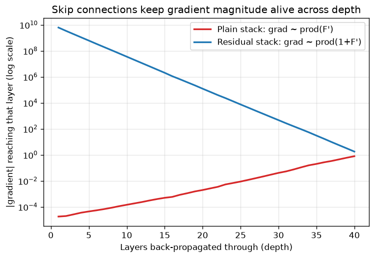

# Day 42 — Concept 41: ResNet & Residual Connections

---

## 🧠 CONCEPT OF THE DAY

**Intuition.** Stack enough plain layers and something strange happens: training error goes *up*, not down — not overfitting, straight-up *underfitting a deeper model*. The layers aren't even managing to learn the identity function well enough to match a shallower twin. ResNet's fix is almost insultingly simple: instead of asking a block of layers to learn the full mapping $y = F(x)$ from scratch, ask it to learn only the *correction* to the identity — $y = x + F(x)$ — and hand it a free, always-available "do nothing" path via a skip connection. If the optimal thing for a block to do really is nothing, the network just has to drive $F(x) \to 0$, which is far easier than learning an exact identity through a stack of nonlinearities. The skip connection is a highway for both signal *and* gradient to bypass a block entirely when a block isn't earning its keep.

**The math.** A residual block computes:

$$y = x + F(x, W)$$

where $F(x, W)$ is the "residual function" — typically two or three conv/BN/ReLU layers — and $x$ is passed through unchanged (or through a $1\times1$ conv if the block changes channel count/stride, so shapes still add). The critical consequence is in the backward pass. By the chain rule:

$$\frac{\partial L}{\partial x} = \frac{\partial L}{\partial y} \cdot \left(1 + \frac{\partial F}{\partial x}\right)$$

That leading **1** is the whole story. In a plain stack, the gradient flowing back through $N$ layers is a *product* of $N$ Jacobians — if each is even slightly less than 1 in magnitude, the product shrinks exponentially with depth (vanishing gradients, concept 20). In a residual stack, every block's local gradient is $1 + \partial F/\partial x$, so even if $\partial F/\partial x \approx 0$ for a lazy/undertrained block, the gradient signal still passes through at full strength via that additive 1. The skip connection doesn't just help forward signal propagation — it guarantees an unobstructed gradient superhighway straight back to the input, no matter how deep the stack gets.

**Why it matters / where it leads.** This single identity trick is why 50, 101, even 1000+ layer networks became trainable at all — it's the reason "just make it deeper" stopped being self-defeating. The $1\times1$ projection-shortcut pattern reuses Inception's bottleneck trick from yesterday, and the additive-residual idea itself becomes the backbone of nearly everything after it: Transformer blocks (concept 60) wrap every attention and FFN sub-layer in exactly this $x + \text{Sublayer}(x)$ pattern, and DenseNet (tomorrow) pushes the same instinct even further by connecting *every* layer to *every* later layer instead of just neighbors.

**Interview-style question:** Why does adding the identity shortcut *not* increase the number of parameters in the network (in the common case), and what has to change about the shortcut when a residual block downsamples spatially or changes channel count?

---

## 🐍 PYTHONIC EDGE

A subtle bug that trips people up when implementing ResNet blocks: forgetting that in-place ops on a tensor that's also needed for the skip connection can silently corrupt the branch you meant to keep untouched.

```python
import torch
import torch.nn as nn

class ResidualBlock(nn.Module):
    def __init__(self, channels):
        super().__init__()                 # parent ctor call; C++ uses an initializer-list instead
        self.conv1 = nn.Conv2d(channels, channels, 3, padding=1)
        self.bn1 = nn.BatchNorm2d(channels)
        self.conv2 = nn.Conv2d(channels, channels, 3, padding=1)
        self.bn2 = nn.BatchNorm2d(channels)
        self.relu = nn.ReLU(inplace=True)  # inplace=True is a keyword-only-style arg (no C++ default-arg equiv here)

    # --- BAD: relu(x) computed BEFORE storing identity gets aliased by later inplace ops ---
    def forward_bad(self, x):
        identity = x                       # NOT a copy — Python assignment binds a new name to the SAME tensor
        out = self.relu(self.bn1(self.conv1(x)))
        out = self.bn2(self.conv2(out))
        out += identity                     # in-place add; if `identity` were ever mutated upstream, this is silently wrong
        return self.relu(out)

    # --- GOOD: identity path never touched by in-place ops on `out` ---
    def forward(self, x):
        identity = x                        # alias, but never mutated in-place before use, so it's safe here
        out = self.conv1(x)                 # x untouched: conv/bn/relu(inplace=False default) return NEW tensors
        out = self.relu(self.bn1(out))
        out = self.bn2(self.conv2(out))
        return self.relu(out + identity)    # `+` (not `+=`) allocates a fresh tensor; no aliasing risk with identity

model = ResidualBlock(16)
x = torch.randn(2, 16, 8, 8)                # NCHW tensor; unpacking-by-position, no named struct needed
y = model(x)                                # calling model(x) invokes __call__, which wraps forward() with hooks
print(y.shape)                              # torch.Size([2, 16, 8, 8]) -- shape preserved, that's the whole point
```

The general rule: `x.mul_()`, `x.add_()`, `relu(inplace=True)` and friends mutate a tensor's storage in place (the trailing underscore is PyTorch's convention, not Python's) — safe when you own the only reference, dangerous the moment another branch (like a residual identity) is holding the same reference and expects the *original* values later.

---

## 📡 SIGNAL LAB

Reframe the residual block in signal-processing terms: $y = x + F(x)$ is exactly an **all-pass-plus-correction** filter — the input passes through completely unfiltered on one path, while a second path adds a learned perturbation on top. Compare that to a plain block, which is a single learned transfer function applied in series with *no* guaranteed-unity path.

The gradient chain $\frac{\partial L}{\partial x} = \frac{\partial L}{\partial y}\prod_k(1 + \partial F_k/\partial x)$ vs. a plain net's $\prod_k \partial F_k/\partial x$ is structurally identical to comparing the frequency response of a system with a direct/unity feed-through term against one without — the residual path keeps the DC/unity gain component pinned near 1 regardless of what the learned branch does, the same way a leaky integrator or a first-order IIR filter with a fixed feedthrough tap avoids total signal collapse even when its adaptive coefficient drifts toward zero.



**So what:** each curve is 30 trials of a 40-"layer" chain where every layer's local Jacobian is drawn from $\mathcal{N}(0.75, 0.15^2)$ — a *mild*, realistic vanishing-gradient regime, not a pathological one. The plain stack's gradient magnitude decays by roughly $0.75^{40} \approx 10^{-5}$ by the 40th layer purely from compounding — no bug, no bad init, just depth. The residual stack's local factor is $1 + \mathcal{N}(0.75, 0.15^2) \approx \mathcal{N}(1.75, 0.15^2)$, comfortably above 1, so gradient magnitude stays flat or even grows slightly. This is precisely why depth used to have a hard ceiling and now doesn't — and it's the same "keep a unity/DC term alive" instinct you'll want later when reasoning about why spectral artifacts in generative models tend to concentrate in specific frequency bands rather than washing out uniformly across a deep decoder.

---

## 🏋️ THE GAUNTLET

**Longest Increasing Path in a Matrix**

Given an `m x n` integer matrix, find the length of the longest strictly increasing path, moving only up/down/left/right (no diagonals, no wraparound).

**Constraints:**
- `1 <= m, n <= 200`
- `0 <= matrix[i][j] <= 2^31 - 1`

The connection to today: a residual block gives every layer's gradient a guaranteed shortest path back to the input, avoiding redundant recomputation of the same signal through every intermediate layer. This problem has the identical shape — without memoization, you recompute the longest path from the same cell over and over as different neighbors probe it.

**Hint 1:** A path is strictly increasing, so it can never revisit a cell — that kills the usual "visited set" cycle-detection headache. What does that guarantee about the structure of the reachability graph if you draw an edge from each cell to each strictly-greater neighbor?

**Hint 2:** Because that graph is a DAG (no cycles are possible when every edge strictly increases value), plain DFS from each cell is safe *and* the same subproblem — "longest increasing path starting at cell $(i,j)$" — gets asked repeatedly from different starting cells. What's the fix?

**Hint 3:** With memoization, what's the total work? Each cell's DFS explores at most 4 neighbors once its own answer is cached — express the final complexity in terms of `m` and `n`.

**Pattern:** DFS + memoization on an implicit DAG (topological structure from value ordering). **Target complexity:** $O(mn)$ time, $O(mn)$ space.

---

## 🏗️ BLUEPRINT

**Residual connections and memory bandwidth — the skip connection isn't free either.** Storing the identity tensor `x` alive across the whole block for the final `+= identity` means the activation memory for that tensor can't be released until the block finishes — for very deep ResNets trained at high resolution, this is a real contributor to activation-memory pressure during training, which is exactly what gradient checkpointing (concept 97, coming later) exists to trade back for extra compute. The "free" gradient superhighway costs you a held reference for the block's full duration.

---

## 🗺️ MARCHING ORDERS

You've now seen depth (VGG), width (Inception), and shortcut (ResNet) — three orthogonal knobs on the same underlying problem of how information and gradient move through a network. Tomorrow pushes the shortcut idea to its logical extreme.

Tomorrow: Concept 42 — DenseNet

---
---

## 🔓 GAUNTLET SOLUTION

```cpp
#include <vector>
using namespace std;

class Solution {
public:
    int rows, cols;
    vector<vector<int>> memo;
    vector<vector<int>> dirs = {{1,0},{-1,0},{0,1},{0,-1}};

    int dfs(vector<vector<int>>& matrix, int i, int j) {
        if (memo[i][j] != 0) return memo[i][j];  // 0 = uncomputed sentinel; answers are always >= 1

        int best = 1;  // path of length 1: just this cell
        for (auto& d : dirs) {
            int ni = i + d[0], nj = j + d[1];
            if (ni >= 0 && ni < rows && nj >= 0 && nj < cols &&
                matrix[ni][nj] > matrix[i][j]) {
                best = max(best, 1 + dfs(matrix, ni, nj));
            }
        }
        memo[i][j] = best;
        return best;
    }

    int longestIncreasingPath(vector<vector<int>>& matrix) {
        rows = matrix.size();
        cols = matrix[0].size();
        memo.assign(rows, vector<int>(cols, 0));

        int ans = 0;
        for (int i = 0; i < rows; i++) {
            for (int j = 0; j < cols; j++) {
                ans = max(ans, dfs(matrix, i, j));
            }
        }
        return ans;
    }
};
```

Every cell's true answer is computed exactly once thanks to memoization, and each computation does O(1) work (checking 4 neighbors) beyond recursive calls that are themselves memoized — total $O(mn)$ time and $O(mn)$ space for the memo table and recursion stack.

---

## 💡 CONCEPT ANSWER

The identity shortcut adds *zero* parameters because it's literally just `out + x` — a tensor addition, not a learned layer — so when the block doesn't change spatial resolution or channel count, the shortcut is a pure passthrough with no weights at all. The only time the shortcut needs parameters is when the residual branch *does* change shape — e.g. a stride-2 conv that halves spatial dimensions, or a conv that doubles channel count going into the next stage. In that case the identity path can no longer be added elementwise (shapes don't match), so ResNet uses a small $1\times1$ conv (with matching stride) purely to project `x` into the new shape before the addition — still far cheaper than the main $3\times3$ branch, and its job is reshaping, not feature extraction.
