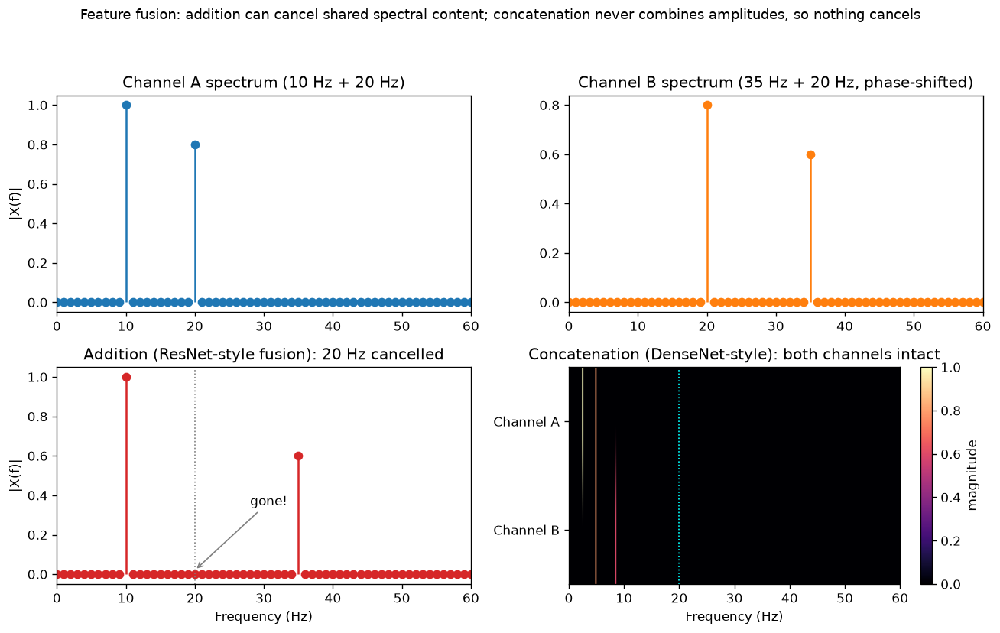

# Day 43 — Concept 42: DenseNet

---

## 🧠 CONCEPT OF THE DAY

**Intuition.** ResNet gave every block a "do nothing" escape hatch by *adding* the input back onto the output. DenseNet asks: why stop at just the immediately preceding layer? Inside a dense block, every layer receives the **concatenated** feature maps of *every* layer that came before it, not just the last one — and its own output gets appended to that growing stack for everyone after it to use. There's no "in case you need it" shortcut here; direct access to every earlier layer's raw output is just... the normal input. Nothing is ever recomputed, and nothing is ever blended away — each layer's contribution stays exactly as it was, forever addressable by anything downstream.

**The math.** For a dense block, layer $l$ computes:

$$x_l = H_l\big([x_0, x_1, \dots, x_{l-1}]\big)$$

where $[\cdot]$ is channel-wise concatenation and $H_l$ is a small composite function (typically BN → ReLU → Conv). Contrast this directly with ResNet's $x_l = x_{l-1} + F(x_{l-1})$: ResNet *adds*, which forces every tensor in the sum to share the same shape and irreversibly blends their values together. DenseNet *concatenates*, which has no such shape constraint on preserving identity — each earlier feature map survives completely intact as its own set of channels. Because of this, each $H_l$ only needs to contribute a small number of *new* channels — the **growth rate** $k$ — since it isn't responsible for carrying forward everything already available; layer $l$'s input has $k_0 + k(l-1)$ channels, where $k_0$ is the block's initial channel count. Small $k$ (commonly 12–32) keeps each layer cheap even as the *collective* representation the block builds keeps getting richer.

The gradient story is ResNet's superhighway taken to its logical extreme: because $x_l$ depends directly on *every* $x_j$ for $j < l$, backprop gives every earlier layer a direct gradient path to every later loss-touching layer — not just to its immediate neighbor. Feature reuse and gradient flow are the same mechanism here, viewed from two directions.

**Why it matters / where it leads.** Concatenation's one real cost is that channel counts grow *linearly* with block depth — left unchecked, a deep dense block becomes enormous. DenseNet's answer is the **transition layer** between dense blocks: a $1\times1$ conv (this week's bottleneck trick, concept 37, again) that compresses channels back down, followed by pooling to halve spatial resolution before the next dense block starts fresh. This "concatenate freely, then periodically compress" rhythm — feature reuse traded against a controlled compression tax — is a pattern you'll meet again once we reach U-Net skip connections (concept 94), which face the identical concatenate-vs-channel-blowup tension.

**Interview-style question:** DenseNet uses concatenation instead of addition for its skip connections. What's the practical memory cost of this design choice during training, and why does every transition layer include a $1\times1$ conv *before* the pooling step rather than after?

---

## 🐍 PYTHONIC EDGE

The single most common bug when porting ResNet-flavored code to DenseNet: muscle memory reaches for `+=` where the whole point demands `torch.cat`. If the channel counts happen to line up, this fails *silently* — no shape error, just a network that quietly stops being a DenseNet.

```python
import torch
import torch.nn as nn

class DenseLayer(nn.Module):
    def __init__(self, in_channels, growth_rate):
        super().__init__()                          # parent ctor; C++ needs an initializer-list instead
        self.bn = nn.BatchNorm2d(in_channels)
        self.relu = nn.ReLU()
        self.conv = nn.Conv2d(in_channels, growth_rate, 3, padding=1)

    def forward(self, x):
        return self.conv(self.relu(self.bn(x)))      # calling model(x) invokes __call__, not forward() directly

class DenseBlockBad(nn.Module):
    def __init__(self, in_channels, growth_rate, num_layers):
        super().__init__()
        self.layers = nn.ModuleList([                # list comprehension building submodules
            DenseLayer(in_channels + i * growth_rate, growth_rate)
            for i in range(num_layers)
        ])

    def forward(self, x):
        for layer in self.layers:
            new_feat = layer(x)
            x = x + new_feat          # BUG: habit from ResNet — this ADDS, it doesn't grow the channel stack!
        return x                      # channel count never grows past in_channels; not DenseNet at all

class DenseBlockGood(nn.Module):
    def __init__(self, in_channels, growth_rate, num_layers):
        super().__init__()
        self.layers = nn.ModuleList([
            DenseLayer(in_channels + i * growth_rate, growth_rate)
            for i in range(num_layers)
        ])

    def forward(self, x):
        features = [x]                                # Python list accumulates tensors, no fixed-size array needed
        for layer in self.layers:
            out = layer(torch.cat(features, dim=1))    # @ is for matmul; dim=1 here is the channel axis (NCHW)
            features.append(out)                       # .append() grows the list; each entry stays untouched
        return torch.cat(features, dim=1)              # single final concat — every layer's output still intact

block = DenseBlockGood(in_channels=8, growth_rate=4, num_layers=3)
x = torch.randn(2, 8, 16, 16)                          # tuple-like shape: (batch, channels, H, W)
y = block(x)
print(y.shape)                                         # torch.Size([2, 20, 16, 16]) -- 8 + 3*4 channels, as expected
```

Note the accumulation pattern itself: `features` is a plain Python list, appended to with `.append()` (no reallocation-and-copy semantics to worry about, unlike a C++ `std::vector` reserve/resize dance), and `torch.cat(features, dim=1)` is called fresh each time — that repeated concatenation *is* correct and necessary here, since each layer's input genuinely differs from the last. The bug isn't "concatenating too often" — it's reaching for `+` when the architecture's entire identity depends on `cat`.

---

## 📡 SIGNAL LAB

Frame ResNet's addition and DenseNet's concatenation as two different ways to *fuse* two "feature-map" signals, and the DSP consequence becomes concrete. Addition sums amplitudes — if two signals share a frequency component but disagree in phase, that component can partially or fully **destructively interfere** and disappear from the sum, with no way to recover it afterward. Concatenation never combines amplitudes at all — it just lays both signals side by side as separate channels — so no phase relationship between them can ever cause information loss.



**So what:** channel A carries a 10 Hz component plus a 20 Hz component; channel B carries a 35 Hz component plus that *same* 20 Hz component but phase-shifted by $\pi$. Summed (the ResNet move), the two 20 Hz components are equal in magnitude and exactly opposite in phase — they cancel to zero, and that frequency is simply gone from the fused signal, full stop, no way to reconstruct it downstream. Concatenated (the DenseNet move), both channels' full spectra — 20 Hz included, twice over — survive untouched, because concatenation never lets one channel's phase interact with another's. This is directly relevant to your frequency-domain forensics lane: when a generative model's decoder fuses feature paths via addition (as many upsampling/skip architectures do), it's entirely possible for a diagnostic spectral signature to get destructively cancelled purely as a side effect of *how* two paths were recombined — not because the information was never there. Concatenation-based fusion is spectrally "lossless" in this specific sense; addition is not, and knowing which one an architecture uses tells you something real about whether to trust an absence of a spectral artifact at the output.

---

## 🏋️ THE GAUNTLET

**Concatenated Words**

Given an array of distinct, lowercase-only strings `words`, return all strings in `words` that are a **concatenated word** — a string that can be built entirely by concatenating at least two *shorter* strings from `words` (with repetition allowed).

**Constraints:**
- `1 <= words.length <= 10^4`
- `0 <= words[i].length <= 30`
- All strings in `words` consist of lowercase English letters only and are distinct.

The connection to today: DenseNet builds each layer's output by concatenating every already-computed earlier feature map — pure reuse, never recomputed from scratch. This problem is the literal string-world version of that instinct: check whether a word decomposes into pieces that are *already available* in the dictionary, without re-deriving the same sub-segmentation over and over for different candidate splits.

**Hint 1:** For a single word $w$ of length $n$, this is classic Word Break: let `dp[i]` mean "the prefix `w[0:i]` can be fully segmented into pieces that are each in the dictionary." What's the recurrence for `dp[i]` in terms of smaller `dp[j]` and substring membership checks?

**Hint 2:** The dictionary itself contains $w$ — so if you allow the DP to treat the *entire* string `w[0:n]` as a single valid piece (i.e., `j = 0`, `i = n` in one step), `dp[n]` becomes trivially true for every word, which isn't what you want (that's one piece, not "at least two"). How do you patch the recurrence to forbid exactly that one combination, without needing to remove $w$ from the dictionary or process words in any particular order first?

**Hint 3:** Each substring check and extraction costs $O(n)$, and the DP has $O(n^2)$ `(i, j)` pairs per word, so one word costs $O(n^2)$ (with a hash-set lookup per candidate substring). Given $\sum L_i$ is bounded and each $L_i \le 30$, what's the total complexity across all words, and why doesn't caching *across different words* buy you anything here (i.e. why is per-word memoization sufficient on its own)?

**Pattern:** DP word-break per string, checked against a hash-set dictionary. **Target complexity:** $O\!\left(\sum_i L_i^2\right)$ time, $O\!\left(\sum_i L_i\right)$ space for the dictionary.

---

## 🏗️ BLUEPRINT

No blueprint today.

---

## 🗺️ MARCHING ORDERS

You've now seen three ways architectures move information across depth: add-and-hope-it's-near-zero (ResNet), concatenate-and-keep-everything (DenseNet), and tomorrow you flip the whole frame — instead of combining what a layer already has, you learn how to *grow* a feature map back up in spatial size.

Tomorrow: Concept 43 — Transposed conv / upsampling

---
---

## 🔓 GAUNTLET SOLUTION

```cpp
#include <vector>
#include <string>
#include <unordered_set>
using namespace std;

class Solution {
public:
    bool canForm(const string& word, unordered_set<string>& dict) {
        int n = word.size();
        vector<bool> dp(n + 1, false);
        dp[0] = true;
        for (int i = 1; i <= n; i++) {
            for (int j = 0; j < i; j++) {
                if (j == 0 && i == n) continue;  // forbid using the WHOLE word as its own single piece
                if (dp[j] && dict.count(word.substr(j, i - j))) {
                    dp[i] = true;
                    break;
                }
            }
        }
        return dp[n];
    }

    vector<string> findAllConcatenatedWordsInADict(vector<string>& words) {
        unordered_set<string> dict(words.begin(), words.end());
        vector<string> result;
        for (auto& w : words) {
            if (!w.empty() && canForm(w, dict)) {
                result.push_back(w);
            }
        }
        return result;
    }
};
```

`dict` includes every word, $w$ itself included — that's fine, because the `j == 0 && i == n` guard is the *only* place $w$ matching itself as a single whole piece could sneak in, and it's explicitly skipped. Any other true `dp[n]` path necessarily passed through some intermediate `dp[j]` with `0 < j < n`, which by definition required at least one earlier piece — so the final piece plus that history is always $\ge 2$ pieces. Each word costs $O(n^2)$ for the DP (with $O(n)$ substring + hash-set work per cell), giving $O\!\left(\sum_i L_i^2\right)$ total — with $L_i \le 30$, this is comfortably fast even at $10^4$ words. Cross-word memoization buys nothing because each word's DP result depends only on that word's own characters and the fixed global dictionary — there's no shared subproblem *between* two different words' DP tables to reuse.

---

## 💡 CONCEPT ANSWER

Because concatenation preserves every earlier layer's channels rather than blending them into a fixed-width sum, a dense block's activation memory grows **quadratically** in the number of layers within the block — layer $l$'s input alone holds $k_0 + k(l-1)$ channels, and if you naively keep every intermediate concatenated tensor alive for the backward pass, the *cumulative* memory footprint across all layers in the block is $O(L^2)$ in the layer count $L$, versus ResNet's $O(L)$ (each block's activations stay a fixed width). This is DenseNet's real practical cost, and it's why efficient implementations use shared memory buffers / memory-efficient concatenation to avoid materializing every intermediate concat as a separate tensor.

The $1\times1$ conv comes *before* pooling in a transition layer because its job is to compress the channel dimension the dense block just inflated — do that cheaply first, at full spatial resolution, while there's only a small number of *output* channels to convolve into. Pooling afterward then downsamples spatially on that already-slim tensor. Doing it in the other order (pool first, then $1\times1$) would work shape-wise too, but it means the $1\times1$ conv would be operating on a spatially smaller tensor with no benefit — the real reason for the ordering is that channel compression is the transition layer's primary duty and is cheapest to do before you also throw away spatial resolution, keeping the two operations' costs additive rather than compounding awkwardly.
