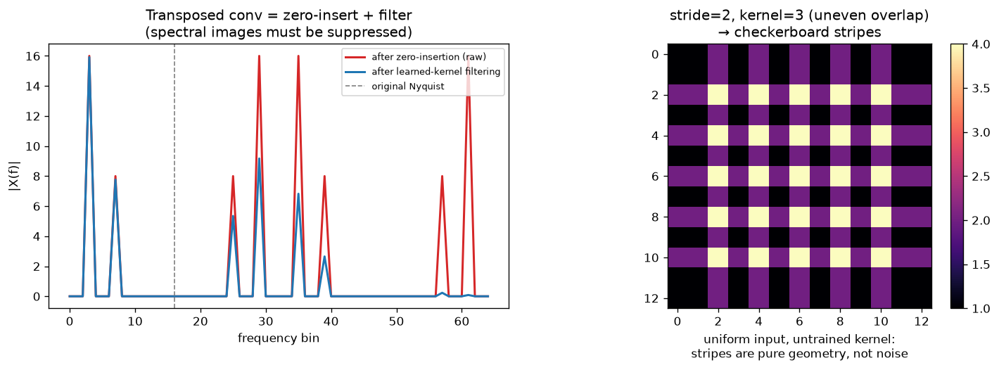

# Day 44 — Concept 43: Transposed conv / upsampling

---

## 🧠 CONCEPT OF THE DAY

**Intuition.** Every conv you've studied so far shrinks or holds size steady: slide a small window over a big input, produce a smaller (or equal) output. At some point — segmentation masks, GAN/VAE decoders, super-resolution — you need to go the other way: take a small, coarse feature map and grow it back up. Transposed convolution does this by literally running the strided-conv bookkeeping in reverse. Instead of sliding a kernel *over* the input to collapse a neighborhood into one output value, you take *one* input value, stamp a scaled copy of the whole kernel onto the (larger) output canvas at a location set by that input's position times the stride, and let neighboring stamps overlap and add. It's scatter instead of gather.

Don't be fooled by the old name "deconvolution" — this is not mathematical deconvolution (there's no inversion of the forward conv happening, no recovery of a unique input). It's literally the backward pass (gradient) of an ordinary strided conv, repurposed as a forward operation.

**The math.** For a 1D input $x$ of length $L_{in}$, kernel $w$ of size $k$, stride $s$, the output length is:

$$L_{out} = (L_{in} - 1)\cdot s - 2p + k + p_{out}$$

where $p$ is padding and $p_{out}$ is output padding (a tie-breaker when $s$ doesn't evenly divide the geometry). Each output position is a sum over every input position whose stamped kernel window covers it:

$$y[j] = \sum_{i:\, j - i\cdot s \in [0,k)} x[i]\cdot w[j - i\cdot s]$$

**Why it matters / where it leads.** This scatter-add is exactly what every upsampling decoder does under the hood — U-Net's expansive path (concept 94), GAN generators (concept 81), VAE decoders (concept 80), super-resolution nets. But the overlap-add geometry has a failure mode baked in: when $k$ isn't a multiple of $s$, some output positions get contributions from 2 input stamps and neighboring positions get contributions from only 1 — a *purely geometric* unevenness, present even with an untrained, uniform kernel. That unevenness is the **checkerboard artifact**. It's why many modern decoders (Stable Diffusion's decoder, ESRGAN, etc.) sidestep literal transposed conv entirely in favor of "resize + conv" — nearest/bilinear upsample followed by an ordinary stride-1 conv — same net effect, geometrically incapable of checkerboarding.



**Interview question:** *Why does a stride-2, kernel-size-3 transposed convolution produce checkerboard artifacts, and how would you eliminate them without shrinking the layer's receptive field?*

---

## 🐍 PYTHONIC EDGE

The bug that bites people in practice isn't the artifact — it's silent shape mismatches when `output_padding` is forgotten and a decoder's upsampled tensor doesn't line up with a U-Net skip connection. The clean fix is usually to just not use `ConvTranspose2d` at all.

```python
import torch
import torch.nn as nn

# ---- the bad way: raw ConvTranspose2d, a shape-mismatch bug waiting to happen ----
class BadUpsampler(nn.Module):                        # single inheritance: (nn.Module) -- C++: class BadUpsampler : public nn::Module
    def __init__(self, in_ch, out_ch):                 # self is explicit "this" -- C++ never writes the receiver as a parameter
        super().__init__()                             # calls parent ctor; C++ does this via the initializer list, not a body statement
        self.deconv = nn.ConvTranspose2d(               # attribute created by assignment -- C++ declares it in the header, inits in the body
            in_ch, out_ch, kernel_size=3, stride=2
        )                                               # no output_padding set -> silently wrong size whenever L_in is even

    def forward(self, x):                              # this is NOT the call path -- see model(x) below
        return self.deconv(x)

# ---- the clean way: resize + conv, dodges checkerboard AND the shape-mismatch bug class ----
class CleanUpsampler(nn.Module):
    def __init__(self, in_ch, out_ch):
        super().__init__()
        self.up = nn.Upsample(scale_factor=2, mode="nearest")        # explicit, deterministic 2x -- no stride/kernel geometry to get wrong
        self.conv = nn.Conv2d(in_ch, out_ch, kernel_size=3, padding=1)  # stride-1 conv: output H,W == input H,W, always

    def forward(self, x):
        return self.conv(self.up(x))                    # composition, left to right: up() runs first, feeds conv()

model = CleanUpsampler(64, 32)
x = torch.randn(1, 64, 16, 16)        # shape tuple (N, C, H, W) -- plain Python tuple, no separate shape type like a C++ struct
y = model(x)                          # calling the OBJECT invokes __call__, which runs registered hooks then dispatches to forward()
                                       # -- never call model.forward(x) directly, you'd skip every hook silently
assert y.shape[-2:] == (32, 32)       # assert is a statement, not a macro -- stripped entirely under python -O
                                       # y.shape[-2:] is slice notation with a negative start index: "last two dims"
```

The one-line mental check for any transposed-conv shape bug: does `output_padding` (or the resize factor) actually match what the skip connection on the other side expects? Assert it, don't eyeball it.

---

## 📡 SIGNAL LAB

Transposed conv's "scatter" step, when the stride is uniform, is literally **zero-insertion upsampling** followed by a filter — exactly the classic multirate-DSP interpolator. That framing makes the checkerboard artifact a special case of a much older, well-understood phenomenon: **spectral imaging**.

**Setup.** $x[n]$ has $N=32$ samples with energy at bins $k=3$ and $k=7$. Upsample by $L=4$ via zero-insertion (stride-4 half of a transposed conv, before the kernel is applied).

**(a) Where do the images land?** Zero-insertion by $L$ tiles the spectrum: every original component at bin $k$ reappears at $k + mN$ for $m = 1, \dots, L-1$ (mod $NL$). So $k=3$ shows up again at bins $35, 67, 99$; $k=7$ shows up again at $39, 71, 103$ — confirmed by the red curve in the left panel above, which is exactly the raw zero-inserted spectrum before filtering.

**(b) How sharp does the filter (the learned kernel) need to be?** The images sit *immediately* adjacent to the original passband edge (there's no guard band — that's the nature of zero-insertion) so an ideal brick-wall separator would need infinite taps. In practice you need enough taps (i.e., a big enough kernel, or several stacked layers to grow an equivalent receptive field) to get a transition band narrow enough to knock the images down to negligible energy — the blue curve above (a 3-tap filter) already suppresses most of the image energy, but a small kernel like a real 3×3 transposed conv leaves *residual* leakage.

**(c) So what — the forensic payoff.** That residual leakage is not random noise; it sits at frequencies fixed by the stride (multiples of the original sampling rate), so it's *periodic and predictable*. This is precisely the mechanism behind real spectral forensics on generated images: GAN and diffusion decoders built from transposed-conv (or naive nearest-neighbor) upsampling leave grid-periodic peaks in the 2D FFT magnitude of their output, spaced at bins tied to the generator's upsampling factors — a structure a real camera's optics + sensor never produces. Detectors that flag "AI-generated" images by inspecting the frequency spectrum (rather than pixels) are directly exploiting this exact zero-insertion-imaging argument. Concept 88 (spectral signatures of generated images) picks this thread back up directly.

---

## 🏋️ THE GAUNTLET

**Range Add, Query Once**

You're given an array of size $n$ (values start at 0) and $q$ update operations. Each operation is a triple $(start, end, val)$ meaning "add $val$ to every element with index in $[start, end)$." After applying all $q$ operations, return the final array.

**Constraints:** $1 \le n \le 10^6$, $0 \le q \le 10^5$, $0 \le start < end \le n$, $|val| \le 10^4$ (so intermediate sums fit safely in a 64-bit accumulator).

Naive approach is $O(nq)$ — too slow at these limits. You need something close to $O(n + q)$.

**Hint 1:** You don't need to touch every element in $[start, end)$ for every query. What's the *minimal* information you need to record about a query — could you mark just its two boundary points instead of the whole range?

**Hint 2:** Try marking $+val$ at index $start$ and $-val$ at index $end$ in a scratch array, doing this for every query, and then take a running cumulative sum over that scratch array. What do you notice?

**Hint 3:** That's not a coincidence — a running sum undoes a difference exactly the way integration undoes differentiation. You're building the *discrete derivative* of the answer, then reconstructing the answer by discrete integration. Once you see that, the whole thing is two linear passes.

**Pattern:** difference array + prefix-sum reconstruction. **Target complexity:** $O(n + q)$ time, $O(n)$ space.

---

## 🏗️ BLUEPRINT

No blueprint today.

---

## 🗺️ MARCHING ORDERS

Every artifact you can explain with a spectrum is an artifact you can eventually detect *and* eventually design away — that's the whole game in your corner of research. Keep pulling on that thread.

Tomorrow: Concept 44 — Dilated/atrous conv

---

🔓 GAUNTLET SOLUTION

```cpp
#include <bits/stdc++.h>
using namespace std;

vector<long long> rangeAdd(int n, vector<array<int,3>>& queries) {
    vector<long long> diff(n + 1, 0);           // one extra slot to safely mark the "end" boundary
    for (auto& q : queries) {
        int start = q[0], end = q[1], val = q[2];
        diff[start] += val;                      // mark: value turns "on" here
        diff[end]   -= val;                       // mark: value turns "off" here
    }
    vector<long long> result(n, 0);
    long long running = 0;
    for (int i = 0; i < n; i++) {
        running += diff[i];                      // prefix sum reconstructs the actual value at i
        result[i] = running;
    }
    return result;
}
```

💡 CONCEPT ANSWER

Checkerboard artifacts come from uneven kernel/stride overlap in a transposed conv — some output pixels get summed contributions from 2 (or more) input stamps, neighbors get only 1, and that count difference persists as a periodic pattern no matter what the kernel learns. You can eliminate it without shrinking the receptive field by replacing the transposed conv with a **resize + stride-1 conv** (nearest or bilinear upsample, then an ordinary same-size conv) — the upsampling step is now geometrically uniform (every output pixel is produced by the same interpolation rule), and the conv afterward can use any kernel size you want to control receptive field, decoupled entirely from the upsampling factor. (Sub-pixel convolution / `PixelShuffle` is the other standard answer: convolve at low resolution, then rearrange channels into space — also artifact-free by construction.)
