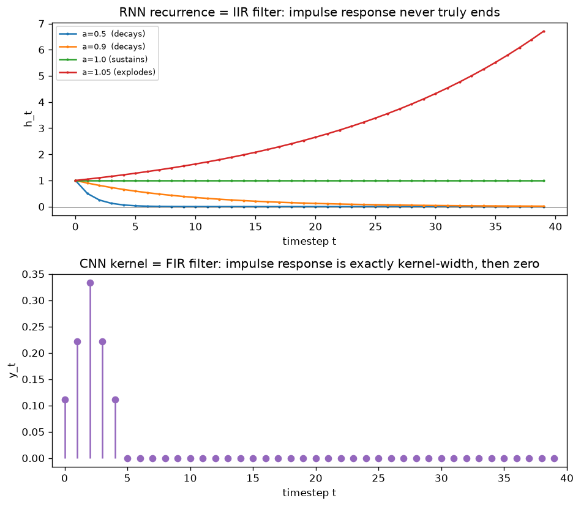

# Day 46 — Concept 45: RNN Cell

*(First concept of Phase 5: Sequence Models. Everything through Phase 4 assumed a fixed-size input processed in one shot — images, feature vectors. Phase 5 asks: what happens when the input is a sequence whose length you don't know in advance?)*

## 🧠 CONCEPT OF THE DAY

**Intuition first.** A feedforward net (even a CNN) is stateless between calls: feed it input A, then input B, and B's output has no idea A ever happened. That's fine for a single image, useless for a sentence, an audio waveform, or a stock series, where *order and history matter*. An RNN fixes this the simplest way possible: give the network a **hidden state** vector that it updates at every timestep and *feeds back into itself* as an extra input for the next step. The hidden state is a compressed, fixed-size summary of "everything relevant I've seen so far."

The key design choice — the one that makes it an "R"NN and not just a chain of different layers — is **weight sharing across time**: the exact same weight matrices are reused at every timestep. This mirrors the weight sharing you already know from CNNs (concept 32 — same kernel slides across space); here, the same cell slides across *time*. That's what lets an RNN handle a 5-token sentence and a 500-token sentence with the identical number of parameters.

**Then the math.** At each timestep $t$, given input $x_t$ and the previous hidden state $h_{t-1}$:

$$h_t = \tanh(W_{xh} x_t + W_{hh} h_{t-1} + b_h)$$

$$y_t = W_{hy} h_t + b_y$$

where $W_{xh}$, $W_{hh}$, $W_{hy}$, $b_h$, $b_y$ are the *same* five parameters at every $t$, and $h_0$ is typically initialized to zeros. "Unrolling" the RNN just means drawing this cell copied $T$ times, once per timestep, with $h_{t-1} \to h_t$ arrows connecting consecutive copies — it's the same physical function applied $T$ times, not $T$ different functions.

**Why it matters / where it leads.** That feedback loop is exactly what a signal-processing person would call an **IIR (infinite impulse response) filter** — a single input at $t=0$ can, in principle, influence the output forever, because $h_{t-1}$ folds every prior input back in. Compare that to a CNN, which is an **FIR (finite impulse response) filter**: its output at any position only ever depends on inputs within the fixed kernel width. This distinction is the whole reason Phase 5 exists as a separate phase from Phase 4 — and it's also the source of the RNN's biggest weakness, which you'll meet directly in two days: an IIR filter's impulse response can decay to nothing, or blow up, depending on the feedback gain. That's "why RNNs forget" (concept 47), and it's a direct consequence of the recurrence you just wrote down today.

**Interview question:** *"Why does an RNN reuse the same $W_{hh}$ at every timestep instead of learning a separate weight matrix per position, the way a fully-connected net would for a fixed-size input? Give two distinct reasons this matters."*

*(Answer at the very bottom.)*

## 🐍 PYTHONIC EDGE

PyTorch gives you two ways to build the same recurrence, and mixing them up is a classic footgun. `nn.RNNCell` is *one* timestep — you loop yourself. `nn.RNN` is the *whole unrolled sequence* — it loops internally (in fused, often cuDNN-accelerated code) and is dramatically faster for anything non-trivial.

```python
import torch
import torch.nn as nn

batch, seq_len, input_size, hidden_size = 4, 10, 8, 16

# --- Manual loop with RNNCell: educational, but slow (Python-level loop) ---
cell = nn.RNNCell(input_size, hidden_size)
x = torch.randn(batch, seq_len, input_size)  # (batch, time, features) -- "batch_first" layout
h = torch.zeros(batch, hidden_size)          # h0, shape (batch, hidden_size) for RNNCell

outputs = []
for t in range(seq_len):
    h = cell(x[:, t, :], h)   # one step: x_t and h_{t-1} in, h_t out
    outputs.append(h)
manual_out = torch.stack(outputs, dim=1)     # (batch, time, hidden_size)

# --- Built-in nn.RNN: same math, whole sequence in one call ---
rnn = nn.RNN(input_size, hidden_size, batch_first=True)
auto_out, h_final = rnn(x)
# auto_out: (batch, time, hidden_size) -- every h_t
# h_final:  (num_layers * num_directions, batch, hidden_size) -- just h_T, note the DIFFERENT
#           shape convention from RNNCell's h0/h -- this bites people constantly

print(manual_out.shape, auto_out.shape, h_final.shape)
```

Two gotchas worth internalizing now, because they resurface at every RNN-family concept this phase:
1. `nn.RNN`'s hidden-state tensor has a leading `num_layers * num_directions` dimension even for a single-layer, single-direction RNN — it's `(1, batch, hidden_size)`, not `(batch, hidden_size)` like `RNNCell`'s. Forgetting the squeeze/unsqueeze here is the #1 shape-mismatch bug in RNN code.
2. Unlike a C++ loop where each iteration is a fresh stack frame, every iteration of the manual Python loop above keeps `h` in the *same* autograd graph — that graph grows by one node per timestep, which is precisely the memory cost you're about to see formalized as BPTT tomorrow.

## 📡 SIGNAL LAB

Today's graph makes the IIR/FIR framing from the concept section literal by feeding an impulse into both a linear RNN recurrence and a CNN-style kernel.



**Setup:** strip the RNN down to its purely linear skeleton (no tanh, no input beyond $t=0$) — the scalar recurrence $h_t = a \cdot h_{t-1} + x_t$, with $x$ a unit impulse ($x_0 = 1$, $x_{t>0}=0$). This isolates exactly what the feedback path does, independent of any nonlinearity.

**What happens:** the impulse response is $h_t = a^t$. Top panel: for $a = 0.5$ it decays smoothly to zero (stable, "forgets" the impulse); for $a=0.9$ it decays much more slowly (long memory, still stable); for $a=1.0$ it never decays at all (marginally stable — the impulse's influence persists forever at constant amplitude); for $a=1.05$ it grows without bound (unstable — a single early input eventually dominates everything downstream, saturating any real nonlinearity it passes through). Bottom panel: an ordinary 5-tap CNN kernel's impulse response is exactly 5 samples wide and then permanently zero — no value of its weights can make it "remember" past its kernel width.

**So what:** in classical DSP terms, $a$ here is the pole of a first-order IIR filter, $H(z) = \dfrac{1}{1 - az^{-1}}$, and stability requires $|a| < 1$ (the pole inside the unit circle) exactly like a feedback amplifier or an audio delay-with-feedback effect. An RNN's real $W_{hh}$ is a full matrix, not a scalar, so "stability" becomes a statement about its **eigenvalues**: repeatedly multiplying by $W_{hh}$ over $T$ steps scales things roughly by (largest eigenvalue)$^T$ — eigenvalues under 1 in magnitude vanish exponentially, over 1 explode exponentially. That's not a metaphor for the vanishing/exploding gradient problem you'll formalize in concepts 46–47 — it's the *literal same mechanism*, just applied to the forward hidden state here instead of the backward gradient.

## 🏋️ THE GAUNTLET

**Problem: Recurrence With Resets (Range-Query Linear Recurrence)**

You're given an array `x[1..n]` and a real decay factor `a`. Define the "global" recurrence with $H[0] = 0$:

$$H[i] = a \cdot H[i-1] + x[i]$$

You must answer $Q$ queries, each a pair $(l, r)$ ($1 \le l \le r \le n$), asking: *if the recurrence were reset to 0 exactly at position $l$ and run forward from there* — i.e. $L[l-1] = 0$, $L[i] = a \cdot L[i-1] + x[i]$ for $i = l, \dots, r$ — *what is $L[r]$?*

(This is exactly what happens in practice when you reset an RNN's hidden state at the start of each new sequence/chunk in a batch — truncated BPTT and per-example resets both do this.)

**Constraints:**
- $1 \le n, Q \le 2 \times 10^5$
- Answer each query in $O(1)$ after preprocessing, target total complexity $O(n + Q)$

**3 hints (escalating):**
1. Expand the global recurrence in closed form: $H[i] = \sum_{k=1}^{i} a^{\,i-k}\, x[k]$. Can you write the *local*, reset-at-$l$ recurrence $L[i]$ as a similar sum, just with the lower limit changed from $1$ to $l$?
2. Compare $H[i] = \sum_{k=1}^{i} a^{i-k}x[k]$ against $L[i] = \sum_{k=l}^{i} a^{i-k}x[k]$. The only difference is the missing terms for $k = 1, \dots, l-1$ — and that missing chunk is itself just $a^{i-l+1}$ times $H[l-1]$. Can you express $L[r]$ purely in terms of two values of $H$?
3. Precompute the array $H[0..n]$ in $O(n)$ and precompute powers of $a$ up to $a^n$ in $O(n)$. Then $L[r] = H[r] - a^{\,r-l+1} \cdot H[l-1]$ answers each query in $O(1)$.

**Pattern:** prefix-scaled linear recurrence ("weighted prefix sum"). Target: $O(n + Q)$ time, $O(n)$ space.

## 🏗️ BLUEPRINT

No blueprint today.

## 🗺️ MARCHING ORDERS

You now have the RNN's forward pass and the mental model (IIR filter, weight-shared-in-time) that everything else in Phase 5 builds on. Every RNN variant coming next — LSTM, GRU, bidirectional — is a modification to *this* recurrence, not a new idea from scratch.

Tomorrow: Concept 46 — Backprop through time (BPTT)

---

🔓 GAUNTLET SOLUTION

```cpp
#include <bits/stdc++.h>
using namespace std;

// Answers Q "reset-at-l" linear recurrence queries in O(n + Q) after O(n) preprocessing.
// H[i] = a*H[i-1] + x[i], H[0] = 0  (global recurrence, reset only at the very start)
// L[r] for a local reset at l is recovered as H[r] - a^(r-l+1) * H[l-1].
int main() {
    int n, q;
    double a;
    cin >> n >> a;
    vector<double> x(n + 1);
    for (int i = 1; i <= n; ++i) cin >> x[i];

    vector<double> H(n + 1, 0.0);
    vector<double> pw(n + 1, 1.0); // pw[k] = a^k
    for (int i = 1; i <= n; ++i) {
        H[i] = a * H[i - 1] + x[i];
        pw[i] = pw[i - 1] * a;
    }

    cin >> q;
    while (q--) {
        int l, r;
        cin >> l >> r;
        double answer = H[r] - pw[r - l + 1] * H[l - 1];
        cout << answer << "\n";
    }
    return 0;
}
```

Complexity: building `H` and `pw` is a single $O(n)$ pass; each query is two array lookups, a multiply, and a subtract — $O(1)$. Total $O(n + Q)$ time, $O(n)$ space.

---

💡 CONCEPT ANSWER

**Two distinct reasons, and both are load-bearing:**

**1. Variable-length inputs.** A fully-connected net's weight matrix has a fixed shape tied to a fixed input size — it has no notion of "position 501" if it only ever saw inputs up to length 500 during design. If an RNN learned a *separate* $W_{hh}^{(t)}$ per timestep, it could never process a sequence longer than the longest one it was architected for, and every different sequence length would need its own parameter count. Weight sharing across time makes the cell length-agnostic: the same five matrices process a 3-token input and a 3,000-token input identically, one step at a time.

**2. Statistical efficiency / inductive bias.** Untied per-timestep weights would need to independently (re-)learn "what a useful update looks like" at every single position from scratch, using only the data that happens to land at that exact position. Tying the weights forces the network to learn one general-purpose *transition function* and lets every timestep's gradient contribute evidence toward the same shared parameters — exactly the same statistical argument as CNN weight sharing across space (concept 32): you get far more effective training signal per parameter, at the cost of assuming the underlying dynamics are time-invariant (stationary) — which, like CNN translation-invariance, is an assumption that mostly holds and occasionally doesn't (e.g. a truly non-stationary signal is a genuine RNN failure mode).
