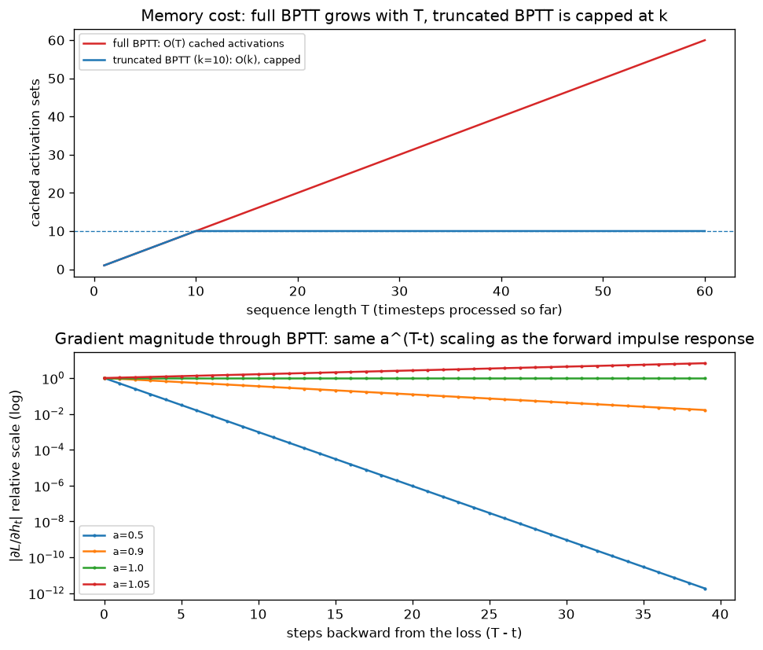

# Day 47 — Concept 46: Backprop Through Time (BPTT)

## 🧠 CONCEPT OF THE DAY

**Intuition first.** Yesterday you unrolled the RNN cell into $T$ copies sharing the same weights. Backprop through time is nothing more than *ordinary backprop applied to that unrolled graph* — there is no new algorithm here, only a new shape of graph. The wrinkle is that every one of those $T$ copies shares the same parameters, so a gradient step doesn't just backprop through one path from loss to weights — it backprops through $T$ *different* paths (one entering the shared $W_{hh}$ at each timestep) and **sums all of them** before the single shared weight matrix gets updated.

**Then the math.** With loss $L = \sum_{t=1}^{T} L_t$ (a per-timestep loss, e.g. next-token prediction), the gradient with respect to the shared recurrent weight is:

$$\frac{\partial L}{\partial W_{hh}} = \sum_{t=1}^{T} \frac{\partial L_t}{\partial W_{hh}} = \sum_{t=1}^{T} \sum_{k=1}^{t} \frac{\partial L_t}{\partial h_t}\left(\prod_{j=k+1}^{t} \frac{\partial h_j}{\partial h_{j-1}}\right)\frac{\partial h_k}{\partial W_{hh}}$$

Don't memorize that — extract the one structural fact that matters: nested inside is a **product of Jacobians** $\prod_{j=k+1}^{t} \partial h_j/\partial h_{j-1}$, one factor per timestep between $k$ and $t$. That product is the multi-dimensional generalization of the scalar $a^{t-k}$ you plotted yesterday (Day 46's Signal Lab) — except now each factor is a full Jacobian matrix (roughly $\text{diag}(\tanh') \cdot W_{hh}$ at each step) instead of a scalar $a$. The forward pass had one feedback gain, $a$; the backward pass multiplies $t-k$ of these Jacobians together to get the gradient signal from step $t$ back to step $k$.

**Why it matters / where it leads.** Two costs fall directly out of this structure, and they're the two panels of today's graph. **Memory:** to compute *any* of these gradients, autograd needs every intermediate $h_1, \dots, h_T$ from the forward pass still in memory — the computational graph is never released until the backward pass finishes, so memory scales $O(T)$ in sequence length. This is why **truncated BPTT** exists in practice: split a long sequence into chunks of length $k$, backprop only within each chunk (`.detach()` the hidden state between chunks so the graph doesn't grow past $k$), and accept that gradients longer than $k$ steps simply don't flow. **Numerical stability:** that Jacobian product is exactly what makes long products of terms with magnitude $<1$ vanish toward zero and terms $>1$ explode — tomorrow's concept ("Why RNNs forget") is the direct consequence of the exact math you just wrote down today, now analyzed as $t - k \to \infty$.

**Interview question:** *"A colleague trains an RNN language model on sequences of length 2,000 using full BPTT and complains training is both painfully slow per step and running out of GPU memory. They ask if increasing batch size would help throughput. What's actually going on, and what's the standard fix?"*

*(Answer at the very bottom.)*

## 🐍 PYTHONIC EDGE

Truncated BPTT in PyTorch is implemented with exactly one operation: `.detach()`. It doesn't change any values — it just cuts the tensor loose from the autograd graph, so gradients stop flowing past that point.

```python
import torch
import torch.nn as nn

rnn = nn.RNN(input_size=8, hidden_size=16, batch_first=True)
optimizer = torch.optim.Adam(rnn.parameters(), lr=1e-3)

full_sequence = torch.randn(4, 2000, 8)  # (batch, T=2000, features) -- way too long for full BPTT
chunk_size = 50

h = torch.zeros(1, 4, 16)  # h0
for start in range(0, full_sequence.size(1), chunk_size):
    chunk = full_sequence[:, start:start + chunk_size, :]

    out, h = rnn(chunk, h)
    loss = out.pow(2).mean()  # stand-in loss

    optimizer.zero_grad()
    loss.backward()          # graph only spans THIS chunk -- O(chunk_size), not O(2000)
    optimizer.step()

    h = h.detach()  # <-- the whole trick: carry the *values* forward, drop the *graph*
    # without this line, h still points into the previous chunk's graph, which PyTorch
    # would try to backprop through a second time on the next .backward() call --
    # and PyTorch frees graphs by default after backward(), so you'd get a hard runtime
    # error ("Trying to backward through the graph a second time") rather than silently
    # accumulating memory. Either way, .detach() is the fix.
```

The mental model, if you're coming from C++: `.detach()` is like returning a plain value instead of a reference/smart-pointer back into the computation history — the numbers survive, but the "how did we get here" chain (needed only for `.backward()`) is severed. It's an $O(1)$ operation; no data is copied.

## 📡 SIGNAL LAB

Today's graph makes both BPTT costs concrete side by side.



**Top panel — memory:** full BPTT's cached-activation count grows linearly and unboundedly with sequence length $T$, because nothing can be freed until the single final `.backward()` call walks all the way back to $t=1$. Truncated BPTT with chunk size $k$ flatlines at $k$ — the graph resets every chunk. This is a direct, unavoidable consequence of how reverse-mode autodiff works: it needs the whole forward trace before it can run backward even one step.

**Bottom panel — the Jacobian-product itself:** this reuses Day 46's $a^{(T-t)}$ curves, but relabels the x-axis as "steps backward from the loss" instead of "timesteps forward from the impulse." That's not a coincidence or a cute callback — it is *the same expression*, because BPTT's Jacobian chain and the forward IIR recurrence are transposes of the same linear operator. In DSP terms: **the backward pass of a linear recurrent filter is itself a linear recurrent filter, running in reverse, with the same pole**. A stable forward filter ($|a|<1$, decaying impulse response) has a backward pass whose gradient contributions from distant past timesteps *also* decay — meaning the network structurally cannot learn dependencies further back than roughly $1/(1-|a|)$ steps, no matter how much data you throw at it. That's the mathematical seed of tomorrow's concept.

## 🏋️ THE GAUNTLET

**Problem: Range Jacobian Product With Updates**

You're tracking a sequence of $n$ per-timestep scalar Jacobian magnitudes $J[1..n]$ (think: $|\partial h_t/\partial h_{t-1}|$ at each step). You must support two operations, interleaved, $q$ times total:

- `UPDATE(i, v)`: set $J[i] = v$ (e.g. weights changed after an optimizer step, so the local Jacobian at position $i$ changed).
- `QUERY(l, r)`: report the *classification* of the product $P = J[l] \cdot J[l+1] \cdots J[r]$:
  - `"VANISHED"` if $P < 10^{-30}$ (including $P = 0$ exactly, if any $J[i]=0$ in range)
  - `"EXPLODED"` if $P > 10^{30}$
  - otherwise, report $P$ itself

**Constraints:**
- $1 \le n, q \le 2\times10^5$
- $0 \le J[i] \le 10^{6}$ (Jacobian magnitudes are non-negative)
- Target: $O((n+q)\log n)$ total

**3 hints (escalating):**
1. A segment tree supporting point update + range product sounds right, but raw floating-point products of up to $2\times10^5$ terms, each as large as $10^6$ or as small as $0$, will overflow/underflow `double` long before you reach the classification thresholds. You need a representation that doesn't multiply raw magnitudes directly.
2. Logarithms turn products into sums: $\log P = \sum \log J[i]$. A segment tree over $\log J[i]$ supports the same point-update / range-query pattern, but now via **addition**, which doesn't overflow anywhere near as easily. What do you do about $J[i] = 0$, where $\log$ is undefined?
3. Track two things per segment-tree node: (a) the count of zeros in the range, and (b) the sum of $\log J[i]$ over the *non-zero* entries. A query first checks the zero-count — if it's nonzero, the product is exactly 0 → `"VANISHED"`. Otherwise compare the summed log against $\log(10^{-30})$ and $\log(10^{30})$, and only call `exp()` to materialize the actual product when it's safely in range.

**Pattern:** segment tree, point update + range query, log-space transform for numerical range. Target: $O((n+q)\log n)$ time, $O(n)$ space.

## 🏗️ BLUEPRINT

**Truncated BPTT's chunk size is a latency/memory-vs-learnable-horizon dial, not a free parameter.** In production sequence-model training (this applies just as much to modern Transformer training with activation checkpointing as to classic RNNs), the chunk/checkpoint size directly trades three things against each other: peak activation memory (smaller chunks = less memory, since fewer intermediates are held live), step latency (smaller chunks = less compute per `.backward()` call, but more chunks per epoch and more Python/kernel-launch overhead), and *the longest dependency the model can possibly learn* — a truncation window of $k$ makes it structurally impossible for gradient to ever connect a token to anything more than $k$ steps in its past, regardless of how long the actual sequences or how much data you have. Picking $k$ is therefore a modeling decision as much as an infra one: it silently caps what the model *can* learn before you've written a single line of architecture code.

## 🗺️ MARCHING ORDERS

You now know exactly why RNN training either needs bounded memory (truncated BPTT) or unbounded memory (full BPTT) — and you've seen the Jacobian-product structure that will explain tomorrow's core failure mode.

Tomorrow: Concept 47 — Why RNNs forget

---

🔓 GAUNTLET SOLUTION

```cpp
#include <bits/stdc++.h>
using namespace std;

// Segment tree over log(J[i]) for non-zero entries, plus a zero-count per node.
// Range product classification via log-space summation avoids float overflow/underflow
// that a direct running product would hit almost immediately at n ~ 2e5.
struct SegTree {
    int n;
    vector<double> logSum; // sum of log(J[i]) over non-zero i in range
    vector<int> zeroCount; // count of J[i] == 0 in range
    vector<double> raw;    // stored raw J[i] values, for rebuilding on update

    SegTree(int n_) : n(n_), logSum(4 * n_, 0.0), zeroCount(4 * n_, 0), raw(n_ + 1, 0.0) {}

    void build(int node, int l, int r, vector<double>& J) {
        if (l == r) {
            raw[l] = J[l];
            if (J[l] == 0.0) { zeroCount[node] = 1; logSum[node] = 0.0; }
            else { zeroCount[node] = 0; logSum[node] = log(J[l]); }
            return;
        }
        int mid = (l + r) / 2;
        build(2 * node, l, mid, J);
        build(2 * node + 1, mid + 1, r, J);
        logSum[node] = logSum[2 * node] + logSum[2 * node + 1];
        zeroCount[node] = zeroCount[2 * node] + zeroCount[2 * node + 1];
    }

    void update(int node, int l, int r, int idx, double v) {
        if (l == r) {
            raw[idx] = v;
            if (v == 0.0) { zeroCount[node] = 1; logSum[node] = 0.0; }
            else { zeroCount[node] = 0; logSum[node] = log(v); }
            return;
        }
        int mid = (l + r) / 2;
        if (idx <= mid) update(2 * node, l, mid, idx, v);
        else update(2 * node + 1, mid + 1, r, idx, v);
        logSum[node] = logSum[2 * node] + logSum[2 * node + 1];
        zeroCount[node] = zeroCount[2 * node] + zeroCount[2 * node + 1];
    }

    // returns {sumLog, zeroCount} for range [ql, qr]
    pair<double, int> query(int node, int l, int r, int ql, int qr) {
        if (qr < l || r < ql) return {0.0, 0};
        if (ql <= l && r <= qr) return {logSum[node], zeroCount[node]};
        int mid = (l + r) / 2;
        auto left = query(2 * node, l, mid, ql, qr);
        auto right = query(2 * node + 1, mid + 1, r, ql, qr);
        return {left.first + right.first, left.second + right.second};
    }
};

int main() {
    int n;
    cin >> n;
    vector<double> J(n + 1);
    for (int i = 1; i <= n; ++i) cin >> J[i];

    SegTree tree(n);
    tree.build(1, 1, n, J);

    int q;
    cin >> q;
    const double LOG_LOW = log(1e-30), LOG_HIGH = log(1e30);

    while (q--) {
        char op;
        cin >> op;
        if (op == 'U') {
            int i; double v;
            cin >> i >> v;
            tree.update(1, 1, n, i, v);
        } else {
            int l, r;
            cin >> l >> r;
            auto [sumLog, zeros] = tree.query(1, 1, n, l, r);
            if (zeros > 0) cout << "VANISHED\n";
            else if (sumLog < LOG_LOW) cout << "VANISHED\n";
            else if (sumLog > LOG_HIGH) cout << "EXPLODED\n";
            else cout << exp(sumLog) << "\n";
        }
    }
    return 0;
}
```

Complexity: build is $O(n)$, each update/query is $O(\log n)$, so total $O((n+q)\log n)$ time, $O(n)$ space.

---

💡 CONCEPT ANSWER

**Increasing batch size does not fix this — the bottleneck is sequence length, not batch size.**

The slowness and memory blowup both come from the exact structural fact in today's concept: with full BPTT on a length-2,000 sequence, the computational graph must hold all 2,000 timesteps' worth of activations simultaneously before a single `.backward()` call can run, and the backward pass itself must walk the full 2,000-step Jacobian chain. Batch size is a *separate* axis — it parallelizes independent sequences, but it doesn't touch the length of any one sequence's unrolled graph. Cranking batch size up would multiply the (already too-large) per-step memory footprint by the batch factor, making the out-of-memory problem *worse*, while doing nothing for the per-step latency along the time axis.

**The standard fix is truncated BPTT:** split each 2,000-length sequence into chunks (e.g. $k=50$–$200$), run the RNN forward and backward chunk-by-chunk, `.detach()` the hidden state between chunks so the graph never exceeds $O(k)$ activations, and carry the hidden state's *values* (not its graph) forward into the next chunk. This bounds both memory and per-step compute to $O(k)$ instead of $O(T)$, at the accepted cost that gradients can never connect two timesteps more than $k$ apart — a tradeoff, not a free lunch, and exactly the mechanism discussed in today's Blueprint.
