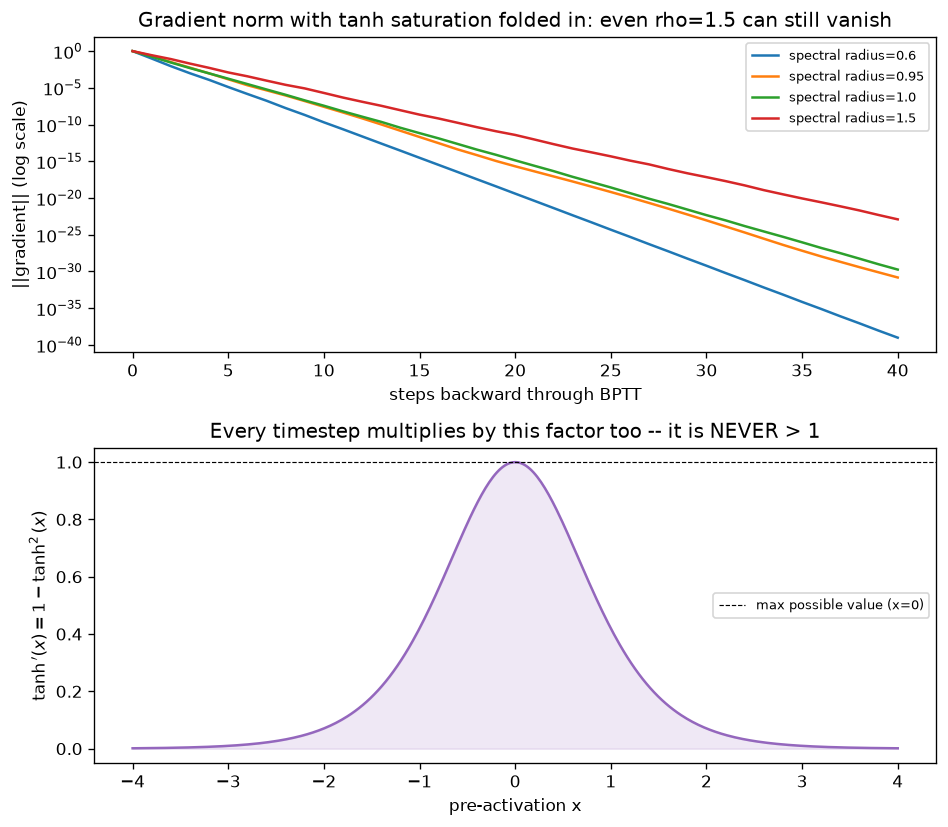

# Day 48 — Concept 47: Why RNNs Forget

## 🧠 CONCEPT OF THE DAY

**Intuition first.** The last two days built the machinery; today names the failure it produces. "Why RNNs forget" is not a separate bug bolted onto the RNN — it's the direct, inevitable consequence of the Jacobian-product structure from Day 47, evaluated as the gap $t-k$ grows large. A vanilla RNN's memory of anything more than roughly a few dozen steps back is, in practice, gone — not because the architecture "chooses" to discard it, but because the gradient signal that would teach it to *keep* that information shrinks toward numerical zero before it ever reaches the responsible parameters.

**Then the math.** Recall from Day 47 that the gradient flowing from step $t$ back to step $k$ passes through the product $\prod_{j=k+1}^{t} \partial h_j / \partial h_{j-1}$. For the standard RNN cell $h_j = \tanh(W_{xh}x_j + W_{hh}h_{j-1} + b_h)$, each factor is:

$$\frac{\partial h_j}{\partial h_{j-1}} = \text{diag}\big(1 - \tanh^2(z_j)\big) \cdot W_{hh}$$

where $z_j$ is the pre-activation. Two independent shrinking forces multiply together at *every single step*:

1. **$\tanh'(z_j) = 1-\tanh^2(z_j)$ is bounded by 1, and equals 1 *only* at $z_j=0$.** The moment activations are pushed away from zero (which is most of the time, once the network has learned anything non-trivial), this factor is meaningfully below 1 — often around 0.1–0.3 for a well-trained saturated network. This is a property of the *activation*, entirely independent of the weights.
2. **$W_{hh}$'s spectral radius (largest eigenvalue magnitude).** If it's below 1, it independently shrinks the signal; if it's above 1, it grows the signal — but even when it's above 1, the $\tanh'$ factor above can still drag the *combined* product below 1, because the two effects multiply.

**Why it matters / where it leads.** This is the key insight today's graph is built to show: **a spectral radius comfortably above 1 does not guarantee healthy gradients**, because $\tanh'$ is fighting it every step. And symmetrically: fixing the eigenvalues alone (careful initialization, orthogonal $W_{hh}$) does not fully fix vanishing, because tanh saturation is a property of the *data flowing through the network*, not something initialization can pin down once training actually moves the activations away from zero. This is precisely the design gap concept 48 (LSTM, tomorrow) exists to close: instead of trying to tune a multiplicative recurrence to sit exactly on the knife's edge between vanishing and exploding, the LSTM introduces an *additive*, gated path for the cell state that doesn't require repeatedly multiplying by a sub-1 factor at every step just to keep old information alive.

**Interview question:** *"A teammate proposes fixing vanishing gradients in a vanilla RNN by swapping tanh for ReLU. Would this help? What new problem does it risk introducing, and why doesn't it fully solve the underlying issue?"*

*(Answer at the very bottom.)*

## 🐍 PYTHONIC EDGE

You can watch this happen directly by inspecting gradient norms per layer/timestep after a `.backward()` call — the classic debugging move for a suspiciously-not-learning RNN.

```python
import torch
import torch.nn as nn

torch.manual_seed(47)
rnn = nn.RNN(input_size=8, hidden_size=64, batch_first=True, nonlinearity="tanh")
x = torch.randn(1, 100, 8)  # a single long-ish sequence, batch=1

out, _ = rnn(x)
loss = out[:, -1, :].pow(2).sum()  # loss depends ONLY on the very last timestep's output
loss.backward()

# retain_grad() would be needed to inspect INTERMEDIATE hidden states directly, since
# PyTorch only keeps .grad populated for leaf tensors (parameters) by default.
# What we CAN inspect directly: the recurrent weight's gradient contribution vs. the
# input weight's -- and, more tellingly, we can retrace the effect by re-running with
# retain_grad() on hidden states to see the per-step gradient magnitude decay directly:

h = torch.zeros(1, 1, 64, requires_grad=False)
hiddens = []
hh = h
for t in range(x.size(1)):
    hh = torch.tanh(x[:, t, :] @ rnn.weight_ih_l0.T + hh @ rnn.weight_hh_l0.T)
    hh.retain_grad()  # normally NOT retained for non-leaf tensors -- opt in explicitly
    hiddens.append(hh)

final_loss = hiddens[-1].pow(2).sum()
final_loss.backward()

grad_norms = [h.grad.norm().item() for h in hiddens]
print(grad_norms[:5], "...", grad_norms[-5:])
# expect grad_norms near t=99 (closest to the loss) to be orders of magnitude larger
# than grad_norms near t=0 -- that gap IS vanishing gradients, made visible.
```

`retain_grad()` is the tool here: PyTorch only auto-populates `.grad` for leaf tensors (parameters, or tensors you explicitly created with `requires_grad=True`), not for every intermediate activation — calling it opts a specific non-leaf tensor into keeping its gradient around after `.backward()`, purely for inspection.

## 📡 SIGNAL LAB



**Top panel** simulates the *real* (non-scalar, non-linear) gradient path: a random $64\times 64$ matrix rescaled to a specific spectral radius, with a representative tanh-saturation factor ($\tanh'(1.5) \approx 0.19$, a plausible "mildly saturated" operating point) multiplied in at every step. Even at spectral radius $1.5$ — which, by the *linear-only* intuition from Day 47, should explode — the combined gradient still decays for many steps once saturation is accounted for, because $1.5 \times 0.19 \approx 0.28 < 1$ per step. Only spectral radius large enough to overcome the saturation factor (here, well above 1.5) would actually explode once tanh is in the loop.

**Bottom panel** shows why that saturation factor is so punishing: $\tanh'(x)$ peaks at exactly $1$ only at $x=0$ and falls off fast — by $|x|=2$ it's already under $0.07$. A trained RNN's hidden units spend most of their time away from zero (that's what makes tanh useful as a nonlinearity in the first place — it's *supposed* to saturate to make decisive gate-like decisions). The tragic irony: the more "confidently" an RNN's units are saturated (the more decisively they've learned to represent something), the more thoroughly they choke off gradient flow to everything before them. **A well-trained vanilla RNN actively sabotages its own ability to learn longer-range dependencies just by doing its job.**

## 🏋️ THE GAUNTLET

**Problem: Longest Surviving Gradient Window**

You're given an array of $n$ per-step gradient-scaling factors `g[1..n]`, each satisfying $0 < g[i] \le 1$ (this models the *shrinking* regime — every step's combined tanh-saturation-times-eigenvalue factor is at most 1, the common case for a trained RNN). Given a threshold $T$ with $0 < T \le 1$, find the length of the **longest contiguous window** $[l, r]$ such that the gradient signal hasn't vanished below the threshold over that stretch:

$$\prod_{i=l}^{r} g[i] \ge T$$

**Constraints:**
- $1 \le n \le 2\times10^5$
- $10^{-6} \le g[i] \le 1$
- $10^{-9} \le T \le 1$
- Target: $O(n)$ time

**3 hints (escalating):**
1. Products of up to $2\times10^5$ small numbers underflow a `double` almost immediately — you need to work in log-space, same trick as yesterday's Gauntlet. Let $s[i] = \log g[i] \le 0$; the constraint becomes $\sum_{i=l}^{r} s[i] \ge \log T$.
2. Since every $s[i] \le 0$, adding an element to the window (extending $r$) can only *decrease or keep* the running sum, and removing an element (advancing $l$) can only *increase or keep* it. That's a one-directional monotonicity in both operations — exactly the condition a two-pointer / sliding-window scan needs to be correct without ever re-scanning.
3. Slide $r$ from left to right, maintaining a running sum. Whenever the running sum drops below $\log T$, advance $l$ (removing $s[l]$ from the sum, incrementing $l$) until the window is valid again or empty. Track the max $(r-l+1)$ seen. Each of $l$ and $r$ only ever moves forward, so total work is $O(n)$.

**Pattern:** two-pointer sliding window in log-space (monotonic-sum variant). Target: $O(n)$ time, $O(1)$ extra space.

## 🏗️ BLUEPRINT

No blueprint today.

## 🗺️ MARCHING ORDERS

You now understand vanishing gradients as a *compounding* effect — activation saturation and recurrent-weight spectral radius multiplying together every single step — not a simple "bad initialization" problem you can init your way out of. That's the exact gap the next architecture is built to close.

Tomorrow: Concept 48 — LSTM gates & cell state

---

🔓 GAUNTLET SOLUTION

```cpp
#include <bits/stdc++.h>
using namespace std;

// Two-pointer sliding window in log-space. Since every s[i] = log(g[i]) <= 0,
// the running sum is monotonically non-increasing as the window grows and
// non-decreasing as it shrinks -- the exact property that makes a two-pointer
// scan correct here (same shape as "shortest window with sum >= X" problems,
// just running in the opposite monotonic direction because our terms are <= 0).
int longestSurvivingWindow(vector<double>& g, double T) {
    int n = g.size();
    double logT = log(T);

    int l = 0;
    double runningSum = 0.0;
    int best = 0;

    for (int r = 0; r < n; ++r) {
        runningSum += log(g[r]);

        while (l <= r && runningSum < logT) {
            runningSum -= log(g[l]);
            ++l;
        }

        if (l <= r) best = max(best, r - l + 1);
    }
    return best;
}

int main() {
    int n;
    double T;
    cin >> n >> T;
    vector<double> g(n);
    for (auto& v : g) cin >> v;

    cout << longestSurvivingWindow(g, T) << "\n";
    return 0;
}
```

Complexity: `l` and `r` each advance at most $n$ times total across the whole scan (never reset backward), so total work is $O(n)$ time, $O(1)$ extra space beyond the input.

---

💡 CONCEPT ANSWER

**It would help with one half of the problem and actively worsen the other half — it doesn't solve vanishing gradients, it trades them for a different failure mode.**

**Why it helps, partially:** ReLU's derivative is either exactly $1$ (for positive pre-activations) or exactly $0$ (for negative ones) — never a fraction strictly between 0 and 1 like $\tanh'$ almost always is. So for the *active* units, the saturation-shrinkage factor from today's concept disappears entirely: no more "even spectral radius 1.5 can still vanish because of the activation" effect. This is exactly why ReLU-family activations became standard in deep feedforward and convolutional nets (concept 20, vanishing gradients, already covered this).

**Why it doesn't fully fix RNNs, and what breaks instead:** with the saturation factor gone, the *only* thing left controlling the Jacobian product across timesteps is $W_{hh}$'s spectral radius, unmediated. That means the RNN now sits exactly on the earlier "linear-only" curves from Day 47/48's top-left analysis: spectral radius $<1$ still vanishes, cleanly and monotonically now instead of being partially masked by saturation, and — more dangerously — spectral radius $>1$ now **explodes without anything holding it back**, since there's no sub-1 tanh factor left to counteract it. In practice, vanilla RNN + ReLU is notoriously prone to activations blowing up to `inf`/`NaN` within a handful of timesteps unless $W_{hh}$ is very carefully constrained (e.g. initialized as an identity or orthogonal matrix — the IRNN trick). It also does nothing for the *other* half of the original problem: even a perfectly-behaved multiplicative recurrence still requires the signal to survive $t-k$ multiplications to reach a distant timestep at all. Tomorrow's fix (LSTM) sidesteps this by giving the cell state a path where old information is preserved *additively*, not by repeatedly surviving a multiplicative gauntlet — a structural fix, not a tuning fix.
