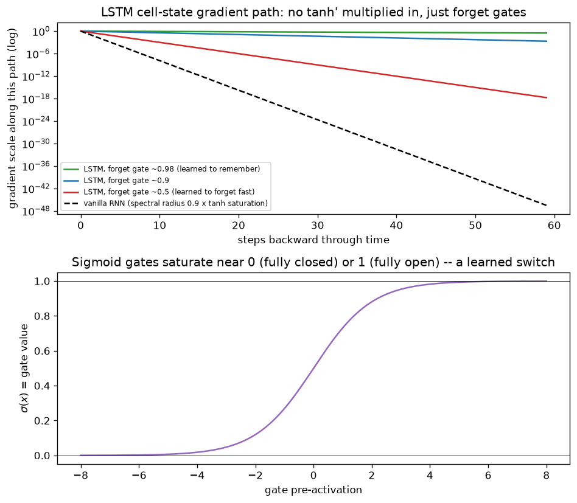

# Day 49 — Concept 48: LSTM Gates & Cell State

## 🧠 CONCEPT OF THE DAY

**Intuition first.** Yesterday's conclusion was structural, not tunable: a vanilla RNN's hidden state carries old information forward only by repeatedly surviving a *multiplicative* gauntlet (spectral radius times tanh-saturation, every single step), and that product is essentially guaranteed to vanish or explode over long horizons. The LSTM's core idea is to stop relying on that gauntlet at all. It adds a second piece of state — the **cell state** $c_t$ — whose update is *additive*, not purely multiplicative, giving old information a path to survive without having to repeatedly beat down a shrinking multiplier.

Three learned **gates** (each a sigmoid, so squashed to $(0,1)$ — a soft "how much" switch, not a hard on/off) control that update:

- **Forget gate** $f_t$: how much of the *old* cell state to keep.
- **Input gate** $i_t$: how much of the *new* candidate information to let in.
- **Output gate** $o_t$: how much of the cell state to actually expose as the hidden state this step.

**Then the math.** At each timestep, given $x_t$ and the previous $h_{t-1}, c_{t-1}$:

$$f_t = \sigma(W_f [h_{t-1}, x_t] + b_f) \qquad i_t = \sigma(W_i [h_{t-1}, x_t] + b_i) \qquad o_t = \sigma(W_o [h_{t-1}, x_t] + b_o)$$

$$\tilde{c}_t = \tanh(W_c [h_{t-1}, x_t] + b_c) \qquad c_t = f_t \odot c_{t-1} + i_t \odot \tilde{c}_t \qquad h_t = o_t \odot \tanh(c_t)$$

($\odot$ is element-wise product; $[h_{t-1},x_t]$ means concatenation.) The load-bearing line is $c_t = f_t \odot c_{t-1} + i_t \odot \tilde{c}_t$ — notice there is **no weight matrix and no tanh applied to $c_{t-1}$ itself** on its way into $c_t$. It's scaled element-wise by a gate and then *added* to, not matrix-multiplied and squashed.

**Why it matters / where it leads.** Differentiate that line: $\partial c_t / \partial c_{t-1} = f_t$ (element-wise), full stop — no $W_{hh}$, no $\tanh'$. This should look familiar: it's structurally identical to a **residual/skip connection** (concept 41, ResNet) — the cell state has a near-identity path across timesteps, gated by $f_t$ rather than always-on, but critically *not* forced to pass through a squashing nonlinearity and a full weight matrix every step the way the vanilla RNN's hidden state was. If the network learns to push $f_t$ close to $1$ for information worth keeping, the gradient along the cell-state path barely shrinks at all across dozens or hundreds of steps — the LSTM doesn't eliminate the possibility of vanishing gradients, but it gives the network an explicit, learnable *choice* to avoid it, where the vanilla RNN had no such choice available at all.

**Interview question:** *"Why does the LSTM cell state update by element-wise multiply-then-add ($c_t = f_t \odot c_{t-1} + i_t \odot \tilde c_t$) instead of running $c_{t-1}$ through a weight matrix and a tanh, the way the hidden state $h_t$ effectively does in a vanilla RNN? What would break if you added a tanh directly on the $c_{t-1}$ term?"*

*(Answer at the very bottom.)*

## 🐍 PYTHONIC EDGE

`nn.LSTMCell` and `nn.LSTM` mirror the `RNNCell`/`RNN` split from Day 46, but now the state is a **pair** — `(h, c)` — not a single tensor, and that trips people up constantly.

```python
import torch
import torch.nn as nn

batch, input_size, hidden_size = 4, 8, 16

cell = nn.LSTMCell(input_size, hidden_size)
x_t = torch.randn(batch, input_size)

h = torch.zeros(batch, hidden_size)
c = torch.zeros(batch, hidden_size)

h, c = cell(x_t, (h, c))  # NOTE: state is a tuple (h, c), not a single tensor like RNNCell
# common bug: writing `h = cell(x_t, h)` (copy-pasted from RNNCell code) -- TypeError,
# LSTMCell always expects (h, c) as a 2-tuple, even though only h is "the output" you'd
# normally feed downstream (e.g. into a classifier head).

# Full-sequence nn.LSTM: same (h, c) pairing, now for the whole unrolled sequence
lstm = nn.LSTM(input_size, hidden_size, batch_first=True)
seq = torch.randn(batch, 20, input_size)
out, (h_final, c_final) = lstm(seq)
# out:      (batch, 20, hidden_size)         -- h_t for every t (NOT c_t -- c is never
#                                                exposed outside the cell by default)
# h_final:  (1, batch, hidden_size)          -- h_T only
# c_final:  (1, batch, hidden_size)          -- c_T only, needed if you want to CONTINUE
#                                                the recurrence later (stateful LSTM)
```

The gotcha worth internalizing: `out` gives you every $h_t$, but **never** gives you every $c_t$ — the cell state is treated as pure internal bookkeeping, only its final value is returned. If you ever need $c_t$ at every step (rare, but happens in some cell-state-visualization or gradient-flow debugging work), you're back to the manual `LSTMCell` loop from above.

## 📡 SIGNAL LAB

Today's graph puts the LSTM's cell-state gradient path directly next to Day 48's vanilla RNN curve, same log scale.



**Top panel:** the cell-state gradient path is literally the running product of forget-gate values, $\prod f_t$ — nothing else multiplies in. When the network has learned to hold $f_t \approx 0.98$ for information worth remembering, that product only drops to about $0.30$ after 60 steps — compare that to the vanilla RNN's dashed curve, which (using Day 48's realistic spectral-radius-times-saturation factor of about $0.17$ per step) is already below $10^{-40}$ by step 60. Same axis, same log scale, roughly *forty orders of magnitude* apart. That gap is not a tuning difference — it's the difference between a multiplicative-only recurrence and one with a genuinely additive, gate-controlled path.

**Bottom panel** is a reminder of *why* the gates behave like clean switches rather than smoothly-blended averages in practice: sigmoid pre-activations pushed even moderately away from zero (which is exactly what a trained gate's weights are optimized to do, once the gate has "decided" what it's for) saturate hard toward $0$ or $1$ within a few units. A learned forget gate isn't approximating "keep 73% of the old state" — in a well-trained network it's closer to a soft binary decision, "keep this" or "drop this," which is precisely the discrete, interpretable memory-control behavior that made LSTMs so effective on tasks with genuinely long-range structure (e.g. matching an opening and closing bracket dozens of tokens apart).

## 🏋️ THE GAUNTLET

**Problem: Cell State Simulator**

You're given the LSTM cell-state recurrence in its general affine form: for $t=1,\dots,n$,

$$c_t = f_t \cdot c_{t-1} + b_t$$

where `f[1..n]` (each in $(0,1]$, a forget-gate value) and `b[1..n]` (the injected new information, $i_t \cdot \tilde c_t$) are given, and both arrays can be modified between queries (training updates the gate weights). Support, interleaved, up to $q$ operations:

- `UPDATE(t, f, b)`: set `f[t] = f`, `b[t] = b`.
- `QUERY(l, r, c0)`: assuming $c_{l-1} = c0$, run the recurrence forward through steps $l, \dots, r$ using the *current* `f[]`/`b[]` values, and report $c_r$.

**Constraints:**
- $1 \le n, q \le 2\times10^5$
- Target: $O(\log n)$ per update and per query, $O(n)$ preprocessing

**3 hints (escalating):**
1. Each step is an **affine map** of the running value: $c_t = f_t \cdot c_{t-1} + b_t$, i.e. $x \mapsto A_t x + B_t$ with $A_t = f_t$, $B_t = b_t$. Composing two affine maps of one variable produces another affine map — if step 1 is $x \mapsto A_1 x + B_1$ and step 2 is $x \mapsto A_2 x + B_2$, doing step 1 *then* step 2 gives $x \mapsto (A_2 A_1) x + (A_2 B_1 + B_2)$. What data structure lets you merge adjacent affine maps in $O(1)$ and rebuild only $O(\log n)$ ancestors after a single-position change?
2. Build a segment tree where leaf $t$ stores the map $(A_t, B_t) = (f_t, b_t)$, and every internal node stores the *single composed affine map* for its entire range, merged left-child-then-right-child (order matters — affine composition is **not** commutative in general).
3. `UPDATE` is a standard point update: change one leaf, recompute $O(\log n)$ ancestors via the $O(1)$ merge rule. `QUERY(l, r, c0)` walks the segment tree collecting the $O(\log n)$ canonical nodes covering $[l,r]$, composes them together **in left-to-right order** into one combined map $(A,B)$, then returns $A \cdot c0 + B$.

**Pattern:** segment tree over an associative (non-commutative) monoid — affine-function composition. Target: $O(\log n)$ per operation after $O(n)$ build.

## 🏗️ BLUEPRINT

No blueprint today.

## 🗺️ MARCHING ORDERS

You now have the gate/cell-state mechanics that make LSTMs the long-standing default "just make it work" choice for sequence memory, and you can see precisely *why* they fix Day 48's forgetting problem rather than just papering over it. Next up is the streamlined sibling that keeps most of the benefit with fewer gates.

Tomorrow: Concept 49 — GRU

---

🔓 GAUNTLET SOLUTION

```cpp
#include <bits/stdc++.h>
using namespace std;

// Segment tree over affine maps x -> A*x + B, one map per leaf (f_t, b_t),
// merged via affine composition. QUERY composes the O(log n) canonical nodes
// covering [l, r] in strict left-to-right order (composition is not commutative),
// then applies the combined map to c0 in O(1).
struct AffineMap {
    double A, B; // x -> A*x + B
};

AffineMap mergeMaps(const AffineMap& first, const AffineMap& second) {
    // apply `first` then `second`: second.A * (first.A * x + first.B) + second.B
    return {second.A * first.A, second.A * first.B + second.B};
}

struct SegTree {
    int n;
    vector<AffineMap> tree;

    SegTree(int n_) : n(n_), tree(4 * n_, {1.0, 0.0}) {}

    void build(int node, int l, int r, vector<double>& f, vector<double>& b) {
        if (l == r) { tree[node] = {f[l], b[l]}; return; }
        int mid = (l + r) / 2;
        build(2 * node, l, mid, f, b);
        build(2 * node + 1, mid + 1, r, f, b);
        tree[node] = mergeMaps(tree[2 * node], tree[2 * node + 1]);
    }

    void update(int node, int l, int r, int idx, double f, double b) {
        if (l == r) { tree[node] = {f, b}; return; }
        int mid = (l + r) / 2;
        if (idx <= mid) update(2 * node, l, mid, idx, f, b);
        else update(2 * node + 1, mid + 1, r, idx, f, b);
        tree[node] = mergeMaps(tree[2 * node], tree[2 * node + 1]);
    }

    // returns the composed affine map for [ql, qr], or identity if the range
    // doesn't intersect [l, r] at this node
    AffineMap query(int node, int l, int r, int ql, int qr) {
        if (qr < l || r < ql) return {1.0, 0.0}; // identity map
        if (ql <= l && r <= qr) return tree[node];
        int mid = (l + r) / 2;
        AffineMap left = query(2 * node, l, mid, ql, qr);
        AffineMap right = query(2 * node + 1, mid + 1, r, ql, qr);
        return mergeMaps(left, right); // left range applied BEFORE right range
    }
};

int main() {
    int n;
    cin >> n;
    vector<double> f(n + 1), b(n + 1);
    for (int i = 1; i <= n; ++i) cin >> f[i];
    for (int i = 1; i <= n; ++i) cin >> b[i];

    SegTree tree(n);
    tree.build(1, 1, n, f, b);

    int q;
    cin >> q;
    while (q--) {
        char op;
        cin >> op;
        if (op == 'U') {
            int t; double newF, newB;
            cin >> t >> newF >> newB;
            tree.update(1, 1, n, t, newF, newB);
        } else {
            int l, r; double c0;
            cin >> l >> r >> c0;
            AffineMap combined = tree.query(1, 1, n, l, r);
            cout << (combined.A * c0 + combined.B) << "\n";
        }
    }
    return 0;
}
```

Complexity: build is $O(n)$; each update recomputes $O(\log n)$ ancestors at $O(1)$ each; each query touches $O(\log n)$ canonical nodes and merges them at $O(1)$ each — $O(\log n)$ per operation, $O(n)$ space.

---

💡 CONCEPT ANSWER

**Adding a tanh (or any weight matrix) directly on the $c_{t-1}$ term would reintroduce exactly the vanishing-gradient mechanism the cell state exists to avoid.**

The whole point of $c_t = f_t \odot c_{t-1} + i_t \odot \tilde c_t$ is that $\partial c_t/\partial c_{t-1} = f_t$ — a clean, element-wise, boundable-near-1 factor, with **nothing else multiplied in**. If you instead wrote something like $c_t = \tanh(W_c c_{t-1}) + i_t \odot \tilde c_t$, you'd get $\partial c_t/\partial c_{t-1} = \text{diag}(\tanh') \cdot W_c$ — which is *precisely* the vanilla-RNN Jacobian factor from Day 48, tanh-saturation and weight-matrix spectral radius multiplying together every step. You'd have rebuilt the exact multiplicative gauntlet the LSTM was invented to route around, just with an extra gate mechanism bolted on top for no structural benefit.

This is also why the *forget gate itself* being a sigmoid (not a tanh, not unbounded) matters: $f_t \in (0,1)$ guarantees the cell-state path can never explode purely from the gating multiplier (unlike an uncontrolled $W_{hh}$ with spectral radius $>1$), while still allowing $f_t \to 1$ to make the path nearly lossless when the network has learned that's the right call. The design is deliberately asymmetric: gates are bounded, gentle, multiplicative *scalers* of an otherwise additive highway — never a replacement squashing function sitting directly in that highway's main path.
