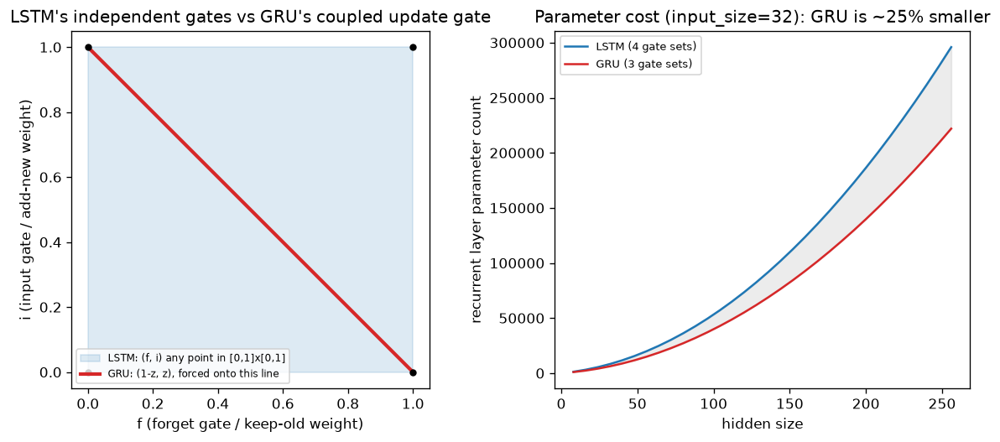

# Day 50 — Concept 49: GRU

*(Fifth of six RNN/LSTM-family concepts. Concept 50 — Bidirectional RNNs — is intentionally deferred for a later session; from here we jump straight to concept 51, Seq2seq encoder–decoder, which begins the bridge into attention.)*

## 🧠 CONCEPT OF THE DAY

**Intuition first.** The GRU (Gated Recurrent Unit) asks: does the LSTM really need *two* separate pieces of state (cell state $c_t$ and hidden state $h_t$) and *three* independent gates (forget, input, output)? Its answer is no — merge the cell state and hidden state into one, and **couple** the forget and input decisions into a single gate instead of learning them independently. The result does noticeably less bookkeeping per step, with comparable performance on most tasks.

**Then the math.** With a single hidden state $h_t$ (no separate cell state):

$$z_t = \sigma(W_z[h_{t-1}, x_t]) \qquad r_t = \sigma(W_r[h_{t-1}, x_t])$$

$$\tilde{h}_t = \tanh(W_h[r_t \odot h_{t-1}, \, x_t]) \qquad h_t = (1-z_t)\odot h_{t-1} + z_t \odot \tilde{h}_t$$

The **update gate** $z_t$ plays the LSTM's forget-and-input role *at once*: notice the update line is a **convex combination** — $(1-z_t)$ and $z_t$ always sum to exactly 1, element-wise. Where the LSTM's forget gate $f_t$ and input gate $i_t$ are two *independently* learned sigmoids that can take any values in $[0,1]$ each, the GRU forces "how much old state to keep" and "how much new information to add" to be two sides of the same coin. The **reset gate** $r_t$ does something the LSTM has no direct equivalent for: it controls how much of the *previous* hidden state is even allowed to influence the *candidate* $\tilde h_t$ before the update happens — $r_t \approx 0$ lets the candidate ignore history entirely and start fresh from $x_t$ alone.

**Why it matters / where it leads.** Today's graph makes the coupling concrete: the LSTM's $(f, i)$ pair can be *any* point in the unit square $[0,1]\times[0,1]$ — including, notably, $(1,1)$: keep everything old **and** fully add everything new, letting the cell state's magnitude grow over time (a real, if unusual, LSTM behavior). The GRU's $(1-z, z)$ pair is forced onto the diagonal line $f+i=1$ — a strict subset of what the LSTM can express. That's a genuine tradeoff, not a strict improvement: fewer independent parameters (three gate weight sets instead of four — see the right panel, roughly 25% fewer recurrent parameters at a given hidden size) and a smaller hypothesis space to search during optimization (which often makes GRUs *faster to train* and competitive on small-to-medium datasets), at the cost of provably being unable to represent some update patterns the LSTM can.

**Interview question:** *"The GRU has no separate output gate — its full hidden state $h_t$ is used directly both as the memory carried to the next step AND as the value exposed to downstream layers, unlike the LSTM where $o_t$ lets the network partially hide $c_t$'s content from $h_t$ while still preserving it internally. What's the practical consequence of not having that separation?"*

*(Answer at the very bottom.)*

## 🐍 PYTHONIC EDGE

`nn.GRUCell`/`nn.GRU` follow the exact same API shape as `RNNCell`/`RNN` — a single state tensor, not the `(h, c)` pair LSTM needs — which is precisely why GRU is often the easiest drop-in "try a gated RNN with minimal code churn" swap.

```python
import torch
import torch.nn as nn

batch, input_size, hidden_size = 4, 8, 16

gru_cell = nn.GRUCell(input_size, hidden_size)
lstm_cell = nn.LSTMCell(input_size, hidden_size)

x_t = torch.randn(batch, input_size)

h_gru = torch.zeros(batch, hidden_size)
h_gru = gru_cell(x_t, h_gru)             # single tensor in, single tensor out -- like RNNCell

h_lstm = torch.zeros(batch, hidden_size)
c_lstm = torch.zeros(batch, hidden_size)
h_lstm, c_lstm = lstm_cell(x_t, (h_lstm, c_lstm))  # tuple in, tuple out -- extra bookkeeping

# Swapping nn.LSTM -> nn.GRU in an existing model needs exactly one code-shape change:
# unpacking `out, h_final = gru(seq)` instead of `out, (h_final, c_final) = lstm(seq)`.
# Everything downstream that only ever consumed `out` (e.g. a classifier head reading
# per-timestep hidden states) needs ZERO other changes.
lstm = nn.LSTM(input_size, hidden_size, batch_first=True)
gru = nn.GRU(input_size, hidden_size, batch_first=True)
seq = torch.randn(batch, 20, input_size)

out_lstm, (h_final, c_final) = lstm(seq)
out_gru, h_final_gru = gru(seq)  # one fewer thing to unpack, by construction
```

Parameter count is a one-line sanity check worth running whenever you're deciding between the two for a memory-constrained deployment: `sum(p.numel() for p in gru.parameters())` vs the LSTM equivalent should show almost exactly the 3:4 ratio from today's right-hand graph.

## 📡 SIGNAL LAB



**Left panel:** the LSTM's $(f,i)$ gate pair can land anywhere in the shaded unit square — including corners like $(1,1)$ (keep everything *and* fully add the new candidate, letting $\|c_t\|$ grow over time) or $(0,0)$ (a hard reset to zero). The GRU's $(1-z, z)$ pair is confined to the red diagonal line running through that square — it can still reach any *balance point* between "all old" and "all new," but it can never independently choose to keep everything *and* add everything, or forget everything *and* add nothing. This is the formal version of "coupling forget and input into one gate": a real restriction on the function class, not just an implementation simplification.

**Right panel:** the parameter gap is not a rounding error — for a `hidden_size=256`, `input_size=32` recurrent layer, the LSTM's 4-gate structure costs roughly a third more parameters than the GRU's 3-gate structure, and that gap scales linearly with hidden size in both the $W_x$ and (dominant, for large hidden sizes) $W_h$ terms. On memory- or latency-constrained deployments — on-device sequence models, or anywhere the recurrent layer is the throughput bottleneck — this is often the deciding factor over the LSTM's strictly larger expressiveness.

## 🏋️ THE GAUNTLET

**Problem: Dynamic Context Reset Boundary**

You maintain $n$ reset-gate values `r[1..n]`, each a real number that can change over time, and a fixed threshold $\theta$. A position $j$ counts as a **hard reset point** whenever $r[j] < \theta$ (the GRU's reset gate has decided the candidate at $j$ should mostly ignore history). Support, interleaved, up to $q$ operations:

- `UPDATE(i, v)`: set `r[i] = v`.
- `QUERY(i)`: return the **largest** $j \le i$ such that $r[j] < \theta$ (the nearest hard reset at or before position $i$), or $0$ if no such $j$ exists.

**Constraints:**
- $1 \le n, q \le 2\times10^5$
- Target: $O(\log n)$ per operation

**3 hints (escalating):**
1. A naive `QUERY` that scans backward from $i$ until it finds a qualifying value is $O(n)$ worst case, and with up to $2\times10^5$ queries that's too slow. What's the actual question being asked? "Largest element $\le i$ in some set" is a **predecessor query**.
2. You don't need to scan `r[]` at query time at all — maintain a separate sorted set containing *exactly* the indices $j$ where $r[j] < \theta$ holds right now. `UPDATE(i, v)` only needs to check whether $i$'s membership in that set *changes*: insert $i$ if the new value newly qualifies and the old one didn't, erase $i$ if the old value qualified and the new one doesn't.
3. With that set maintained incrementally, `QUERY(i)` is exactly "largest element of the set that is $\le i$" — a single `upper_bound(i)` followed by stepping one element back (or reporting $0$ if the resulting iterator is `begin()`), both $O(\log n)$ with a balanced BST like `std::set`.

**Pattern:** dynamic predecessor query via an incrementally-maintained ordered set. Target: $O(\log n)$ per operation, $O(n)$ space.

## 🏗️ BLUEPRINT

No blueprint today.

## 🗺️ MARCHING ORDERS

Five concepts in, you've now covered the full "make recurrence actually work" arc: the base RNN cell, how gradients flow backward through it (BPTT), why that flow fails (vanishing/exploding), and two gated fixes (LSTM, GRU) that give the network an explicit, learnable way around the failure. As noted at the top, concept 50 (Bidirectional RNNs) is being deliberately held for later — next up is the encoder–decoder pattern that both RNN variants get plugged into for sequence-to-sequence tasks, which is also where the cracks that motivate attention first appear.

Next: Concept 51 — Seq2seq encoder–decoder

---

🔓 GAUNTLET SOLUTION

```cpp
#include <bits/stdc++.h>
using namespace std;

// Maintains a std::set of "hard reset" indices (r[j] < theta) incrementally.
// UPDATE only touches the set when membership actually flips; QUERY is a
// predecessor lookup via upper_bound + one step back. Both O(log n).
int main() {
    int n;
    double theta;
    cin >> n >> theta;

    vector<double> r(n + 1);
    set<int> resetPoints;
    for (int i = 1; i <= n; ++i) {
        cin >> r[i];
        if (r[i] < theta) resetPoints.insert(i);
    }

    int q;
    cin >> q;
    while (q--) {
        char op;
        cin >> op;
        if (op == 'U') {
            int i; double v;
            cin >> i >> v;
            bool wasReset = r[i] < theta;
            bool nowReset = v < theta;
            r[i] = v;
            if (wasReset && !nowReset) resetPoints.erase(i);
            else if (!wasReset && nowReset) resetPoints.insert(i);
            // if wasReset == nowReset, membership doesn't change -- no set op needed
        } else {
            int i;
            cin >> i;
            auto it = resetPoints.upper_bound(i); // first element strictly > i
            if (it == resetPoints.begin()) {
                cout << 0 << "\n"; // no qualifying j <= i
            } else {
                --it; // step back to the largest element <= i
                cout << *it << "\n";
            }
        }
    }
    return 0;
}
```

Complexity: each `UPDATE` does at most one `std::set` insert/erase, $O(\log n)$; each `QUERY` does one `upper_bound` plus a constant-time step, $O(\log n)$. Total $O((n+q)\log n)$ time, $O(n)$ space.

---

💡 CONCEPT ANSWER

**Losing the output gate means the GRU can't independently "hide" part of its memory from what gets exposed downstream — whatever the hidden state currently holds is exactly what every consumer of it sees, every step.**

In the LSTM, $c_t$ can keep carrying information forward internally (e.g. "I'm 40 tokens into a nested clause, remember the depth") while $o_t$ suppresses most of it from $h_t$ at a given step, so a downstream classifier reading $h_t$ at that step doesn't get confused by internal bookkeeping that isn't relevant *yet*. The GRU has no such separation: its single $h_t$ is simultaneously (a) the full carried memory into the next timestep and (b) the complete signal exposed to any layer consuming this timestep's output. If the network needs to track something across many steps *without* that information being immediately relevant to the current-step output, the GRU has to represent it inside the same vector that's also being read downstream at every step — it can't cleanly compartmentalize "for later" from "for now" the way the LSTM's $c_t$/$h_t$ split allows.

In practice this rarely causes a measurable performance gap — GRUs are broadly competitive with LSTMs on most benchmarks — but it is the concrete mechanism behind the (occasionally observed) cases where LSTMs pull ahead on tasks with unusually long-range, "carry quietly, reveal much later" dependency structure, and it's the correct, specific answer to "why not just always use GRU" beyond a hand-wavy "LSTM is sometimes better."
