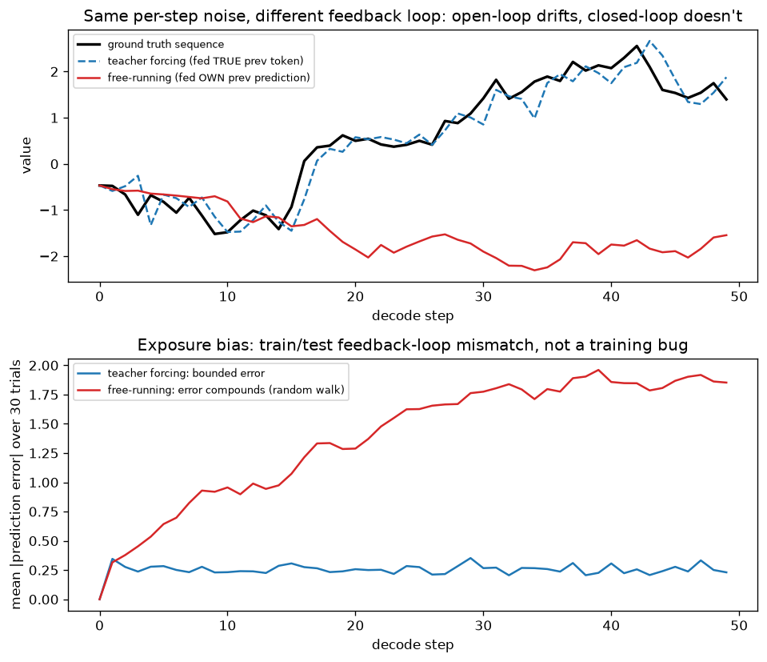

# Day 51 — Concept 51: Seq2seq Encoder–Decoder

*(Concept 50, Bidirectional RNNs, remains intentionally deferred. This concept begins the two-day bridge into Phase 6 — the encoder-decoder pattern here is exactly what attention is grafted onto.)*

## 🧠 CONCEPT OF THE DAY

**Intuition first.** Everything through Day 50 assumed input and output are aligned one-to-one — one hidden state per input token, roughly one prediction per timestep. Real tasks like translation don't work that way: "How are you?" (4 tokens) might become "Comment ça va ?" (4 different tokens, different order, different language). Seq2seq solves this with two separate RNNs (either flavor — vanilla, LSTM, or GRU) wired together through a single handoff point: an **encoder** reads the entire input sequence and compresses it into one fixed-size vector, and a **decoder** starts from that vector and generates the output sequence one token at a time, feeding each generated token back in as its own next input.

**Then the math.** Encoder: run any RNN cell forward over the input $x_1, \dots, x_{T_x}$, and keep only the *final* hidden state as the **context vector** $c = h_{T_x}^{\text{enc}}$ — every intermediate $h_1^{\text{enc}}, \dots, h_{T_x-1}^{\text{enc}}$ is discarded once encoding finishes. Decoder: initialize its own hidden state with that context, $s_0 = c$, then generate autoregressively:

$$s_t = \text{RNN}(y_{t-1}, s_{t-1}) \qquad \hat y_t = \text{softmax}(W_o s_t + b_o)$$

where $y_{t-1}$ is the *previous output token* (fed back in as this step's input) and $\hat y_t$ is a probability distribution over the output vocabulary. Generation stops when the decoder emits a designated end-of-sequence token.

**Why it matters / where it leads.** Two design choices here have real consequences you'll meet directly. First: **teacher forcing.** During training, feeding the decoder its own (early-training, near-garbage) predictions as $y_{t-1}$ would make training absurdly noisy and — just as importantly — inherently sequential, since step $t$'s input depends on step $t-1$'s output. Instead, training feeds the *true* previous token from the reference output as $y_{t-1}$, regardless of what the model actually predicted. This makes every decoder timestep's target computable in parallel from ground truth, and gives stable, correct gradients from the very first batch. But it creates a train/inference mismatch: at inference time there is no ground truth to feed back, only the model's own (now error-prone) predictions — a phenomenon called **exposure bias**, which today's graph makes visible. Second, and more structural: the *entire* input sequence — 4 tokens or 400 — gets squeezed through the exact same fixed-size vector $c$. That's fine for short inputs; it's the seed of tomorrow's concept (the fixed-context bottleneck) and the direct motivating problem attention was invented to solve.

**Interview question:** *"If teacher forcing gives more stable gradients and lets you parallelize training across timesteps, why not just always use it — why does anyone worry about exposure bias as a real problem instead of a solved one?"*

*(Answer at the very bottom.)*

## 🐍 PYTHONIC EDGE

A minimal seq2seq forward pass makes the encoder → context → decoder handoff explicit — notice exactly *one* tensor crosses the boundary between the two RNNs.

```python
import torch
import torch.nn as nn

vocab_size, embed_dim, hidden_size = 1000, 32, 64

encoder = nn.LSTM(embed_dim, hidden_size, batch_first=True)
decoder_cell = nn.LSTMCell(embed_dim, hidden_size)
embed = nn.Embedding(vocab_size, embed_dim)
output_proj = nn.Linear(hidden_size, vocab_size)

src = torch.randint(0, vocab_size, (2, 12))   # (batch, src_len)
tgt = torch.randint(0, vocab_size, (2, 9))    # (batch, tgt_len), teacher-forcing targets

# --- Encoder: consume the whole source, keep ONLY the final (h, c) ---
_, (h, c) = encoder(embed(src))
# `_` here is every intermediate h_t -- exactly the information Day 52 argues is being
# thrown away. h, c are each (1, batch, hidden_size); LSTMCell wants (batch, hidden_size).
h, c = h.squeeze(0), c.squeeze(0)

# --- Decoder: teacher-forced, one step at a time, fed the TRUE previous token ---
logits = []
decoder_input = embed(tgt[:, 0])  # start token's embedding
for t in range(1, tgt.size(1)):
    h, c = decoder_cell(decoder_input, (h, c))
    logits.append(output_proj(h))
    decoder_input = embed(tgt[:, t])  # <-- TRUE previous token, not the model's own argmax

logits = torch.stack(logits, dim=1)  # (batch, tgt_len-1, vocab_size)
```

At inference, the only structural change is what feeds `decoder_input`: instead of `embed(tgt[:, t])`, you'd use `embed(logits[-1].argmax(dim=-1))` — the model's own guess. That one-line swap *is* exposure bias, made syntactically obvious: training never exercises the code path inference actually runs.

## 📡 SIGNAL LAB

Today's graph is a control-theory framing of exposure bias: same per-step noise, two different feedback loops.



**Top panel:** the true trajectory (black) is what the decoder is trying to reproduce. Teacher forcing (blue dashed) feeds the *true* previous value back in every step — any small prediction error is automatically wiped out at the next step, because the next step's input isn't your last error, it's ground truth again. Free-running (red) feeds the model's *own* previous output back in — a small error now becomes part of the input to the next step, which adds its own small error on top of that, compounding.

**Bottom panel** quantifies it over 30 trials: teacher-forced mean absolute error stays roughly flat around the per-step noise level, however long the sequence runs — errors never get the chance to compound because the loop is corrected externally every step. Free-running error grows over decode steps, tracing out something close to a random walk's characteristic $\sqrt{t}$ growth (worse still if the per-step bias isn't purely random). In control-systems terms, teacher forcing is **closed-loop** (a reference signal continuously corrects drift) while free-running inference is **open-loop** (nothing corrects drift once it starts) — and the entire point is that seq2seq models are *trained* closed-loop but *deployed* open-loop. That mismatch, not a training bug, is exposure bias.

## 🏋️ THE GAUNTLET

**Problem: Beam Expansion Top-K**

A beam-search decoder maintains $k$ hypotheses with current cumulative log-prob scores `base[1..k]`. At the next decode step, hypothesis $i$ can extend with any of $V$ vocabulary tokens; its possible score deltas `delta[i][1..V]` are given **already sorted in descending order** (a real, common setup — sorting each row's own vocabulary-distribution once is cheap; the expensive part is combining $k$ rows). Each candidate's new score is `base[i] + delta[i][j]`. Find the **top $k$** scores among all $k \times V$ candidates — and which $(i,j)$ achieves each — **without** generating and sorting all $k \times V$ candidates.

**Constraints:**
- $1 \le k \le 500$
- $1 \le V \le 5\times10^4$
- Target: $O(k \log k)$ — independent of $V$

**3 hints (escalating):**
1. Sorting all $kV$ candidates costs $O(kV \log(kV))$ — with $k=200, V=50{,}000$ that's tens of millions of comparisons, every single decode step. You're given each row pre-sorted descending; that structure is the whole point — don't discard it.
2. The single best candidate overall must be the best (first) entry of *some* row — it can't be beaten by a later entry in its own row (rows are sorted descending) or by any entry not yet considered from another row. This is exactly "merge $k$ sorted lists and extract the top $k$ elements," a classic heap pattern.
3. Build a max-heap seeded with one candidate per row: $(base[i]+delta[i][1],\, i,\, 1)$ for each of the $k$ rows — $O(k \log k)$ to build. Then repeat $k$ times: pop the max (that's the next-best overall candidate), and push that same row's *next* column entry, $(base[i]+delta[i][j+1],\, i,\, j+1)$, if it exists. Each pop/push is $O(\log k)$; you do $O(k)$ of them total.

**Pattern:** k-way merge of sorted lists via a bounded heap. Target: $O(k \log k)$ time (independent of $V$), $O(k)$ space.

## 🏗️ BLUEPRINT

**Beam search's top-k step is exactly today's Gauntlet, running in production at real scale — and it's why decoder latency doesn't scale linearly with vocabulary size.** A naive production implementation that flattens all `beam_width x vocab_size` candidates and calls a full sort every decode step pays for the entire vocabulary's sort cost at *every single generated token*, for the entire length of the output — for a 50k-vocabulary model generating 100 tokens with beam width 8, that's the difference between roughly $8 \times 50{,}000 \times \log(400{,}000) \approx 7.4M$ comparisons per step (naive sort) and roughly $8 \log 8 \approx 24$ heap operations per step (k-way merge) — a difference of five orders of magnitude, repeated 100 times. This is precisely the kind of "the algorithm textbook complexity difference is invisible until you multiply it by production scale and step count" gap that separates a demo-quality decoding loop from one that actually serves traffic.

## 🗺️ MARCHING ORDERS

You now have the full encoder–decoder skeleton and the train/inference mismatch (exposure bias) it introduces. Tomorrow makes the *other* structural cost of this design explicit: what happens to that fixed-size context vector $c$ as the input sequence gets long.

Tomorrow: Concept 52 — Fixed-context bottleneck

---

🔓 GAUNTLET SOLUTION

```cpp
#include <bits/stdc++.h>
using namespace std;

// K-way merge of k descending-sorted rows via a max-heap of (score, row, col).
// Extracts the global top-k without ever materializing all k*V candidates.
struct Candidate {
    double score;
    int row, col; // col is 0-indexed into delta[row]

    bool operator<(const Candidate& other) const {
        return score < other.score; // std::priority_queue is a MAX-heap on operator<
    }
};

vector<Candidate> beamTopK(vector<double>& base, vector<vector<double>>& delta, int k) {
    priority_queue<Candidate> heap;
    int rows = base.size();

    for (int i = 0; i < rows; ++i) {
        if (!delta[i].empty()) {
            heap.push({base[i] + delta[i][0], i, 0});
        }
    }

    vector<Candidate> result;
    while (!heap.empty() && (int)result.size() < k) {
        Candidate top = heap.top();
        heap.pop();
        result.push_back(top);

        int nextCol = top.col + 1;
        if (nextCol < (int)delta[top.row].size()) {
            heap.push({base[top.row] + delta[top.row][nextCol], top.row, nextCol});
        }
    }
    return result;
}

int main() {
    int k;
    cin >> k;
    vector<double> base(k);
    for (auto& b : base) cin >> b;

    vector<vector<double>> delta(k);
    for (int i = 0; i < k; ++i) {
        int V;
        cin >> V;
        delta[i].resize(V);
        for (auto& d : delta[i]) cin >> d;
        sort(delta[i].rbegin(), delta[i].rend()); // ensure descending, as the problem assumes
    }

    auto result = beamTopK(base, delta, k);
    for (auto& c : result) {
        cout << c.score << " (hyp " << c.row << ", token " << c.col << ")\n";
    }
    return 0;
}
```

Complexity: heap starts with $\le k$ entries, $O(k \log k)$ to build; each of the $k$ extraction rounds does one pop and at most one push, $O(\log k)$ each — total $O(k \log k)$ time, $O(k)$ space, with no dependence on $V$ beyond the one-time input read.

---

💡 CONCEPT ANSWER

**Because always using teacher forcing optimizes the model for a task it will never actually be asked to perform at inference time — the model gets extremely good at "predict the next token given a perfect, error-free history," but inference always hands it an imperfect one.**

The model never sees its own mistakes during training, so it never learns how to *recover* from them. A small early error at inference (a slightly wrong word choice, a mistranslated phrase) shifts the decoder into a region of "history" it has literally never encountered in training — training only ever showed it ground-truth histories — so its predictions from that point on can degrade rapidly, exactly the compounding random-walk-like drift in today's graph's bottom panel. This is a genuine, unsolved-in-general tension: pure teacher forcing gives the best, most stable training signal but the worst train/inference match; pure free-running training (feeding the model's own predictions during training too) matches inference exactly but is far noisier and slower to converge, especially early in training when predictions are near-random. Practical mitigations sit between the extremes — **scheduled sampling** (randomly mix in the model's own predictions with increasing probability as training progresses, gradually easing the model toward the distribution it'll face at inference) is the classic compromise, and it exists *specifically* because "just always use teacher forcing" is not, in fact, a solved problem.
