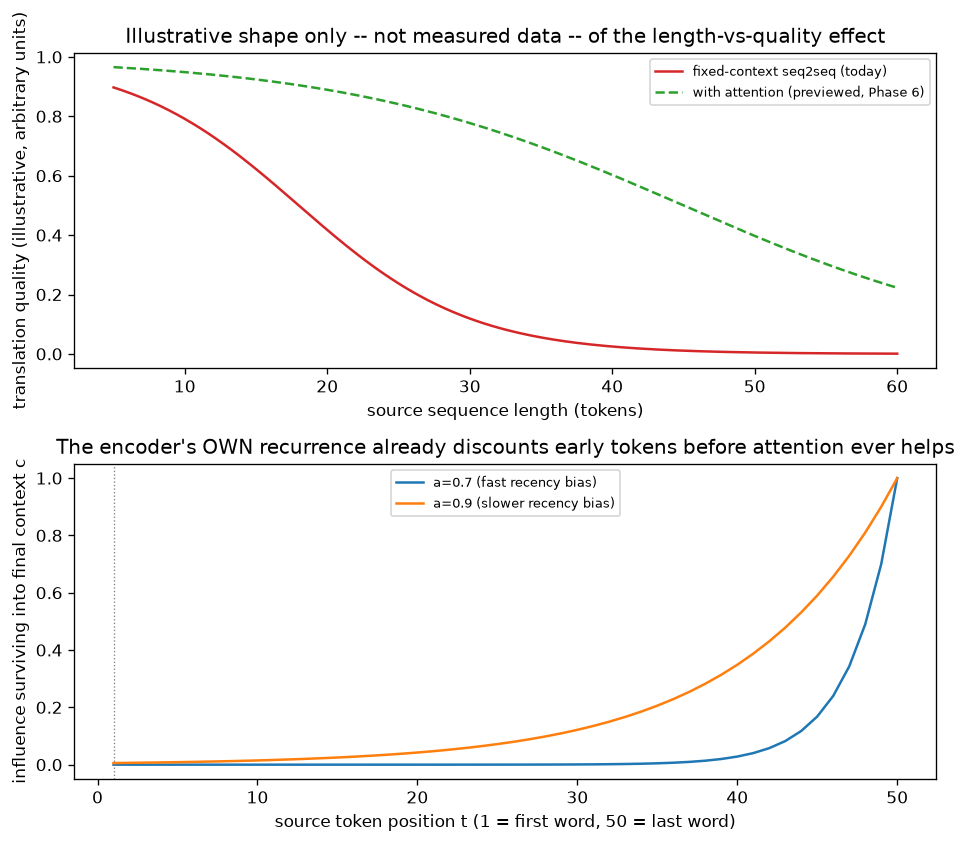

# Day 52 — Concept 52: Fixed-Context Bottleneck

*(Last concept of Phase 5: Sequence Models. Tomorrow's concept — Attention intuition — opens Phase 6, and exists specifically to remove the bottleneck described below.)*

## 🧠 CONCEPT OF THE DAY

**Intuition first.** Trace back through everything built this phase: the encoder (Day 51) reads a source sequence of *any* length — 5 tokens or 500 — and must summarize the entire thing into one context vector $c$, of a *fixed* dimension chosen at architecture-design time, before the decoder ever sees a single piece of it. That's not a minor implementation detail; it's a hard information-theoretic constraint. A vector of dimension $d$ has a fixed representational capacity, full stop — it doesn't matter whether the source sentence was written by Hemingway or contained the entire text of a novel, $c$ is still just $d$ real numbers. As source length grows, you are asking the same fixed-size container to hold more and more.

**Then the math.** There isn't new math to derive today — the bottleneck is a direct restatement of Day 51's encoder: $c = h_{T_x}^{\text{enc}}$, a single vector, independent of $T_x$. What's worth making precise is *how* information gets lost, not just *that* it does: because $c$ is produced by the encoder's own recurrence, it inherits the exact recency-bias mechanism from Days 46–48. Reusing that $a^{t}$-style decay motif: a source token at position $t$ contributes influence to the final $c$ that scales roughly like $a^{T_x - t}$ for whatever effective decay factor the encoder's weights and activations produce — meaning **tokens near the start of a long input are structurally discounted before you've even reached the "compress everything into one vector" problem.** Two separate mechanisms stack on top of each other: (1) the encoder's own recurrence already forgets distant history (Days 47–48), and (2) even what survives has to be squeezed through one fixed-size vector regardless of how much content is trying to fit through it.

**Why it matters / where it leads.** The empirically observed consequence (illustrated, not measured, in today's top panel — this is a stylized version of a widely-reported effect, not raw benchmark data) is that fixed-context seq2seq translation quality holds up reasonably well on short sentences and degrades noticeably as source length grows past the point the fixed-size $c$ can comfortably represent. The fix, which is the entire premise of tomorrow's concept, is almost embarrassingly direct once you've internalized today's diagnosis: **stop forcing everything through one vector.** Instead of discarding every intermediate encoder hidden state and keeping only $h_{T_x}^{\text{enc}}$, keep *all* of them, $h_1^{\text{enc}}, \dots, h_{T_x}^{\text{enc}}$, and let the decoder learn, at each output step, which of those $T_x$ vectors to look at. That's attention in one sentence, and you now have every prerequisite needed to understand exactly which problem it's solving and why.

**Interview question:** *"Attention is often described as 'letting the decoder look at every encoder hidden state instead of just the last one.' Does this fix BOTH problems identified today — the fixed-size compression bottleneck AND the encoder's own recency bias — or just one of them? Be specific about which."*

*(Answer at the very bottom.)*

## 🐍 PYTHONIC EDGE

You can watch the bottleneck directly by comparing how much of `encoder` output actually gets used by a plain (non-attention) seq2seq decoder — the answer is "almost all of it is computed, and almost all of it is thrown away."

```python
import torch
import torch.nn as nn

encoder = nn.LSTM(input_size=32, hidden_size=64, batch_first=True)
src = torch.randn(1, 200, 32)  # a long 200-token source sequence

all_hidden_states, (h_final, c_final) = encoder(src)
print(all_hidden_states.shape)  # torch.Size([1, 200, 64]) -- every h_t, fully computed
print(h_final.shape)            # torch.Size([1, 1, 64])   -- only THIS reaches the decoder

# The bottleneck, made numeric: how much of `all_hidden_states` is actually reachable
# by a plain seq2seq decoder that only ever receives h_final?
total_values_computed = all_hidden_states.numel()
values_actually_passed_on = h_final.numel()
print(f"{values_actually_passed_on} / {total_values_computed} values reach the decoder "
      f"({100 * values_actually_passed_on / total_values_computed:.2f}%)")
# 64 / 12800 = 0.50% -- the encoder computes 200x more information than the fixed-context
# decoder is architecturally capable of receiving. This is exactly what attention
# (tomorrow) reclaims: it keeps `all_hidden_states` alive and queryable instead of
# discarding 99.5% of it the instant encoding finishes.
```

Nothing about this is a bug — `all_hidden_states` was always available in memory, it was simply never *wired* to the decoder in the vanilla seq2seq architecture. Attention's core engineering change is almost entirely about which tensor gets passed forward, not about inventing new mathematics from scratch.

## 📡 SIGNAL LAB



**Top panel (illustrative, not measured data)** sketches the qualitative shape widely reported for fixed-context seq2seq: quality that holds up while the source is short enough to fit comfortably through $c$, then degrades as length grows past that point — contrasted with the flatter profile attention achieves by not forcing everything through one vector (previewed here, derived properly starting tomorrow).

**Bottom panel** is the quantitative half of today's argument, reusing the exact $a^{(T-t)}$ decay curves from Days 46 and 48, now interpreted through the bottleneck lens: for a 50-token source sequence, a token at position 1 contributes an almost negligible fraction of its original signal to the final context vector $c$ by the time encoding reaches position 50 — while a token at position 49 or 50 contributes nearly all of it. This is a subtle but important point often missed: **attention alone does not fully fix this specific mechanism.** Each individual $h_t^{\text{enc}}$ that attention lets the decoder access is still itself the output of a recurrence that has been quietly discounting distant history the entire time it was being computed. Attention removes the "everything must funnel through one vector" bottleneck; it does not, by itself, remove the base RNN encoder's own internal recency bias. (The concept that removes recurrence's recency bias entirely is dropping recurrence altogether — Transformers, concept 60 onward — a distinction worth holding onto for the interview question below.)

## 🏋️ THE GAUNTLET

**Problem: Fixed-Capacity Stream Summary**

You must summarize a stream of items arriving one at a time — total count $n$ **unknown in advance**, and potentially far too large to store — into a fixed-size summary of exactly $k$ items, using only $O(k)$ memory throughout. The requirement: after the entire stream has been processed, **every one of the $n$ items that ever arrived must have had exactly equal probability $k/n$ of ending up in the final $k$-item summary** — no matter how large $n$ turns out to be, and without ever knowing $n$ ahead of time.

Implement:
- `process(item)`: called once per stream element, in arrival order, $O(1)$ amortized.
- `getSummary()`: called once at the end, returns the current $k$-item summary.

**Constraints:**
- $1 \le k \le n \le 10^7$ (n unknown to your algorithm during streaming)
- Target: $O(n)$ total time (i.e. $O(1)$ amortized per `process` call), $O(k)$ space

**3 hints (escalating):**
1. If you knew $n$ up front, you could pick $k$ uniformly random indices in $[1,n]$ and keep only those. You don't know $n$ until the stream ends. For the *first* $k$ items, though, there's an obvious thing to do that requires no randomness at all yet — what is it?
2. For item $i$ where $i > k$: you want item $i$ to end up in the final summary with probability exactly $k/i$ (its "fair share" *if the stream stopped right now*). If it does get in, it should evict a uniformly random one of the $k$ current slots, not always the same slot. What single random draw per item accomplishes both "does it get in" and "which slot does it replace"?
3. Fill the reservoir with the first $k$ items directly. For each item $i > k$, draw a uniform random integer $j \in [1, i]$. If $j \le k$, overwrite `reservoir[j]` with item $i$; otherwise discard item $i$. (This is the classical Algorithm R.) Prove correctness by induction: assume after processing item $i-1$, every item seen so far has probability exactly $k/(i-1)$ of being in the reservoir. Item $i$ enters with probability $k/i$ by construction. Any item that was already in the reservoir survives this step only if either item $i$ doesn't bump it ($j \ne$ its slot) — combine these to show every item's probability updates to exactly $k/i$ after this step too, completing the induction.

**Pattern:** reservoir sampling (Algorithm R) — a fixed-capacity, single-pass, uniform stream summary. Target: $O(n)$ total time, $O(k)$ space.

## 🏗️ BLUEPRINT

No blueprint today.

## 🗺️ MARCHING ORDERS

Phase 5 is complete: you built the RNN cell, understood exactly how and why its gradients behave the way they do across time, met two gated fixes, wired two RNNs together into an encoder-decoder, and diagnosed precisely what breaks as sequences get long. Every one of those pieces — the recurrence, the gate mechanics, the recency-decay motif, the encoder/decoder split — is a prerequisite Phase 6 assumes you already have solid.

Tomorrow: Concept 53 — Attention intuition (soft lookup), opening Phase 6: Attention & Transformers

---

🔓 GAUNTLET SOLUTION

```cpp
#include <bits/stdc++.h>
using namespace std;

// Algorithm R: fixed-capacity reservoir sampling. Maintains the invariant that
// after processing i items, every item seen so far is in the k-slot reservoir
// with probability exactly k/i -- without ever knowing the eventual stream
// length n in advance, and using only O(k) memory.
class ReservoirSampler {
public:
    ReservoirSampler(int k) : k(k), count(0), rng(random_device{}()) {
        reservoir.reserve(k);
    }

    void process(int item) {
        ++count;
        if ((int)reservoir.size() < k) {
            reservoir.push_back(item); // fill phase: first k items go straight in
            return;
        }
        // count > k here: draw j uniform in [1, count]
        uniform_int_distribution<long long> dist(1, count);
        long long j = dist(rng);
        if (j <= k) {
            reservoir[j - 1] = item; // evict slot j, replace with this item
        }
        // else: item discarded, reservoir unchanged
    }

    vector<int> getSummary() const { return reservoir; }

private:
    int k;
    long long count;
    vector<int> reservoir;
    mt19937_64 rng;
};

int main() {
    int k, n;
    cin >> k >> n;
    ReservoirSampler sampler(k);
    for (int i = 0; i < n; ++i) {
        int item;
        cin >> item;
        sampler.process(item);
    }
    for (int v : sampler.getSummary()) cout << v << " ";
    cout << "\n";
    return 0;
}
```

Complexity: `process` does $O(1)$ work (one random draw, at most one array write) — $O(n)$ total across the whole stream, $O(k)$ space for the reservoir regardless of how large $n$ turns out to be.

---

💡 CONCEPT ANSWER

**Attention fixes the fixed-size compression bottleneck. It does not, by itself, fix the encoder's own recency bias.**

Attention's mechanism is to keep every encoder hidden state $h_1^{\text{enc}}, \dots, h_{T_x}^{\text{enc}}$ alive and let the decoder compute a learned, per-output-step weighted combination over *all* of them, instead of being handed only the single final $h_{T_x}^{\text{enc}}$. This directly solves the "everything must funnel through one fixed-size vector" problem from today's concept: the decoder is no longer capped at $d$ real numbers of total source information — it can access $T_x \times d$ numbers, one full hidden state per source position, and it learns which positions matter for which output word (this is why attention visualizations famously show interpretable word-alignment patterns in translation).

What it does **not** fix: each individual $h_t^{\text{enc}}$ that the decoder can now attend to is still itself computed by the *same encoder recurrence* discussed all through this phase, which means it's still subject to the vanishing-gradient-driven recency bias from Days 47–48. If a piece of information from position 3 in a 100-token source sequence has already been mostly "forgotten" by the encoder's own recurrence by the time $h_3^{\text{enc}}$ was computed and folded into everything after it, attention being able to *look at* $h_3^{\text{enc}}$ doesn't recover information that was never faithfully encoded there in the first place — attention can only reweight what's actually present in each hidden state, it can't retroactively un-forget. The mechanism that removes recurrence's internal recency bias entirely is dropping recurrence altogether, computing every position's representation with direct, equal-footing access to every other position — which is exactly the architectural leap Transformers make, several concepts from now.
