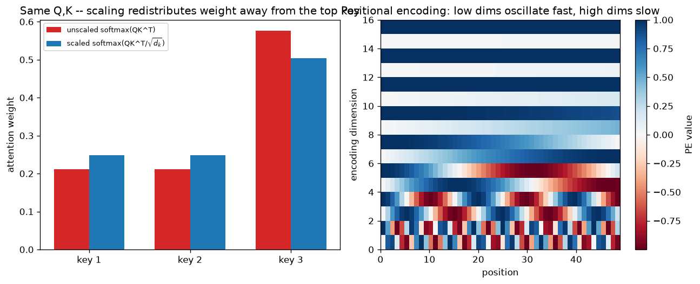

# Special Day — Problem-First Capstone: Language Modeling → Attention & Transformers

*(Not part of the regular Day N / Concept N sequence — this is a bonus session built directly from two uploaded course slide decks, sitting on top of Days 46–52 already in this journal. `progress.json` is untouched by this file; the automated routine's next regular concept is still 53.)*

## 🗺️ Syllabus Map & Sources

This capstone is built from two decks:

1. **CSE 4621: Machine Learning — Lecture 9, "Language Modeling"** (Ishmam Tashdeed, CSE IUT). Covers: language as data, the next-word-prediction task and the probability chain rule, one-hot encoding and why it fails, word embeddings via Word2Vec (skip-gram/CBOW, distributional semantics, self-supervised learning), RNN architecture and weight sharing, BPTT, vanishing/exploding gradients, and the LSTM's three gates + cell state.
2. **"Maths Behind Transformers"** (Ishmam Tashdeed, ML Men Group). Covers: the full Transformer architecture diagram, embeddings intuition, the attention bottleneck problem via a worked "apple" (fruit vs. company) disambiguation example, multi-head attention intuition, and the formal Query/Key/Value machinery — scaled dot-product attention and multi-head attention formulas.

**Mapping onto this journal:** the RNN/LSTM material (deck 1, second half) is exactly Days 46–49; the encoder-decoder/bottleneck framing that motivates deck 2's attention section is exactly Days 51–52. What's genuinely new territory here — not yet covered by any Day in this journal, since the roadmap's Concept 53 onward hasn't run yet — is: word embeddings formalized (Word2Vec's actual softmax objective and gradient), and the full Q/K/V attention formalism with multi-head attention. This special day treats *all* of it problem-first: every idea below is introduced through a fully worked numerical example before any commentary.

**Further reading (links embedded in the source decks):**
- Word2Vec applied — meme search: `medium.com/data-science/meme-search-using-pretrained-word2vec-9f8df0a1ade3`
- RNN walkthrough: `medium.com/@archit.saxena/recurrent-neural-network-rnn-92faf7c01fd4`
- The Illustrated Word2Vec: `jalammar.github.io/illustrated-word2vec`
- Embeddings in ML, explained: `vaclavkosar.com/ml/Embeddings-in-Machine-Learning-Explained`
- Attention/Transformer video explainers (linked from the deck): `youtu.be/48gBPL7aHJY`, `youtu.be/OyFJWRnt_AY`, `youtu.be/4Bdc55j80l8`, and a full playlist at `youtube.com/playlist?list=PLs8w1Cdi-zva4fwKkl9EK13siFvL9Wewf`

---

## 🧮 Part 1 — Language as Data & Embeddings

**Problem 1.1 — Perplexity from the chain rule.** Deck 1 gives the chain-rule identity $P(S) = \prod_t P(w_t \mid w_1,\dots,w_{t-1})$, using the example "Where are we going." Simplify to a **bigram** model ($P(w_t\mid w_{<t}) \approx P(w_t\mid w_{t-1})$) over the exact vocabulary from the deck's one-hot slide, `{the, cat, sat, on, mat}`. Given:

$$P(\text{the}\mid\langle s\rangle)=0.4,\ P(\text{cat}\mid\text{the})=0.5,\ P(\text{sat}\mid\text{cat})=0.6,\ P(\text{on}\mid\text{sat})=0.7,\ P(\text{the}\mid\text{on})=0.8,\ P(\text{mat}\mid\text{the})=0.3$$

compute $P(\text{"the cat sat on the mat"})$ and its **perplexity** $= P(S)^{-1/N}$ ($N=6$ words).

**Solution:** $P(S) = 0.4 \times 0.5 \times 0.6 \times 0.7 \times 0.8 \times 0.3 = 0.02016$. Perplexity $= 0.02016^{-1/6} \approx \mathbf{1.917}$. Interpretation: perplexity is "effective branching factor" — this model is, on average, about as uncertain as choosing uniformly among **1.92** options per word. A perfect model (probability 1 on every true next word) has perplexity exactly 1; a uniform-random model over a vocabulary of size $V$ has perplexity exactly $V$. Perplexity isn't named explicitly in the slides, but it's the standard companion metric every "language modeling" exam pairs with the chain-rule setup shown — know it cold.

**Problem 1.2 — One-hot's blind spot, quantified.** Deck 1 states one-hot vectors are orthogonal (cosine similarity 0 between any two distinct words) and "extremely sparse." (a) Confirm the orthogonality claim numerically for `cat = [0,1,0,0,0]` and `mat = [0,0,0,0,1]`. (b) For a realistic vocabulary size $V=50{,}000$, what *fraction* of each one-hot vector's entries are zero?

**Solution:** (a) `cat · mat = 0`, and cosine similarity $= \frac{0}{\|cat\|\|mat\|} = 0$ — identical to the similarity between any *other* unrelated pair, e.g. `cat` and a hypothetical `quantum`. One-hot encoding cannot express "cat and mat are more related than cat and quantum are" — it treats every distinct word as equally, maximally dissimilar. (b) $\frac{V-1}{V} = \frac{49{,}999}{50{,}000} = 99.998\%$ zeros. This is the numeric backbone of "dimensionality → large weights": a `50,000`-unit input layer where 49,999 of every 50,000 inputs are always exactly 0 is is both wasteful and, per (a), throws away exactly the similarity structure embeddings exist to capture.

**Problem 1.3 — Skip-gram softmax, computed by hand.** Deck 1's skip-gram objective predicts context words from a center word via $P(o\mid c) = \dfrac{\exp(u_o \cdot v_c)}{\sum_{w \in V} \exp(u_w \cdot v_c)}$. Center word `cat` has vector $v_c = [1, 0]$. Context vocabulary: $u_{\text{dog}} = [1,1]$, $u_{\text{pizza}} = [-1,0]$, $u_{\text{mat}} = [0,1]$. Compute $P(\text{dog}\mid\text{cat})$, $P(\text{pizza}\mid\text{cat})$, $P(\text{mat}\mid\text{cat})$.

**Solution:** dot products: $u_{\text{dog}}\cdot v_c = 1$, $u_{\text{pizza}}\cdot v_c = -1$, $u_{\text{mat}}\cdot v_c = 0$. Exponentials: $e^1=2.7183$, $e^{-1}=0.3679$, $e^0=1$; $Z = 4.0862$. $\boxed{P(\text{dog}\mid\text{cat})=0.6652,\ P(\text{pizza}\mid\text{cat})=0.0900,\ P(\text{mat}\mid\text{cat})=0.2447}$ (sums to 1, up to rounding). This is the numeric proof of "co-occurring words pull their embeddings toward each other": `dog`'s vector is most *aligned* with `cat`'s ($u_{\text{dog}}\cdot v_c=1$, the largest score), so it gets assigned the highest predicted probability — geometry directly drives the training signal.

**Problem 1.4 — The gradient that actually does the pulling.** The word2vec cross-entropy loss for one true (center, context) pair is $J = -\log P(o\mid c)$. Its well-known gradient with respect to the center vector is $\dfrac{\partial J}{\partial v_c} = \Big(\sum_{w} P(w\mid c)\, u_w\Big) - u_o$ — i.e. *(what the model currently expects) minus (the true context word's vector)*. Using Problem 1.3's numbers, with the *true* observed context word being `dog`, compute this gradient (report $u_o - \sum_w P(w|c)u_w$, the direction $v_c$ is nudged *toward*).

**Solution:** expected embedding under the current model $= 0.6652\cdot[1,1] + 0.0900\cdot[-1,0] + 0.2447\cdot[0,1] = [0.5752,\ 0.9100]$. Nudge direction $= u_{\text{dog}} - \text{expected} = [1,1]-[0.5752,0.9100] = \boxed{[0.4248,\ 0.0900]}$. Gradient descent adds a (learning-rate-scaled) multiple of this to $v_c$ — pushing `cat`'s vector further toward `dog`'s, proportionally more in the dimension where the model's current prediction was furthest off. This *is* "gradient descent on word prediction automatically encodes similarity," made completely concrete: no similarity objective was ever written down, it falls out of next-word softmax training alone.

---

## 🧮 Part 2 — RNN / LSTM, Now With Real Numbers (ties to Days 46–49)

**Problem 2.1 — RNN forward pass to its fixed point.** Scalar RNN (for hand-tractability): $h_t = \tanh(W_{hh}h_{t-1} + W_{xh}x_t + b_h)$, with $W_{hh}=0.5$, $W_{xh}=1.0$, $b_h=0$, $h_0=0$, constant input $x_t=1$ for all $t$. Compute $h_1, \dots, h_5$.

**Solution:** $h_1=\tanh(1)=0.7616$, $h_2=\tanh(0.3808+1)=0.8811$, $h_3=\tanh(0.4406+1)=0.8938$, $h_4=\tanh(0.4469+1)=0.8951$, $h_5=\tanh(0.4476+1)=0.8952$. The sequence is converging to a **fixed point** $h^\star \approx 0.8952$ satisfying $h^\star = \tanh(0.5h^\star+1)$ — a saturated operating point, exactly the regime Day 48's "why RNNs forget" argument assumes when it multiplies in a representative $\tanh'$ factor.

**Problem 2.2 — How many BPTT steps until the gradient is gone?** At the steady state from 2.1, the per-step Jacobian factor is $a = W_{hh}\cdot\tanh'(z^\star)$ where $z^\star = W_{hh}h^\star + W_{xh}\cdot 1$. Compute $a$, then find the smallest $n$ such that $a^n < 10^{-6}$.

**Solution:** $z^\star = 0.5(0.8952)+1 = 1.4476$; $\tanh'(z^\star) = 1-\tanh^2(z^\star) = 1-0.8952^2 = 0.1986$; $a = 0.5\times0.1986 = \boxed{0.0993}$. Solve $0.0993^n < 10^{-6} \Rightarrow n\log_{10}(0.0993) < -6 \Rightarrow n > 6.003 \Rightarrow \boxed{n=6}$. In just **6 timesteps**, this RNN's gradient has already fallen below one part in a million — a direct numeric confirmation of deck 1's claim "RNN forgets after 10–20 steps," and if anything, this operating point forgets *faster* than that folk number.

**Problem 2.3 — One full LSTM step, every gate computed.** $h_{t-1}=0.5$, $c_{t-1}=0.8$, $x_t=1$. Gate pre-activations (weights chosen for a clean hand-computable example): $f_t=\sigma(1\cdot h_{t-1}+1\cdot x_t)$, $i_t=\sigma(1\cdot h_{t-1}-1\cdot x_t)$, $o_t=\sigma(0.5h_{t-1}+0.5x_t)$, $\tilde c_t = \tanh(1\cdot h_{t-1}+1\cdot x_t)$. Compute $f_t, i_t, o_t, \tilde c_t, c_t, h_t$.

**Solution:** $f_t=\sigma(1.5)=0.8176$, $i_t=\sigma(-0.5)=0.3775$, $o_t=\sigma(0.75)=0.6792$, $\tilde c_t=\tanh(1.5)=0.9051$. $c_t = f_t c_{t-1} + i_t\tilde c_t = 0.8176(0.8)+0.3775(0.9051) = 0.6541+0.3417=\boxed{0.9958}$. $h_t = o_t\tanh(c_t) = 0.6792\times\tanh(0.9958) = 0.6792\times0.7595 = \boxed{0.5161}$. This is deck 1's cell diagram (forget gate $\odot$ old cell state, plus input gate $\odot$ candidate, "conveyor belt") executed with actual numbers instead of symbols — every arrow in that diagram corresponds to exactly one line above.

---

## 🧮 Part 3 — Attention & Transformers (new territory — Q/K/V formalized)

**Problem 3.1 — Scaled dot-product attention, fully worked.** Using deck 2's formula $\text{Attention}(Q,K,V) = \text{softmax}\!\left(\dfrac{QK^T}{\sqrt{d_k}}\right)V$: one query $q=[1,1]$ attends over three keys/values, $d_k=2$:

$$K = \begin{bmatrix}1&0\\0&1\\1&1\end{bmatrix} \qquad V = \begin{bmatrix}1&0\\0&1\\2&2\end{bmatrix}$$

Compute the raw scores, the scaled scores, the softmax weights, and the final attention output.

**Solution:** raw scores $q\cdot k_i = [1,\ 1,\ 2]$. Scaled by $\sqrt{2}=1.4142$: $[0.7071,\ 0.7071,\ 1.4142]$. Softmax: $e^{0.7071}=2.0281$ (×2), $e^{1.4142}=4.1133$, $Z=8.1695$ → weights $\boxed{[0.2483,\ 0.2483,\ 0.5035]}$. Output $= 0.2483[1,0]+0.2483[0,1]+0.5035[2,2] = \boxed{[1.2552,\ 1.2552]}$. Read against deck 2's "apple" example: key 3 (most aligned with the query) contributes over half the output — exactly the "orange pulls apple's embedding toward it" behavior shown geometrically in the slides, now produced by the literal formula.

**Problem 3.2 — Why divide by $\sqrt{d_k}$ at all?** Re-run 3.1 *without* the scale (softmax directly on raw scores $[1,1,2]$) and compare the resulting weights and output to 3.1's scaled version. Then answer analytically: if every component of $q$ and $k$ is i.i.d. with mean 0, variance 1, what is $\text{Var}(q\cdot k)$ for $d_k$-dimensional vectors, and why does that justify the $\dfrac{1}{\sqrt{d_k}}$ factor specifically?

**Solution:** unscaled softmax weights: $[0.2119,\ 0.2119,\ 0.5761]$ (compare scaled: $[0.2483,0.2483,0.5035]$) — the unscaled distribution is visibly **more peaked** on key 3, and the output shifts to $[1.3642,1.3642]$ (compare scaled: $[1.2552,1.2552]$), pulled harder toward $v_3$. Analytically: $q\cdot k=\sum_{j=1}^{d_k}q_jk_j$; since terms are independent, mean-0: $\text{Var}(q\cdot k) = \sum_j \text{Var}(q_jk_j) = \sum_j \mathbb{E}[q_j^2]\mathbb{E}[k_j^2] = \sum_j 1\cdot 1 = d_k$. So the raw dot product's standard deviation *grows* as $\sqrt{d_k}$ — for the original Transformer's $d_k=64$, that's a standard deviation of $8$, meaning typical scores routinely land near $\pm16$ (2 std. devs), and $e^{16}/e^0 \approx 8.9$ million — softmax saturates to a near-one-hot, near-zero-gradient regime almost by accident, independent of whether the query genuinely "should" attend sharply. Dividing by $\sqrt{d_k}$ exactly cancels the variance growth, restoring unit variance regardless of dimension — this, not "it worked empirically," is the actual justification.

**Problem 3.3 — Multi-head parameter counting, and a genuine "gotcha."** Deck 2's formula: $\text{MultiHead}(Q,K,V)=\text{Concat}(\text{head}_1,\dots,\text{head}_h)W^O$, $\text{head}_i = \text{Attention}(QW_i^Q,KW_i^K,VW_i^V)$. Original Transformer values: $d_{\text{model}}=512$, $h=8$, so $d_k=d_v=d_{\text{model}}/h=64$. (a) Count total parameters across all $W_i^Q,W_i^K,W_i^V,W^O$ (ignore biases). (b) Compare against a hypothetical *single-head* attention with $d_k=d_{\text{model}}=512$ (no splitting) — just the $W^Q,W^K,W^V$ projections, no output projection needed since there's nothing to concatenate. Which has more parameters?

**Solution:** (a) Per head: $3\times(512\times64) = 98{,}304$. Across 8 heads: $786{,}432$. Output projection $W^O$: $(8\times64)\times512 = 512\times512=262{,}144$. **Total $=1{,}048{,}576 = 2^{20}$** exactly — a suspiciously round number worth recognizing on sight in an exam. (b) Single-head $W^Q,W^K,W^V$ at full $d_{\text{model}}\times d_{\text{model}}$: $3\times512\times512=786{,}432$ — **identical** to the 8-head split's combined Q/K/V parameter count, because $h\times d_k = 512 = d_{\text{model}}$ by construction; splitting into heads doesn't change the total projection size, it only reshapes it. **The entire extra parameter cost of multi-head over single-head attention is $W^O$ alone** ($262{,}144$ params, 25% of the total) — a fact that trips up almost everyone who assumes "more heads = proportionally more parameters" without checking.

**Problem 3.4 — Positional encoding, computed.** Deck 2's architecture diagram shows a "Positional Encoding" block added to the input embedding. The standard formula: $PE(pos,2i)=\sin\!\big(pos/10000^{2i/d_{\text{model}}}\big)$, $PE(pos,2i+1)=\cos\!\big(pos/10000^{2i/d_{\text{model}}}\big)$. For a toy $d_{\text{model}}=4$, compute the full encoding vector at $pos=1$.

**Solution:** $i=0$: denominator $10000^0=1$ → $PE(1,0)=\sin(1)=0.8415$, $PE(1,1)=\cos(1)=0.5403$. $i=1$: denominator $10000^{0.5}=100$ → $PE(1,2)=\sin(0.01)=0.0100$, $PE(1,3)=\cos(0.01)=0.99995$. $\boxed{PE(1) = [0.8415,\ 0.5403,\ 0.0100,\ 0.99995]}$. Notice the early dimension pair oscillates fast (period $2\pi$) while the later pair barely moves per step (period $200\pi$) — exactly the right-panel graph above, and structurally the same "filter bank at multiple frequencies" idea from this journal's Day 41 (Inception) Signal Lab, now applied along the *position* axis instead of the *spatial-frequency* axis. The deeper reason sinusoids specifically were chosen (not just "any encoding"): $PE(pos+k)$ can be written as a **fixed linear transformation** (a 2D rotation by angle $k\omega$ within each sin/cos pair) applied to $PE(pos)$, independent of $pos$ itself — meaning relative position is linearly recoverable from the encoding, which a network layer can learn to exploit with a single linear map.

**Problem 3.5 — Causal masking, numerically.** Deck 2's architecture shows "Masked Multi-Head Attention" in the decoder. For a 3-token sequence with raw score matrix (each row = one query's scores against all 3 keys) $\begin{bmatrix}1&2&3\\1&2&3\\1&2&3\end{bmatrix}$, apply a causal mask (query $i$ may only attend to keys $j\le i$, others set to $-\infty$ before softmax) and compute each row's resulting weights.

**Solution:** row 0 (token 0 sees only itself): $[1,-\infty,-\infty] \to \boxed{[1,\ 0,\ 0]}$. Row 1 (sees tokens 0–1): $[1,2,-\infty] \to \boxed{[0.2689,\ 0.7311,\ 0]}$. Row 2 (sees all): $[1,2,3] \to \boxed{[0.0900,\ 0.2447,\ 0.6652]}$. Masking is applied **before** softmax, not after (zeroing weights after softmax would leave the un-masked weights not summing to 1) — a classic implementation trap.

**Problem 3.6 — The $O(n^2)$ vs $O(n)$ crossover, precisely.** Per-layer compute: self-attention is $O(n^2 d)$ (every pair of the $n$ tokens compares, each comparison costs $O(d)$), a recurrent layer is $O(nd^2)$ ($n$ sequential steps, each an $O(d^2)$ matrix-vector product). For $d=512$ (the original Transformer's $d_{\text{model}}$), at what sequence length $n$ do the two become equal, and which is cheaper below that length?

**Solution:** set $n^2d = nd^2 \Rightarrow n=d=512$. **For any sequence shorter than 512 tokens, self-attention is actually the cheaper option in raw operation count** — the "attention is $O(n^2)$, therefore worse" reflex is only correct once $n$ exceeds $d$, which is exactly why FlashAttention and long-context techniques (concepts 64 and 111, later in this roadmap) exist specifically for the long-sequence regime, not as a general complaint about attention. And this comparison undersells attention's *real* practical edge regardless of $n$ vs $d$: the $n^2$ term is fully parallelizable across all pairs simultaneously, while the recurrent $O(n)$ term is an inherently sequential dependency chain (Day 47's whole BPTT-memory argument) — on real hardware, "more total FLOPs but parallel" routinely beats "fewer FLOPs but serial."

---

## 🕳️ Tricky Traps (rapid-fire)

1. **"Attention removes all of the RNN's problems."** False — see Day 52's answer key: attention removes the fixed-size bottleneck, but each individual encoder hidden state it attends over is still produced by a recurrence with its own recency bias. (Full fix: drop recurrence entirely — Transformers.)
2. **"Skip-gram and CBOW are the same objective, just implemented differently."** False — skip-gram predicts *context from center* ($P(w_{t+j}\mid w_t)$), CBOW predicts *center from context* ($P(w_t \mid w_{t-k},\dots,w_{t+k})$, averaging/summing context vectors as input). Different conditioning, different gradient shapes, different data-efficiency tradeoffs (skip-gram tends to do better on rare words; CBOW trains faster).
3. **"Multi-head attention with $h$ heads has $h\times$ the parameters of single-head attention."** False — see Problem 3.3. Splitting $d_{\text{model}}$ across heads at $d_k=d_{\text{model}}/h$ keeps the Q/K/V projection cost fixed; only $W^O$ is genuinely extra.
4. **"Perplexity of 1 means the model is perfect; perplexity of 0 is even better."** Perplexity is bounded *below* by 1 (probability 1 on the true word every time) — 0 is not achievable and not meaningful; don't let "lower is better" tempt you into treating it like an unbounded loss.
5. **"Positional encoding is added so the model knows word order, full stop."** Incomplete — the *specific* choice of sinusoids (not, say, raw integer position or a random fixed vector) matters because it makes relative offsets linearly recoverable (Problem 3.4) — a random fixed encoding would carry position information too, just not in a form a single linear layer can exploit for *relative* position.
6. **"Since $QK^T/\sqrt{d_k}$ prevents softmax saturation, larger $d_k$ is always safe now."** Only variance is controlled — the mean of the *maximum* order statistic among $n$ (roughly) independent scores still grows (slowly) with $n$ and $d_k$'s degrees of freedom; scaling fixes the dominant effect, it doesn't make attention temperature-invariant in every regime.
7. **"LSTM's forget gate defaults to 'remember nothing' at initialization."** Framework-dependent, and it's a real, commonly-tested gotcha the other way: many implementations initialize the forget-gate bias to a *positive* value (e.g. 1.0), specifically so gradients flow well from step one instead of the network having to *learn* to stop forgetting everything by default.

---

## 🏋️ Practice Set (unsolved — solve, then check)

**P1.** Bigram model over `{I, love, machine, learning}`: $P(\text{I}\mid\langle s\rangle)=0.5$, $P(\text{love}\mid\text{I})=0.6$, $P(\text{machine}\mid\text{love})=0.4$, $P(\text{learning}\mid\text{machine})=0.9$. Compute $P(\text{"I love machine learning"})$ and its perplexity ($N=4$).

**P2.** Skip-gram: center word `queen`, $v_c=[0,1]$. Context vocabulary $u_{\text{king}}=[1,0]$, $u_{\text{rose}}=[0,1]$, $u_{\text{sword}}=[1,1]$. Compute $P(\text{king}\mid\text{queen})$, $P(\text{rose}\mid\text{queen})$, $P(\text{sword}\mid\text{queen})$, and the training gradient $\partial J/\partial v_c$ if the true observed context word is `rose`.

**P3.** LSTM step: $h_{t-1}=0.2$, $c_{t-1}=-0.3$, $x_t=0.5$. $f_t=\sigma(0.8h_{t-1}+0.8x_t)$, $i_t=\sigma(-0.5h_{t-1}+1\cdot x_t)$, $o_t=\sigma(1\cdot h_{t-1}+0.2)$, $\tilde c_t=\tanh(0.6h_{t-1}-0.6x_t)$. Compute $f_t,i_t,o_t,\tilde c_t,c_t,h_t$.

**P4.** Same $K,V$ as Problem 3.1. Compute attention output for **two** queries, $q_1=[0,1]$ and $q_2=[2,0]$ (scaled, $d_k=2$).

**P5.** $d_{\text{model}}=256$, $h=4$ heads. Compute $d_k$, total Q/K/V parameters across all heads, $W^O$'s parameter count, and the grand total. Confirm it still matches the single-head-equivalent Q/K/V count.

**P6.** Compute the full positional encoding vector $PE(2)$ for $d_{\text{model}}=4$.

---

💡 PRACTICE SET SOLUTIONS

**P1.** $P(S) = 0.5\times0.6\times0.4\times0.9 = 0.108$. Perplexity $=0.108^{-1/4} \approx \mathbf{1.744}$.

**P2.** Scores: $u_{\text{king}}\cdot v_c=0$, $u_{\text{rose}}\cdot v_c=1$, $u_{\text{sword}}\cdot v_c=1$. $Z=e^0+e^1+e^1=1+2.7183+2.7183=6.4366$. $P(\text{king})=0.1554$, $P(\text{rose})=0.4223$, $P(\text{sword})=0.4223$ (the latter two tie — both score 1). Expected embedding $=0.1554[1,0]+0.4223[0,1]+0.4223[1,1]=[0.5777,0.8446]$. Gradient (true=`rose`, $u_{\text{rose}}=[0,1]$): $u_{\text{rose}}-\text{expected} = [-0.5777,\ 0.1554]$ — note the *negative* first component: training pushes $v_c$ **away** from dimension 1 this step, since `sword` (which shares that dimension with `rose`) is stealing probability mass that should belong to the true label.

**P3.** $f_t=\sigma(0.56)=0.6365$, $i_t=\sigma(0.4)=0.5987$, $o_t=\sigma(0.4)=0.5987$, $\tilde c_t=\tanh(-0.18)=-0.1781$. $c_t = 0.6365(-0.3)+0.5987(-0.1781) = -0.1910-0.1066=-0.2976$. $h_t = 0.5987\times\tanh(-0.2976) = 0.5987\times(-0.2892) = \mathbf{-0.1731}$.

**P4.** $q_1=[0,1]$: raw scores $[0,1,1]$, scaled $[0,\ 0.7071,\ 0.7071]$, weights $[0.1978,\ 0.4011,\ 0.4011]$, output $\mathbf{[1.0000,\ 1.2033]}$. $q_2=[2,0]$: raw scores $[2,0,2]$, scaled $[1.4142,\ 0,\ 1.4142]$, weights $[0.4458,\ 0.1084,\ 0.4458]$, output $\mathbf{[1.3374,\ 1.0000]}$.

**P5.** $d_k = 256/4=64$. Per-head Q/K/V: $3\times256\times64=49{,}152$; total across 4 heads $=196{,}608$. $W^O$: $(4\times64)\times256=65{,}536$. Grand total $=\mathbf{262{,}144}$ (note: also a round number, $2^{18}$). Single-head-equivalent Q/K/V: $3\times256\times256=196{,}608$ — matches the 4-head total exactly, confirming Problem 3.3's pattern generalizes.

**P6.** $i=0$: denom $=10000^0=1$ → $PE(2,0)=\sin(2)=0.9093$, $PE(2,1)=\cos(2)=-0.4161$. $i=1$: denom$=10000^{0.5}=100$ → $PE(2,2)=\sin(0.02)=0.0200$, $PE(2,3)=\cos(0.02)=0.9998$. $\boxed{PE(2) = [0.9093,\ -0.4161,\ 0.0200,\ 0.9998]}$.
