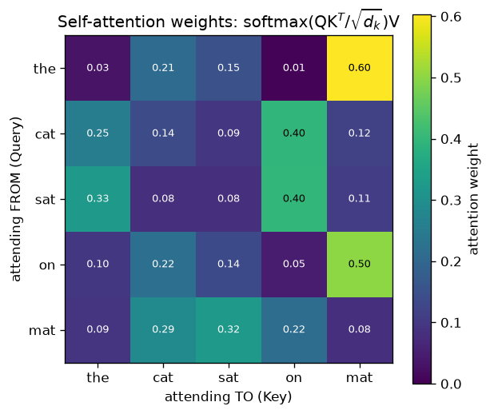

# Day 54 — Concept 54: Query, Key, Value

*(Second concept of Phase 6. Yesterday you got the soft-lookup mechanism with $q$, $k_i$, $v_i$ handed to you as given vectors. Today: where do they actually come from?)*

## 🧠 CONCEPT OF THE DAY

**Intuition first.** Every token starts life as a single embedding vector — one description of "what this token is." But soft lookup needs *three* different roles out of that one vector: something to search with (query), something to be matched against (key), and something to actually hand back once matched (value). Rather than reusing the same vector for all three jobs, the model learns three separate lenses — three weight matrices — and views every token through each of them. Think of a token like "cat" wearing three different hats simultaneously: as a **query**, it asks "what context am I looking for?"; as a **key**, it advertises "here's what I contain, come find me if this is relevant"; as a **value**, it says "and here's what I'll actually contribute if you pick me." The same underlying token produces three *different* vectors because searching-for and being-found-as and being-returned-as are three genuinely different jobs, and forcing one vector to do all three would bottleneck what the model can express.

**Then the math.** Given an input sequence packed as rows of a matrix $X \in \mathbb{R}^{n \times d_{\text{model}}}$ (n tokens, each a $d_{\text{model}}$-dim embedding), and three learned weight matrices:

$$Q = XW_Q, \quad K = XW_K, \quad V = XW_V$$

where $W_Q, W_K \in \mathbb{R}^{d_{\text{model}} \times d_k}$ and $W_V \in \mathbb{R}^{d_{\text{model}} \times d_v}$ are learned parameters (not fixed — trained by backprop just like every other weight in the network). Each row $Q_i$, $K_i$, $V_i$ is now token $i$'s query, key, and value vector respectively. Plug these straight into yesterday's mechanism, one query at a time:

$$\text{output}_i = \sum_{j=1}^{n} \text{softmax}\!\left(Q_i \cdot K_j\right)_j \, V_j$$

or, vectorized across all queries at once (today's actual implementation target):

$$\text{Attention}(Q, K, V) = \text{softmax}(QK^T)\,V$$

**Why it matters / where it leads.** This is the fork in the road that separates *cross*-attention from *self*-attention. In Day 53's encoder–decoder setup, $Q$ came from the decoder and $K$, $V$ came from the encoder — two different sequences. Nothing stops you from setting $X$ to the *same* sequence for all three projections: $Q = XW_Q$, $K = XW_K$, $V = XW_V$, all from the identical input $X$. That's self-attention (Day 57) — every token queries every other token *in its own sequence*, including itself. The only thing that changes between "attention," "self-attention," and "cross-attention" is *where the rows of $X$ that feed $Q$ versus $K,V$ come from* — the $QK^TV$ machinery underneath is identical. Also notice $W_Q$ and $W_K$ must map to the *same* dimension $d_k$ (their outputs get dotted together), but $W_V$ is free to map to a different $d_v$ — the output dimension is decoupled from the matching dimension, a design freedom multi-head attention (Day 56) will exploit directly.

Below is what $\text{softmax}(QK^T/\sqrt{d_k})V$ actually looks like once $Q$, $K$, $V$ are real numbers — this uses the scaling factor you'll formally justify tomorrow, applied here so the weights don't just saturate to near-one-hot:



Read it as: row = the querying token, column = the token being attended to, cell = how much of that column's value vector ends up in the row's output. Every row sums to 1 — it's a full probability distribution per query, exactly like Day 53's soft lookup, just now with $Q$, $K$, $V$ actually *produced* by the network instead of handed to it.

**Interview question:** *"Why do we need three separate learned projections $W_Q$, $W_K$, $W_V$ instead of just using the raw token embeddings directly as query, key, and value — what capability would you lose?"*

*(Answer at the very bottom.)*

## 🐍 PYTHONIC EDGE

The bad way projects Q, K, V with three separate `nn.Linear` layers — correct, but it's three separate matmul kernel launches when it could be one. The clean way (used in real implementations, e.g. GPT-style blocks) fuses all three into a single projection and splits the result.

```python
import torch
import torch.nn as nn

torch.manual_seed(42)
d_model, d_k, n_tokens = 8, 4, 5
x = torch.randn(n_tokens, d_model)  # (5, 8) -- 5 tokens, each an 8-dim embedding

# --- BAD: three separate nn.Linear layers, three separate matmul calls ---
class QKVSlow(nn.Module):
    # class X(Base): single inheritance -- like `class QKVSlow : public nn::Module` in C++,
    # no header/source split required
    def __init__(self, d_model, d_k):
        super().__init__()  # parent ctor call; C++ initialiser-list equivalent: QKVSlow() : Module()
        self.wq = nn.Linear(d_model, d_k, bias=False)  # self.wq: instance attribute, no header decl needed
        self.wk = nn.Linear(d_model, d_k, bias=False)
        self.wv = nn.Linear(d_model, d_k, bias=False)

    def forward(self, x):
        return self.wq(x), self.wk(x), self.wv(x)  # tuple return; C++: std::tuple or out-params


# --- GOOD: one fused Linear, then split the output into three chunks ---
class QKVFast(nn.Module):
    def __init__(self, d_model, d_k):
        super().__init__()
        self.qkv = nn.Linear(d_model, 3 * d_k, bias=False)  # one weight matrix does all 3 projections
        self.d_k = d_k

    def forward(self, x):
        qkv = self.qkv(x)                    # (n, 3*d_k) -- one matmul instead of three
        q, k, v = qkv.chunk(3, dim=-1)        # chunk(): split into 3 equal views along last axis;
                                               # tuple unpacking `q, k, v = ...` -- no std::tie needed
        return q, k, v


slow, fast = QKVSlow(d_model, d_k), QKVFast(d_model, d_k)
q1, k1, v1 = slow(x)   # invokes __call__ -> forward(); never call .forward(x) directly, it skips hooks
q2, k2, v2 = fast(x)

print(q1.shape, k1.shape, v1.shape)  # torch.Size([5, 4]) each -- shape is a tuple-like object
# NOTE: weights differ (each Linear is independently initialized), so q1 != q2 numerically here --
# the point is the *shape* and *call count* difference: 1 matmul kernel launch vs 3.
```

The takeaway that matters architecturally: fusing $W_Q, W_K, W_V$ into one $[d_{\text{model}} \times 3d_k]$ matrix and slicing the output is mathematically identical to three separate projections — matrix multiplication is linear, so $X[W_Q | W_K | W_V] = [XW_Q | XW_K | XW_V]$ — but it's one GPU kernel launch instead of three, which matters a lot once this runs millions of times during training.

## 📡 SIGNAL LAB

Q, K, V as three learned projections of the same input is exactly a **filter bank**: one signal, run through several distinct linear filters, producing several distinct "views" tuned for different downstream jobs (think of an analysis filter bank splitting a signal into subbands — each subband filter extracts a different frequency-localized feature from the *same* underlying waveform).

**Problem.** You have one synthetic signal (length 32, a sum of two sinusoids) that stands in for a token embedding. Apply three different fixed linear filters (matrices) to it — call them $W_Q$, $W_K$, $W_V$ — to produce a query-view, key-view, and value-view, exactly the way three FIR filters would extract three different features from a signal. Then, treat 4 shifted copies of the same base signal as your "sequence" (4 tokens), project each through $W_Q, W_K, W_V$, and compute one row of the attention output for query-token 0.

```python
import numpy as np
np.random.seed(42)

t = np.linspace(0, 1, 32, endpoint=False)
base = np.sin(2*np.pi*5*t) + 0.5*np.sin(2*np.pi*11*t)  # one signal, two frequency components

# 4 "tokens": circularly shifted copies of the same base signal (a toy stand-in for
# 4 positions in a sequence whose content is related but not identical)
tokens = np.stack([np.roll(base, shift) for shift in (0, 4, 8, 12)])  # (4, 32)

d_k = 6
W_Q = np.random.randn(32, d_k) * 0.1  # each column of W_Q/W_K/W_V IS a length-32 FIR filter
W_K = np.random.randn(32, d_k) * 0.1  # -- projecting = correlating the signal against d_k filters
W_V = np.random.randn(32, d_k) * 0.1

Q = tokens @ W_Q  # (4, d_k) -- query-view of every token
K = tokens @ W_K  # (4, d_k) -- key-view of every token
V = tokens @ W_V  # (4, d_k) -- value-view of every token

scores = (Q @ K.T) / np.sqrt(d_k)          # (4, 4)
weights = np.exp(scores - scores.max(axis=1, keepdims=True))
weights /= weights.sum(axis=1, keepdims=True)
output_row0 = weights[0] @ V               # query-token 0's blended output

print("attention weights for token 0:", np.round(weights[0], 3))
print("output vector for token 0     :", np.round(output_row0, 3))
```

**So what.** $W_Q$, $W_K$, $W_V$ are literally filter banks here — each column is a length-32 FIR kernel, and projecting a token through $W_Q$ is exactly correlating that signal against $d_k$ learned filters. The reason $Q$, $K$, $V$ *must* be separate projections rather than one shared filter bank is now visually obvious in DSP terms: a filter bank tuned to detect "which subbands are present" (a good key) is not necessarily the same filter bank you'd want for "what content to hand back once matched" (a good value) — you wouldn't design a radar system's *matching* filter and its *payload-extraction* filter to be the same kernel just because they both look at the same received signal. When you get to Day 88 (spectral signatures of generated images) and reason about what a learned attention head is doing to frequency content, remember this: $W_Q$ and $W_K$ jointly determine *which* frequency-domain relationships get high attention weight, while $W_V$ independently determines *what* gets propagated forward once that relationship is found — two separable design questions the model gets to answer independently only because they're separate matrices.

## 🏋️ THE GAUNTLET

**Problem: Time Based Key-Value Store** *(LeetCode 981 — and yes, the naming is not a coincidence today)*

Design a time-based key-value store that supports:
- `set(key, value, timestamp)`: stores the `key`–`value` pair at the given `timestamp`. Timestamps for a given key are strictly increasing across calls.
- `get(key, timestamp)`: returns the value associated with `key` at the largest previously-set timestamp $\le$ the given `timestamp`. If no such timestamp exists, return `""`.

**Constraints:**
- Up to $2 \times 10^5$ total `set`/`get` calls.
- All timestamps passed to `set` for a given key are strictly increasing.
- Each `get` call: target $O(\log n)$ where $n$ is the number of `set` calls made for that key so far.

**3 hints (escalating):**
1. What data structure lets you go from a key string to "everything ever stored for that key," in $O(1)$ average? What should you store *per key* — a single value, or a history?
2. Since timestamps for a given key arrive strictly increasing from `set`, the per-key history is *already sorted* by construction the moment you append to it — no re-sorting needed. What binary-search primitive finds "the rightmost timestamp $\le$ target" in a sorted array in $O(\log n)$?
3. Store `unordered_map<string, vector<pair<int,string>>>` (key → list of (timestamp, value) pairs, appended in increasing timestamp order by `set`). For `get`, binary-search that key's vector for the last entry with timestamp $\le$ the query timestamp — C++'s `upper_bound` finds the first entry *strictly greater* than the target, so the answer sits one position before it.

**Pattern:** hashmap of key → sorted-by-construction array, binary search (`upper_bound`) for "largest $\le$ target." Target: $O(1)$ amortized `set`, $O(\log n)$ `get`.

## 🏗️ BLUEPRINT

**$d_k$ (the query/key projection dimension) is a compute-vs-expressiveness dial, decided independently of $d_{\text{model}}$.** Nothing forces $d_k = d_{\text{model}}$ — projecting down to a smaller $d_k$ shrinks the $QK^T$ matmul from $O(n^2 d_{\text{model}})$ to $O(n^2 d_k)$ FLOPs, a real, controllable cost since $n^2$ already dominates for long sequences. The catch: too small a $d_k$ and two genuinely different tokens can become indistinguishable after projection (their queries/keys collide in a cramped space), silently capping what relationships the attention pattern can express — a cheaper matmul bought with a coarser matching space. Multi-head attention (Day 56) is the resolution: instead of picking one $d_k$ and living with the tradeoff, split into several smaller heads that each get their own cheap, low-dimensional $QK^T$, then recombine — cheap compute per head *and* several independent matching subspaces, instead of one dial forcing a single compromise.

## 🗺️ MARCHING ORDERS

You now know not just *how* soft lookup blends values, but *where* the query, key, and value vectors actually come from — three learned lenses on the same input, decoupled enough to serve self-attention, cross-attention, and eventually multi-head attention without changing the underlying mechanism at all.

Tomorrow: Concept 55 — Scaled dot-product (why √d)

---

🔓 GAUNTLET SOLUTION

```cpp
#include <bits/stdc++.h>
using namespace std;

// Hashmap of key -> vector<(timestamp, value)>, appended in strictly increasing
// timestamp order by set() (guaranteed by the problem), so each key's history is
// sorted by construction. get() binary-searches with upper_bound for the first
// entry strictly greater than the query timestamp, then steps back one to find
// the largest entry <= the query timestamp.
class TimeMap {
public:
    TimeMap() {}

    void set(string key, string value, int timestamp) {
        store[key].emplace_back(timestamp, value);
    }

    string get(string key, int timestamp) {
        auto it = store.find(key);
        if (it == store.end()) return "";

        auto& history = it->second;
        // upper_bound on a vector<pair<int,string>> compares by .first (timestamp)
        // against a pair; construct a dummy pair with max string so it only compares timestamp.
        auto pos = upper_bound(history.begin(), history.end(),
                                make_pair(timestamp, string(1e6, 'z')));

        if (pos == history.begin()) return "";  // every stored timestamp is > query
        --pos;                                   // step back to the largest timestamp <= query
        return pos->second;
    }

private:
    unordered_map<string, vector<pair<int, string>>> store;
};
```

Complexity: `set` is $O(1)$ amortized (vector append); `get` is $O(\log n)$ per call via `upper_bound` on that key's history, where $n$ is the number of entries stored for that key. Space: $O(\text{total set calls})$.

---

💡 CONCEPT ANSWER

**What you lose by using raw embeddings directly as $Q$, $K$, $V$ instead of learned projections:**

The model would be stuck comparing tokens in whatever coordinate system the *embedding layer* happened to produce — a space optimized for nothing in particular except "distinct tokens get distinct vectors." Three separate learned projections give the model three separate degrees of freedom it can train independently:

1. **$W_Q$ and $W_K$ jointly learn *what similarity should mean* for this task.** Two tokens can be semantically close in embedding space but irrelevant to each other for the task at hand (or the reverse — distant in embedding space but exactly what should attend to each other, e.g. a pronoun and its antecedent far away in the sentence). Without learned $W_Q, W_K$, the notion of "relevant" is frozen at whatever raw dot-product-of-embeddings happens to measure — the model can never adjust it via gradient descent.

2. **$W_V$ independently learns *what to actually propagate* once a match is found**, decoupled from what made the match good in the first place. A key can correctly signal "this position is relevant" while the value carries completely different information forward (e.g. positional or task-specific content that had nothing to do with *why* it was matched). Sharing one vector for matching-and-payload forces those two jobs to compromise on a single representation.

Concretely: raw embeddings as $Q=K=V=X$ would make $QK^T = XX^T$, a fixed similarity matrix (up to whatever the embedding table already encodes) that no amount of training on this attention layer could ever reshape — the three learned matrices are precisely what turns attention from "reuse whatever similarity the embeddings happen to have" into "learn whatever similarity and payload-extraction this task actually needs."
