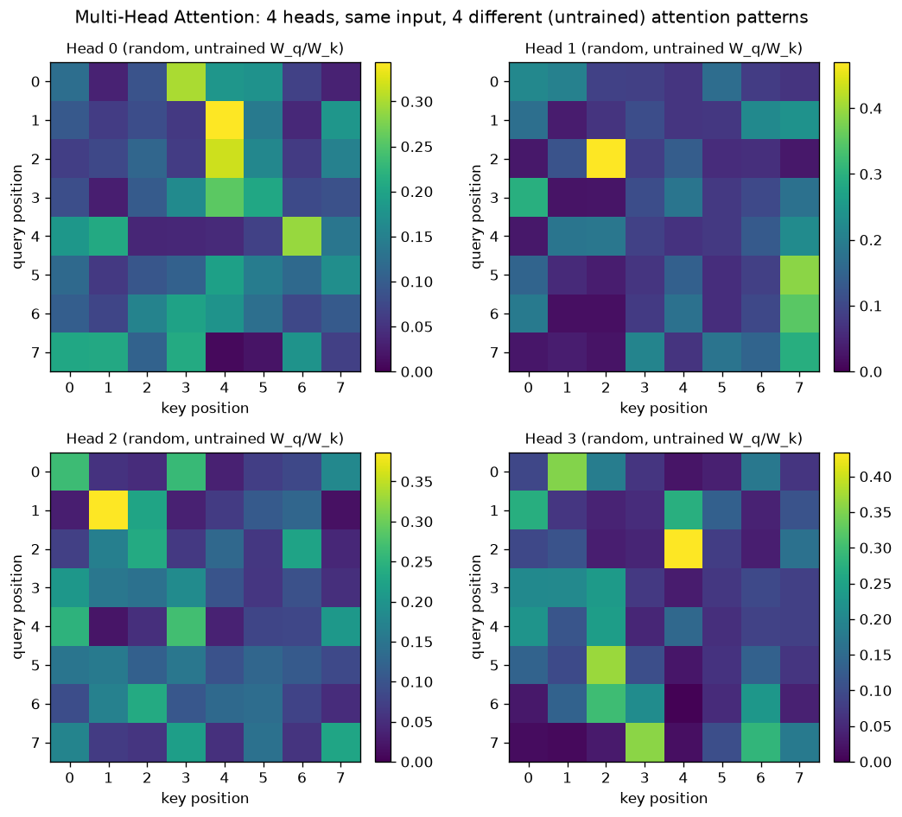

# Day 56 — Multi-Head Attention

## 🧠 CONCEPT OF THE DAY

**Intuition.** Day 54's blueprint already spoiled the punchline: a single `d_k`-dimensional attention head forces one compromise — either `d_k` is big (expressive matching space, expensive `QK^⊤`) or small (cheap, but everything gets crammed into one similarity notion). Real sentences need *several* independent notions of relevance at once — "which token is the subject of this verb," "which token is nearby," "which token shares this entity" — and one dot product can't hold all of those relationships without blurring them together. Multi-head attention's fix: don't pick one `d_k` and live with it. Split the model dimension into `h` smaller, *independent* subspaces, run scaled dot-product attention separately in each one (so each head is free to specialize — Head 3 might learn "attend to the previous token," Head 7 might learn "attend to the matching closing bracket"), then concatenate the results and mix them back together with one more learned projection.

**The math.** Given `Q, K, V ∈ ℝ^{n×d_model}`, project each into `h` heads with their own learned weight matrices:

$$\text{head}_i = \text{Attention}(QW_i^Q,\ KW_i^K,\ VW_i^V), \quad i = 1, \dots, h$$

where `W_i^Q, W_i^K ∈ ℝ^{d_model × d_k}` and `W_i^V ∈ ℝ^{d_model × d_v}`, typically `d_k = d_v = d_model / h` so the total compute matches a single full-width head. Concatenate all heads along the feature axis and mix with one more learned matrix `W^O`:

$$\text{MultiHead}(Q, K, V) = \text{Concat}(\text{head}_1, \dots, \text{head}_h)\, W^O$$

with `W^O ∈ ℝ^{(h \cdot d_v) × d_model}`, so the output shape matches the input — this block is a drop-in replacement for single-head attention anywhere in the architecture.

**Why it matters / where it leads.** This is why "attention heads" became a unit of interpretability research — after training, you can visualize what Head 3 attends to versus Head 7 and find heads that specialize in syntax, coreference, or positional offsets, entirely unsupervised. The graph below shows the mechanism that makes this possible even *before* any training happens: give 4 heads the same 8-token input but 4 independently-random `W_q`/`W_k` pairs, and you already get 4 visibly different attention-weight heatmaps — different heads land their peak weight on different query/key pairs purely from random initialization. Training doesn't create the heads' independence, it just steers each already-independent head toward a useful, interpretable pattern instead of a random one.



It also sets up Day 57 (self- vs cross-attention): the same multi-head machinery applies whether Q comes from the same sequence as K/V (self-attention, encoder or causal decoder) or from a different sequence entirely (cross-attention, decoder attending to encoder outputs). A senior interviewer's go-to follow-up here: *"Does multi-head attention cost more FLOPs than single-head attention at the same `d_model`?"* — if you can explain why splitting into `h` heads of size `d_model/h` keeps the total `QK^⊤` FLOPs roughly constant (it's the same total dimensionality, just partitioned), you've shown you understand the design isn't "more capacity for free," it's "the same capacity, spent more flexibly."

**Interview-style question:** Why can't you just get the same effect as multi-head attention by using one big head with `d_k = d_model` and a bigger softmax — what does splitting into separate heads give you that widening one head cannot?

*(answer at the very bottom)*

---

## 🐍 PYTHONIC EDGE

The bad way: run `h` separate attention calls in a Python loop — correct, but you pay Python overhead per head and miss the batched-matmul speedup. The clean way: reshape once so all heads execute as one batched operation, and know exactly which `.view()`/`.transpose()`/`.contiguous()` combination is required and why.

```python
import torch

# ---------- bad way: h separate attention calls in a loop ----------
def multihead_naive(q, k, v, h):
    d_model = q.size(-1)               # .size(-1) == length of last dim, like .shape[-1]
    d_k = d_model // h                 # // is integer (floor) division, not / then truncate
    outs = []
    for i in range(h):                 # range(h) is a lazy iterable object, not a materialized list
        qi = q[..., i * d_k:(i + 1) * d_k]   # slice notation [a:b]; ... = "all leading dims", no C++ equiv
        ki = k[..., i * d_k:(i + 1) * d_k]
        vi = v[..., i * d_k:(i + 1) * d_k]
        scores = qi @ ki.transpose(-2, -1) / (d_k ** 0.5)   # @ = matmul; ** = exponent
        outs.append(torch.softmax(scores, dim=-1) @ vi)
    return torch.cat(outs, dim=-1)     # cat != concat; dim=-1 = last axis

# ---------- clean way: one reshape, one batched matmul ----------
class MultiHeadAttention(torch.nn.Module):
    # class X(Base): Python single-inheritance; C++ writes class X : public Base
    def __init__(self, d_model, h):
        super().__init__()             # parent ctor; C++ uses initializer-list syntax instead
        assert d_model % h == 0        # assert raises AssertionError if false — no-op in C++ release builds
        self.h, self.d_k = h, d_model // h   # tuple unpacking: two assigns in one statement
        self.qkv_proj = torch.nn.Linear(d_model, 3 * d_model)
        self.out_proj = torch.nn.Linear(d_model, d_model)

    def forward(self, x):
        b, n, d = x.shape               # tuple unpacking again; .shape is a tuple-like object
        qkv = self.qkv_proj(x)          # calling the module invokes __call__ -> wraps forward()
        q, k, v = qkv.chunk(3, dim=-1)  # chunk splits into 3 equal pieces along last dim

        # (b, n, d) -> (b, n, h, d_k) -> (b, h, n, d_k): each head now its own "batch" row
        q = q.view(b, n, self.h, self.d_k).transpose(1, 2)
        k = k.view(b, n, self.h, self.d_k).transpose(1, 2)
        v = v.view(b, n, self.h, self.d_k).transpose(1, 2)
        # NOTE: .view() requires contiguous memory; .transpose() breaks that guarantee,
        # so a later .view() call downstream would need .contiguous() first — .reshape() avoids this trap

        out = torch.nn.functional.scaled_dot_product_attention(q, k, v)  # batched over (b, h) automatically
        out = out.transpose(1, 2).contiguous().view(b, n, d)  # merge heads back; .contiguous() is mandatory here
        return self.out_proj(out)

mha = MultiHeadAttention(d_model=64, h=8)
x = torch.randn(2, 10, 64)
out = mha(x)   # never call mha.forward(x) directly — you'd skip pre/post hooks that __call__ wraps in
```

The one-loop-per-head version and the reshaped version compute *identical* math — the only difference is that `.view()` + batched matmul lets PyTorch dispatch a single fused GPU kernel across all `h` heads instead of `h` sequential kernel launches.

---

## 📡 SIGNAL LAB

Multi-head attention is a **filter bank**. In spectral analysis, instead of one wideband filter trying to capture everything in a signal at once, you build a bank of narrowband filters — each tuned to a different center frequency or subband — run the signal through all of them in parallel, then recombine the subband outputs (that's literally how a polyphase filter bank or a short-time Fourier transform with overlapping windows works). Each head in multi-head attention is doing the same job in "relevance space" instead of frequency space: instead of one filter tuned to one frequency band, you get one attention pattern tuned to one *kind of relationship*, and instead of overlap-add reconstruction, you get `W^O` learning how to weight and recombine the heads' outputs.

**Worked check**, building a literal 4-channel filter bank and showing that concatenating the subband outputs recovers information a single wideband filter blurs together:

```python
import numpy as np
np.random.seed(42)

fs = 256                                       # sample rate (Hz)
t = np.arange(0, 1, 1 / fs)
# a signal with three distinct spectral components
sig = (np.sin(2 * np.pi * 8 * t) + 0.7 * np.sin(2 * np.pi * 32 * t)
       + 0.5 * np.sin(2 * np.pi * 64 * t) + 0.2 * np.random.randn(len(t)))

def bandpass_fft(x, lo, hi, fs):
    X = np.fft.rfft(x)
    freqs = np.fft.rfftfreq(len(x), d=1 / fs)
    mask = (freqs >= lo) & (freqs < hi)        # boolean mask, elementwise AND via & (not `and`)
    Xf = X * mask
    return np.fft.irfft(Xf, n=len(x))

bands = [(0, 16), (16, 40), (40, 80), (80, fs // 2)]   # 4 "heads" = 4 subbands
subband_outputs = [bandpass_fft(sig, lo, hi, fs) for lo, hi in bands]   # list comprehension

# a single wideband ("single-head") filter over the whole range for comparison
wideband = bandpass_fft(sig, 0, fs // 2, fs)

recon = sum(subband_outputs)   # "concat + recombine" step, analogous to W^O mixing heads
print(f"perfect reconstruction error (4-band filter bank): {np.abs(recon - sig).max():.2e}")
print(f"energy at 32 Hz visible in subband 2 alone: {np.abs(np.fft.rfft(subband_outputs[1])).max():.2f}")
print(f"energy at 32 Hz visible in wideband output:      {np.abs(np.fft.rfft(wideband)).max():.2f}")
```

The filter bank reconstructs the original signal near-perfectly (each band is disjoint, so summing recovers everything — the FFT analogue of `Concat` + `W^O`), and critically, subband 2 alone *isolates* the 32 Hz component the way Head 1 might isolate "attend to the previous token" — that isolation is destroyed the moment you look only at the wideband output, which is why the paper doesn't just widen one head. **So what:** multi-head attention buys the same thing a filter bank buys over one wideband filter — decomposition into independently-interpretable, independently-optimizable channels, at the cost of a bit of extra plumbing (`W^O` vs. simple summation) to recombine them.

---

## 🏋️ THE GAUNTLET

**Problem: Merge k Sorted Lists**

You're given `k` linked lists, each sorted in ascending order (think: `k` attention heads each producing their own sorted stream of candidate scores that must be merged into one global ranking). Merge all `k` lists into one sorted linked list and return its head.

**Constraints:** `0 ≤ k ≤ 10^4`, total number of nodes across all lists `≤ 10^4`, `-10^4 ≤ node.val ≤ 10^4`.

**Target:** `O(N log k)` time where `N` = total nodes, `O(k)` extra space.

**Hints (use only if stuck, in order):**
1. Merging two sorted lists at a time, one pair after another (`merge(merge(merge(L1,L2),L3),L4)...`), is correct but degrades to `O(N·k)` in the worst case. What data structure gives you the current minimum across `k` candidates in `O(log k)` instead of `O(k)`?
2. Keep a min-heap of size `k`, one entry per list, holding each list's *current front node*. Pop the global minimum, append it to your output, then push that popped list's *next* node back onto the heap.
3. In C++, `priority_queue` is a max-heap by default — you need a min-heap, so supply a custom comparator (or negate values) comparing `ListNode*` by `->val`. Watch for the tie-breaking edge case: what happens if the comparator doesn't provide a strict weak ordering when two values are equal?

**Pattern:** k-way merge via a min-heap — recognize this whenever you have `k` independently-sorted streams that need one globally-sorted output; it's the same primitive under beam search, external sorting, and (as the setup above hints) merging per-head candidate rankings.

---

## 🏗️ BLUEPRINT

No blueprint today.

---

## 🗺️ MARCHING ORDERS

You just closed the loop Day 54 opened — one dial replaced by several independent, specializable ones. Tomorrow: Concept 57 — Self- vs Cross-Attention.

---

🔓 GAUNTLET SOLUTION

```cpp
class Solution {
public:
    struct Compare {
        bool operator()(ListNode* a, ListNode* b) {
            return a->val > b->val;   // reverse order -> min-heap out of priority_queue's max-heap default
        }
    };

    ListNode* mergeKLists(vector<ListNode*>& lists) {
        priority_queue<ListNode*, vector<ListNode*>, Compare> pq;

        for (ListNode* node : lists) {
            if (node) pq.push(node);   // skip empty lists
        }

        ListNode dummy(0);
        ListNode* tail = &dummy;

        while (!pq.empty()) {
            ListNode* smallest = pq.top();
            pq.pop();
            tail->next = smallest;
            tail = tail->next;
            if (smallest->next) pq.push(smallest->next);
        }

        return dummy.next;
    }
};
```

Each of the `N` nodes is pushed and popped from a heap of size at most `k` exactly once: `O(N log k)` time, `O(k)` space for the heap.

💡 CONCEPT ANSWER

Widening one head to `d_k = d_model` gives you exactly one softmax distribution per query — one weighted average over `V`, computed one way. No matter how large you make that single head, it's still forced to produce a *single* compromise attention pattern per query, because softmax only lets you express one probability distribution at a time. Splitting into `h` heads instead gives you `h` *independent* softmax distributions per query, each free to attend to a completely different subset of tokens for a completely different reason — one head can go sharp and local while another goes broad and global, simultaneously, for the same query. That's not something you can recover by making one softmax "wider"; it's a fundamentally different computational structure (multiple parallel weighted averages, combined afterward by a learned linear map) rather than one bigger weighted average. Width buys a higher-dimensional single relevance judgment; heads buy multiple *independent* relevance judgments — and empirically, real language needs several simultaneous, qualitatively different notions of "what's relevant here."
