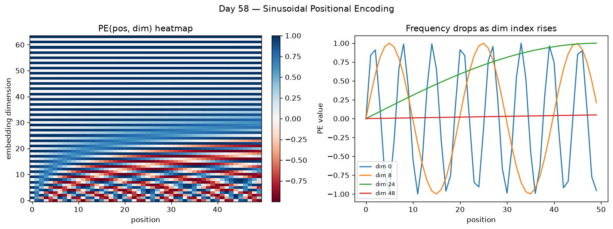

# Day 58 — Sinusoidal Positional Encoding

## 🧠 CONCEPT OF THE DAY

**Intuition.** Look back at Day 53–57's formula: `softmax(QKᵀ/√d_k)V`. Nowhere in that expression does token *order* appear — it's a weighted sum over a *set* of value vectors, and the weights come from dot products between vectors that don't know their own position. Shuffle the input sequence and permute the output by exactly the same shuffle: self-attention is permutation-*equivariant*, full stop. That's a problem, because "the cat sat on the mat" and "the mat sat on the cat" would attend identically. We need to inject position *into the vectors themselves*, before attention ever runs. Sinusoidal positional encoding does this with a fixed (non-learned) vector added elementwise to each token embedding — built from sine/cosine waves whose frequency changes geometrically across the embedding dimensions. Picture a clock: the second hand ticks fast and repeats every minute, the hour hand crawls and repeats every 12 hours. Read both hands together and you can pinpoint a much longer stretch of time uniquely than either hand alone could — that's exactly what stacking a "fast" sinusoid (low dimension index) next to a "slow" one (high dimension index) buys you: enough independent phase information to make every position's vector distinguishable.

**The math.** For a model dimension `d_model` and position `pos ∈ {0, 1, 2, ...}`, dimension index `i ∈ {0, ..., d_model/2 - 1}`:

$$PE(pos, 2i) = \sin\!\left(\frac{pos}{10000^{2i/d_{model}}}\right), \qquad PE(pos, 2i+1) = \cos\!\left(\frac{pos}{10000^{2i/d_{model}}}\right)$$

Each pair of dimensions `(2i, 2i+1)` is one sinusoid — sine and cosine of the *same* frequency, just 90° out of phase — and the frequency `1/10000^{2i/d_model}` shrinks geometrically as `i` grows, so wavelengths span roughly `2π` (dimension 0) up to `2π · 10000` (the last dimension). The result is added directly to the token embedding: `x' = Embedding(token) + PE(pos)`, same shape, no extra parameters, computed once and cached.



The heatmap (left) is exactly the `PE(pos, dim)` matrix you'd add to a batch of embeddings — vertical banding near the top because those dimensions oscillate so slowly they're nearly constant over just 50 positions, fine-grained ripples near the bottom where the fast dimensions live. The right panel isolates four individual dimensions to make that frequency drop concrete: `dim 0` completes several full cycles in the same span where `dim 48` has barely started to bend.

**Why it matters / where it leads.** The sin/cos pairing isn't decorative — it's what makes *relative* position linearly recoverable. Because of the angle-addition identities `sin(a+k) = sin(a)cos(k) + cos(a)sin(k)` and `cos(a+k) = cos(a)cos(k) - sin(a)sin(k)`, `PE(pos+k)` is expressible as a **linear transformation of `PE(pos)`** that depends only on the offset `k`, not on `pos` itself. That means attention can, in principle, learn to attend by relative offset ("look 3 tokens back") using a fixed linear operation applied uniformly across the whole sequence — a property a naively learned position-embedding table (one row per absolute position, like early BERT) doesn't get for free. The tradeoff, and the reason this exact scheme didn't survive into most modern LLMs: sinusoidal PE is *added* to the embedding, permanently entangling content and position in a way that's hard to undo layer after layer, and in practice extrapolation to sequences longer than anything seen in training is weaker than the original paper hoped. That's precisely the gap Day 59 (learned positions and RoPE) closes — rotary embeddings keep this same "geometrically-spaced frequencies" idea but apply it as a *rotation* to Q and K at every layer instead of a one-time additive offset, which composes far more cleanly with attention's dot products.

**Interview-style question:** Why does the original Transformer use `10000` as the base of the geometric frequency progression instead of, say, `2` or `100` — what would go wrong at the two extremes (too small a base vs. too large a base) for a sequence of length ~512–2048?

*(answer at the very bottom)*

---

## 🐍 PYTHONIC EDGE

The bad way: build the PE table with nested Python `for` loops over position and dimension — correct, but slow and error-prone to keep in sync with the paper's indexing. The clean way: vectorize the whole thing as one broadcasted NumPy/PyTorch expression, matching exactly how it ships in practice.

```python
import torch

class PositionalEncoding(torch.nn.Module):
    # class X(Base): Python single-inheritance; C++ writes class X : public Base
    def __init__(self, d_model, max_len=5000):
        super().__init__()                       # parent ctor call; C++ uses initializer-list syntax instead
        pos = torch.arange(max_len).unsqueeze(1)  # (max_len, 1); unsqueeze adds a dim, no C++ reshape equivalent
        i = torch.arange(0, d_model, 2)           # range(...) as an object here is a Tensor, step-2 slice of dims
        div_term = torch.exp(-i * (torch.log(torch.tensor(10000.0)) / d_model))  # 10000^(-i/d) via exp(log(...))

        pe = torch.zeros(max_len, d_model)
        pe[:, 0::2] = torch.sin(pos * div_term)   # slice notation [start:stop:step]; even dims -> sin
        pe[:, 1::2] = torch.cos(pos * div_term)   # odd dims -> cos; pos * div_term broadcasts (max_len,1)*(d/2,)

        # buffers are saved/moved-with-the-model but never get gradients — unlike self.x = ... for a plain attribute
        self.register_buffer("pe", pe.unsqueeze(0))  # (1, max_len, d_model): leading dim broadcasts over batch

    def forward(self, x):                         # calling pe_module(x) invokes __call__, which wraps forward()
        return x + self.pe[:, : x.size(1)]         # negative-free slice; only take PE rows up to seq_len

pe_module = PositionalEncoding(d_model=64)
tokens = torch.randn(2, 20, 64)   # (batch, seq_len, d_model)
out = pe_module(tokens)           # broadcast add: same PE rows reused across the batch dimension
```

The bug the loop version invites: off-by-one confusion between `2i` and `2i+1` indexing once you're four nested loops deep, plus the temptation to recompute `pe` on every forward call. `register_buffer` computes it exactly once, moves it to GPU with `.to(device)` automatically alongside the model's real parameters, and gets excluded from the optimizer — it's a lookup table, not something gradient descent should ever touch.

---

## 📡 SIGNAL LAB

Sinusoidal positional encoding is literally a small Fourier-style filter bank: a set of sinusoids at geometrically spaced frequencies, sampled at integer "time" points (the positions). This has an exact radar/GPS analogue: **ambiguity resolution via multiple frequencies.** A single high-frequency sinusoid gives very precise phase information about position but wraps around (aliases) every wavelength — you can't tell position 3 from position 3+λ just from phase alone. A single low-frequency sinusoid is unambiguous over a huge range but gives coarse, noisy phase resolution. Radar systems facing exactly this tradeoff (e.g. resolving range ambiguity with multiple pulse-repetition frequencies, or GPS combining coarse code-phase with fine carrier-phase) stack several frequencies together — coarse ones for unambiguous range, fine ones for precision — and combine them (conceptually a Chinese-Remainder-Theorem-like reconstruction). That's precisely why `PE` uses a whole geometric ladder of frequencies rather than one: the low dimensions (high frequency) let attention discriminate fine-grained *relative* offsets, the high dimensions (low frequency) anchor coarse, long-range position without wrapping.

**Worked check — how many usable "rungs" does a 64-dim PE actually give you before the fast rungs alias?**

```python
import numpy as np
np.random.seed(42)

d_model = 64
seq_len = 200
i = np.arange(0, d_model, 2)
freqs = 1.0 / (10000 ** (2 * i / d_model))   # cycles per position-step, one per dimension pair

wavelengths = 2 * np.pi / freqs              # positions per full cycle, i.e. the "aliasing period"
n_ambiguous = np.sum(wavelengths < seq_len)  # dims that complete a full cycle before the sequence ends

print(f"wavelength of fastest pair (i=0): {wavelengths[0]:.1f} positions")
print(f"wavelength of slowest pair (i={i[-1]}): {wavelengths[-1]:.2e} positions")
print(f"{n_ambiguous} of {len(freqs)} frequency pairs alias (wrap at least once) within a "
      f"{seq_len}-position sequence")
```

Running this: the fastest pair wraps every ~6.3 positions — read alone, it can't tell position 5 from position 11.3. The slowest pair has a wavelength around `6.3 × 10^4` positions — effectively a constant offset ramp over any realistic sequence, unambiguous but useless for fine discrimination on its own. **So what:** neither extreme is individually sufficient, exactly like single-PRF radar or single-frequency GPS carrier phase — but read *together*, each dimension pair's phase disambiguates a different scale, and 32 pairs spanning that six-orders-of-magnitude frequency range is what lets a linear attention head recover both "which token is this" (coarse) and "how far is it from me" (fine) from one additive vector.

---

## 🏋️ THE GAUNTLET

**Problem: Binary Watch / Minimum Number of Frequencies to Cover a Range**

Given `n` sinusoidal "channels," where channel `k` has period `p[k]` (a positive integer, `p[k]` can repeat), and a required unambiguous range `R`, find the *minimum subset* of channels whose combined period (the LCM of the chosen `p[k]`'s) is `≥ R`. Return the size of that minimum subset, or `-1` if no subset of the given channels reaches `R` even using all of them.

**Constraints:** `1 ≤ n ≤ 18`, `1 ≤ p[k] ≤ 10^4`, `1 ≤ R ≤ 10^12`.

**Hints (use only if stuck, in order):**
1. `n ≤ 18` is a screaming signal for bitmask enumeration over subsets — `2^18 ≈ 262144` is small, but computing LCM naively per subset from scratch is wasteful; think about what you can build incrementally.
2. Process subsets in order of popcount (number of channels used) via BFS/DP over bitmasks: `best_lcm[mask]` built from `best_lcm[mask without one bit]` combined with the newly added channel's period via `lcm(a, b) = a * b / gcd(a, b)`. Watch for overflow — cap/clamp any LCM once it exceeds `R`, since you never need it more precise than "already enough."
3. The answer is the minimum popcount over all masks whose `best_lcm[mask] ≥ R`; BFS by increasing popcount (or iterate `k = 1..n` and check all masks of that popcount) lets you return as soon as you find the first hit, avoiding computing the full DP table when small answers exist.

**Pattern:** Bitmask DP over subsets with an LCM/GCD combine step — recognize this whenever "combine a subset optimally, `n` is tiny (≤ ~20), and the combine operation is associative/commutative" (LCM, GCD, XOR, bitwise-OR of coverage masks all fit this shape).

---

## 🏗️ BLUEPRINT

No blueprint today.

---

## 🗺️ MARCHING ORDERS

You've now got a fixed, parameter-free way to tell attention "where" a token lives — the missing ingredient since Day 53. Tomorrow: Concept 59 — Learned & Rotary (RoPE) Positions.

---

🔓 GAUNTLET SOLUTION

```cpp
class Solution {
public:
    long long lcm(long long a, long long b, long long cap) {
        long long g = __gcd(a, b);
        // clamp to avoid overflow past what we'll ever need; cap+1 signals "already enough"
        __int128 result = (__int128)(a / g) * b;
        if (result > cap) return cap + 1;
        return (long long)result;
    }

    int minChannels(vector<int>& p, long long R) {
        int n = p.size();
        vector<long long> bestLcm(1 << n, 1);   // bestLcm[mask] = combined period of channels in mask

        for (int mask = 1; mask < (1 << n); mask++) {
            int lowBit = mask & (-mask);
            int idx = __builtin_ctz(lowBit);     // index of lowest set bit
            int prevMask = mask ^ lowBit;
            bestLcm[mask] = lcm(bestLcm[prevMask], p[idx], R);
        }

        int ans = -1;
        for (int mask = 1; mask < (1 << n); mask++) {
            if (bestLcm[mask] >= R) {
                int bits = __builtin_popcount(mask);
                if (ans == -1 || bits < ans) ans = bits;
            }
        }
        return ans;
    }
};
```

Every mask's combined LCM is built in `O(1)` from a strict submask (the same mask with its lowest bit cleared), so the whole table fills in `O(2^n)`. Scanning all `2^n` masks for the minimum popcount hitting `≥ R` is another `O(2^n)`, giving `O(2^n)` total — trivial for `n ≤ 18`.

💡 CONCEPT ANSWER

Too small a base (like `2`) makes the frequency ladder drop off so fast that within a few dimension pairs you're already at wavelengths shorter than realistic sequence lengths — most of the `d_model` dimensions end up redundant, all aliasing at similar short periods, wasting capacity and giving poor long-range discrimination. Too large a base (like `100` isn't actually too large, but pushing toward something like `10^9`) spreads frequencies so thin that the *useful* mid-range wavelengths — the ones actually comparable to typical sequence lengths (hundreds to low thousands) — are covered by very few dimension pairs, starving the model of resolution exactly where it matters, while huge stretches of the dimension range sit at wavelengths so long they're functionally constant offsets over any real sequence. `10000` was chosen because for `d_model` in the few-hundred-to-thousand range, it spreads wavelengths from single digits up to tens of thousands of positions — comfortably bracketing the sequence lengths (up to ~512 in the original paper) the model would actually see, so every scale from "adjacent token" to "whole sequence span" gets at least a few dimension pairs dedicated to resolving it.
