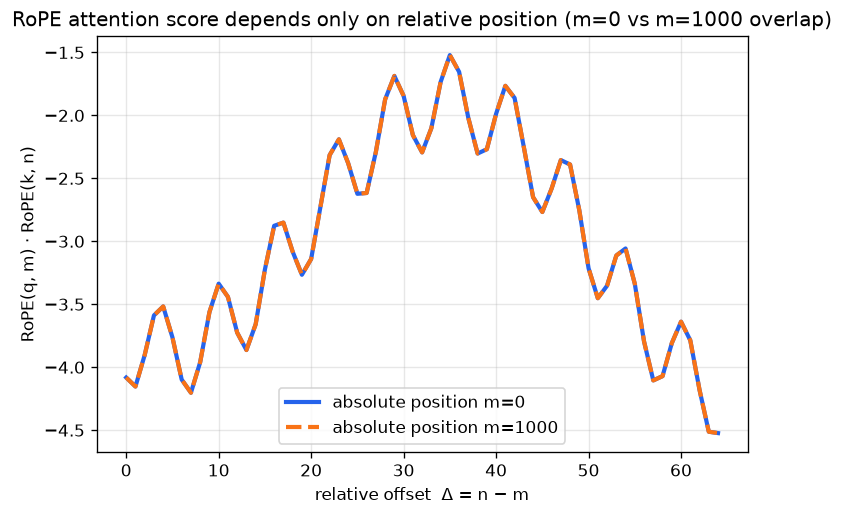

# Day 59 — Learned & Rotary (RoPE) Positional Embeddings

## 🧠 CONCEPT OF THE DAY

**Intuition first.** Yesterday's sinusoidal PE (Day 58) is a fixed lookup table nature handed you: position $p$ always maps to the same wave pattern, and you just *add* it to the token embedding. Two other schools of thought exist:

- **Learned positional embeddings** — instead of hardcoding sine/cosine, treat position the same way you treat a token: give every slot $0 \dots L_{\max}-1$ its own trainable vector in an embedding table, and let backprop figure out the best shape. GPT-2 and BERT do this.
- **Rotary positional embeddings (RoPE)** — a completely different move. Don't *add* a position vector to the embedding at all. Instead, **rotate** the query and key vectors by an angle proportional to their position, right before the dot product in attention. Think of each pair of dimensions in $q$ or $k$ as a 2D point on a clock face — position $m$ just spins that point by $m$ degrees. The magnitude never changes, only the angle.

Why bother rotating instead of adding? Because dot products of rotated vectors have a beautiful property: **the angle between two rotated vectors depends only on the difference in rotation, not on the absolute rotation of either one.** Rotate $q$ by $m$ and $k$ by $n$, and their dot product is a function of $(m-n)$ alone. Attention scores become *relative-position-aware* for free — no separate relative-position lookup table needed (which is what earlier "relative attention" papers like Transformer-XL had to bolt on by hand).

**The math.** Split a $d$-dimensional vector $x$ into $d/2$ pairs $(x_{2i}, x_{2i+1})$. For position $m$, rotate each pair by angle $m\theta_i$, using the *same* frequency schedule as sinusoidal PE:

$$\theta_i = \text{base}^{-2i/d}, \qquad \text{base} = 10000$$

The rotation of one pair is just a 2D rotation matrix:

$$\begin{pmatrix} x'_{2i} \\ x'_{2i+1} \end{pmatrix} = \begin{pmatrix} \cos(m\theta_i) & -\sin(m\theta_i) \\ \sin(m\theta_i) & \cos(m\theta_i) \end{pmatrix} \begin{pmatrix} x_{2i} \\ x_{2i+1} \end{pmatrix}$$

Apply this to $q$ at position $m$ and $k$ at position $n$, and the dot product collapses to:

$$\text{RoPE}(q, m) \cdot \text{RoPE}(k, n) = \sum_{i=0}^{d/2 - 1} \|q_i\| \|k_i\| \cos\big((m-n)\theta_i + \phi_i\big)$$

where $\phi_i$ is the phase offset between $q_i$ and $k_i$ within that pair — the point being every term depends on $m$ and $n$ only through $(m - n)$.

**Why it matters / where it leads.** Learned absolute embeddings have a hard ceiling: the embedding table has exactly $L_{\max}$ rows, so the model has *never seen* position $L_{\max}+1$ and has nothing sensible to look up if you feed it a longer sequence at inference time. RoPE has no table to run out of — it's a formula, evaluable at any $m$. That's why LLaMA, GPT-NeoX, PaLM, and Mistral all use RoPE: it composes cleanly with attention's relative structure, and it's a big part of why techniques like position-interpolation and NTK-aware scaling (stretching or reinterpreting $\theta_i$ post-hoc) can extend context length without retraining from scratch. This is the last missing piece before Day 60, where you'll assemble the full transformer block — residual + LayerNorm + attention (now position-aware via RoPE) + FFN — end to end.

**Interview-style question:** *Why does RoPE generalize better to sequence lengths longer than training, compared to learned absolute positional embeddings — and what still breaks if you push RoPE far enough beyond the trained length?* (Answer at the very bottom.)

---

## 🐍 PYTHONIC EDGE

RoPE rotation is conceptually a loop over pairs, but production code (HF Transformers, LLaMA reference) never writes that loop — it uses one vectorized "rotate half" trick. Here's the naive version vs. the idiomatic one.

```python
import torch

# ---------- the "bad" way: explicit Python loop over pairs ----------
def rope_naive(x, pos, theta):
    # x: (d,) — a single query/key vector. theta: (d//2,) frequency schedule.
    d = x.shape[0]              # .shape is a tuple attribute, not a method call like C++ .size()
    out = x.clone()             # .clone() copies data; plain `out = x` would just alias the tensor (like a pointer, not a deep copy)
    for i in range(d // 2):     # range() returns a lazy iterator object in Python, not a materialized array like std::vector<int>
        angle = pos * theta[i]
        x0, x1 = x[2 * i], x[2 * i + 1]   # tuple unpacking: no std::tie needed, Python assigns both in one line
        out[2 * i]     = x0 * torch.cos(angle) - x1 * torch.sin(angle)
        out[2 * i + 1] = x0 * torch.sin(angle) + x1 * torch.cos(angle)
    return out

# ---------- the clean, vectorized way ----------
def rotate_half(x):
    # x: (..., d). Split last dim into two halves instead of interleaved pairs (equivalent under a fixed permutation).
    x1, x2 = x.chunk(2, dim=-1)   # .chunk splits into equal pieces; dim=-1 means "last axis" (negative indexing, no C++ equivalent)
    return torch.cat((-x2, x1), dim=-1)   # torch.cat is like std::vector concatenation but returns a NEW tensor (no in-place +=)

def rope_apply(x, cos, sin):
    # cos, sin: (..., d) precomputed once per forward pass — broadcasted, no per-element Python loop.
    return x * cos + rotate_half(x) * sin   # `*` is elementwise here (NOT @, which is matmul) — easy C++ dev mistake to conflate the two

# precompute cos/sin for a batch of positions once, outside any per-token loop
positions = torch.arange(16)                    # range()'s tensor cousin; produces an actual 1D tensor, unlike lazy range()
freqs = positions[:, None] * theta[None, :]      # None indexing inserts a new axis (like unsqueeze); NumPy/Torch idiom, no C++ analog
cos, sin = freqs.cos().repeat_interleave(2, dim=-1), freqs.sin().repeat_interleave(2, dim=-1)
```

The naive version is $O(d)$ Python-level iterations *per vector, per position* — deadly once you multiply by batch size × sequence length × heads. The vectorized version does the same rotation as one broadcasted tensor op: `cos`/`sin` are computed **once** for all positions and reused via broadcasting, and `rotate_half` reshuffles + negates in a single fused call. Rule of thumb: any time you're writing `for i in range(tensor.shape[-1])`, ask whether a `chunk`/`cat`/broadcast rewrite exists — it almost always does, and it's the difference between a kernel that vectorizes on GPU and one that doesn't.

---

## 📡 SIGNAL LAB

Look again at $\theta_i = \text{base}^{-2i/d}$ — that's *exactly* the same geometric frequency ladder from Day 58's sinusoidal PE. RoPE isn't a new frequency design; it reuses the DFT-like basis and repurposes it as a set of **carrier rotations** instead of additive waves. Applying $e^{i m \theta_i}$ to a token at position $m$ is literally modulating a complex exponential carrier at frequency $\theta_i$ by sample index $m$ — this is a discrete-time chirp bank, one carrier per dimension-pair, at frequencies spaced geometrically from $1$ down to $\text{base}^{-1} \approx 10^{-4}$.

This buys you a Nyquist-flavored worked problem: **at what relative offset does the highest-frequency channel ($\theta_0 = 1$ rad/position) start aliasing — i.e., become indistinguishable from a smaller offset?**

A rotation by angle $\theta_0 \cdot \Delta$ is periodic with period $2\pi / \theta_0 = 2\pi \approx 6.28$ positions, since $\theta_0 = 1$. So $\Delta = 0$ and $\Delta = 2\pi \approx 6.28$ produce (nearly) the same rotation on that channel — the fastest channel "wraps around" every ~6 tokens, exactly like a sinusoid sampled below Nyquist folding back onto a lower apparent frequency. A single channel genuinely can't disambiguate offsets that differ by a multiple of its period.

**So what saves RoPE from real aliasing?** The *ensemble*. Each of the $d/2$ channels wraps at a different period (from ~6 positions up to $2\pi \cdot \text{base} \approx 62{,}832$ positions for the slowest channel), so while any single channel is ambiguous, the joint pattern across all channels — like a multi-tone code, or a mixed-radix number system — is unambiguous over a vastly longer range than any one component. This is the same trick as a Fourier-based hash: no single frequency needs to resolve the whole range, the *combination* does. It's also exactly why the plot below shows the score curve *decaying* with distance rather than staying flat: as $\Delta$ grows, the high-frequency channels churn through several full cycles and their contributions to the sum increasingly cancel (destructive interference across mismatched phases), leaving mostly the slow channels' contribution — a built-in, learned-nothing locality bias, very much like a low-pass envelope falling out of a sum of chirps.

The graph below rotates a fixed random $(q, k)$ pair (seed 42, $d=8$) at absolute positions $m=0$ and $m=1000$, and sweeps the relative offset $\Delta = n - m$ from 0 to 64. The two curves overlap almost exactly — direct visual proof that the score is a function of $\Delta$ alone, plus you can see the decay envelope described above.



---

## 🏋️ THE GAUNTLET

**Problem: In-Place Circular Rotation**

Given an integer array `nums` of size `n` and a non-negative integer `k`, rotate the array to the right by `k` steps **in-place**, using **O(1) extra space**.

- $1 \le n \le 10^6$
- $0 \le k \le 10^9$
- Target: **O(n) time, O(1) extra space** (no second array, no `nums[i - k % n]` copy-into-new-list shortcuts).

Example: `nums = [1,2,3,4,5,6,7]`, `k = 3` → `[5,6,7,1,2,3,4]`.

**Hint 1:** $k$ can be larger than $n$ — what should you do to $k$ before anything else, and why does a rotation by $n$ steps do nothing at all?

**Hint 2:** You can't allocate a second array. But you *can* reverse a subrange of the array in-place in $O(\text{length})$ time with two pointers walking inward. Where would reversing the *whole* array by itself leave you, relative to the target?

**Hint 3:** After reversing the whole array, the first $k$ elements are the *right* elements but themselves reversed, and the remaining $n-k$ are the *left* elements, also reversed. What operation, applied to each of those two pieces independently, finishes the job?

**Pattern:** three-reversal rotation trick (reverse whole → reverse each half). Target complexity: **O(n) time, O(1) space**.

---

## 🏗️ BLUEPRINT

No blueprint today.

---

## 🗺️ MARCHING ORDERS

Sit with the graph until the "why do the curves overlap" answer feels obvious, not memorized — that intuition is what separates people who can *use* RoPE from people who can only cite that LLaMA uses it.

Tomorrow: Concept 60 — Transformer block (residual + LN + FFN)

---

🔓 GAUNTLET SOLUTION

```cpp
#include <vector>
#include <algorithm>
using namespace std;

class Solution {
public:
    void rotate(vector<int>& nums, int k) {
        int n = nums.size();
        k %= n;                                  // rotating by n is a no-op, so only k % n steps matter
        if (k == 0) return;

        reverse(nums.begin(), nums.end());        // reverse the whole array
        reverse(nums.begin(), nums.begin() + k);   // un-reverse the first k (now the rotated-in tail)
        reverse(nums.begin() + k, nums.end());     // un-reverse the remaining n-k (the original head)
    }
};

// Why it works:
// reverse(whole) turns [1,2,3,4,5,6,7] (k=3) into [7,6,5,4,3,2,1].
// The desired final array [5,6,7,1,2,3,4] is exactly the first k elements
// and last n-k elements of that reversed array, each *individually* re-reversed
// back to forward order. Three linear passes => O(n) time, O(1) extra space.
```

---

💡 CONCEPT ANSWER

RoPE generalizes better because it's a **closed-form function of position**, not a lookup table — it can be evaluated at *any* integer $m$, including ones never seen during training, and because attention scores only ever depend on the *difference* $(m-n)$, a model trained on offsets up to $\Delta_{\max}$ has implicitly learned how to use every offset it saw, regardless of the absolute positions involved. A learned absolute embedding table, by contrast, has a hard-coded number of rows: position $L_{\max}+1$ literally has no trained vector, so the model is extrapolating into undefined territory the instant you exceed the training length.

What still breaks: RoPE generalizes to *offsets* it saw during training, but the model has never seen **relative offsets larger than $\Delta_{\max}$** either — attention scores between very distant tokens correspond to high-frequency channels wrapping through many periods in ways training never exercised, and empirically perplexity degrades once you push far enough past the trained context length. This is precisely the gap that position-interpolation and NTK-aware/YaRN rescaling techniques target: they rescale or reinterpret the $\theta_i$ schedule so that "never-seen-large" relative offsets get remapped into the range of offsets the model *did* train on, rather than relying on raw extrapolation.
