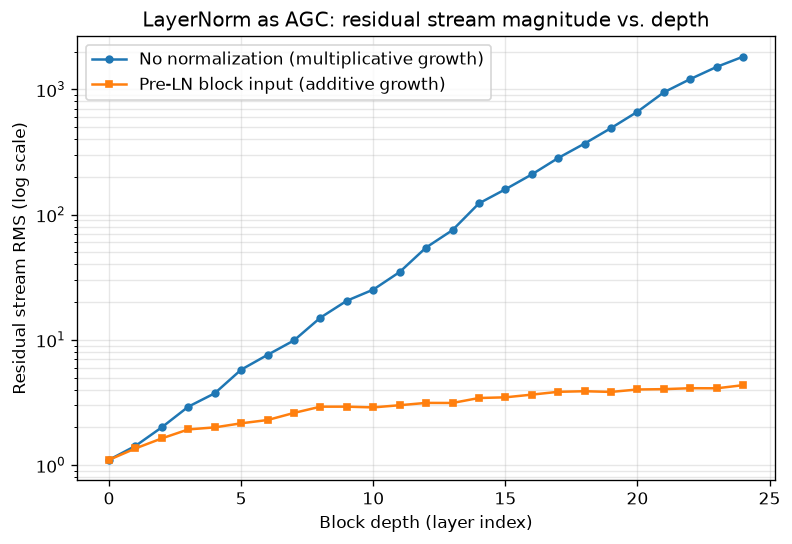

# Day 60 — The Transformer Block (Residual + LayerNorm + FFN)

## 🧠 CONCEPT OF THE DAY

**Intuition first.** For the last eight days (53–59) you built the pieces of attention — Q/K/V, scaled dot-product, multi-head, self- vs cross-attention, positional encodings. But attention alone is *only* a token-mixing operation: it lets every position read every other position, then produces a weighted average. Averages are inherently smoothing — stack enough of them with nothing else and every token's representation converges toward the same bland blend. A transformer block fixes this by alternating attention (mix across tokens) with a **position-wise feed-forward network** (transform each token independently, adding real nonlinear capacity), and wraps *both* in a **residual connection + LayerNorm** so that stacking dozens of these blocks stays trainable at all.

Think of the residual connection as a **highway lane**: the raw input to a block always has an unobstructed path straight through to the output (`x + sublayer(x)`), so even if a sublayer starts out learning something useless (near-zero output), the block still passes information through unchanged — gradients have a clean route back to early layers instead of being forced through every nonlinearity (this is the same fix ResNet applied to CNNs on Day 41). LayerNorm is the **volume knob**: it rescales each token's vector to a consistent mean/variance *before* (Pre-LN) or *after* (Post-LN) the sublayer, so activations don't drift to numerically unstable magnitudes as they pass through dozens of stacked blocks.

**The math.** A transformer block combines a token-mixing sublayer (multi-head self-attention, Day 56) and a token-wise sublayer (the FFN):

$$\text{FFN}(x) = W_2 \, \sigma(W_1 x + b_1) + b_2$$

where $W_1 \in \mathbb{R}^{d_{ff} \times d_{model}}$ projects up (typically $d_{ff} = 4 d_{model}$), $\sigma$ is a nonlinearity (GELU in modern transformers, Day 3), and $W_2 \in \mathbb{R}^{d_{model} \times d_{ff}}$ projects back down. Note the FFN is applied **identically and independently to every token position** — no cross-token mixing happens here; that's attention's job alone.

The two dominant ways to wire residual + LayerNorm around each sublayer:

**Post-LN** (original *Attention Is All You Need*):

$$x' = \text{LN}\big(x + \text{Attn}(x)\big), \qquad \text{out} = \text{LN}\big(x' + \text{FFN}(x')\big)$$

**Pre-LN** (GPT-2 onward, now the near-universal default):

$$x' = x + \text{Attn}\big(\text{LN}(x)\big), \qquad \text{out} = x' + \text{FFN}\big(\text{LN}(x')\big)$$

The difference looks cosmetic but isn't: in Pre-LN, the raw residual stream $x$ is **never itself normalized** — LN only touches the copy fed *into* the sublayer. That leaves a pure, unimpeded identity path from block 1 straight to block $N$, exactly like ResNet's identity shortcut.

**Why it matters / where it leads.** Post-LN normalizes the residual stream itself, which sounds safer — but it means the identity path is no longer purely linear; gradients must pass through a LayerNorm's normalization statistics at every block, which empirically makes very deep Post-LN transformers unstable to train without a careful learning-rate warmup (Day 17). Pre-LN keeps that gradient highway clean, which is why it dominates at scale — GPT-2/3, LLaMA, and nearly every modern LLM use it — at the cost of the residual stream's raw magnitude growing with depth (you'll see exactly this in the graph below), which is why most Pre-LN architectures add one final LayerNorm after the last block, right before the output projection. This block — attention + FFN + residual + LN — *is* the repeating unit; Day 61 is simply about how you arrange stacks of it (encoder-only, decoder-only, or both) for different tasks.

**Interview-style question:** *Why does Pre-LN training tend to be more stable than Post-LN at large depth, and what's the tradeoff Pre-LN architectures pay for that stability?* (Answer at the very bottom.)

---

## 🐍 PYTHONIC EDGE

A transformer block is a perfect case for composing small `nn.Module`s instead of writing one long functional blob. Here's the "script it inline" way vs. the idiomatic, composable way.

```python
import torch
import torch.nn as nn

# ---------- the "bad" way: one flat function, nothing reusable or inspectable ----------
def transformer_block_naive(x, attn_fn, w1, b1, w2, b2, ln1_params, ln2_params):
    # x: (batch, seq, d_model). Every weight is a loose variable you must thread by hand.
    attn_out = attn_fn(x)
    x = x + attn_out                                # residual add, but no named module to inspect/debug
    x = torch.layer_norm(x, x.shape[-1:], *ln1_params)
    ffn_out = torch.nn.functional.gelu(x @ w1.T + b1) @ w2.T + b2   # @ is matmul, NOT elementwise * (a common C++ dev slip)
    x = x + ffn_out
    x = torch.layer_norm(x, x.shape[-1:], *ln2_params)
    return x

# ---------- the clean, idiomatic way: a proper nn.Module ----------
class TransformerBlock(nn.Module):                 # class X(Base): single inheritance; C++ would write `class X : public Base`
    def __init__(self, d_model, n_heads, d_ff, dropout=0.1):
        super().__init__()                          # runs nn.Module's constructor first; C++ uses an initializer-list instead
        self.attn = nn.MultiheadAttention(d_model, n_heads, batch_first=True)  # self.x = ...: instance attr, no header declaration needed
        self.ffn = nn.Sequential(                    # nn.Sequential chains modules; callable as a single unit via __call__
            nn.Linear(d_model, d_ff),
            nn.GELU(),
            nn.Linear(d_ff, d_model),
        )
        self.ln1 = nn.LayerNorm(d_model)
        self.ln2 = nn.LayerNorm(d_model)
        self.dropout = nn.Dropout(dropout)

    def forward(self, x, attn_mask=None):           # forward() defines the computation, but you never call it directly
        normed = self.ln1(x)                         # Pre-LN: normalize the sublayer's INPUT, not the residual stream itself
        attn_out, _ = self.attn(normed, normed, normed, attn_mask=attn_mask)  # tuple unpacking: MHA returns (output, weights)
        x = x + self.dropout(attn_out)                # residual add keeps x's raw scale on the identity path
        x = x + self.dropout(self.ffn(self.ln2(x)))    # same Pre-LN pattern for the FFN sublayer
        return x

block = TransformerBlock(d_model=256, n_heads=8, d_ff=1024)
out = block(torch.randn(4, 32, 256))                 # block(x) invokes __call__, which wraps forward() with hooks —
                                                       # calling block.forward(x) directly skips those hooks; never do it
```

The naive version threads seven loose arguments through a function and inlines every op, so nothing is independently testable, printable (`print(block)`), or reusable across a stack of layers. The `nn.Module` version packages state (weights) with behavior (`forward`), composes via `nn.Sequential`, and — critically — plugging `block(x)` instead of `block.forward(x)` matters: `__call__` (inherited from `nn.Module`) is what registers forward/backward hooks, handles `.train()`/`.eval()` mode dispatch (e.g. `Dropout` behaves differently), and is required for autograd to build the graph correctly.

---

## 📡 SIGNAL LAB

LayerNorm's job — rescale each token vector back to a fixed mean/variance every time it's about to grow or shrink — is exactly what **automatic gain control (AGC)** does in a cascaded analog or digital signal chain: without it, a signal passed through many amplifying stages either saturates (clips) or decays into the noise floor; AGC renormalizes the level at each stage so downstream stages always see a signal in their usable dynamic range.

**Worked problem.** Model each block's contribution to the residual stream as a small, roughly independent random increment with per-element variance $\sigma^2$ (a reasonable approximation for a freshly-initialized FFN's output). Without any normalization, the residual stream after $L$ blocks is $x_L = x_0 + \sum_{l=1}^{L} f_l(x_{l-1})$, and if each $f_l$'s output variance itself scales with the *current* magnitude of $x_{l-1}$ (true here, since $f_l$ is close to linear before the GELU saturates), the variance compounds **multiplicatively** — $\text{Var}(x_l) \approx (1+c)\,\text{Var}(x_{l-1})$ for some $c>0$, i.e. exponential growth in $L$.

Now put a LayerNorm on the block's *input* only (Pre-LN), so every block always sees a unit-variance vector regardless of the current residual stream's scale. Its output variance $\sigma^2$ is now roughly **constant across depth**, so the increments behave like a random walk with fixed step size:

$$\text{Var}(x_L) \approx \text{Var}(x_0) + L\sigma^2$$

RMS magnitude grows only as $\sqrt{\text{Var}(x_0) + L\sigma^2}$ — a $\sqrt{L}$ curve, not $e^L$. **So what:** this is precisely the empirical reason Pre-LN transformers train stably at 50+ layers where Post-LN (which normalizes the compounding stream itself) needs careful warmup, and it's also *why* Pre-LN stacks still add one extra final LayerNorm before the output head — the $\sqrt{L}$ drift is much tamer than exponential, but it's not zero.

The graph below simulates a 24-block toy residual stream ($d=64$, seed 42) both without any normalization and with Pre-LN, tracking RMS magnitude per layer on a log scale — the multiplicative-vs-additive growth regimes are unmistakable once you see the two curves side by side.



---

## 🏋️ THE GAUNTLET

**Problem: Sliding Window Maximum**

Given an integer array `nums` and a window size `k`, return an array of the maximum value in each contiguous window of size `k` as it slides from the left end of the array to the right, one step at a time.

- $1 \le k \le \text{nums.length} \le 10^5$
- $-10^4 \le \text{nums}[i] \le 10^4$
- Target: **O(n) time** total (not O(n·k)), **O(k) extra space**.

Example: `nums = [1,3,-1,-3,5,3,6,7]`, `k = 3` → `[3,3,5,5,6,7]`.

**Hint 1:** The brute force recomputes the max of every window from scratch — O(n·k). When the window slides by one, only one element leaves and one enters. What's redundant about throwing away everything you knew about the old window?

**Hint 2:** Suppose element `a` is to the left of element `b` (`a` will leave the window before `b` does) and `a ≤ b`. Can `a` *ever* be the answer for any future window that still contains `b`? If not, once `b` arrives, is there any reason to keep `a` around at all?

**Hint 3:** Maintain a deque of *indices* whose corresponding values are strictly decreasing from front to back. On each new element: pop from the back while it violates the decreasing property, push the new index, then pop from the front if it has slid outside the window. The front index is always the current window's max.

**Pattern:** monotonic deque. Target complexity: **O(n) time, O(k) space** — each index is pushed and popped at most once.

---

## 🏗️ BLUEPRINT

**Pre-LN vs. Post-LN is a stability-vs-final-norm tradeoff, not a free lunch.** Pre-LN wins the training-stability argument at scale (clean identity path, no warmup schedule required to avoid divergence at init) — which is why virtually every large decoder-only LLM uses it. But because the residual stream itself is never renormalized, its magnitude drifts upward with depth (the $\sqrt{L}$ growth above), which can quietly degrade the effective learning signal in the *later* blocks of a very deep stack (their sublayer outputs become a smaller and smaller fraction of an ever-growing residual norm) — the reason production Pre-LN architectures bolt on a final LayerNorm before the output head, and why some very deep models (DeepNet, and scaled-residual variants) go further and explicitly down-weight each block's contribution as depth grows, trading a bit of per-block expressiveness for even more stability at 100+ layer scale.

---

## 🗺️ MARCHING ORDERS

You've now assembled every load-bearing piece of a transformer block from the ground up — go trace through a real `nn.TransformerEncoderLayer` source and confirm every line maps to something you derived this week.

Tomorrow: Concept 61 — Encoder-only vs decoder-only vs enc-dec

---

🔓 GAUNTLET SOLUTION

```cpp
#include <vector>
#include <deque>
using namespace std;

class Solution {
public:
    vector<int> maxSlidingWindow(vector<int>& nums, int k) {
        deque<int> dq;              // stores indices, values strictly decreasing front-to-back
        vector<int> result;
        int n = nums.size();

        for (int i = 0; i < n; ++i) {
            // evict indices that have slid out of the current window
            while (!dq.empty() && dq.front() <= i - k) {
                dq.pop_front();
            }
            // evict from the back anything the new element makes irrelevant:
            // nums[i] will outlive them AND is >= their value, so they can never win again
            while (!dq.empty() && nums[dq.back()] <= nums[i]) {
                dq.pop_back();
            }
            dq.push_back(i);

            // once the first full window is formed, front of deque is this window's max
            if (i >= k - 1) {
                result.push_back(nums[dq.front()]);
            }
        }
        return result;
    }
};

// Each index enters the deque exactly once and leaves at most once (front or back
// eviction), so total work across all n iterations is O(n), not O(n*k).
```

---

💡 CONCEPT ANSWER

Pre-LN keeps the raw residual stream $x$ completely unnormalized on its path from block 1 to block $N$ — LayerNorm only ever touches a *copy* fed into a sublayer, never the accumulating stream itself — so the gradient of the loss with respect to any early block's parameters has a direct, purely-linear (identity) route back through every later block, undisturbed by LayerNorm's normalization statistics. Post-LN normalizes the residual stream itself after every sublayer, which means that identity path no longer exists in pure form: gradients must flow *through* a LayerNorm operation at every single block, and at large depth (dozens of blocks) this compounds into training that diverges or stalls unless you use a careful learning-rate warmup schedule to keep early updates small while the statistics settle.

The tradeoff: because Pre-LN never renormalizes the residual stream itself, its magnitude grows with depth (additively in variance, $\text{Var}(x_L) \approx \text{Var}(x_0) + L\sigma^2$, so RMS grows like $\sqrt{L}$) — an unbounded, ever-growing "carrier" that later blocks' sublayer outputs become a shrinking fraction of. This is why Pre-LN stacks typically need one final LayerNorm right before the output head, and why some very deep architectures explicitly rescale each block's contribution rather than trusting raw addition to stay well-behaved indefinitely.
