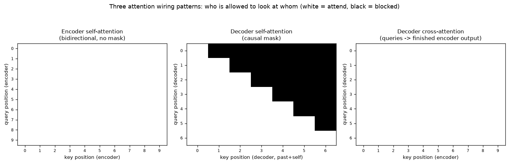

# Day 61 — Encoder-Only vs Decoder-Only vs Encoder-Decoder

## 🧠 CONCEPT OF THE DAY

**Intuition first.** Days 53–60 built exactly one reusable part: the transformer block (self-attention + FFN + residual + LayerNorm). Today is not a new part — it's the wiring diagram. The same block gets stacked into three different topologies depending on one question: *is the whole input allowed to see itself all at once, or must generation only ever look backward?*

- **Encoder-only (BERT-style).** Every token's self-attention is fully bidirectional — token 5 can attend to token 9, which hasn't "happened" yet in reading order but is already sitting in memory. This is fine because the whole input is available at once; there's no notion of "the future" for a sentence you already have in full. Good for *understanding* tasks — classification, embeddings, retrieval — where you consume a fixed input and emit one judgment about it.
- **Decoder-only (GPT-style).** Self-attention is *causally masked*: token $i$ may only attend to tokens $j \le i$. This isn't a modeling choice made for fun — it's forced by the training objective. You train by predicting token $i+1$ from tokens $1..i$; if token $i$ could see token $i+1$ during training, the model would just copy the answer instead of learning to predict it, and at inference time tokens $i+1, i+2, \dots$ don't exist yet anyway. Good for *generation*.
- **Encoder–decoder (T5 / original *Attention Is All You Need*).** An encoder stack runs full bidirectional self-attention once over the input (the "source"). A decoder stack runs causally-masked self-attention over the output-so-far (the "target"), **plus** a second attention sublayer — cross-attention — where decoder queries attend over the *finished* encoder output. Good for tasks with a genuinely distinct input and output: translation, summarization.

**The math.** All three are the same scaled dot-product attention from Day 55 —

$$\text{Attn}(Q,K,V) = \text{softmax}\!\left(\frac{QK^\top}{\sqrt{d_k}} + M\right)V$$

— differing only in where $Q$, $K$, $V$ come from and what mask $M$ is added before the softmax (an entry of $M_{ij}=-\infty$ zeroes out that attention weight; $M_{ij}=0$ leaves it untouched):

$$
M^{\text{encoder}}_{ij} = 0 \ \ \forall i,j
\qquad\qquad
M^{\text{decoder}}_{ij} =
\begin{cases}
0 & j \le i \\
-\infty & j > i
\end{cases}
$$

For cross-attention, $Q$ comes from the decoder (length $m$, still growing) but $K,V$ come from the **encoder's finished output** (length $n$, fixed once computed):

$$\text{CrossAttn}(Q_{\text{dec}}, K_{\text{enc}}, V_{\text{enc}}) = \text{softmax}\!\left(\frac{Q_{\text{dec}} K_{\text{enc}}^\top}{\sqrt{d_k}}\right)V_{\text{enc}}, \qquad M^{\text{cross}} = 0 \ \ \forall i,j$$

No causal mask on cross-attention — the encoder output isn't "the future" relative to the decoder, it's a completed, fixed artifact the decoder is allowed to consult in full, every step.

**Why it matters / where it leads.** This one masking choice is *the* fork in the road for the entire field's architecture landscape. Decoder-only wins for general-purpose LLMs (GPT, LLaMA) because one causally-masked stack can be trained on raw next-token prediction over anything — no need to define a separate "source" and "target." Encoder-only (BERT, and its embedding-model descendants) still wins wherever you need a fixed-size representation of an input rather than a generated sequence. Encoder-decoder still wins on tasks with a crisp input→output split and asymmetric lengths, since the encoder pays its full-context cost exactly once regardless of how long the decoder's output runs. Day 62 formalizes the causal mask itself (the exact matrix construction and why it's implemented as additive $-\infty$ rather than literal zeroing); this lesson is the "why three shapes exist" that Day 62's mechanics slot into.

**Interview-style question:** *In an encoder-decoder model, decoder self-attention is causally masked but decoder cross-attention is not. If you accidentally forgot the causal mask on decoder self-attention during training but the model still converged to low training loss, what would you see go wrong at inference time — and why wouldn't training loss have caught it?* (Answer at the very bottom.)

---

## 🐍 PYTHONIC EDGE

Building a causal mask is one of those things everyone eventually writes with a Python loop first, then discovers the vectorized one-liner. Here's the progression.

```python
import torch

# ---------- the "bad" way: nested Python loops building the mask element-by-element ----------
def causal_mask_naive(seq_len):
    mask = torch.zeros(seq_len, seq_len)          # torch.zeros(rows, cols): shape as positional args, not a struct
    for i in range(seq_len):                      # range() returns a lazy iterator object, not a materialized list (unlike a raw C++ index loop, no allocation)
        for j in range(seq_len):
            if j > i:                              # future position relative to query i -> must be blocked
                mask[i, j] = float("-inf")         # Python float("-inf") — no equivalent literal in C++, you'd use -std::numeric_limits<float>::infinity()
    return mask

# ---------- the clean, idiomatic way: vectorized, no Python-level loop at all ----------
def causal_mask(seq_len, device="cpu"):
    # torch.triu: upper triangle of a matrix; diagonal=1 excludes the main diagonal (today's own position stays visible)
    upper = torch.triu(torch.ones(seq_len, seq_len, device=device), diagonal=1)
    mask = upper.masked_fill(upper == 1, float("-inf"))   # masked_fill(bool_mask, value): out-of-place; masked_fill_() is the in-place, trailing-underscore twin
    return mask                                            # (the _-suffix convention: any torch method ending in _ mutates the tensor instead of returning a new one)

m = causal_mask(5)
print(m)
# tensor([[0., -inf, -inf, -inf, -inf],
#         [0.,   0., -inf, -inf, -inf],
#         [0.,   0.,   0., -inf, -inf],
#         [0.,   0.,   0.,   0., -inf],
#         [0.,   0.,   0.,   0.,   0.]])

# Even more idiomatic in modern PyTorch: skip building the additive mask entirely.
scores = torch.randn(5, 5)
attn_weights = torch.softmax(
    scores.masked_fill(torch.triu(torch.ones(5, 5, dtype=torch.bool), diagonal=1), float("-inf")),
    dim=-1,                                        # dim=-1: negative indexing on axes too — "last axis," regardless of tensor rank
)
```

The naive version is $O(n^2)$ Python-interpreter work for something that's fundamentally a fixed geometric pattern — `torch.triu` produces the exact same boolean structure in one fused C++/CUDA kernel call, with no per-element Python overhead and no risk of an off-by-one on the diagonal (a classic bug: `diagonal=0` vs `diagonal=1` decides whether a token can attend to *itself*, which it always should). `masked_fill` is also the pattern to reach for any time you need "everywhere this boolean condition holds, overwrite with a constant" — it's vectorized `if/else` for tensors, and it composes directly with `torch.triu`, `torch.tril`, or any other boolean tensor you construct.

---

## 📡 SIGNAL LAB

The causal-vs-bidirectional split is exactly the causal-vs-zero-phase split in filter design, and it's a distinction you already work around constantly in offline signal processing.

A **causal filter** — like decoder self-attention — can only use samples $x[0..n]$ to compute $y[n]$; it's implementable in real time, but any nontrivial causal filter introduces **phase delay** (a *group delay*), because it necessarily lags behind the true signal to have enough past samples to average. A **zero-phase filter** — like encoder self-attention, or `scipy.signal.filtfilt` — is allowed to use the *entire* signal, past and future, to compute any single output sample. `filtfilt` literally implements this by running the filter forward, then running it again backward over the (now already-computed) result, which cancels phase distortion exactly — but it requires the whole signal to already be sitting in memory. You cannot run `filtfilt` on a live audio stream one sample at a time, for the identical reason you cannot run BERT-style bidirectional attention token-by-token during generation: both require the "future" to already exist.

**Worked problem.** Take a simple length-5 causal moving-average filter, $h[n] = \tfrac{1}{5}$ for $n=0..4$. Its frequency response has a **linear phase term** $e^{-j\omega \cdot 2}$ — a delay of exactly $(5-1)/2 = 2$ samples, the filter's group delay. Now take the *zero-phase* equivalent — apply the same 5-tap average forward, then backward (`filtfilt`'s trick). The forward pass contributes phase $-2\omega$; the backward pass, run on time-reversed data, contributes the exact opposite $+2\omega$ (because reversing time negates $\omega$ in the phase term) — they cancel, leaving pure magnitude shaping and **zero net phase shift**, at the cost of doubling the filter order (now effectively 9 taps' worth of smoothing) and needing the entire array before you can start.

**So what:** this is the identical trade you already navigate as a frequency-domain CV/generative researcher — offline zero-phase filtering, like BERT-style encoding, gets a "free" quality win (no phase distortion / full-context representations) *because* it isn't required to run causally. Any time you deploy a causal, real-time system — streaming ASR, autoregressive generation, live filtering — you are paying a structural tax (group delay, or GPT's inability to revise a token after emitting it) that a batch/offline system with full context simply never has to pay.

The graph below shows exactly this fork, one level up the stack: the three attention masks (encoder bidirectional, decoder causal, decoder→encoder cross) rendered as heatmaps — white cells are "allowed to attend," black cells are "blocked."



---

## 🏋️ THE GAUNTLET

**Problem: Streaming Window Max + Offline Range Max**

You're given an array `nums` of `n` integers, revealed to you **one at a time** (you may never look ahead — causal, like decoder self-attention), and a fixed window size `k`.

1. **Causal pass:** as each element arrives, output the maximum of the last `k` elements ending at the current index (for indices `< k-1`, output the max of all elements seen so far).
2. **Offline pass:** once the full array has been revealed (bidirectional, like encoder self-attention — you now see everything), answer `q` queries, each `(l, r)`, asking for the maximum over `nums[l..r]` (inclusive), as fast as possible per query.

Constraints: `1 <= n <= 2×10^5`, `1 <= k <= n`, `1 <= q <= 2×10^5`, `0 <= l <= r < n`, values fit in a 32-bit int.

**Target:** causal pass in **O(n) total**; offline pass in **O(n log n) preprocessing, O(1) per query**.

**Pattern:** monotonic deque (sliding window maximum) for the causal part; sparse table (static RMQ) for the offline part — the two data structures are the algorithmic mirror of "must respect a causal mask" vs "the whole array is already visible."

**Hints (escalating):**
1. For the causal part: what invariant would let you answer "max of the current window" in O(1) *without* rescanning the window every step? Think about which elements in the window could *ever* become the answer as the window slides forward — an element that's both older *and* smaller than a more recent element can never win again.
2. For the offline part: since you're told the entire array upfront (no causal restriction), you don't need to rebuild anything per query — precompute the max over every window of length $2^j$ starting at every index, once.
3. Combine carefully: a query `[l, r]` doesn't neatly split into power-of-two blocks — you need two *overlapping* power-of-two windows (not a partition) to cover `[l, r]` in O(1) lookups; and for the causal deque, remember to evict from the *front* when the front index falls more than `k` behind the current index, not just when values go stale.

Full solution is under 🔓 GAUNTLET SOLUTION at the very bottom — try it for real before looking.

---

## 🏗️ BLUEPRINT

No blueprint today.

---

## 🗺️ MARCHING ORDERS

You now have the full menu of transformer topologies — pick the shape based on whether your task has a fixed input to *understand*, a sequence to *generate*, or both. Tomorrow: Concept 62 — Causal masking.

---

## 🔓 GAUNTLET SOLUTION

```cpp
#include <bits/stdc++.h>
using namespace std;

int main() {
    int n, k;
    // (In a real contest, read n, k, nums[], q, and the queries here.)
    cin >> n >> k;
    vector<int> nums(n);
    for (int i = 0; i < n; i++) cin >> nums[i];

    // ---------- Causal pass: sliding window maximum via monotonic deque ----------
    // deque holds INDICES, strictly decreasing by value front-to-back.
    vector<int> causalMax(n);
    deque<int> dq;
    for (int i = 0; i < n; i++) {
        // Evict from the back any index whose value is <= current value:
        // it can never again be the max of a window that also contains nums[i].
        while (!dq.empty() && nums[dq.back()] <= nums[i]) dq.pop_back();
        dq.push_back(i);
        // Evict from the front any index that has fallen out of the last k elements.
        while (dq.front() <= i - k) dq.pop_front();
        causalMax[i] = nums[dq.front()];   // front of deque is always the current window's max
    }
    // causalMax[i] is now available in O(n) total across all i -- true streaming, O(1) amortized per step.

    // ---------- Offline pass: sparse table for O(1) static range-max queries ----------
    int LOG = 1;
    while ((1 << LOG) <= n) LOG++;
    vector<vector<int>> sparse(LOG, vector<int>(n));
    sparse[0] = nums;
    for (int j = 1; j < LOG; j++) {
        for (int i = 0; i + (1 << j) <= n; i++) {
            sparse[j][i] = max(sparse[j - 1][i], sparse[j - 1][i + (1 << (j - 1))]);
        }
    }
    vector<int> logTable(n + 1);
    for (int i = 2; i <= n; i++) logTable[i] = logTable[i / 2] + 1;

    auto rangeMax = [&](int l, int r) {            // two OVERLAPPING power-of-two windows cover [l, r] in O(1)
        int j = logTable[r - l + 1];
        return max(sparse[j][l], sparse[j][r - (1 << j) + 1]);
    };

    int q;
    cin >> q;
    while (q--) {
        int l, r;
        cin >> l >> r;
        cout << rangeMax(l, r) << "\n";
    }
    return 0;
}
```

Complexity: causal pass is O(n) amortized (each index pushed once, popped at most once). Sparse table build is O(n log n) time/space; each query is O(1) via the overlapping-window trick (`logTable[r-l+1]` picks the largest power of two that fits, and the two windows starting at `l` and ending at `r` are allowed to overlap since `max` is idempotent).

---

## 💡 CONCEPT ANSWER

If decoder self-attention weren't causally masked during training, the model could attend directly to token $i+1$ while "predicting" token $i+1$ — the trivial shortcut of copying the target instead of predicting it. Training loss would still fall, often to a very low value, because the model has genuinely solved the (degenerate) task it was actually given: look up the answer that's sitting right there in the input. Loss doesn't catch this because loss only measures whether the training objective was optimized, not whether the mechanism used to optimize it will still be available at inference time. At inference, tokens beyond the current position **don't exist yet** — there's nothing for the unmasked attention to copy from — so the model, having never learned to predict from context alone, produces garbage (or degenerates to whatever it can attend to, e.g. attending to padding or repeating itself). This is exactly why train/inference *distributional* mismatches are dangerous: they can hide silently behind a healthy-looking loss curve and only surface once you actually try to generate.
