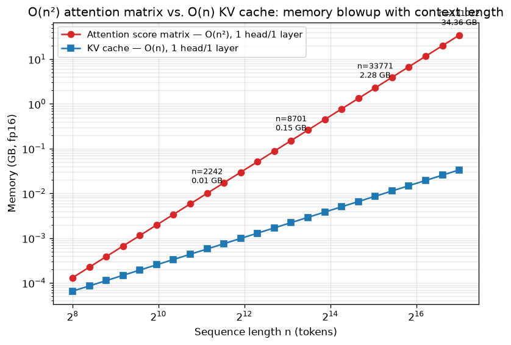

# Day 63 — O(n²) Cost & Long-Context Pain

## 🧠 CONCEPT OF THE DAY

**Intuition.** Self-attention is an all-to-all conversation: every token asks a question of every other token. With $n$ tokens, that's $n \times n$ conversations to score before you even get to pick who to listen to. Double the sequence length and you don't double the work — you quadruple it, because both the number of "askers" and the number of "askees" doubled at once. This is the tax you pay for attention's biggest strength (any token can look at any other token, no matter how far apart) — the same flexibility that killed the RNN bottleneck (Day 52) reappears as a cost, just moved from "sequential steps" to "pairwise comparisons."

**The math.** For a single attention head with sequence length $n$ and head dimension $d$:

$$\text{scores} = QK^\top \in \mathbb{R}^{n \times n}, \qquad \text{FLOPs}(QK^\top) = O(n^2 d)$$

Softmax is applied elementwise over that same $n \times n$ matrix ($O(n^2)$), and the weighted sum with $V$ is another matmul:

$$\text{out} = \text{softmax}\!\left(\frac{QK^\top}{\sqrt{d}}\right) V, \qquad \text{FLOPs}(\cdot V) = O(n^2 d)$$

So **compute** is $O(n^2 d)$ per head, and **memory** to materialize the score matrix is $O(n^2)$ per head, per layer, per batch element — independent of $d$. Two separate quadratic taxes, and they don't hit at the same time: compute grows with FLOPs you can parallelize away on a big-enough GPU, but memory is a hard ceiling — you either fit or you OOM.

**Why it matters / where it leads.** This is precisely why "just run the model at 16x the context length" is never free: 16x the tokens means 256x the attention-matrix memory. It's the reason production LLMs cap context and charge more for longer windows, and it's the single biggest open problem long-context research chips away at from three angles: (1) don't materialize the full matrix — tile the computation and keep it in fast memory (FlashAttention, Day 64 — same $O(n^2)$ FLOPs, but the $O(n^2)$ *memory* traffic disappears); (2) don't compute all $n^2$ pairs — sparse/windowed/linear attention approximate the full matrix; (3) shrink $n$ itself — retrieval (RAG, Day 108) keeps only the relevant slice in context. Every one of those is a direct response to today's concept.

**Interview question:** *Self-attention's cost is usually summarized as "O(n²)." Precisely — is that FLOPs, memory, or both? And at $n = 100{,}000$ tokens with head dim $d = 64$, which of the two actually causes an out-of-memory error first?*

(Answer at the very bottom.)



---

## 🐍 PYTHONIC EDGE

The naive way to "look at" attention cost in code is to build the full score matrix and inspect it — which is exactly the $O(n^2)$ memory trap in miniature. The fix that FlashAttention scales up: process queries in **blocks**, accumulate an online (running) softmax, and never hold the full $n \times n$ matrix at once.

```python
import torch

# ---- BAD: materializes the full n x n score matrix ----
def full_attention(Q, K, V):
    d = Q.shape[-1]
    # @ is matrix multiplication (there's no operator overload for this in C++;
    # you'd call a BLAS gemm function explicitly)
    scores = (Q @ K.transpose(-2, -1)) / d ** 0.5   # ** is exponentiation, not XOR like in C++
    weights = torch.softmax(scores, dim=-1)          # dim=-1: negative indexing, "last axis"
    return weights @ V                                # peak memory here: O(n^2), full matrix lives in RAM/VRAM


# ---- GOOD: block-wise, online softmax -- never materializes the full matrix ----
def blockwise_attention(Q, K, V, block_size=16):
    n, d = Q.shape
    out = torch.zeros_like(Q)
    row_max = torch.full((n, 1), float("-inf"))   # None has no C++ "nullptr" equivalent here;
    row_sum = torch.zeros((n, 1))                   # this is just a plain fp tensor of zeros

    # range() below produces a lazy iterator object, not a materialized C++-style array
    for start in range(0, n, block_size):            # slice notation [a:b]; end index is exclusive
        end = min(start + block_size, n)
        K_blk, V_blk = K[start:end], V[start:end]     # slicing returns a view, not a copy

        blk_scores = (Q @ K_blk.transpose(-2, -1)) / d ** 0.5     # shape (n, block_size) only
        blk_max = blk_scores.max(dim=-1, keepdim=True).values
        new_max = torch.maximum(row_max, blk_max)

        # in-place-suffixed methods (trailing _) mutate the tensor rather than returning a copy
        correction = (row_max - new_max).exp()
        out.mul_(correction)                          # .mul_() is in-place; .mul() would allocate a copy
        row_sum.mul_(correction)

        p = (blk_scores - new_max).exp()
        out += p @ V_blk
        row_sum += p.sum(dim=-1, keepdim=True)
        row_max = new_max

    return out / row_sum   # peak memory here: O(n * block_size), never O(n^2)
```

The bad version's peak memory is `n * n * 4` bytes (fp32) for `scores` alone. The good version's peak is `n * block_size * 4` bytes — tunable, and never quadratic. This *is* FlashAttention's core idea, minus the CUDA-kernel-level fusion that makes it fast in practice.

---

## 📡 SIGNAL LAB

Today's $O(n^2)$ has an exact DSP twin: **naive autocorrelation**. Given a length-$n$ signal $x$, the direct definition is a sliding dot product over every lag:

$$r[\tau] = \sum_{t} x[t]\, x[t+\tau], \qquad \tau = -(n-1), \dots, (n-1)$$

Computed directly, that's $O(n^2)$ — exactly attention's shape (every position compared against every other position). But signals have a trick attention doesn't: the **Wiener–Khinchin theorem** says autocorrelation is the inverse FFT of the power spectral density:

$$r = \mathcal{F}^{-1}\big(|\mathcal{F}(x)|^2\big) \implies O(n \log n)$$

```python
import numpy as np

np.random.seed(42)
n = 64
x = np.random.randn(n)

# Direct O(n^2) autocorrelation
r_direct = np.array([np.sum(x[:n - abs(tau)] * x[abs(tau):]) if tau >= 0
                      else np.sum(x[:n - abs(tau)] * x[abs(tau):])
                      for tau in range(-(n - 1), n)])

# FFT-based O(n log n) autocorrelation (zero-padded to avoid circular wraparound)
X = np.fft.fft(x, n=2 * n)
psd = np.abs(X) ** 2
r_fft = np.fft.ifft(psd).real
r_fft = np.concatenate([r_fft[n:], r_fft[:n]])[1:]   # reorder to match lags -(n-1)..(n-1)

print(np.allclose(r_direct, r_fft, atol=1e-8))   # True
```

**So what:** the FFT shortcut works because autocorrelation is **shift-invariant** — the same fixed operation (multiply-and-sum) is reused at every lag, so it can be reformulated in the frequency domain as one elementwise multiply. Self-attention's $QK^\top$ is *not* shift-invariant: the "kernel" at each position is the query vector $Q_i$, which is **content-dependent and different for every single row**. There's no fixed filter to push through an FFT — you're not correlating one signal against shifted copies of itself, you're correlating $n$ *different* query vectors against the same key set. That's precisely why attention can't borrow the convolution theorem's speedup and is stuck with genuine $O(n^2)$ unless you approximate (linear attention, kernel tricks) or restructure the memory access pattern (FlashAttention) instead.

---

## 🏋️ THE GAUNTLET

**Sliding Window Maximum.** Given an integer array `nums` and a window size `k`, return an array of the maximum value in each contiguous window of size `k` as it slides from left to right.

**Constraints:** `1 <= nums.length <= 10^5`, `-10^4 <= nums[i] <= 10^4`, `1 <= k <= nums.length`.

The brute-force answer recomputes a max over `k` elements for every one of the `n - k + 1` windows — an $O(n \cdot k)$ echo of today's theme (redundant pairwise work you're paying for over and over). Your job: beat it.

**Hints (escalating):**
1. Consecutive windows overlap in all but two elements. What can you carry forward from window $i$ to window $i+1$ instead of rescanning?
2. You need "the max of the current window," fast, as the window slides. Not every element in the window is a *candidate* for future maxes — can you identify and discard elements that can never win again, the moment a bigger element shows up to their right?
3. Maintain a deque of *indices*, kept in strictly decreasing order of `nums[index]`. On each new element: pop from the back while it's smaller than the incoming value (those are permanently dead); push the new index; pop from the front if it has fallen outside the current window. The front of the deque is always the current window's max.

**Pattern:** monotonic deque. **Target complexity:** $O(n)$ time, $O(k)$ space — each index is pushed and popped at most once.

---

## 🏗️ BLUEPRINT

No blueprint today.

---

## 🗺️ MARCHING ORDERS

You now know *exactly* where attention's cost lives — compute in the FLOPs, memory in the materialized matrix — which is the only way to reason correctly about what any long-context trick actually buys you. Hold onto that distinction; tomorrow's concept is built entirely on exploiting it.

Tomorrow: Concept 64 — FlashAttention

---

🔓 GAUNTLET SOLUTION

```cpp
#include <vector>
#include <deque>
using namespace std;

class Solution {
public:
    vector<int> maxSlidingWindow(vector<int>& nums, int k) {
        deque<int> dq;              // stores indices, values strictly decreasing
        vector<int> result;
        int n = nums.size();
        result.reserve(n - k + 1);

        for (int i = 0; i < n; ++i) {
            // evict indices whose values can never be the max again
            while (!dq.empty() && nums[dq.back()] < nums[i]) {
                dq.pop_back();
            }
            dq.push_back(i);

            // evict the front if it has slid out of the window
            if (dq.front() <= i - k) {
                dq.pop_front();
            }

            // once the first full window is formed, record the max
            if (i >= k - 1) {
                result.push_back(nums[dq.front()]);
            }
        }
        return result;
    }
};
```

Each index enters and leaves the deque at most once, so total work across the whole array is $O(n)$ despite the nested-looking `while` inside the `for`.

💡 CONCEPT ANSWER

Both compute and memory scale as $O(n^2)$, but they scale differently in what multiplies the $n^2$: compute is $O(n^2 d)$ FLOPs, memory is $O(n^2)$ *elements*, with no $d$ factor. At $n = 100{,}000$: the score matrix alone has $10^{10}$ entries — even at fp16 (2 bytes) that's **20 GB, for one head, one layer, one batch element**, before a single FLOP of the weighted sum has run. Real models have 32+ heads and 32+ layers; even if you never hold more than one layer's matrices at a time, that single layer's worth of heads alone blows well past a single GPU's memory. **Memory is what kills you first** — you hit the OOM while allocating the score tensor, long before the $O(n^2 d)$ compute has become the wall-clock bottleneck. That's exactly the asymmetry FlashAttention exploits: it does *not* reduce the $O(n^2 d)$ FLOPs (same total multiply-adds), it eliminates the $O(n^2)$ *materialization* by never writing the full matrix to HBM — tiling the computation so peak memory becomes $O(n)$ instead.
