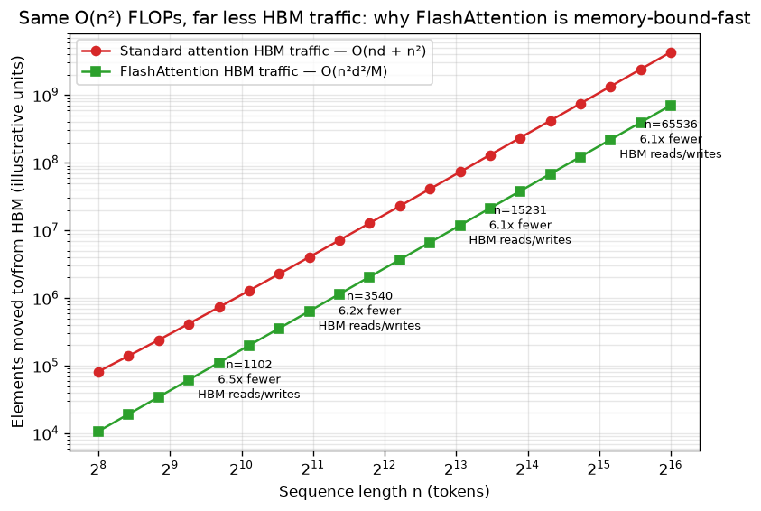

# Day 64 — FlashAttention

## 🧠 CONCEPT OF THE DAY

**Intuition.** Yesterday you learned attention's $O(n^2)$ tax is really *two* taxes: compute FLOPs and materialized memory. Here's the twist that makes FlashAttention possible — on a modern GPU, those two taxes are paid in different currencies, and one is vastly more expensive than the other. A GPU has a tiny pool of blazing-fast on-chip memory (SRAM, ~20 TB/s bandwidth, ~100KB per streaming multiprocessor) and a much larger pool of comparatively slow off-chip memory (HBM, ~2 TB/s, tens of GB). Standard attention writes the full $n \times n$ score matrix out to slow HBM, reads it back for softmax, writes the result back, then reads it again for the final matmul with $V$. The GPU's tensor cores sit idle for most of that time, waiting on memory — this workload is **memory-bandwidth-bound**, not compute-bound. FlashAttention's insight: never write the $n \times n$ matrix to HBM at all. Tile $Q$, $K$, $V$ into blocks small enough to fit in SRAM, fuse matmul → mask → softmax → matmul into a single kernel, and use the **online (running) softmax** you hand-wrote yesterday in `blockwise_attention` to combine partial results block-by-block. Only the final $O(n \times d)$ output ever touches HBM.

**The math.** FLOPs are unchanged — still $O(n^2 d)$ multiply-adds, the same total arithmetic. What changes is HBM traffic. Standard attention moves roughly

$$\text{HBM}_{\text{standard}} = O(nd + n^2)$$

elements to/from slow memory (load $Q,K,V$, then write/read the full score matrix at least once each for softmax). FlashAttention, by tiling into SRAM-sized blocks of size tied to SRAM capacity $M$, reduces this to

$$\text{HBM}_{\text{flash}} = O\!\left(\frac{n^2 d^2}{M}\right)$$

Since $M$ is typically tens of thousands of elements and $d^2$ is a few thousand, the ratio $d^2/M$ is a fraction well below 1 — the same $n^2$ *shape*, but a dramatically smaller constant, plus the separate $O(nd)$ term vanishes entirely. The **backward pass** compounds the win: rather than storing the $n \times n$ attention matrix for the gradient computation (which would reintroduce $O(n^2)$ memory), FlashAttention *recomputes* it on the fly from the cached $Q,K,V$ and output statistics — trading a modest amount of extra compute for a huge cut in memory traffic. That's the same recomputation-for-memory trade you'll formalize on Day 97 (gradient checkpointing).

**Why it matters / where it leads.** This is the clearest real-world lesson in **roofline thinking**: FLOPs count tells you almost nothing about wall-clock speed if your workload is memory-bound rather than compute-bound. FlashAttention does the *same* multiply-adds as standard attention (arguably more, counting backward-pass recomputation) yet runs 2–4x faster in practice and uses $O(n)$ instead of $O(n^2)$ memory — purely by respecting the GPU memory hierarchy. It's why every serious transformer implementation today calls a fused attention kernel instead of writing out `softmax(Q @ K.T / sqrt(d)) @ V` naively, and it's the practical enabler behind every long-context claim you'll see from here through Day 103 (serving) and Day 100 (KV cache) — you can't reason about inference throughput without first knowing whether you're compute-bound or memory-bound.

**Interview question:** *FlashAttention doesn't reduce the number of FLOPs — arguably it increases them slightly, since the backward pass recomputes the attention matrix instead of storing it. Yet it's substantially faster in wall-clock time. What GPU-level bottleneck is it actually targeting, and why doesn't cutting FLOPs alone help there?*

(Answer at the very bottom.)



---

## 🐍 PYTHONIC EDGE

You don't need to hand-write the tiling loop from yesterday to get FlashAttention's benefit — PyTorch exposes a fused kernel that dispatches to it automatically. The "bad" way builds attention out of separate primitive ops (each one a round trip through HBM); the "clean" way calls the single fused op and lets the backend pick the fastest available kernel (FlashAttention, memory-efficient attention, or a math fallback).

```python
import torch
import torch.nn.functional as F

# ---- BAD: unfused primitives -- each op below is a separate HBM round trip ----
def naive_attention(Q, K, V):
    d = Q.shape[-1]
    scores = (Q @ K.transpose(-2, -1)) / d ** 0.5   # writes the full n x n matrix to HBM
    weights = torch.softmax(scores, dim=-1)          # reads it back, writes it back again
    return weights @ V                                # reads it back once more


# ---- GOOD: one fused, kernel-selected call -- never materializes the n x n matrix ----
def fused_attention(Q, K, V):
    # is_causal=True fuses the causal mask (Day 62) into the same kernel too;
    # no separate mask tensor ever touches memory
    return F.scaled_dot_product_attention(Q, K, V, is_causal=True)


class TinyAttention(torch.nn.Module):                # class X(Base): single inheritance (C++: class X : public Base)
    def __init__(self, d_model, n_heads):             # constructor; self is explicit (C++'s "this" is implicit)
        super().__init__()                             # parent ctor call (C++: initialiser-list syntax instead)
        self.n_heads = n_heads
        self.qkv = torch.nn.Linear(d_model, 3 * d_model)   # instance attrs set via self.x = ...
                                                              # (C++: declare in header, init in ctor body)

    def forward(self, x):                              # never call .forward() directly from outside --
        B, T, C = x.shape                                # tuple unpacking: a, b, c = shape (no C++ equivalent)
        qkv = self.qkv(x)                                # this actually invokes __call__ under the hood,
        q, k, v = qkv.chunk(3, dim=-1)                    # which wraps forward() with hooks (autograd, etc.)
        return fused_attention(q, k, v)


model = TinyAttention(d_model=64, n_heads=4)
x = torch.randn(2, 16, 64)
out = model(x)   # calling the object -- __call__ -- not model.forward(x)
```

`naive_attention` forces four separate HBM passes over $O(n^2)$ data; `fused_attention` is a single kernel launch with $O(n)$ HBM traffic for the output. Same math, same autograd support — the fused call just refuses to ever materialize the thing yesterday's lesson proved was the memory bottleneck.

---

## 📡 SIGNAL LAB

FlashAttention's core trick — tile the data into on-chip-sized blocks and never materialize the full result in slow memory — has a direct DSP analogue: **overlap-save / overlap-add convolution**, used to filter a signal that's far too long to fit in fast memory (or arrives as an infinite stream) using FFT-based blocks.

Naively FFT-filtering a long signal $x$ of length $n$ against a filter $h$ of length $m$ means one giant FFT of size $\approx n$ — you need the *entire* signal resident in memory before you can start. Overlap-save instead processes $x$ in fixed-size chunks, each padded with $m-1$ samples of context carried over from the previous chunk, so a bounded-size buffer produces exactly correct output with no boundary artifacts:

```python
import numpy as np

np.random.seed(42)
n, m = 1000, 15                       # long signal, short filter
x = np.random.randn(n)
h = np.random.randn(m)

# ---- Ground truth: one big convolution (this is the "materialize everything" version) ----
y_direct = np.convolve(x, h, mode="full")

# ---- Overlap-save: fixed-size blocks, bounded buffer, never holds the whole signal at once ----
block = 64                             # analogous to an SRAM-sized tile
L = block - (m - 1)                    # valid (non-overlap) output samples per block
y_blocks = []
buf = np.zeros(m - 1)                  # carried-over context from the previous block (bounded state)

for start in range(0, n, L):
    chunk = x[start:start + L]
    padded = np.concatenate([buf, chunk])
    if len(padded) < block:
        padded = np.concatenate([padded, np.zeros(block - len(padded))])
    spec = np.fft.fft(padded, n=block) * np.fft.fft(h, n=block)
    conv_block = np.fft.ifft(spec).real
    y_blocks.append(conv_block[m - 1:m - 1 + min(L, len(chunk))])
    buf = np.concatenate([buf, chunk])[-(m - 1):]

y_overlap_save = np.concatenate(y_blocks)

print(np.allclose(y_direct[:len(y_overlap_save)], y_overlap_save, atol=1e-8))   # True
```

**So what:** both algorithms face the identical constraint — a "fast, small buffer" (SRAM / a chunk register) versus a "slow, unbounded store" (HBM / the full signal) — and both solve it the same way: carry a small amount of bounded state (online softmax's running max/sum; overlap-save's `m-1`-sample tail) forward across tiles instead of materializing the whole problem at once. This is a general memory-hierarchy pattern, not an attention-specific trick — anywhere you see "compute over a huge array in one shot" rewritten as "stream fixed-size blocks with a little carried state," you're looking at the same idea FlashAttention applies to attention and overlap-save applies to convolution.

---

## 🏋️ THE GAUNTLET

**Find Median from Data Stream.** Design a data structure that supports two operations as numbers arrive one at a time in a stream: `addNum(int num)` — add an integer, and `findMedian()` — return the median of all integers seen so far. Both operations will be called up to $5 \times 10^4$ times total, interleaved in any order.

**Constraints:** `-10^5 <= num <= 10^5`. `findMedian` may be called before any numbers have been added is not a valid case — at least one `addNum` always precedes it.

Like yesterday's problem, the brute-force answer (re-sort on every `addNum`, or scan for the median on every `findMedian`) redoes work that a smarter running/online structure would carry forward — the same theme as online softmax: don't recompute from scratch, maintain state incrementally.

**Hints (escalating):**
1. Re-sorting the full list on every insertion is $O(n \log n)$ per call — far too slow at $5\times10^4$ calls. The median only ever depends on the one or two elements sitting at the *middle* of the sorted order. Do you need the rest of the array sorted at all?
2. Split what you've seen into two halves: the smaller half and the larger half. If you could always instantly access the *maximum* of the smaller half and the *minimum* of the larger half, you'd have the median (or the average of those two) for free. What data structure gives you $O(1)$ access to an extreme value with $O(\log n)$ insertion?
3. Keep a max-heap for the smaller half and a min-heap for the larger half. After every `addNum`, push into one heap, then rebalance: if the size difference between the two heaps exceeds 1, pop the top of the larger one and push it into the smaller one. Maintain the invariant that the max-heap's top is always $\le$ the min-heap's top.

**Pattern:** two-heap (max-heap + min-heap) balancing. **Target complexity:** $O(\log n)$ per `addNum`, $O(1)$ per `findMedian`.

---

## 🏗️ BLUEPRINT

No blueprint today.

---

## 🗺️ MARCHING ORDERS

You now have the full picture: yesterday told you *why* attention is expensive, today told you *which* expense actually matters on real hardware and how to dodge it without changing the math. That FLOPs-vs-bandwidth distinction is a lens you'll reuse for the rest of your systems-adjacent ML career — hold onto it.

Tomorrow: Concept 65 — Tokenization (BPE/WordPiece/SentencePiece)

---

🔓 GAUNTLET SOLUTION

```cpp
#include <queue>
#include <vector>
using namespace std;

class MedianFinder {
public:
    MedianFinder() {}

    void addNum(int num) {
        // lower half: max-heap (largest of the small values on top)
        if (lo.empty() || num <= lo.top()) {
            lo.push(num);
        } else {
            hi.push(num);
        }

        // rebalance: keep sizes equal or lo ahead by exactly one
        if (lo.size() > hi.size() + 1) {
            hi.push(lo.top());
            lo.pop();
        } else if (hi.size() > lo.size()) {
            lo.push(hi.top());
            hi.pop();
        }
    }

    double findMedian() {
        if (lo.size() > hi.size()) {
            return lo.top();
        }
        return (lo.top() + hi.top()) / 2.0;
    }

private:
    priority_queue<int> lo;                                   // max-heap, smaller half
    priority_queue<int, vector<int>, greater<int>> hi;        // min-heap, larger half
};
```

Each `addNum` does at most two heap pushes/pops — $O(\log n)$. `findMedian` just peeks at one or two tops — $O(1)$. The invariant `lo.size() >= hi.size()` (never off by more than one) is what keeps the median always reachable without a scan.

💡 CONCEPT ANSWER

The bottleneck is HBM memory bandwidth, not compute (tensor-core FLOPs). Attention's elementwise ops — masking, softmax, dropout — have very low arithmetic intensity (few FLOPs per byte moved), so the GPU spends most of its time waiting on memory transfers between HBM and the compute units rather than actually multiplying numbers; the tensor cores are frequently idle. Cutting FLOPs doesn't help a memory-bound kernel because FLOPs were never the limiting resource — you're bottlenecked on *bytes moved*, not *operations performed*. FlashAttention's actual lever is kernel fusion plus tiling: by fusing matmul→mask→softmax→matmul into one kernel operating on SRAM-resident blocks, it collapses several separate O(n²) HBM round trips into a single O(n) one, at the cost of a *few more* FLOPs (backward-pass recomputation instead of storing activations). That trade — more compute, far less memory traffic — is a net win precisely because compute was cheap and memory bandwidth was the scarce resource all along. This is the roofline model in miniature: whether an optimization helps depends entirely on which side of compute-bound vs. memory-bound your workload sits on, and for attention (outside of very large batch/head dims) it's memory-bound.
