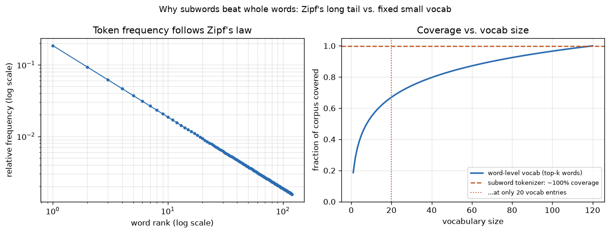

# Day 65 — Tokenization (BPE/WordPiece/SentencePiece)

## 🧠 CONCEPT OF THE DAY

**Intuition.** Every transformer you've built since Day 60 consumes a fixed-size lookup table of integer IDs — but raw text is neither fixed-size nor made of integers. Something has to chop a string into a finite vocabulary of reusable pieces before embedding-lookup even applies. The naive options both fail in the same way: whole-word vocabularies ("the", "cat", "photosynthesis") explode combinatorially — English alone has hundreds of thousands of word forms, and any fixed vocab will still choke on typos, new slang, or `"transformerification"` — while character-level vocabularies never run out of coverage but bloat every sequence 4-6x, which is brutal once you remember Day 63's $O(n^2)$ attention cost. **Subword tokenization is the compromise**: build a vocabulary out of the *most frequently reused chunks* — often whole words for common ones, but syllable-or-shorter fragments for rare ones — so common words stay a single token while any unseen word still decomposes into pieces the model has seen before. Nothing is ever truly out-of-vocabulary.

**The math.** Byte-Pair Encoding (BPE) builds this vocabulary bottom-up, greedily:

1. Start with the vocabulary = every individual character (or byte) in the training corpus.
2. Count all adjacent symbol pairs across the corpus; find the single most frequent pair $(a, b)$.
3. Merge every occurrence of $(a, b)$ into one new symbol $ab$; add it to the vocabulary.
4. Repeat steps 2–3 until the vocabulary reaches a target size $V$ (typically 30k–50k).

Formally, at each step BPE selects

$$(a^*, b^*) = \arg\max_{(a,b)} \; \text{count}(a, b) \; \text{ over all adjacent pairs in the corpus}$$

**WordPiece** (used by BERT) changes only the selection criterion — instead of raw pair frequency, it merges the pair that maximizes the *likelihood gain* to the training corpus:

$$\text{score}(a, b) = \frac{\text{count}(a, b)}{\text{count}(a) \times \text{count}(b)}$$

This favors pairs that co-occur *more than chance* would predict (like "un" + "usual") over pairs that are merely individually common (like "the" + " "). **SentencePiece** solves a different problem entirely: both BPE and WordPiece assume you can pre-split on whitespace, which fails for Japanese, Chinese, or Thai. SentencePiece treats the raw input — including spaces, re-encoded as an explicit symbol `▁` — as one undifferentiated stream of characters/bytes, so the algorithm (it can run BPE *or* a unigram language-model variant underneath) becomes language-agnostic and perfectly reversible: `decode(encode(x)) == x`, whitespace and all.

**Why it matters / where it leads.** Vocabulary size is a *system design lever*, not a free hyperparameter: it directly sets the size of the embedding matrix and the final softmax projection (Day 5) — both scale as $O(V \times d_{\text{model}})$ — while simultaneously setting how many tokens a given piece of text costs, which feeds straight into the $O(n^2)$ attention bill from Day 63 and the throughput math you'll hit on Day 101. Every "context window" or "tokens per second" number you'll ever see quoted for an LLM is downstream of this single design choice made once, at pretraining time, and frozen forever after. Tomorrow's embeddings (Day 66) are literally the vectors this vocabulary indexes into — tokenization is the irreversible first commitment every subsequent layer has to live with.

**Interview question:** *GPT-family models use byte-level BPE — the base alphabet is the 256 possible byte values, not Unicode characters. WordPiece-style tokenizers (BERT) instead fall back to a literal `[UNK]` token for text they can't decompose. What problem does byte-level BPE solve that character-level BPE doesn't, and why does that make `[UNK]` structurally impossible in a byte-level scheme?*

(Answer at the very bottom.)



---

## 🐍 PYTHONIC EDGE

The naive approach — split on whitespace and assign every new word the next free integer — has no subword fallback: it works fine on the training corpus and then silently grows without bound (or crashes on `[UNK]`) the moment it sees unfamiliar text. A real tokenizer is *trained* once to a fixed vocab size and then guarantees every future string decomposes into known pieces.

```python
from tokenizers import Tokenizer, models, trainers, pre_tokenizers

# ---- BAD: naive whitespace "tokenization" -- no subwords, unbounded vocab, no OOV handling ----
def naive_tokenize(corpus):
    vocab = {}
    for doc in corpus:
        for word in doc.split():         # .split() -- no punctuation/casing handling, no fallback
            if word not in vocab:         # `in` -- membership test against dict keys
                vocab[word] = len(vocab)  # every unseen word silently grows the vocab forever
    return vocab

corpus = ["gradient descent finds minima", "descent minimizes the loss"]
naive_vocab = naive_tokenize(corpus)
print(f"naive vocab size: {len(naive_vocab)}")   # f-string; grows unbounded with corpus size


# ---- GOOD: train a real (tiny) BPE tokenizer -- fixed vocab, guaranteed decomposition ----
class SubwordTokenizer:                                    # class X: no base (C++: no ": public Base" needed)
    def __init__(self, corpus, vocab_size=50):              # constructor; self is explicit (C++'s `this` is implicit)
        self._tok = Tokenizer(models.BPE(unk_token="[UNK]"))    # instance attr via self.x = ... (C++: header + ctor)
        self._tok.pre_tokenizer = pre_tokenizers.Whitespace()
        trainer = trainers.BpeTrainer(vocab_size=vocab_size, special_tokens=["[UNK]"])
        self._tok.train_from_iterator(corpus, trainer=trainer)   # trains merges once, like fitting a model

    def __call__(self, text):                # calling the instance invokes __call__ directly --
        return self._tok.encode(text).ids     # no forward()/hook wrapping here, that's an nn.Module-specific thing

    def __len__(self):                        # dunder method -- enables the builtin len(tok) call below
        return self._tok.get_vocab_size()


tok = SubwordTokenizer(corpus)
ids = tok("gradients minimize descent")   # unseen word "gradients" still encodes: decomposes into known subwords
print(ids, f"vocab size: {len(tok)}")     # len(tok) dispatches to __len__, not a raw attribute lookup
```

`naive_tokenize` hands every model a vocabulary that grows with the corpus and breaks on anything new; `SubwordTokenizer` fixes the vocabulary size up front and *by construction* can encode any string over its base alphabet — the exact property tomorrow's embedding table depends on.

---

## 📡 SIGNAL LAB

Tokenization is a form of lossy-free source coding, and BPE's merge rule is doing exactly what Shannon's source coding theorem says an optimal code should: spend fewer symbols on predictable content. That's the same bound Nyquist's sampling theorem enforces from the other direction — Nyquist says you need no *more* samples than $2\times$ the bandwidth to reconstruct a signal losslessly; Shannon says you need no *more* bits than the source's entropy rate to encode it losslessly. Both are "don't pay for redundancy you could have predicted" bounds.

```python
import math
from collections import Counter

text = "the cat sat on the mat the cat ate the rat"
chars = list(text)
n0 = len(chars)

# ---- Zeroth-order entropy of the raw character stream ----
counts0 = Counter(chars)
probs0 = [c / n0 for c in counts0.values()]
H0 = -sum(p * math.log2(p) for p in probs0)   # Shannon entropy, bits per symbol
print(f"chars: {n0}, H0 = {H0:.3f} bits/token, total = {H0 * n0:.1f} bits")

# ---- One BPE merge step: find the single most frequent adjacent pair, merge every occurrence ----
pairs = Counter(zip(chars, chars[1:]))
best_pair, _ = pairs.most_common(1)[0]        # e.g. ('a', 't') -- "at" is highly predictable given "a"

merged, i = [], 0
while i < len(chars):
    if i < len(chars) - 1 and (chars[i], chars[i + 1]) == best_pair:
        merged.append(chars[i] + chars[i + 1])
        i += 2
    else:
        merged.append(chars[i])
        i += 1

counts1 = Counter(merged)
probs1 = [c / len(merged) for c in counts1.values()]
H1 = -sum(p * math.log2(p) for p in probs1)
print(f"tokens: {len(merged)}, H1 = {H1:.3f} bits/token, total = {H1 * len(merged):.1f} bits")
```

Running this: 42 characters at $H_0 = 2.927$ bits/token cost **122.9 total bits**. After merging the single most-predictable pair (`"a"+"t" \to "at"`, since "a" is followed by "t" far more than chance), the stream shrinks to 36 tokens at a slightly *higher* $H_1 = 2.994$ bits/token — but only **107.8 total bits**. **So what:** the merge didn't just make the sequence shorter, it moved bits *out* of the encoding that was never information in the first place — the "t" after "a" was redundant, predictable structure, exactly like a redundant sample above the Nyquist rate. Every BPE merge is a tiny step of the corpus's empirical description length toward its true entropy rate — which is precisely why a 50k-merge vocabulary compresses natural-language sequences roughly 3–4x versus raw bytes: it's approaching the same entropy floor a good arithmetic coder would, just with the added constraint that the "codebook" has to be a static, greedy, mergeable one instead of an optimal adaptive one.

---

## 🏋️ THE GAUNTLET

**Encode and Decode Strings (Run-Length-style boundary problem).** You need to serialize a `vector<string>` (think: a batch of decoded token strings) into one single string for storage, and deserialize it back into the exact original vector, for arbitrary content — including strings that contain any character, of any length, including empty strings and strings containing digits, colons, or other characters you might have been tempted to use as delimiters.

**Constraints:** up to $200$ strings per batch, each up to $200$ characters, characters can be *any* value (not just printable ASCII) — no delimiter character is safe to assume unused.

**Hints (escalating):**
1. Any single fixed delimiter character (like `,` or `\n`) fails the moment a string in the batch contains that exact character. You need a scheme that can't be confused no matter what's inside the strings.
2. What if you prefixed each string with *its own length*, instead of separating strings from each other? Then you'd always know exactly how many characters to consume next, regardless of their content.
3. Encode each string as `"{len}#{string}"` (e.g. `"5#hello"`), concatenated back to back with no separator between entries. Decoding: read digits up to the `#` to get the length, then consume exactly that many raw characters — the `#` and the digits before it can never be ambiguous, because you always know in advance exactly how many bytes come next.

**Pattern:** length-prefixed / self-delimiting encoding (the same idea BPE's own byte-level fallback and most binary wire protocols use — never invent a delimiter that might appear in the payload; declare the length instead). **Target complexity:** $O(\text{total characters})$ for both encode and decode.

---

## 🏗️ BLUEPRINT

**Vocabulary size as a latency/memory dial.** A bigger tokenizer vocab shortens sequences (fewer tokens per sentence → cheaper $O(n^2)$ attention and less KV-cache traffic at serving time) but grows the embedding table and final softmax/output-projection matrix linearly in $V$ — and those live in GPU memory and get touched on every single forward pass regardless of sequence length. The industry's settled compromise (30k–100k+ for most modern LLMs) is a deliberate trade of "make every request's context a bit shorter" against "make every model instance permanently a bit bigger" — there's no vocab size that wins on both axes at once.

---

## 🗺️ MARCHING ORDERS

You've spent six weeks reasoning about what happens *inside* the model — today you saw the one decision made *before* the model ever sees a token, and it's frozen the moment pretraining starts. Respect it: a tokenizer mismatch between training and inference is a silent, catastrophic bug with no stack trace.

Tomorrow: Concept 66 — Embeddings → contextual embeddings

---

🔓 GAUNTLET SOLUTION

```cpp
#include <string>
#include <vector>
using namespace std;

class Codec {
public:
    // Encodes a list of strings to a single string.
    string encode(vector<string>& strs) {
        string out;
        for (const string& s : strs) {
            out += to_string(s.size()) + "#" + s;   // length-prefix: size, delimiter, then raw payload
        }
        return out;
    }

    // Decodes a single string to a list of strings.
    vector<string> decode(string s) {
        vector<string> result;
        int i = 0;
        while (i < (int)s.size()) {
            int j = i;
            while (s[j] != '#') j++;         // scan forward to find the length prefix's end
            int len = stoi(s.substr(i, j - i));
            string token = s.substr(j + 1, len);  // consume exactly `len` raw chars -- content is never re-scanned
            result.push_back(token);
            i = j + 1 + len;
        }
        return result;
    }
};
```

Each string costs $O(\text{digits in its length} + \text{its own length})$ to encode and decode — no scanning for a delimiter inside the payload, so no payload content can ever break the scheme, no matter what bytes it contains.

💡 CONCEPT ANSWER

Character-level BPE still needs a base alphabet of *Unicode* code points — and Unicode has over 149,000 assigned characters, with new emoji and scripts added regularly. Any tokenizer whose base alphabet is Unicode characters can still encounter a character outside that alphabet (an unassigned code point, a rare CJK ideograph excluded to keep the base alphabet small, a corrupted byte sequence) and has to fall back to `[UNK]`, permanently and irreversibly destroying information — you cannot decode `[UNK]` back to the original character. Byte-level BPE sidesteps this by choosing its base alphabet to be the 256 possible byte values instead of Unicode characters — and *every* Unicode string, in any script, is by definition a finite sequence of bytes under UTF-8. Since the base alphabet already covers all 256 possible byte values, every possible input string is representable from the very first BPE step, before any merges are even applied. `[UNK]` isn't just rare in byte-level BPE, it's structurally impossible: there is no byte value the vocabulary doesn't already contain, so nothing can ever fail to decompose. The price is that a single "character" in some scripts (e.g. CJK, emoji) can cost multiple byte-tokens where a WordPiece-style Unicode vocab might have covered it in one — coverage-completeness and per-character token efficiency are in tension, and GPT's byte-level choice explicitly picks completeness.
