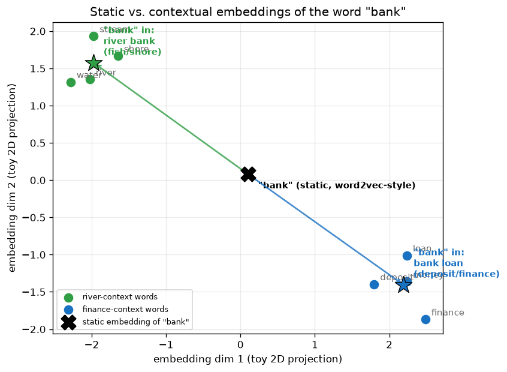

# Day 66 — Embeddings → Contextual Embeddings

## 🧠 CONCEPT OF THE DAY

**Intuition.** Yesterday's tokenizer hands you a stream of integer IDs. An **embedding table** is the first thing that turns those IDs into something a network can compute with: a lookup, `E[id]`, into a matrix of learned vectors — one row per vocabulary entry. That's a *static* embedding: the word "bank" gets exactly one vector, forever, no matter what sentence it shows up in. That's fine until you hit polysemy — "I sat by the river **bank**" and "I took out a **bank** loan" use the same token ID for two almost-unrelated meanings, and a single fixed vector has to somehow represent both averaged together. A **contextual embedding** fixes this by making the vector for a token a *function of the whole sequence it appears in*, not just the token itself — every layer of self-attention (Day 56) lets each token's representation absorb information from its neighbors, so the same word ID walks out of the network holding a different vector depending on what's around it. Think of the static table as a dictionary definition; a contextual embedding is what that word means *in this specific sentence*, the way a human reader resolves it instantly from context.

**The math.** Static embedding is a pure lookup:

$$e_{w} = E[w], \quad E \in \mathbb{R}^{|V| \times d}$$

where $w$ is a token ID and $E$ is a learned matrix — the same $e_w$ for every occurrence of token $w$ anywhere in any sentence.

A contextual embedding replaces this with a function of the *entire* input sequence $x = (x_1, \dots, x_n)$:

$$h_i = f_\theta(e_{x_1}, e_{x_2}, \dots, e_{x_n})_i$$

so token $i$'s output vector $h_i$ depends on every other token in the sequence, not just $e_{x_i}$ in isolation. In a transformer, $f_\theta$ is stacked self-attention + FFN blocks; concretely, one attention layer computes each token's new representation as a weighted sum over *all* tokens' value vectors:

$$h_i = \sum_{j=1}^{n} \alpha_{ij} \, v_j, \qquad \alpha_{ij} = \text{softmax}_j\!\left(\frac{q_i^\top k_j}{\sqrt{d_k}}\right)$$

Change the surrounding tokens $x_j$ and every $k_j, v_j$ changes, so $h_i$ changes too — even though $x_i$ itself, and its starting-point static embedding $e_{x_i}$, are identical. That's the entire mechanical difference between Day 65's/today's static lookup table and everything from Day 53 onward: static embeddings are the $t=0$ input to the network; contextual embeddings are what comes *out* of one or more attention layers applied to those inputs.

**Why it matters / where it leads.** Every "embedding" people casually refer to when they say "BERT embeddings" or "sentence embeddings" from a modern model is a *contextual* embedding — pulled from a hidden layer's output, not the input table. This is precisely the mechanism that makes Day 67 (BERT & masked LM) and Day 68 (GPT & causal LM) possible: both are pretraining objectives designed specifically to *force* the contextualization machinery to learn something useful, by making the network predict a token using only the contextual information around it. It's also why a single embedding matrix in a modern LLM is enormous ($|V| \times d$, often hundreds of millions of parameters) yet still only the *starting point* — the real representational power lives in what the attention stack does to those vectors afterward.

**Interview question:** *You're asked to build a semantic search system. A colleague suggests just averaging static word2vec vectors for each document. Why will this fail on a corpus with a lot of polysemous or negated language, and what specifically does swapping in contextual (transformer) embeddings fix — and what does it *not* fix?*

(Answer at the very bottom.)



The plot above is a toy self-attention computation: `bank_static` (the black X) is one fixed point — the static embedding, computed as a plain average over all context words the token ever co-occurs with. The two stars are the *same* starting query, but pulled toward the river cluster or the finance cluster depending only on which context words are actually present in the sentence at attention time — exactly the mechanism in the formula above, just in 2D instead of $d_{\text{model}}$ dimensions.

---

## 🐍 PYTHONIC EDGE

The naive way to build a static embedding lookup is a Python dict keyed by string — it works, but it's O(vocab) memory in Python objects, has no batched GPU op, and silently returns nothing (or crashes) on an unseen key with no clean way to gradient-update it. `nn.Embedding` replaces the dict with a single differentiable matrix and integer-tensor indexing.

```python
import torch
import torch.nn as nn

vocab = ["<unk>", "the", "bank", "river", "loan"]
word_to_id = {w: i for i, w in enumerate(vocab)}   # dict comprehension -- no C++ equivalent as an expression

# ---- BAD: dict of hand-rolled vectors, no batching, no gradients ----
bad_table = {w: torch.randn(4) for w in vocab}      # each vector is a disconnected leaf tensor
def bad_lookup(sentence_words):
    return [bad_table[w] for w in sentence_words]   # list comprehension; KeyError on unseen word, no fallback

sent = ["the", "bank", "river"]
bad_vecs = bad_lookup(sent)   # returns a Python list of tensors -- can't feed this straight into a batched matmul


# ---- GOOD: nn.Embedding -- one matrix, batched, differentiable, index_select under the hood ----
class TinyEmbedder(nn.Module):                       # class X(Base): single inheritance (C++: class X : public Base)
    def __init__(self, vocab_size, dim):             # constructor; self is explicit (C++'s `this` is implicit)
        super().__init__()                            # parent ctor call (C++: initialiser-list, e.g. Base())
        self.table = nn.Embedding(vocab_size, dim)     # instance attr via self.x = ... (C++: declare+init separately)

    def forward(self, ids):                            # never call .forward() directly -- see __call__ note below
        return self.table(ids)                          # nn.Embedding.__call__ -> its forward(): a batched gather

embedder = TinyEmbedder(len(vocab), dim=4)
ids = torch.tensor([word_to_id[w] for w in sent])    # dtype long; index tensor, not a Python list
vecs = embedder(ids)                                   # embedder(...) invokes __call__, which wraps forward()
                                                        # with hooks -- calling embedder.forward(ids) skips them
print(vecs.shape)                                      # torch.Size([3, 4]) -- (seq_len, dim), fully batched

# in-place normalize each row to unit length (note the trailing underscore -- mutates, no C++ equivalent naming)
vecs.div_(vecs.norm(dim=-1, keepdim=True))             # .div_() in-place; dim=-1 -- negative indexing on axes too
```

`bad_lookup` returns a Python list you'd have to manually `torch.stack` before any GPU op, and a typo'd or unseen word throws `KeyError` mid-batch. `TinyEmbedder` is one `index_select` under the hood — a single fused, batched, gradient-tracked op — and this exact module is what sits *underneath* every contextual model from tomorrow onward: BERT and GPT both start with an `nn.Embedding` identical in kind to this one, before any attention layer ever touches the vectors.

---

## 📡 SIGNAL LAB

Static vs. contextual embeddings is the same tension as a **fixed (LTI) filter vs. an adaptive filter** in DSP. An LTI filter applies the exact same impulse response $h[n]$ to every input, everywhere, regardless of local signal statistics — like a static embedding applying the exact same vector to every occurrence of a word. An adaptive filter (LMS, RLS, Wiener with local statistics) updates its coefficients based on the *local neighborhood* of the signal, the same way self-attention recomputes a token's vector from its local context window every time.

**Worked example.** Take a synthetic non-stationary signal made of two tones active in disjoint time windows:

```python
import numpy as np

fs = 500          # sample rate (Hz)
t = np.arange(0, 1, 1 / fs)
sig = np.zeros_like(t)
sig[t < 0.5] += np.sin(2 * np.pi * 20 * t[t < 0.5])   # 20 Hz active only in [0, 0.5)s
sig[t >= 0.5] += np.sin(2 * np.pi * 80 * t[t >= 0.5])  # 80 Hz active only in [0.5, 1)s

# "Static" representation: one global FFT over the whole signal
global_spectrum = np.abs(np.fft.rfft(sig))

# "Contextual" representation: STFT -- a separate spectrum per local window
window = 64
stft = np.array([
    np.abs(np.fft.rfft(sig[i:i + window] * np.hanning(window)))
    for i in range(0, len(sig) - window, window // 2)
])
```

`global_spectrum` is exactly the static-embedding failure mode: it correctly reports that *both* 20 Hz and 80 Hz energy exist somewhere in the signal, but it destroys *when* — one fixed vector, averaged over the whole sequence, exactly like `E["bank"]` averaging over every context the word ever appeared in. The STFT rows are contextual: each one reports the local spectral content of just its window, so you can see 20 Hz dominate the first half and 80 Hz dominate the second half — the same way `h_i` for "bank" reports the local *semantic* content of just its sentence.

**So what:** this is the exact reason a global Fourier transform is a bad tool for non-stationary audio/video content (speech, footstep transients, GAN-upsampling checkerboard artifacts you'll formalize on Day 88) — you need a windowed, *context-local* transform to localize what's happening *where*. Contextual embeddings are the semantic-domain analog of trading a single global basis for a local, content-adaptive one — this is worth keeping in your back pocket for your own frequency-domain generative-forensics work, since the same static-vs-local tension is what separates a global PSD estimate from a spectrogram when you're hunting for localized synthesis artifacts.

---

## 🏋️ THE GAUNTLET

**Sliding Window Maximum.** Given an integer array `nums` and a window size `k`, return an array of the maximum value in each contiguous window of size `k` as it slides from left to right across `nums`.

**Constraints:** $1 \le k \le \text{nums.length} \le 10^5$, $-10^4 \le \text{nums}[i] \le 10^4$. Target: no $O(nk)$ brute force — every element should be processed in amortized $O(1)$.

**Hints (escalating):**
1. Brute force recomputes the max of every window from scratch — $O(nk)$ total. What information from the *previous* window is still valid for the *next* one, and what's the minimum you'd need to throw away?
2. If some element in the current window is smaller than an element that arrives *after* it (and is still within reach for future windows), that smaller element can **never** be the max of any window from now on — it's permanently useless. What data structure keeps only the elements still capable of eventually being a window's max, in guaranteed-decreasing order?
3. Maintain a deque of *indices* (not values) such that `nums` at those indices is strictly decreasing front-to-back. For each new index `i`: pop from the back while `nums[back] <= nums[i]` (those are now useless), push `i`; pop from the front if it's fallen outside the window (`front <= i - k`); once `i >= k - 1`, the front of the deque is the max for the current window.

**Pattern:** monotonic deque — the same "some elements are provably never useful again" pruning idea that shows up anywhere you need a running max/min over a sliding window. **Target complexity:** $O(n)$ time, $O(k)$ space (each index enters and leaves the deque at most once).

---

## 🏗️ BLUEPRINT

**The embedding table is a memory/latency dial, same lever as yesterday's vocab-size dial, just measured differently.** $E \in \mathbb{R}^{|V| \times d}$ costs $|V| \times d \times 4$ bytes in fp32 — at $|V| = 50\text{k}$, $d = 4096$ that's already ~800 MB, sitting on the GPU as a single dense matrix that's touched (via gather, not matmul) on every forward pass regardless of batch size. In production serving, this table is one of the first places people apply **int8/int4 quantization** (Day 74 preview) specifically because embedding lookups are far more quantization-tolerant than the attention/FFN matmuls downstream — you're indexing into rows, not doing dot products against the whole matrix, so per-row quantization error doesn't compound the way it does through 40+ transformer layers. It's a cheap, low-risk place to shave memory before you touch anything load-bearing.

---

## 🗺️ MARCHING ORDERS

You now have both halves of the input pipeline nailed down: yesterday's tokenizer decides *what* the discrete units are, today's embedding + contextualization decides *what they mean, here, right now*. Everything from BERT onward is just increasingly clever ways to train that contextualization machinery.

Tomorrow: Concept 67 — BERT & masked LM

---

🔓 GAUNTLET SOLUTION

```cpp
#include <vector>
#include <deque>
using namespace std;

class Solution {
public:
    vector<int> maxSlidingWindow(vector<int>& nums, int k) {
        deque<int> dq;              // stores indices, nums[dq] strictly decreasing front-to-back
        vector<int> result;
        result.reserve(nums.size() - k + 1);

        for (int i = 0; i < (int)nums.size(); i++) {
            // drop indices that fell out of the current window from the front
            if (!dq.empty() && dq.front() <= i - k) {
                dq.pop_front();
            }
            // drop indices whose value can never be a future max, from the back
            while (!dq.empty() && nums[dq.back()] <= nums[i]) {
                dq.pop_back();
            }
            dq.push_back(i);

            if (i >= k - 1) {
                result.push_back(nums[dq.front()]);   // front is always the current window's max
            }
        }
        return result;
    }
};
```

Every index is pushed exactly once and popped at most once (from either end), so total work across the whole array is $O(n)$ despite the nested-looking `while` inside the `for`.

💡 CONCEPT ANSWER

Averaging static word2vec vectors per document collapses every occurrence of a word to the same fixed point regardless of sentence — so "the bank approved the loan" and "the river bank flooded" contribute an identical vector for "bank" to their document averages, even though the words mean unrelated things; the averaging step then blends whatever polysemy was already baked into that single static vector with every other word in the document, destroying word order and any negation ("not good" averages "not" and "good" as if they were independent, positive-ish tokens). Swapping in contextual (transformer) embeddings fixes the polysemy problem directly — "bank" gets a different vector depending on which sense is active in that specific sentence, because self-attention lets it absorb "loan"/"river" from its actual context before you ever pool anything. It also captures local word-order effects that averaging inherently can't, since attention weights depend on relative position and surrounding tokens, not just bag-of-words membership. What it does *not* fix: you still need a pooling strategy to go from per-token vectors to one document vector (mean-pooling contextual vectors still has failure modes — dominant tokens can wash out a rare-but-critical one, and naive mean-pooling of the last layer is famously worse than using a `[CLS]` token or a model fine-tuned specifically for sentence embeddings, e.g. via contrastive objectives). Contextualization solves *what a token means here*; it doesn't automatically solve *how to compress a whole document into one vector* — that's a separate design decision layered on top.
