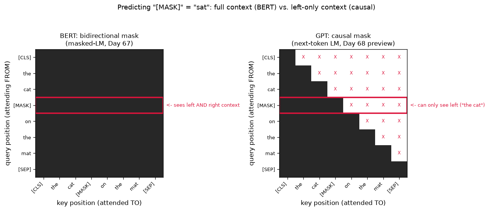

# Day 67 — BERT & Masked LM

## 🧠 CONCEPT OF THE DAY

**Intuition.** Yesterday you saw that contextual embeddings come from running an attention stack over a sequence — but *how do you train that stack* so the vectors it produces are actually useful? BERT's answer is a fill-in-the-blank game: take a sentence, black out ~15% of its tokens as `[MASK]`, and force the model to reconstruct them using *everything else in the sentence — both before and after the blank*. Think of a cloze test from a language exam: "The cat ___ on the mat" — you don't just use "The cat" to guess the missing word, you also use "on the mat" that comes *after* it. That's the entire trick. Because the objective only makes sense with access to both directions, BERT's attention is **bidirectional** — no causal mask, every token attends to every other token, including ones later in the sequence. That's a deliberate departure from the causal masking you saw on Day 62, and it's the reason BERT is called an *encoder*: it builds a rich, fully-contextualized representation of a fixed piece of text, rather than generating new text one token at a time.

**The math.** Given a sequence $x = (x_1, \dots, x_n)$, sample a random subset of positions $\mathcal{M} \subset \{1, \dots, n\}$ (BERT: ~15% of positions). Corrupt those positions — swap the token for `[MASK]` 80% of the time, a random token 10% of the time, and leave it unchanged 10% of the time (more on why below) — to get a corrupted sequence $\tilde{x}$. Run the full bidirectional transformer encoder over $\tilde{x}$ to get contextual vectors $h_1, \dots, h_n$, then train to reconstruct only the corrupted positions:

$$\mathcal{L}_{\text{MLM}} = -\sum_{i \in \mathcal{M}} \log P(x_i \mid \tilde{x}) = -\sum_{i \in \mathcal{M}} \log \, \text{softmax}(W h_i + b)_{x_i}$$

where $W \in \mathbb{R}^{|V| \times d}$ is an output projection back to vocabulary logits (often tied to the input embedding matrix $E$ from Day 66) and the loss is exactly Day 5's cross-entropy, just applied only at the masked positions instead of every position. The 80/10/10 corruption split exists to fix a train/inference mismatch: `[MASK]` never appears at fine-tuning or inference time, so if the model only ever saw `[MASK]` during pretraining, it would learn to only build a useful representation for tokens it's told are masked — swapping in a random token 10% of the time and the *original* token 10% of the time forces every position's representation to stay well-calibrated, since the model can never be sure whether the token it's looking at is trustworthy.

**Why it matters / where it leads.** This bidirectional-vs-causal choice is the single fork in the road that splits modern language modeling into two families: BERT-style encoders (bidirectional, MLM-trained, great at producing representations *for* a fixed piece of text — classification, retrieval, NER) and GPT-style decoders (causal, next-token-trained, great at *generating* text) — exactly Day 68 tomorrow. It's also why BERT can never be used to generate text left-to-right the way GPT can: every layer's forward pass already assumes it can see the whole sequence, so there's no well-defined way to run it token-by-token on a prefix. The `[CLS]` token's final-layer vector (position 0 in the diagram below) is the other half of BERT's design most interview questions probe — it's trained via a second objective (next-sentence prediction, later shown to be largely unnecessary) to aggregate whole-sequence information, which is exactly the "sentence embedding" people extract from BERT-family models for classification and retrieval.

**Interview question:** *Why can't you just take a pretrained BERT model and use it as a drop-in autoregressive text generator by feeding it a prefix and repeatedly asking it to predict the next token? Be specific about what breaks mechanically, not just "it wasn't trained for that."*

(Answer at the very bottom.)



The heatmaps above are the entire architectural difference in one picture. Left: BERT's mask has no zeros — every query position (row) can attend to every key position (column), so the `[MASK]` row (outlined in red) legally pulls information from both "the cat" *and* "on the mat". Right: a causal mask (Day 62, previewing Day 68) zeroes out every position to the right of the diagonal — the same `[MASK]` row can only see "the cat", making the fill-in-the-blank objective structurally impossible to train the way BERT does it.

---

## 🐍 PYTHONIC EDGE

Implementing the 80/10/10 masking rule with an explicit Python loop is the natural first instinct — and it's exactly the kind of code that silently kills your GPU throughput. Vectorized boolean masking with `torch.rand` and `torch.where` does the identical thing in three ops with no Python-level iteration over tokens.

```python
import torch

torch.manual_seed(42)
vocab_size = 30_000
mask_id, pad_id = 103, 0
seq = torch.randint(5, vocab_size, (8, 16))     # (batch, seq_len) of token ids

# ---- BAD: per-token Python loop -- correct, but O(batch * seq_len) Python-level work ----
def bad_mask(seq, p=0.15):
    out = seq.clone()                            # .clone() -- copy semantics, not a reference (C++: explicit copy ctor)
    labels = torch.full_like(seq, -100)           # -100 is PyTorch's "ignore this position" convention for CE loss
    for b in range(seq.size(0)):                  # nested Python for-loops -- no vectorization, GIL-bound
        for i in range(seq.size(1)):
            if seq[b, i] != pad_id and torch.rand(1).item() < p:   # .item() pulls a 0-d tensor into a Python float
                labels[b, i] = seq[b, i]
                out[b, i] = mask_id
    return out, labels

# ---- GOOD: vectorized -- one random tensor, one boolean mask, one where() ----
def good_mask(seq, p=0.15):
    prob = torch.rand(seq.shape)                   # same shape as seq -- elementwise, no Python loop
    can_mask = (seq != pad_id) & (prob < p)         # & is elementwise AND on bool tensors (not Python's `and`)
    labels = torch.where(can_mask, seq, torch.full_like(seq, -100))  # ternary-style select, fully vectorized
    corrupted = torch.where(can_mask, torch.full_like(seq, mask_id), seq)
    return corrupted, labels

masked_seq, labels = good_mask(seq)
n_masked = (labels != -100).sum().item()            # sum over a bool-derived tensor; .item() -> Python int
print(f"masked {n_masked} of {seq.numel()} tokens")  # f-string; .numel() -- total element count, no C++ equivalent name
```

`bad_mask` does the right thing but forces the Python interpreter to touch every single token individually — at batch=256, seq_len=512 that's 131k Python-level iterations *per training step*, each paying interpreter overhead before any GPU work even starts. `good_mask` pushes the entire decision (which positions get masked, what the label is) into three fused C++/CUDA kernels operating on the whole tensor at once — same logic, no per-token Python cost. This is the general pattern for any "for each token, decide something" step in a data pipeline: reach for boolean-tensor comparisons and `torch.where` before reaching for a loop.

---

## 📡 SIGNAL LAB

BERT's bidirectional mask vs. GPT's causal mask is exactly **zero-phase (non-causal) filtering vs. causal filtering** in DSP. A causal filter's output at time $n$ can only use inputs at times $\le n$ — it has no access to the future, by physical necessity, in any real-time system. A non-causal (zero-phase) filter is allowed to use samples on both sides of $n$, which is only possible when you have the *entire* signal buffered already — exactly BERT's situation: it always sees the whole sentence, so nothing stops it from looking "ahead."

**Worked example.** Smooth a noisy synthetic signal two ways — causally (moving average using only past samples) and non-causally (centered moving average using both past and future samples):

```python
import numpy as np

np.random.seed(42)
fs = 200
t = np.arange(0, 1, 1 / fs)
clean = np.sin(2 * np.pi * 5 * t)
noisy = clean + 0.4 * np.random.randn(len(t))

k = 9  # window length

# Causal moving average: output[n] uses only x[n-k+1 : n+1] -- realizable in real time
causal_kernel = np.ones(k) / k
causal_out = np.convolve(noisy, causal_kernel, mode="full")[: len(noisy)]

# Zero-phase moving average: output[n] uses x[n-k//2 : n+k//2+1] -- needs future samples
zero_phase_out = np.convolve(noisy, causal_kernel, mode="same")

# Cross-correlate each output against the clean signal to find the effective delay
causal_lag = np.argmax(np.correlate(causal_out, clean, mode="full")) - (len(clean) - 1)
zp_lag = np.argmax(np.correlate(zero_phase_out, clean, mode="full")) - (len(clean) - 1)
```

`causal_out` reproduces the sine wave's shape correctly but shifted in time by roughly $(k-1)/2$ samples — a pure delay, the DSP signature of any causal linear-phase filter, and mechanically the same reason a causal (GPT-style) mask can only ever *predict forward*, never reconstruct a token using information that hasn't arrived yet. `zero_phase_out` uses `mode="same"`, which is only computable because `np.convolve` has the entire `noisy` array in memory already (future samples included) — it introduces zero delay, at the cost of being fundamentally non-real-time. That's the identical tradeoff as BERT vs. GPT: BERT (`mode="same"`) gets a sharper, zero-lag representation because it cheats and looks at the whole buffer at once; GPT (`mode="full"`, causal) pays a "lag" — it can only condition on the past — in exchange for being the only one of the two that's actually capable of running online, token by token, at generation time.

**So what:** this is worth internalizing for your own work — any "does my model peek at the future" bug (a very common, very silent failure mode in generative/forensic pipelines processing video or audio frame-by-frame) is structurally identical to accidentally using `mode="same"` convolution where you needed `mode="full"`/causal — the model trains fine, validates fine on held-out *offline* data, and then quietly breaks the moment you deploy it in a setting where future samples genuinely aren't available yet.

---

## 🏋️ THE GAUNTLET

**LRU Cache.** Design a data structure that implements a Least Recently Used cache. It should support `get(key)` — return the value if present (else -1) and mark it as most recently used — and `put(key, value)` — insert or update, evicting the least-recently-used entry if inserting would exceed capacity. Both operations must run in **O(1) average time**.

**Constraints:** $1 \le \text{capacity} \le 3000$, up to $2 \times 10^5$ calls to `get`/`put`, keys and values fit in `int`.

**Hints (escalating):**
1. A hash map gives you O(1) average lookup by key. What's missing is a way to know, and update, *recency order* — and updating recency by moving an element within a plain array or vector is O(n) per operation, which blows the target.
2. You need a structure where moving an element to the "most recent" end is O(1) *given a pointer/handle to that element* — not given its value, a handle. What structure supports O(1) removal from and insertion at an arbitrary known position?
3. Combine a hash map (`key -> node pointer`) with a doubly linked list ordered by recency (head = most recently used, tail = least). On `get`/`put` of an existing key: unlink its node and re-insert at the head, both O(1) given the pointer the hash map just gave you. On eviction: drop the tail node and erase its key from the map.

**Pattern:** hash map + doubly linked list for O(1) arbitrary-position move-to-front — the same pattern behind OS page-replacement caches and, not coincidentally, the eviction policy question that comes up when you're designing a KV-cache eviction strategy for long-context serving (Day 100/103 preview). **Target complexity:** O(1) average time per operation, O(capacity) space.

---

## 🏗️ BLUEPRINT

No blueprint today.

---

## 🗺️ MARCHING ORDERS

You now know exactly why BERT sees the whole sentence at once and why that's a *choice*, not a limitation someone forgot to fix — tomorrow you'll watch the same architecture minus one mask matrix turn into a completely different kind of model.

Tomorrow: Concept 68 — GPT & causal LM

---

🔓 GAUNTLET SOLUTION

```cpp
#include <unordered_map>
using namespace std;

class LRUCache {
    struct Node {
        int key, value;
        Node *prev, *next;
        Node(int k, int v) : key(k), value(v), prev(nullptr), next(nullptr) {}
    };

    int capacity;
    unordered_map<int, Node*> cache;   // key -> node pointer, O(1) average lookup
    Node *head, *tail;                  // dummy sentinels: head->next = most recent, tail->prev = least recent

    void remove(Node* node) {
        node->prev->next = node->next;
        node->next->prev = node->prev;
    }

    void insertAtHead(Node* node) {
        node->next = head->next;
        node->prev = head;
        head->next->prev = node;
        head->next = node;
    }

public:
    LRUCache(int cap) : capacity(cap) {
        head = new Node(-1, -1);
        tail = new Node(-1, -1);
        head->next = tail;
        tail->prev = head;
    }

    int get(int key) {
        if (cache.find(key) == cache.end()) return -1;
        Node* node = cache[key];
        remove(node);
        insertAtHead(node);          // touched -> now most recently used
        return node->value;
    }

    void put(int key, int value) {
        if (cache.find(key) != cache.end()) {
            Node* node = cache[key];
            node->value = value;
            remove(node);
            insertAtHead(node);
            return;
        }
        if ((int)cache.size() == capacity) {
            Node* lru = tail->prev;   // least recently used = right before the tail sentinel
            remove(lru);
            cache.erase(lru->key);
            delete lru;
        }
        Node* node = new Node(key, value);
        cache[key] = node;
        insertAtHead(node);
    }
};
```

Every hash map operation and every linked-list splice is O(1), and no operation ever walks the list, so both `get` and `put` are O(1) average time regardless of cache size.

💡 CONCEPT ANSWER

Mechanically, two things break. First, BERT's attention layers were trained with a fully bidirectional mask — every position's representation, at every layer, was computed with access to tokens on both sides. If you feed it only a prefix and ask it to predict the next token, position $i$'s hidden state has never in training been computed without access to positions $> i$; the representations at inference time are now out-of-distribution relative to what the model learned, because the "sentence" it's implicitly conditioning on is truncated in a way it never saw. Second, and more fundamentally, there's no efficient way to even run it incrementally: because every token attends to every other token including future ones, adding one new token at the end changes the *entire* sequence's attention outputs, not just the new position's — unlike a causal model, you can't cache and reuse the previous step's key/value vectors (Day 62's argument for why KV-caching requires causal masking), so every generation step would require a full forward pass over the whole growing sequence from scratch. Even ignoring both issues, BERT was pretrained to fill in a *held-out* token surrounded by context on both sides, not to extend a sequence — there's no training signal that ever taught it "predict what plausibly comes next with nothing after it," which is a categorically different task from "reconstruct what's missing from the middle."
