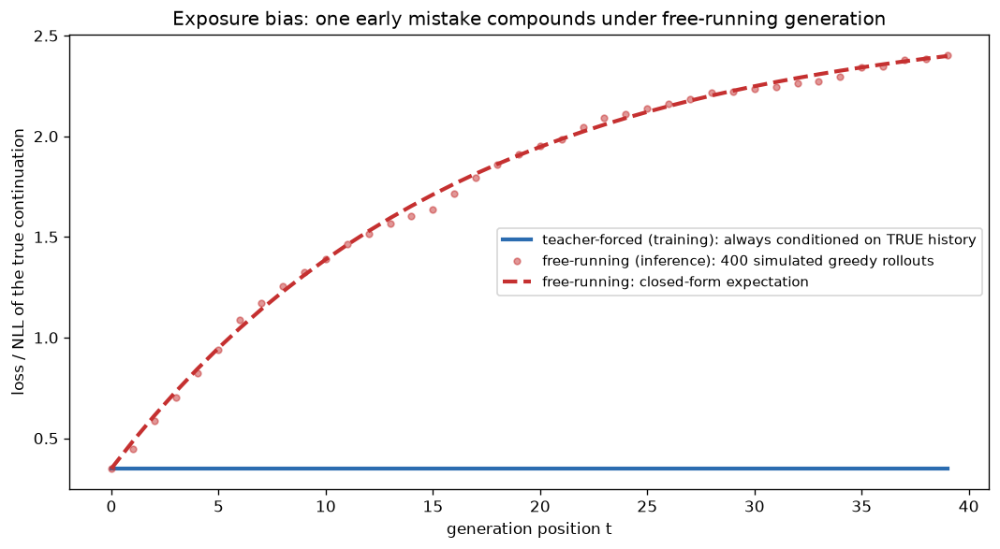

# Day 68 — GPT & Causal LM

## 🧠 CONCEPT OF THE DAY

**Intuition.** Yesterday's BERT plays fill-in-the-blank: it sees the whole sentence and reconstructs a hole in the middle. GPT plays a different game — finish the sentence, one word at a time, using only what's come before. Think of the difference between an editor marking up a finished paragraph (can see everything, front to back) and a writer mid-sentence (can only see what they've typed so far, and has to commit to the next word before knowing what comes after). That "writer" constraint is the entire architecture: same transformer block from Day 60, same self-attention from Day 56 — the *only* structural change from BERT is swapping the bidirectional mask for the causal mask you first saw on Day 62. Remove one mask matrix, and an encoder that builds representations *of* text becomes a decoder that generates *new* text.

**The math.** GPT factorizes the joint probability of a sequence $x = (x_1, \dots, x_n)$ autoregressively, left to right, via the chain rule of probability:

$$P(x_1, \dots, x_n) = \prod_{t=1}^{n} P(x_t \mid x_1, \dots, x_{t-1})$$

Training minimizes the negative log-likelihood of the *next* token at every position simultaneously — this is exactly Day 5's cross-entropy loss, just applied at every position in parallel instead of only at masked ones:

$$\mathcal{L}_{\text{LM}} = -\sum_{t=1}^{n} \log P(x_t \mid x_{<t}) = -\sum_{t=1}^{n} \log\, \text{softmax}(W h_{t-1} + b)_{x_t}$$

where $h_{t-1}$ is the transformer's output at position $t-1$ — the causal mask (Day 62) guarantees $h_{t-1}$ was computed using only $x_1, \dots, x_{t-1}$, never $x_t$ or later, so this is a well-posed prediction and not the model reading its own answer. Because every position's target is just "the next token, shifted by one," GPT gets $n$ training signals per sequence from a single forward pass — no separate masking scheme needed, unlike BERT's explicit corrupt-15%-of-tokens setup. This training-time parallelism (predict all $n$ next-tokens at once, since the true history is always available) is called **teacher forcing**, and it's the crux of today's Signal Lab and graph below: it's *not* how the model behaves at inference time.

**Why it matters / where it leads.** At inference, there is no ground-truth next token to condition on — the model must feed its own output back in as the next input, one step at a time (**autoregressive decoding**). This creates a train/inference mismatch that BERT simply doesn't have: during training every context GPT ever conditions on is real, human-written text; during generation, the moment it picks a slightly-wrong token, every subsequent prediction is conditioned on a context it never saw in training. This is **exposure bias**, and it's the single biggest reason long, greedy-decoded generations degenerate into repetition or drift off-topic — a very real failure mode in autoregressive video/audio generation pipelines too, not just text. It's also, mechanically, exactly what makes GPT-style models cacheable and BERT-style models not: because $h_{t-1}$ never depends on future tokens, the key/value vectors computed for positions $1, \dots, t-1$ are still valid when you add token $t$ — you just append, never recompute. That's the **KV cache** (full treatment Day 100), and it's the reason production LLM serving is even remotely affordable.

**Interview question:** *You're training a GPT-style model with teacher forcing and it achieves excellent (low) training loss. At inference, generation quality degrades noticeably for outputs longer than ~200 tokens. Training loss looked fine — so what's actually going wrong, and name one training-time mitigation.*

(Answer at the very bottom.)



The flat blue line is teacher-forced loss — bounded and constant because the model is always handed the *true* history, exactly as in training. The red curve is what happens once the model has to feed itself: even a small per-step error rate compounds, because a single mistake pushes every later step into an out-of-distribution context the model was never trained to handle gracefully. That gap between the two curves *is* exposure bias, visualized.

---

## 🐍 PYTHONIC EDGE

Implementing greedy autoregressive generation with a Python `for` loop that re-runs the *entire* sequence through the model at every step is the natural first instinct — and it silently makes generation cost $O(n^2)$ in sequence length instead of $O(n)$, because you're recomputing attention over tokens you've already processed. The fix previews the KV-cache idea from today's concept: cache what's already been computed, only run the new token through the model.

```python
import torch

torch.manual_seed(42)

class TinyCausalLM(torch.nn.Module):                    # class X(Base) -- Python single-inheritance (C++: class X : public Base)
    def __init__(self, vocab_size, d_model=16):
        super().__init__()                               # parent ctor call; C++ uses an initialiser list instead
        self.embed = torch.nn.Embedding(vocab_size, d_model)  # instance attribute set via self.x = ... (C++: declare in header, init in body)
        self.proj = torch.nn.Linear(d_model, vocab_size)

    def forward(self, ids):                               # never call .forward() directly -- see below
        return self.proj(self.embed(ids))                 # @ not needed here; nn.Linear does matmul internally

model = TinyCausalLM(vocab_size=50)
prompt = torch.tensor([[5, 12, 7]])                        # shape (batch=1, seq_len=3)

# ---- BAD: re-feed the WHOLE growing sequence every step -- O(n^2) total work ----
def bad_generate(model, prompt, n_new=5):
    seq = prompt.clone()
    for _ in range(n_new):                                 # each iteration recomputes attention over ALL prior tokens
        logits = model(seq)                                # calling model(seq) invokes __call__, which wraps forward() with hooks
        next_id = logits[:, -1, :].argmax(dim=-1, keepdim=True)  # [-1] -- negative indexing, "last position"
        seq = torch.cat([seq, next_id], dim=1)             # torch.cat, not append -- tensors are immutable-shape
    return seq

# ---- GOOD (conceptually): only the NEW token needs a forward pass once past
#      activations are cached -- this is what a real KV cache buys you (Day 100) ----
def good_generate_sketch(model, prompt, n_new=5):
    seq = prompt.clone()
    cache = None                                            # would hold cached K, V tensors per layer in a real impl
    for _ in range(n_new):
        new_token = seq[:, -1:]                              # slice notation [a:b] -- just the most recent token
        logits, cache = model(new_token), cache               # a real model updates `cache` in-place and reuses it
        next_id = logits[:, -1, :].argmax(dim=-1, keepdim=True)
        seq = torch.cat([seq, next_id], dim=1)
    return seq

with torch.no_grad():                                        # context manager -- disables autograd bookkeeping (no C++ equivalent keyword)
    out = bad_generate(model, prompt)
print(f"generated: {out.tolist()}")                          # f-string; .tolist() has no direct C++ name
```

`bad_generate` is correct but at step $k$ it reprocesses all $k$ prior tokens through every attention layer — total work across generation scales quadratically with output length. `good_generate_sketch` is a sketch (a real cache needs per-layer K/V storage, not shown here) of the actual fix: since causal masking guarantees earlier positions' key/value vectors never change once computed, you compute them once and only ever append. This is precisely why the `model(seq)` vs `model(new_token)` distinction matters in production serving code — and why calling `model.__call__()` (i.e., just `model(...)`) rather than `model.forward()` matters too: `__call__` is what triggers registered hooks (useful for caching, profiling, and gradient bookkeeping) that a raw `.forward()` call silently skips.

---

## 📡 SIGNAL LAB

Exposure bias is exactly **quantization error accumulation in a recursive (IIR) filter**, seen from a different field. An IIR filter's output feeds back into itself — $y[n] = a\, y[n-1] + x[n]$ — so any rounding error introduced into $y[n-1]$ doesn't stay local, it gets multiplied by $a$ and re-injected at every future step. An FIR filter, by contrast, only ever looks at *input* samples directly, never its own past output, so a single bad output sample can't contaminate future ones. Teacher-forced GPT training is the FIR case (every prediction conditions on ground truth); autoregressive generation is the IIR case (every prediction conditions on its own past output) — same feedback-vs-feedforward distinction, same reason errors compound in one and not the other.

**Worked example.** Simulate a stable recursive filter with and without a single injected rounding error, and watch it propagate:

```python
import numpy as np

np.random.seed(42)
n = 60
a = 0.9  # pole location -- stable since |a| < 1, but close enough to 1 that errors decay slowly
x = np.zeros(n)
x[0] = 1.0  # impulse input

clean = np.zeros(n)
corrupted = np.zeros(n)
for t in range(1, n):
    clean[t] = a * clean[t - 1] + x[t]
    corrupted[t] = a * corrupted[t - 1] + x[t]
    if t == 5:
        corrupted[t] += 0.5  # single injected error, e.g. a quantization/rounding glitch at t=5

error = np.abs(clean - corrupted)
half_life = np.argmax(error < error[5] * 0.5) - 5  # steps until the injected error decays to half its size
```

At $t=5$, `corrupted` picks up a one-time error of $0.5$. From that point on it's not corrected — it's *multiplied by $a=0.9$ every step* and re-fed into the recursion, so `error[t]` decays geometrically as $0.5 \cdot a^{t-5}$ rather than vanishing immediately. That geometric decay is the *good* case (a stable pole, $|a|<1$, means the error eventually fades); in an unstable or marginally stable system ($a \to 1$, or a causal LM whose greedy decoding wanders into a repetition loop) the injected error doesn't decay at all, it just keeps getting re-injected forever — mechanically identical to the flat, elevated red curve at large $t$ in today's graph.

**So what:** any autoregressive system — a causal LM, an IIR filter, a video codec's motion-compensated prediction, a diffusion sampler's own denoising trajectory — inherits this feedback structure, and the practical lesson is the same across all of them: an error you don't explicitly correct doesn't disappear, it gets folded back into the state and re-amplified (or at best, slowly damped) on every subsequent step. When you're debugging a frame-by-frame generative pipeline that looks fine for a few dozen steps and then visibly degrades, check for a feedback pole close to instability before you assume it's a data problem.

---

## 🏋️ THE GAUNTLET

**Sliding Window Maximum.** Given an integer array `nums` and a window size `k`, return an array of the maximum value in each contiguous window of size `k` as it slides from left to right across `nums`.

**Constraints:** $1 \le k \le \text{nums.length} \le 10^5$, $-10^4 \le \text{nums}[i] \le 10^4$.

**Hints (escalating):**
1. The brute-force scan-each-window-for-its-max is $O(nk)$ — too slow at $n = 10^5$. You need to reuse work between consecutive windows instead of recomputing from scratch each time.
2. As the window slides right by one, you only add one new element and drop one old element. What you actually need at every step is just "the max of the current window" — you don't need the full sorted order of every element in it.
3. Maintain a deque of *indices* (not values) such that the values at those indices are in strictly decreasing order front-to-back. Before pushing a new index, pop from the back while the back's value is $\le$ the new value (those elements can never be the max of any future window). Pop from the front whenever the front index has fallen outside the current window. The front of the deque is always the current window's max.

**Pattern:** monotonic deque for O(1)-amortized sliding-window max/min — the same structural idea behind maintaining a running max of attention scores or logits over a streaming/sliding context window in long-context serving. **Target complexity:** O(n) time, O(k) space.

---

## 🏗️ BLUEPRINT

No blueprint today.

---

## 🗺️ MARCHING ORDERS

You now have both halves of the encoder/decoder split fully wired up — bidirectional-and-reconstructive vs. causal-and-generative — and you understand exactly *why* GPT can be cached and BERT can't. Tomorrow you'll see what happens after this expensive pretraining is done: how a model that only knows "predict the next token" gets repurposed for a task it was never directly trained on.

Tomorrow: Concept 69 — Transfer learning & fine-tuning

---

🔓 GAUNTLET SOLUTION

```cpp
#include <vector>
#include <deque>
using namespace std;

vector<int> maxSlidingWindow(vector<int>& nums, int k) {
    deque<int> dq;   // stores indices; values at these indices are strictly decreasing front-to-back
    vector<int> result;

    for (int i = 0; i < (int)nums.size(); i++) {
        // drop indices that have fallen out of the current window [i-k+1, i]
        while (!dq.empty() && dq.front() <= i - k) {
            dq.pop_front();
        }
        // pop from the back while it's <= the new value -- those can never be a future max
        while (!dq.empty() && nums[dq.back()] <= nums[i]) {
            dq.pop_back();
        }
        dq.push_back(i);

        if (i >= k - 1) {
            result.push_back(nums[dq.front()]);  // front index always holds the current window's max
        }
    }
    return result;
}
```

Each index is pushed onto the deque exactly once and popped at most once across the entire run, so total deque operations are O(n) even though there's a nested-looking `while` inside the `for` — giving O(n) amortized time and O(k) space in the worst case.

💡 CONCEPT ANSWER

Training loss measures **teacher-forced** next-token prediction, where every prediction is conditioned on the *true* preceding context — it never tests what happens when the model has to condition on its *own* imperfect output. Once the model is deployed to actually generate (autoregressive decoding), any small per-step error — and there will always be some, however low the training loss — produces a context the model never saw during training, since training contexts are always drawn from real text. Each subsequent token is then predicted from an increasingly out-of-distribution history, so errors compound: this is exposure bias, and it's why quality degrades with generation length even though the loss curve that measures teacher-forced, single-step accuracy never reveals it. One standard training-time mitigation is **scheduled sampling**: during training, occasionally feed the model its *own* previous prediction instead of the ground-truth token (with some schedule increasing that probability over training), so the model gets some exposure to the kind of imperfect contexts it will actually face at inference, rather than only ever seeing pristine, human-written history.
