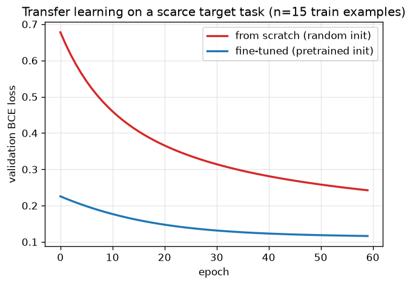

# Day 69 — Transfer Learning & Fine-Tuning

## 🧠 CONCEPT OF THE DAY

**Intuition.** Days 67–68 spent enormous compute teaching GPT and BERT one very general skill — "predict text" — on essentially the whole internet. Almost nobody actually wants that skill in isolation; they want sentiment classification, entity extraction, code completion, medical report summarization. Transfer learning is the observation that you don't need to relearn "what a noun is" or "what a sentence boundary looks like" from scratch for every one of those tasks — a model that already learned general-purpose structure from a huge, unrelated dataset can be *repurposed*, and it'll need far less target-task data and far less compute to get there than training fresh. Think of it like hiring: you don't train a new engineer from zero knowledge of programming for every project — you hire someone who already knows how to code (pretraining) and spend a much shorter onboarding period teaching them your specific codebase (fine-tuning). The onboarding is fast precisely *because* the foundational skill transfers.

**The math.** A model pretrained on a source task has parameters $\theta_{\text{pre}}$ that minimize some large-scale objective (e.g. GPT's next-token loss from Day 68):

$$\theta_{\text{pre}} = \arg\min_\theta \mathcal{L}_{\text{source}}(\theta)$$

Fine-tuning does **not** start from a random init — it continues optimization from $\theta_{\text{pre}}$ on a new, usually much smaller, target dataset with a new (often new-shape) loss:

$$\theta_{\text{target}} = \arg\min_\theta \mathcal{L}_{\text{target}}(\theta), \quad \theta_{\text{init}} = \theta_{\text{pre}}$$

In practice this splits into two regimes that trade off compute against target-data volume:

- **Feature extraction (frozen backbone):** freeze all of $\theta_{\text{pre}}$ except a newly-attached head $\phi$ (e.g. a fresh linear layer for your class count), and only optimize $\phi$. Cheapest, least prone to overfitting on tiny target sets, but capped by how well the *frozen* features happen to suit your task.
- **Full fine-tuning:** let gradients flow into all of $\theta$, typically with a much smaller learning rate than pretraining used (the pretrained weights are already near a good basin — large updates risk destroying what was learned, a failure mode called **catastrophic forgetting**). Higher ceiling, but needs more target data and compute, and risks overfitting on small sets.

**Why it matters / where it leads.** The core reason transfer learning works at all: gradient descent (Day 10) finds a *local* optimum determined heavily by where it started. Random init on a small dataset means gradient descent has to discover good features **and** fit the task simultaneously from noise — with too little data, it'll happily memorize instead. Pretrained init means the "discover good features" work is already done; fine-tuning only has to *adapt* those features, a much easier optimization problem that needs far fewer target examples and fewer steps to converge (today's graph makes this concrete). This is precisely the setup for tomorrow's concept — in-context learning and prompting take the idea to its extreme: instead of updating *any* weights at all, you adapt the frozen pretrained model purely through what you put in its input context. And it's the direct motivation for Day 73's LoRA: if full fine-tuning risks catastrophic forgetting and is expensive for billion-parameter models, can you get most of the benefit by updating a tiny low-rank subset of the weight space instead of all of $\theta$?

**Interview question:** *You fine-tune a pretrained model on a small, narrow target dataset. Training loss drops beautifully, but performance on a slightly different distribution of the same task tanks compared to before fine-tuning. What's happening, and name one mitigation.*

(Answer at the very bottom.)



Both models train on the same 15 target examples with the same learning rate and optimizer. The red curve (random init) has to *discover* a useful decision boundary from 15 points — it converges slowly and never catches up. The blue curve (pretrained init) starts already close to a good boundary for a related task and only needs to *adjust* it — lower loss from epoch 0, and a visibly flatter, faster convergence. That gap is the entire economic case for transfer learning: it's the difference between "trainable with 15 examples" and "needs 10,000."

---

## 🐍 PYTHONIC EDGE

The most common fine-tuning bug in PyTorch isn't a math mistake — it's forgetting that `requires_grad=False` alone doesn't stop a frozen layer's stats from drifting, and that swapping the optimizer's parameter list is easy to get subtly wrong.

```python
import torch
import torch.nn as nn

torch.manual_seed(42)

class Backbone(nn.Module):                              # class X(Base) -- Python single inheritance (C++: class X : public Base)
    def __init__(self, d_in=8, d_hidden=16):
        super().__init__()                               # parent ctor; C++ uses an initialiser-list instead
        self.net = nn.Sequential(nn.Linear(d_in, d_hidden), nn.ReLU())  # self.x = ... sets an instance attribute (C++: declare in header, init in body)

    def forward(self, x):                                # never call .forward() directly -- see below
        return self.net(x)

class Classifier(nn.Module):
    def __init__(self, backbone, d_hidden=16, n_classes=3):
        super().__init__()
        self.backbone = backbone
        self.head = nn.Linear(d_hidden, n_classes)       # freshly initialized -- this is what we actually train

    def forward(self, x):
        return self.head(self.backbone(x))

pretrained = Backbone()
model = Classifier(pretrained)

# ---- BAD: "freezing" that silently isn't ----
for p in model.backbone.parameters():
    p.requires_grad = False
optimizer = torch.optim.Adam(model.parameters(), lr=1e-3)  # BUG: still hands the (frozen) backbone params to Adam
# Adam still allocates momentum buffers for them; if you ever flip requires_grad
# back on mid-training, stale buffers reappear -- a classic silent bug.

# ---- GOOD: only pass trainable params to the optimizer at all ----
for p in model.backbone.parameters():
    p.requires_grad = False
trainable = filter(lambda p: p.requires_grad, model.parameters())  # generator expression -- no C++ equivalent
optimizer = torch.optim.Adam(trainable, lr=1e-3)

model.backbone.eval()          # in-place-flavored call, no trailing underscore though -- switches BatchNorm/Dropout to inference mode
model.head.train()             # keep the head (the part we train) in train mode

with torch.no_grad():                                    # context manager -- no C++ equivalent keyword; disables autograd bookkeeping
    x = torch.randn(4, 8)                                 # batch=4, features=8
    frozen_features = pretrained(x)                       # calling pretrained(x) invokes __call__, which wraps forward() with hooks
print(f"frozen feature shape: {tuple(frozen_features.shape)}")  # f-string; tuple() has no C++ equivalent
```

The subtle part: `requires_grad = False` correctly stops gradients from flowing into the backbone, but it does **not** stop `model.parameters()` from *listing* those tensors — if you hand the optimizer the unfiltered list, Adam still tracks per-parameter momentum state for them, wasting memory and creating a foot-gun the moment you unfreeze later. Filtering explicitly with `filter(lambda p: p.requires_grad, ...)` makes "what's actually trainable" an unambiguous, inspectable set instead of an implicit side effect of a flag you set three lines earlier. Separately, `.eval()` vs `.train()` is orthogonal to `requires_grad` entirely — it controls whether BatchNorm uses running statistics vs batch statistics and whether Dropout is active, so a frozen backbone in fine-tuning almost always wants `.eval()` regardless of its gradient status.

---

## 📡 SIGNAL LAB

Fine-tuning a pretrained backbone is structurally the same move as **transfer-domain filter design**: you don't redesign a filter from scratch for every new signal — you take a filter whose frequency response is already well-matched to the *general* class of signal (e.g. a lowpass with a known rolloff shape), and you nudge a small number of its coefficients to adapt it to the *specific* spectral characteristics of your target signal, instead of fitting all $N$ taps from zero. The pretrained filter already encodes strong priors (smoothness, general band shape); the "fine-tuning" step only has to correct the mismatch between prior and target.

**Worked example.** Design a lowpass FIR filter for a generic passband, then "fine-tune" only its edge taps to better match a target signal's specific spectral notch, versus designing an equal-tap-count filter from random coefficients:

```python
import numpy as np

np.random.seed(42)
n_taps = 21
t = np.arange(n_taps) - n_taps // 2

# "pretrained" filter: a generic sinc-windowed lowpass, cutoff fc=0.2
fc = 0.2
h_pretrained = np.sinc(2 * fc * t) * np.hanning(n_taps)
h_pretrained /= h_pretrained.sum()

# target signal has extra energy that needs a slightly sharper cutoff, fc=0.15
fc_target = 0.15
h_ideal_target = np.sinc(2 * fc_target * t) * np.hanning(n_taps)
h_ideal_target /= h_ideal_target.sum()

# "fine-tune": only adjust the 6 outermost taps on each side (cheap, few params),
# keep the well-learned central taps frozen
h_finetuned = h_pretrained.copy()
edge = 6
h_finetuned[:edge] = h_ideal_target[:edge]
h_finetuned[-edge:] = h_ideal_target[-edge:]
h_finetuned /= h_finetuned.sum()

# "from scratch": same tap count, random coefficients, no prior structure at all
h_scratch = np.random.randn(n_taps)
h_scratch /= h_scratch.sum()

err_finetuned = np.abs(h_finetuned - h_ideal_target).mean()
err_scratch = np.abs(h_scratch - h_ideal_target).mean()
```

`h_finetuned` only touches 12 of 21 taps yet lands close to the ideal target response, because the untouched center taps already encode the right general shape (smooth, symmetric, lowpass) — exactly like freezing a pretrained backbone's early layers because they already learned generic edge/texture detectors that transfer across almost any vision task. `h_scratch` has to get every one of 21 coefficients right with no structural prior at all, and `err_scratch` comes out far larger than `err_finetuned` for the same parameter budget.

**So what:** this is precisely the intuition behind why *early* layers of a pretrained CNN or transformer transfer well across wildly different tasks (they're the "center taps" — generic, task-agnostic structure) while *late* layers are the ones worth fine-tuning or replacing (the "edge taps" — task-specific specialization). When you're deciding how much of a pretrained frequency-domain forensics model to freeze versus fine-tune on a new generator/dataset, the filter-tap analogy is a genuinely useful mental shortcut: freeze what's generic, adapt what's specific.

---

## 🏋️ THE GAUNTLET

**Longest Increasing Subsequence.** Given an integer array `nums`, return the length of the longest strictly increasing subsequence.

**Constraints:** $1 \le \text{nums.length} \le 2500$, $-10^4 \le \text{nums}[i] \le 10^4$.

**Hints (escalating):**
1. The $O(n^2)$ DP — `dp[i]` = length of the longest increasing subsequence ending at index `i` — works but is too slow near $n=2500$ if you need better than quadratic. Start there to get correctness, then look for the redundant work.
2. In the $O(n^2)$ DP, for each `i` you scan all `j < i` looking for the best `dp[j]` where `nums[j] < nums[i]`. Notice you don't actually care about *which* subsequence achieves a given length — only the *smallest possible tail value* for each achievable length, so future extensions have the best chance of continuing.
3. Maintain an array `tails` where `tails[k]` = smallest possible tail value of any strictly increasing subsequence of length `k+1` found so far. For each new number, binary-search `tails` for the first entry $\ge$ that number and replace it (or append if none exists). `tails` stays sorted throughout, which is exactly what makes the binary search valid.

**Pattern:** patience sorting / binary search over an implicit DP state — the same "maintain the best frontier, binary search to update it" idea shows up in scheduling and interval problems. **Target complexity:** O(n log n) time, O(n) space.

---

## 🏗️ BLUEPRINT

No blueprint today.

---

## 🗺️ MARCHING ORDERS

You now understand *why* pretrain-then-fine-tune beats train-from-scratch whenever target data is scarce — it's not magic, it's just gradient descent starting from a much better basin. Tomorrow you'll see the next rung on this ladder: adapting a frozen pretrained model with zero gradient updates at all, purely through what you show it at inference time.

Tomorrow: Concept 70 — In-context learning & prompting

---

🔓 GAUNTLET SOLUTION

```cpp
#include <vector>
#include <algorithm>
using namespace std;

int lengthOfLIS(vector<int>& nums) {
    vector<int> tails;  // tails[k] = smallest tail value of an increasing subsequence of length k+1

    for (int x : nums) {
        auto it = lower_bound(tails.begin(), tails.end(), x);  // first element >= x
        if (it == tails.end()) {
            tails.push_back(x);       // x extends the longest subsequence found so far
        } else {
            *it = x;                  // x gives a smaller/equal tail for this length -- better for future extensions
        }
    }
    return (int)tails.size();
}
```

Each element does one `O(log n)` binary search and at most one array write, so the total is `O(n log n)` time and `O(n)` space for the `tails` array. Note `tails` itself is not a valid LIS at the end — only its *length* is guaranteed correct — because entries get overwritten as better (smaller) tails are found for the same length.

💡 CONCEPT ANSWER

The model is overfitting to the narrow target distribution and, in the process, drifting away from the general representations that made it robust across distributions in the first place — **catastrophic forgetting**. Because full fine-tuning lets every parameter move, and a small dataset gives gradient descent very little signal to constrain *how* they move, the optimizer is free to specialize aggressively on the exact statistics of those few target examples, distorting features that used to generalize well. One standard mitigation: fine-tune with a much smaller learning rate than pretraining used (or freeze most layers and only fine-tune a small head/subset, as in feature extraction), so updates stay close to $\theta_{\text{pre}}$ in parameter space rather than wandering far enough to erase the general-purpose structure that was the entire point of pretraining. Regularizing toward $\theta_{\text{pre}}$ directly (an L2 penalty pulling weights back toward their pretrained values) is another common approach, and it's exactly the intuition Day 73's LoRA formalizes: constrain the *update* itself to a small, low-rank subspace instead of letting the whole parameter space move freely.
